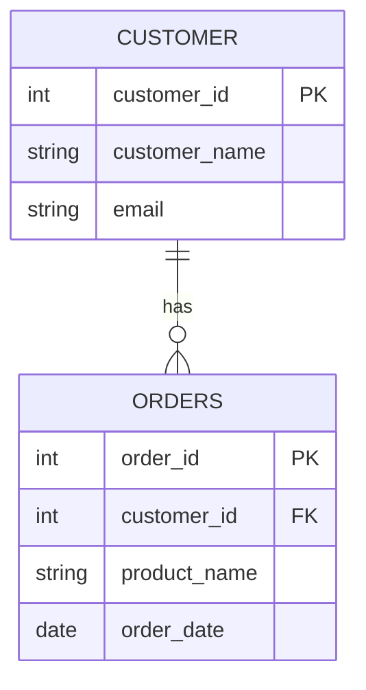
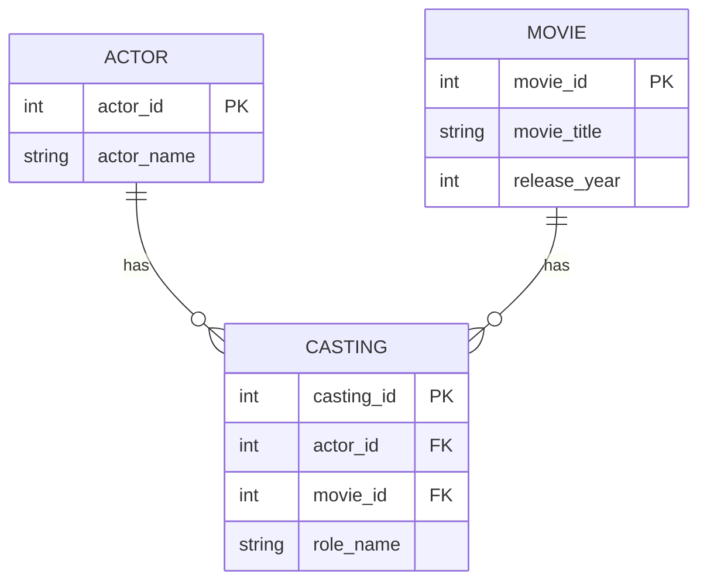
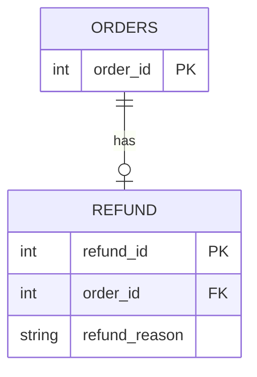

# 데이터베이스 기초

데이터베이스가 무엇인지, 관계형 데이터베이스가 데이터를 어떤 구조(테이블·키·관계)로 저장하는지,
그 구조를 그림(ERD)으로 읽는 법, 그리고 관계형이 아닌 NoSQL까지 한 번에 정리했습니다.
SQL 문법은 [SQL 기초: DDL과 DML](SQL기초_DDL_DML.md), [SQL SELECT](SQL_SELECT.md)에서 이어집니다.

## 데이터베이스와 DBMS

- **데이터베이스(Database)**: 체계적으로 구조화된 데이터의 집합. 여러 사용자가 공유할 수 있고, 적절한 설계와 DBMS의 제약 조건으로 중복을 줄이고 일관성을 유지한다.
- **DBMS(Database Management System)**: 데이터를 효율적으로 저장·조회·수정·삭제하게 해 주는 소프트웨어. PostgreSQL, MySQL, Oracle, SQLite 등.

> DB는 **저장된 데이터의 집합**이고, DBMS는 그것을 **관리하는 소프트웨어**다.

## 관계형 데이터베이스

데이터를 **테이블**로 구성하고, 자료를 여러 테이블로 나눠 관리하면서 테이블 사이에 **관계**를 설정해 관련 데이터를 함께 조회·처리한다. 데이터는 SQL로 관리한다.

| 용어 | 뜻 | 다른 이름 |
|---|---|---|
| 테이블(Table) | 데이터를 저장하는 기본 단위. 특정 유형의 데이터(고객, 주문 등)를 행·열 격자로 나타냄 | |
| 행(Row) | 테이블의 가로. 개별 항목 하나의 정보 | 레코드, 튜플 |
| 열(Column) | 테이블의 세로. 각 행에 저장할 속성 | 필드, 속성 |

**고객 테이블**

| 고객ID | 고객이름 | Email |
|---|---|---|
| 1 | 김민준 | minjun@example.com |
| 2 | 이서연 | seoyeon@example.com |
| 3 | 박지호 | jiho@example.com |

**주문 테이블**

| 주문ID | 고객ID | 상품명 | 날짜 |
|---|---|---|---|
| 101 | 1 | 노트북 | 2024-01-08 |
| 102 | 2 | 핸드폰 | 2024-01-10 |
| 103 | 1 | 태블릿 | 2024-01-12 |
| 104 | 3 | 노트북 | 2024-01-15 |

### 기본 키(Primary Key, PK)

각 행을 **고유하게 식별**하는 열 또는 열의 조합.

- **유일성**: 값이 중복될 수 없다. 여러 열로 구성하면 값의 *조합*이 유일해야 한다.
- **NOT NULL**: 기본 키를 이루는 각 열에는 NULL을 저장할 수 없다.
- 예: 고객 테이블의 PK는 `고객ID`, 주문 테이블의 PK는 `주문ID`.

### 외래 키(Foreign Key, FK)

**다른 테이블(또는 같은 테이블)의 기본 키나 고유 키를 참조**하는 열 또는 열의 조합.

- 예: 주문 테이블의 `고객ID`는 고객 테이블의 `고객ID`를 참조하는 FK.
- 같은 값을 가진 행끼리 연결해 읽는다. 고객ID `1`인 고객과 고객ID `1`인 주문들을 이으면 김민준의 주문이 나온다.

## 테이블 간 관계

### 1:N (one to many)

한 테이블의 한 행이 다른 테이블의 **여러 행**과 관련되는 관계. 가장 흔하다.

- 고객 `C001` 한 명이 주문 `O001`, `O003` 두 건과 연결된다.
- 이때 `고객ID`는 고객 테이블에서는 **PK**, 주문 테이블에서는 **FK**다.
- 같은 구조의 다른 예: 게시글 한 개에 댓글 여러 개 (`댓글.게시글ID`가 FK).

**규칙: "여러 개" 쪽 테이블에 FK를 둔다.**

### M:N (many to many)

양쪽 테이블의 각 행이 상대 테이블의 **여러 행**과 연결될 수 있는 관계.
한 학생은 여러 강좌를 듣고, 한 강좌에는 여러 학생이 있다.

관계형 DB는 M:N을 **직접 표현할 수 없다.** 그래서 **연관 테이블(중계 테이블)**을 두어 **두 개의 1:N 관계**로 쪼갠다.

| 학생ID | 이름 |
|---|---|
| S001 | 김민준 |
| S002 | 이서연 |
| S003 | 박지호 |

| 강좌ID | 강좌명 |
|---|---|
| C001 | 파이썬 기초 |
| C002 | 웹 개발 기초 |
| C003 | 데이터베이스 기초 |

**수강 테이블 (연관 테이블)**

| 학생ID | 강좌ID | 수강일 |
|---|---|---|
| S001 | C001 | 2024-01-08 |
| S002 | C002 | 2024-01-10 |
| S001 | C003 | 2024-01-12 |
| S003 | C001 | 2024-01-15 |

- 수강 테이블의 각 행은 "한 학생이 한 강좌에 등록한 기록"이다.
- `학생 : 수강 = 1 : N`, `강좌 : 수강 = 1 : N` 두 관계로 표현된다.
- `학생ID`는 학생 테이블, `강좌ID`는 강좌 테이블을 참조하는 FK.
- 연관 테이블에는 **두 테이블의 PK가 FK로 들어가고**, 관계 자체의 정보(수강일, 역할명 등)를 추가로 담을 수 있다.
- `(학생ID, 강좌ID)`를 **복합 기본 키**로 지정하면 같은 학생이 같은 강좌에 중복 등록되는 것을 막는다.
- 같은 구조의 다른 예: 배우 ↔ 영화 (출연 테이블에 `역할명`이 들어감).

### 1:1 (one to one)

한 테이블의 한 행이 다른 테이블의 **단 하나의 행**과만 관련되는 관계.
예: 주문 `O001` ↔ 환불 `R001` (환불 테이블이 `주문ID`를 FK로 가짐).

1:1 관계로 테이블을 나누는 상황:

- 보안이 필요한 **민감한 데이터 분리**
- **자주 쓰는 데이터와 그렇지 않은 데이터** 분리
- **선택적으로 존재하는** 데이터 관리 (환불은 일부 주문에만 있음)
- 매우 큰 데이터를 별도로 관리

### 관계는 "무엇을 만들려는가"에 따라 달라진다

교사 ↔ 학생은 어떤 관계일까? 답은 **어떤 관점으로 추상화하느냐**에 따라 다르다.

| 관점 | 교사 → 학생 | 학생 → 교사 | 결론 |
|---|---|---|---|
| 담임 교사 | 한 교사 : 여러 학생 (1:N) | 한 학생 : 한 담임 (1:1) | **1:N** |
| 과목 교사 | 한 교사 : 여러 학생 (1:N) | 한 학생 : 여러 교사 (1:N) | **M:N** |

→ 정답이 하나로 정해지지 않는다. **만들려는 product가 원하는 것이 무엇이냐**에 따라 모델이 달라지므로, 기획이 구체적이어야 한다.

스스로 생각해 볼 관계: 부서와 직원 / 동아리와 회원 / 직원과 사물함.

## 스키마와 ERD

### 스키마(Schema)

테이블, 열, 데이터 타입, 키, 제약 조건 등 **데이터베이스의 구조를 정의한 것**.
데이터가 실제로 저장된 *값*이라면, 스키마는 그 값을 *어떤 구조로 저장할지* 정한 것이다.

| | 데이터 | 스키마 |
|---|---|---|
| 예 | `1, 김민준, minjun@example.com` 같은 실제 값 | 고객 테이블에 `고객ID`(정수, PK), `고객이름`(문자열), `Email`(문자열) 열이 있다는 정의 |
| 바뀌는 때 | 고객이 추가되거나 이메일이 변경될 때 | 열을 추가하거나 기본 키를 바꿀 때 |

### ERD(Entity-Relationship Diagram)

데이터의 구성과 관계를 **그림**으로 표현한 것. 실제 데이터의 행을 보여주는 게 아니라 **저장 구조**를 보여준다.

| 구성 요소 | 뜻 | 예 |
|---|---|---|
| 엔티티(Entity) | 데이터를 관리하려는 대상. 보통 테이블 | 고객, 주문, 상품 |
| 속성(Attribute) | 대상이 가진 정보. 테이블의 열 | 고객ID, 고객이름, Email |
| 기본 키(PK) | 각 행을 고유하게 식별 | |
| 외래 키(FK) | 다른 테이블의 키를 참조 | |
| 관계(Relationship) | 테이블 사이의 연결을 선으로 표현. 선 끝의 기호가 연결 가능한 행 수를 나타냄 | |

### 까마귀 발 표기법(Crow's Foot Notation)

관계선 끝의 기호로 "연결될 수 있는 행의 수"를 나타낸다. 이 문서의 그림은 Mermaid `erDiagram` 문법이다.

| 기호 | 뜻 |
|---|---|
| `\|\|` | 반드시 하나 |
| `o\|` | 없거나 하나 |
| `o{` | 없거나 여러 개 |
| `\|{` | 하나 이상 |

**① 고객과 주문 (1:N)**

- 한 고객은 주문이 없을 수도, 여러 건일 수도 있다. (`ORDERS` 쪽 `o{`)
- 각 주문은 반드시 한 고객에게 속한다. (`CUSTOMER` 쪽 `||`)
- → `1:N`, 고객의 주문은 **선택적**이고 주문의 고객은 **필수**.
- `int`/`string`/`date`는 데이터 종류를 간단히 표시한 것이고, 실제 SQL 타입 이름은 DBMS마다 다를 수 있다.

**읽는 요령**: "한 고객이 주문을 몇 건 할 수 있나?"를 알려면 **주문 쪽** 기호를, "주문 한 건이 몇 명의 고객에게 속하나?"를 알려면 **고객 쪽** 기호를 본다. 물으려는 대상의 *반대편* 끝을 본다.

**② 배우와 영화 (M:N → 출연 테이블로 분해)**

- 출연 테이블의 각 행이 배우 한 명과 영화 한 편을 연결한다.
- 이 그림은 출연 정보가 아직 없는 배우나 영화도 저장할 수 있다고 가정한다 (`o{`).

**③ 주문과 환불 (1:1)**

- 주문당 환불은 최대 한 번이라고 가정한다. 주문은 환불이 없거나 하나 있고(`o|`), 각 환불은 반드시 주문 하나에 속한다(`||`).

### ERD를 읽는 순서

1. PK와 FK를 확인한다.
2. 관계선 양쪽 기호로 연결 가능한 행의 수를 확인한다.
3. 실제 테이블에서는 FK와 참조 대상 키의 값이 같은 행을 이어 읽는다.

## 비관계형 데이터베이스 (NoSQL)

**NoSQL(Not only SQL)**은 키–값, 문서, 그래프 등 다양한 데이터 모델을 쓰는 데이터베이스를 통칭한다.
확장 방식과 일관성 보장 수준은 제품과 설정에 따라 다르다. 데이터 구조, 조회 방식, 서비스 요구에 맞춰 고른다.

| 종류 | 저장 방식 | 적합한 용도 | 예시 제품 |
|---|---|---|---|
| **키–값** | 키–값 쌍으로 저장하고 키로 조회 | 캐싱, 세션 관리 (세션 ID로 로그인 정보 조회) | Redis, Amazon DynamoDB |
| **문서** | JSON 같은 문서. 문서마다 필드가 달라도 됨. 계층 구조를 자연스럽게 표현. 필요하면 필드·타입 검사 규칙 설정 가능 | 상품마다 속성이 다른 경우 (의류는 사이즈, 노트북은 메모리) | MongoDB |
| **그래프** | 노드(Node), 관계를 나타내는 엣지(Edge), 속성(Property). 관계 자체를 직접 저장 | 친구의 친구 찾기처럼 연결을 따라가는 탐색 | Neo4j |
| **와이드 컬럼** | 관련 데이터를 파티션 단위로 묶어 여러 서버에 분산 저장. 조회 패턴에 맞춰 테이블 설계 | 대량 로그·시계열을 쌓고 정해진 패턴으로 읽기 (기기별 센서 기록의 기간별 조회) | Apache Cassandra |

**관계형과의 차이 한 줄**: 관계형 DB는 외래 키와 JOIN으로 관련 데이터를 연결하고, 그래프 DB는 노드와 관계를 직접 저장해 연결을 탐색한다.

## 정리

- DB는 데이터의 집합, DBMS는 그것을 관리하는 소프트웨어.
- 관계형 DB는 테이블(행·열)로 저장하고, **PK로 행을 식별, FK로 테이블을 연결**한다.
- 관계는 1:N(FK를 N쪽에), M:N(연관 테이블로 분해), 1:1(분리 목적)으로 나뉘고, **어떤 관계가 되는지는 기획이 정한다.**
- 스키마는 구조의 정의, ERD는 그 구조를 그린 그림. 까마귀 발 기호는 *반대편* 끝에서 읽는다.
- NoSQL은 키–값/문서/그래프/와이드 컬럼으로 나뉘며 용도에 맞게 선택한다.
