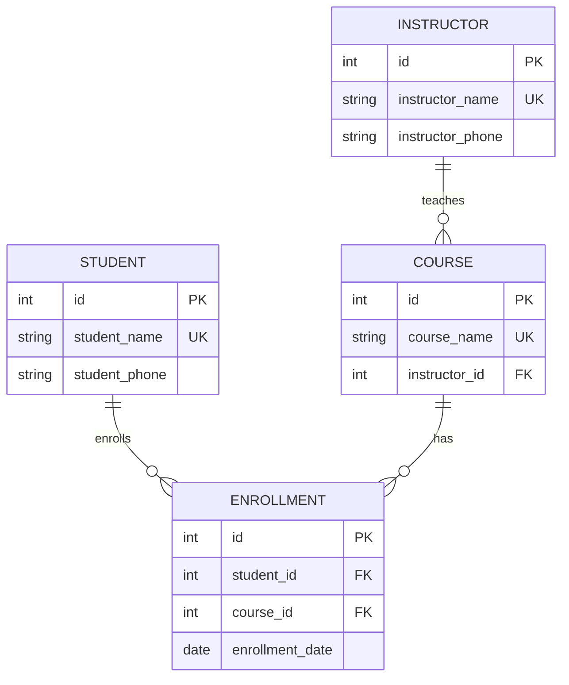

# 데이터베이스 설계

요구사항을 바탕으로 필요한 데이터와 데이터 사이의 관계를 정하는 **데이터베이스 설계**를 정리했습니다. 키, 데이터 무결성, 정규화(1NF~3NF)와 반정규화, ERD 작성 순서를 수강신청 예제 하나로 이어서 다룹니다.
테이블·관계(1:N, M:N, 1:1)의 기본 개념은 [데이터베이스 기초](데이터베이스기초.md), 제약조건 문법은 [SQL 기초: DDL과 DML](SQL기초_DDL_DML.md)을 참고하세요.

개체, 속성, 키, 관계를 설계하고 ERD로 표현하는 것이 설계의 핵심이다.

## 키(Key)

행을 식별하거나 테이블 사이의 관계를 연결하는 데 쓰는 **컬럼 또는 컬럼의 조합**이다. 수강신청 예제에서는 *학생이 같은 강좌에 한 번만 신청할 수 있다*고 가정한다.

| 키 | 설명 |
|----|------|
| 후보키 (Candidate Key) | 각 행을 유일하게 구분하는 **최소한의** 컬럼 조합 |
| 기본키 (Primary Key) | 후보키 중 대표로 고른 키. 중복·NULL 불가 |
| 복합키 (Composite Key) | 두 개 이상의 컬럼으로 구성된 키 |
| 외래키 (Foreign Key) | 다른(또는 같은) 테이블의 기본키·고유 키를 참조하는 컬럼(조합). 테이블 사이 관계를 연결 |

### 후보키

- **유일성**: 키 값이 같은 행이 둘 이상 존재하지 않는다.
- **최소성**: 구성 컬럼을 하나라도 빼면 행을 유일하게 구분할 수 없다.
- 수강신청에서 학생ID나 강좌ID **하나만으로는** 행을 구분할 수 없지만, `(학생ID, 강좌ID)`를 함께 쓰면 구분되므로 후보키다.

### 기본키

- 예: 학생·수강신청 테이블의 정수형 `id`

### 복합키

- 수강신청의 `(학생ID, 강좌ID)`를 기본키로 고르면 **복합 기본키**가 된다.
- 각 컬럼의 값은 반복될 수 있지만 **전체 조합**은 중복될 수 없다.

### 외래키

- 예: 수강신청의 학생ID는 학생 테이블의 `id`를, 강좌ID는 강좌 테이블의 `id`를 참조한다.

## 데이터 무결성

데이터의 **정확성과 일관성이 유지되는 성질**이다. 키와 제약조건으로 잘못된 데이터가 저장되는 것을 막는다.

| 무결성 | 규칙 | 예 | 보장 수단 |
|--------|------|-----|-----------|
| 개체 무결성 | 기본키는 중복·NULL 불가 | 학생 `id`는 반드시 값이 있고 다른 학생과 겹치지 않는다 | `PRIMARY KEY` |
| 참조 무결성 | 외래키 값은 참조 대상에 존재해야 함 | 수강신청의 학생ID는 학생 테이블에 있는 `id`여야 한다 | `FOREIGN KEY` |
| 도메인 무결성 | 컬럼에는 정해진 타입·허용 범위의 값만 저장 | 수강료는 0 이상의 정수 | 데이터 타입, `CHECK`, `NOT NULL` |

- 참조 무결성에서 외래키의 **NULL 허용 여부는 별도로 정한다.** 반드시 연결되어야 하는 컬럼에는 `NOT NULL`을 함께 지정한다.

## 정규화(Normalization)

테이블을 나누어 **불필요한 중복과 이상 현상**을 줄이는 과정이다.

예제 가정: 학생이 같은 강좌에 한 번만 신청 가능, 강좌마다 담당 강사 한 명, 학생·강사는 동명이인이 없고 연락처가 하나, 강좌명은 중복되지 않는다.

### 중복으로 생기는 이상 현상

수강신청 내역을 한 테이블에 저장한 경우:

| 학생명 | 학생연락처 | 강좌명 | 강사명 | 강사연락처 | 신청일 |
|--------|-----------|--------|--------|-----------|--------|
| 김민준 | 010-1111-1111 | 파이썬 | 이지수 | 010-0000-0000 | 2026-03-01 |
| 김민준 | 010-1111-1111 | SQL | 이지수 | 010-0000-0000 | 2026-03-02 |
| 이서연 | 010-2222-2222 | 파이썬 | 이지수 | 010-0000-0000 | 2026-03-03 |

- **수정 이상**: 강사연락처를 일부 행에서만 고치면 같은 강사의 연락처가 달라진다.
- **삽입 이상**: 신청자가 없는 새 강좌만 저장하기 어렵다.
- **삭제 이상**: SQL의 유일한 신청 기록을 지우면 강좌 정보도 사라진다.

### 제1정규형 (1NF)

**각 칸에는 하나의 값**만 저장한다. 강좌명에 `파이썬, SQL`을 함께 넣지 않고 신청한 강좌마다 행을 나눈다.

| 학생명 | 강좌명 |
|--------|--------|
| 김민준 | 파이썬 |
| 김민준 | SQL |

- 위에서 처음 제시한 수강신청 테이블은 **이미 1NF를 만족**한다.

### 제2정규형 (2NF)

1NF를 만족하고, **후보키의 일부만으로 결정되는 일반 속성을 분리**한다. (일반 속성: 어떤 후보키에도 포함되지 않는 속성)

- 원본의 후보키는 `(학생명, 강좌명)`이다. 학생연락처는 학생명만으로, 강사명·강사연락처는 강좌명만으로 결정된다.
- 그래서 학생·강좌·수강신청 테이블로 나누고 각 테이블에 정수형 `id`를 기본키로 부여한다.
- `id` 부여 자체가 2NF의 조건은 아니다. 학생명·강좌명에는 `UNIQUE NOT NULL`을 유지한다.

**학생** — PK: `id`

| id | 학생명 | 학생연락처 |
|----|--------|-----------|
| 1 | 김민준 | 010-1111-1111 |
| 2 | 이서연 | 010-2222-2222 |

**강좌** — PK: `id`

| id | 강좌명 | 강사명 | 강사연락처 |
|----|--------|--------|-----------|
| 1 | 파이썬 | 이지수 | 010-0000-0000 |
| 2 | SQL | 이지수 | 010-0000-0000 |

**수강신청** — PK: `id`

| id | 학생ID | 강좌ID | 신청일 |
|----|--------|--------|--------|
| 1 | 1 | 1 | 2026-03-01 |
| 2 | 1 | 2 | 2026-03-02 |
| 3 | 2 | 1 | 2026-03-03 |

- 학생ID·강좌ID는 각각 학생·강좌 테이블의 `id`를 참조하는 정수형 외래키다.
- `(학생ID, 강좌ID)`에 **복합 UNIQUE**를 두어 중복 신청을 막고, 두 컬럼 모두 `NOT NULL`로 지정한다.
- 신청일은 학생과 강좌의 **조합으로 결정**되므로 수강신청 테이블에 둔다.

### 제3정규형 (3NF)

2NF를 만족하고, **일반 속성이 다른 일반 속성을 거쳐 결정되는 구조를 분리**한다.

- 강좌 `id` → 강사명 → 강사연락처로 이어진다. 같은 강사가 여러 강좌를 맡으면 연락처가 반복되므로 강사 테이블로 분리한다.
- 강사 테이블에 정수형 `id`를 기본키로 두고 강사명에 `UNIQUE NOT NULL`을 둔다.
- 강좌 테이블에는 강사 `id`를 참조하는 정수형 외래키 `강사ID`를 둔다.
- 학생·수강신청 테이블은 2NF 구조를 유지한다.

**강사** — PK: `id`

| id | 강사명 | 강사연락처 |
|----|--------|-----------|
| 1 | 이지수 | 010-0000-0000 |

**강좌** — PK: `id`

| id | 강좌명 | 강사ID |
|----|--------|--------|
| 1 | 파이썬 | 1 |
| 2 | SQL | 1 |

- 이제 강사연락처가 바뀌면 **강사 테이블의 한 행만** 수정하면 된다. 수정 이상이 해소된다.

### 함수적 종속

위 과정은 "어떤 값이 다른 값을 결정하는가"를 보고 테이블을 나눈 것이다. A 값이 정해지면 B 값이 하나로 결정되는 관계를 **함수적 종속**이라 하고 `A → B`로 쓴다.

| 종류 | 설명 | 예제의 사례 |
|------|------|-------------|
| 함수적 종속 | A가 정해지면 B가 하나로 결정 | 학생명 → 학생연락처, 강좌명 → 강사명, 강사연락처 |
| 부분 함수적 종속 | 후보키의 **일부만으로** 결정 | 2NF에서 분리한 학생연락처 |
| 이행적 함수적 종속 | A → B → C로 **이어서** 결정 | 3NF에서 분리한 강좌 `id` → 강사명 → 강사연락처 |

- 부분 함수적 종속을 없애면 2NF, 이행적 함수적 종속을 없애면 3NF.

## 반정규화(Denormalization)

조회 성능 등을 위해 **의도적으로 데이터를 중복 저장**하는 것이다.

- 예: 신청 인원을 매번 집계하는 대신 강좌별 신청 인원을 별도로 저장한다.
- 조회는 간단해질 수 있지만, **신청·취소 시 집계 값도 함께 갱신**해야 한다. (갱신을 빠뜨리면 불일치)
- **정규화한 구조를 기본**으로 하고, 성능상 필요가 확인되면 반정규화를 검토한다.

## ERD 작성 순서

1. **사전 준비 및 요구사항 분석**
   - 서비스의 비즈니스 규칙 정리. 예: 학생은 여러 강좌를 신청할 수 있지만 같은 강좌에는 한 번만.
   - 사용자 이용 과정을 시나리오로 작성. 예: 회원가입 → 강좌 검색 → 수강 신청
2. **개체 도출 및 개념적 설계**
   - 요구사항에서 학생, 강좌, 강사처럼 관리할 대상을 찾고 대상 사이의 관계를 연결한다. 예: 학생이 강좌를 신청, 강사가 강좌를 담당.
3. **상세 설계 및 논리적 모델링**
   - 각 개체의 속성과 기본키를 정한다.
   - 관계를 1:1, 1:N, M:N으로 구분하고 외래키를 정한다. **M:N은 연관 테이블**로 표현한다. 예: 학생과 강좌 사이에 수강신청 테이블을 두고 신청일 저장.
4. **데이터 정규화**
   - 종속 관계를 확인해 불필요한 중복을 줄이고, 분리한 테이블과 관계를 ERD에 반영한다.

## 수강신청 ERD

정규화한 학생, 강좌, 강사, 수강신청 테이블을 ERD로 표현한다.

**가정**
- 학생·강좌는 신청 기록이 없어도 저장할 수 있고, 강사는 담당 강좌가 없어도 저장할 수 있다. (그래서 관계선의 "1" 쪽에서 N쪽이 `o{`, 0개 이상)
- 각 강좌에는 담당 강사가 **반드시 한 명** 있고, 각 수강신청은 학생 한 명과 강좌 하나에 연결된다.

**읽는 법**
- `STUDENT`는 학생, `COURSE`는 강좌, `INSTRUCTOR`는 강사, `ENROLLMENT`는 수강신청 테이블이다.
- 모든 테이블의 기본키와 외래키는 정수형 `id`다.
- 수강신청의 `student_id`, `course_id`는 각각 학생·강좌의 `id`를 참조하고, `(student_id, course_id)`에는 **복합 UNIQUE**를 적용해 중복 신청을 막는다. (Mermaid ERD에는 복합 제약을 표기하기 어려워 글로 적는다)
- 강좌의 `instructor_id`는 강사의 `id`를 참조하는 외래키다.
- `UK`는 고유 키로, 학생명·강좌명·강사명의 중복을 막는다.

## 정리

- 키: 후보키(유일성+최소성) 중 하나를 기본키로, 다른 테이블 참조는 외래키, 두 컬럼 이상이면 복합키.
- 무결성은 제약조건으로 보장한다: 개체(`PRIMARY KEY`), 참조(`FOREIGN KEY`), 도메인(타입·`CHECK`·`NOT NULL`).
- 정규화는 "무엇이 무엇을 결정하는가"를 보고 나누는 일이다. 2NF는 부분 종속, 3NF는 이행 종속을 제거한다.
- 반정규화는 성능 필요가 확인된 뒤에, 중복 값을 함께 갱신하는 비용을 감수하고 선택한다.
- ERD는 요구사항 → 개체·관계 → 속성·키·관계 유형 → 정규화 순으로 그린다.
