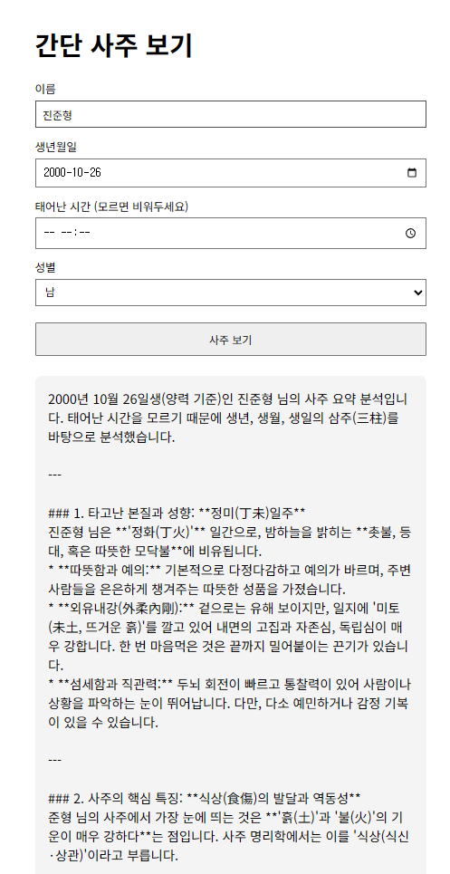
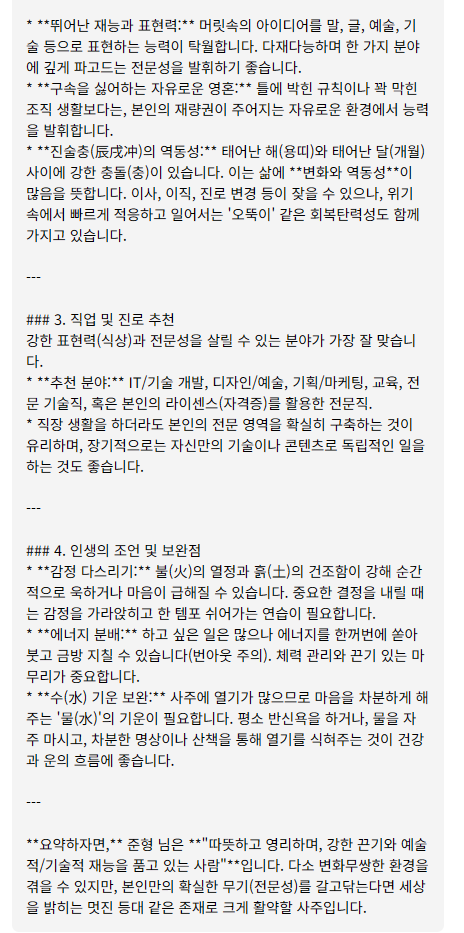

# API 실습 — 간단 사주 보기 (saju.html)

## 개요
이름·생년월일·태어난 시간·성별과 Gemini API 키를 입력받아, 브라우저에서 Gemini API를 직접 호출해 사주 해석 결과를 화면에 보여주는 프론트엔드 실습 페이지입니다. 처음에는 백엔드(`/api/saju`)를 거치는 구조였는데, 지금은 브라우저에서 바로 Gemini를 호출하도록 바뀌었습니다.

## 파일 구조
- `saju.html` — 폼 UI + fetch 호출 로직만 있는 단일 HTML 파일 (별도 CSS/JS 파일 없음)

## 동작 방식
1. 이름, 생년월일, 태어난 시간(선택), 성별, Gemini API 키를 입력받는다.
2. 제출 시 입력한 API 키를 `localStorage`에 저장해두고(다음 방문 때 자동 채워짐), `x-goog-api-key` 헤더에 담아 Gemini API(`generativelanguage.googleapis.com`)를 브라우저에서 직접 호출한다.
3. 응답에서 모델 출력 텍스트를 찾아 결과 박스에 그대로 출력한다. 실패하면 에러 메시지를 보여준다.

## API 키 처리 (보안 주의)
- API 키는 소스코드에 하드코딩하지 않고, 사용자가 폼에 직접 입력해 그 브라우저의 `localStorage`에만 저장한다.
- 그래도 **브라우저 dev tools나 네트워크 탭에는 키가 그대로 노출**된다 — 이건 구조적인 한계라 개인 로컬 실습용으로만 적합하고, 공개 배포(예: GitHub Pages)로는 쓰면 안 된다. 실제로 배포하려면 이전처럼 서버 쪽에서 키를 보관하는 백엔드 프록시가 필요하다.

## 실행 화면

## 미완성 부분
- 사주팔자를 실제로 계산하는 로직은 없다. 입력값을 그대로 Gemini에 던져서 알아서 해석하게 하는 임시 구조 (코드 내 TODO 주석 참고).
- 위 "API 키 처리" 항목대로, 클라이언트에서 직접 API를 호출하는 구조라 공개 배포에는 적합하지 않다.
