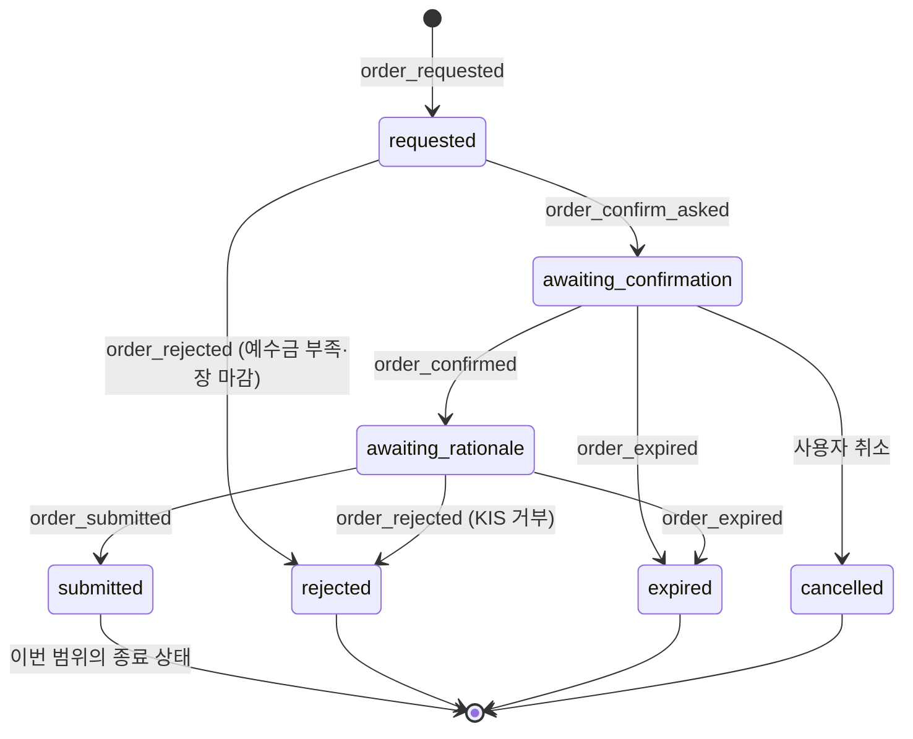

# 이벤트 카탈로그

- 작성일: 2026-08-04
- 근거 교안: 4교시

---

## 1. 이벤트란?

업무에서 **중요한 일이 발생했다는 기록**입니다.

교안 4교시의 원칙: **모든 클릭이 아니라, 업무 상태나 다음 처리를 바꾸는 사건만** 핵심 이벤트로 기록합니다.

### 도메인 이벤트와 운영 로그를 구분합니다

3교시에서 이벤트 후보 21개를 찾았습니다. 그런데 이 21개는 성격이 다릅니다.

| 구분 | 정의 | 개수 |
|---|---|---:|
| **도메인 이벤트** | 주문의 상태를 바꿉니다. 이 기록이 없으면 업무를 재구성할 수 없습니다. | 8 |
| **운영 로그** | 상태를 바꾸지 않습니다. 오류 분석과 프롬프트 개선에 씁니다. | 13 |

둘을 섞어 두면 "이 이벤트가 없으면 시스템이 고장 나는가"를 판단할 수 없습니다. `event_logs.event_category` 컬럼으로 구분합니다.

---

## 2. 도메인 이벤트 (8개)

주문의 상태를 바꾸는 사건입니다. **하나라도 빠지면 주문 흐름이 끊깁니다.**

| 이벤트 | 발생 조건 | 상태 변화 | 다음 처리 |
|---|---|---|---|
| `order_requested` | 의도 분류가 주문으로 판별되고 종목·수량이 확정됨 | 없음 → `requested` | 시세 조회, 예상 금액 계산, 예수금 확인 |
| `order_confirm_asked` | 사전 검증을 통과해 사용자에게 확인을 요청함 | `requested` → `awaiting_confirmation` | 확인 응답 대기 |
| `order_confirmed` | 사용자가 진행에 동의함 | `awaiting_confirmation` → `awaiting_rationale` | 근거 선택지 제시 |
| `rationale_recorded` | 사용자가 근거 유형(+메모)을 입력함 | `awaiting_rationale` 유지 | KIS 주문 호출 |
| `order_submitted` | KIS가 주문을 접수하고 주문번호를 반환함 | `awaiting_rationale` → `submitted` | 주문번호 안내, **종료** |
| ~~`order_executed`~~ | ~~체결 조회에서 체결이 확인됨~~ | ~~`submitted` → `executed`~~ | **이번 범위 밖** (아래 참고) |
| `order_rejected` | KIS가 거부하거나 사전 검증에 실패함 | 임의 상태 → `rejected` | 사유 안내, 재시도 안내 |
| `order_expired` | 대기 상태가 만료 시각을 지남 | `awaiting_*` → `expired` | 만료 안내 |

### 🔴 `order_executed`를 이번 범위에서 제외한 이유

기존 `모의 매수/매도 주문` 서브워크플로우를 확인한 결과, **체결 조회 노드가 없습니다.**

```
When Executed by Another Workflow
→ Call 'KIS 토큰 발급/갱신'
→ hash key 발급
→ 주문 실행           ← 주문 접수 응답까지
→ 주문번호 주문결과    ← Set 노드. 응답을 정리하는 것이지 체결 조회가 아님
→ 데이터베이스에 주문 기록
```

| 선택 | 비용 | 판단 |
|---|---|---|
| 체결 조회 추가 (조회 + 폴링 + 상태 갱신) | +3h | 버퍼가 0인 일정에 부담 |
| **`submitted`까지만 다루고 체결은 범위 밖으로 명시** | 0h | **채택** |

**채택 근거**

1. 성공 기준(`판단 근거를 설명할 수 있는가`)은 **체결과 무관**합니다. 근거는 주문 전에 기록되므로 체결 여부가 측정값을 바꾸지 않습니다.
2. 모의투자 시장가 주문은 장중이면 거의 즉시 체결되지만, **"거의"에 의존하면 안 됩니다.**
3. 발표에서 "주문 접수까지 다뤘고 체결 확인은 범위 밖"이라고 말하는 것이, 애매하게 체결을 주장하다 시연에서 미체결이 나오는 것보다 낫습니다.

→ 도메인 이벤트는 **8개에서 7개로** 줄어듭니다.

### 상태 전이 다이어그램



> `executed` 상태는 `orders.status`에 값으로만 남겨 두고, 이번 프로젝트에서는 도달하지 않습니다. 나중에 체결 조회를 추가하면 그때 사용합니다.

### `rationale_recorded`가 도메인 이벤트인 이유

다른 프로젝트라면 근거 입력은 부가 기능이므로 운영 로그로 분류할 것입니다. 이 프로젝트에서는 다릅니다.

```
rationale_recorded 없이는
→ awaiting_rationale 에서 submitted 로 넘어갈 수 없습니다 (흐름 차단)
→ 성공 기준을 측정할 데이터가 없습니다 (프로젝트 목적 미달)
```

**근거 입력은 주문 흐름의 필수 관문이자 프로젝트의 측정 지표입니다.** 따라서 도메인 이벤트입니다.

---

## 3. 운영 로그 (13개)

상태를 바꾸지 않지만, 없으면 시스템을 개선할 수 없습니다.

| 이벤트 | 발생 조건 | 기록 목적 | `payload` 주요 내용 |
|---|---|---|---|
| `intent_classified` | 의도 분류에 성공함 | 분류 정확도 확인 | 원문, 분류 결과, 추출값 |
| `intent_classification_failed` | 의도를 판별할 수 없음 | **프롬프트 개선.** 어떤 표현이 실패하는지 모아야 함 | 원문 |
| `stock_resolved` | 종목명을 종목코드로 확정함 | 변환 성공률 확인 | 입력 종목명, 확정 종목코드 |
| `stock_ambiguous` | 종목명 조회 결과가 2건 이상 | 어떤 종목명이 자주 모호한지 파악 | 입력값, 후보 목록 |
| `stock_resolution_failed` | 종목을 찾을 수 없음 | **종목 마스터 범위 판단.** 어떤 종목이 요청되는지 확인 | 입력값 |
| `term_explained` | 용어 설명을 전송함 | **용어 재질문 감소 측정 (성공 기준)** | 질문한 용어 |
| `account_diagnosed` | 계좌 진단을 전송함 | 사용 빈도 확인 | 없음 (수치는 저장 안 함) |
| `quote_retrieved` | 시세 조회를 전송함 | 사용 빈도, 관심 종목 파악 | 종목코드 |
| `rationale_skipped` | 근거 입력 없이 이탈함 | **근거 입력이 이탈을 유발하는지 확인 (가정 검증)** | 주문 정보 |
| `token_refreshed` | 토큰을 재발급함 | 갱신 빈도 확인 | 없음 (토큰값 저장 금지) |
| `token_refresh_failed` | 토큰 재발급에 실패함 | 장애 원인 추적 | 오류 코드 |
| `llm_call_failed` | LLM 호출이 실패·시간초과 | 안정성 확인 | 실패 단계, 오류 메시지 |
| `duplicate_order_blocked` | 진행 중 주문이 있어 새 주문을 차단함 | 사용자 혼란 빈도 확인 | 기존 주문 정보 |
| `unauthorized_access_blocked` | 화이트리스트에 없는 `chat_id`에서 메시지 | **보안 사건 기록** | `chat_id`, 원문 |

> 표에 14행이 있으나 `unauthorized_access_blocked`는 보안 사건으로 별도 취급하므로 운영 로그 13개 + 보안 1개로 셉니다.

### 성공 기준 측정에 직접 쓰이는 이벤트

| 성공 기준 측정 항목 | 사용하는 이벤트 |
|---|---|
| 근거 기록률 | `rationale_recorded` ÷ (`order_submitted` + `order_rejected`) |
| `그냥 감` 비율 | `rationales.reason_type = 'gut'` 비율 |
| 용어 재질문 감소 | `term_explained`의 `payload.term` 반복 횟수 |
| 근거 입력 이탈률 | `rationale_skipped` ÷ `order_confirmed` |

> **이 4개를 측정할 수 있어야 발표에서 결과를 보여줄 수 있습니다.** 이벤트를 남기지 않으면 발표에서 "동작합니다"만 말하고 끝납니다.

---

## 4. 이벤트를 만들지 않은 사건

교안의 "모든 클릭을 이벤트로 만들지 않는다" 원칙을 적용한 결과입니다.

| 사건 | 이벤트를 만들지 않은 이유 |
|---|---|
| 메시지 수신 | 모든 이벤트의 전제입니다. 별도 기록은 중복입니다. |
| 화이트리스트 통과 | 정상 경로입니다. 통과하지 못한 경우만 기록합니다. |
| 만료된 주문 정리 | 정리 자체는 업무가 아닙니다. 결과인 `order_expired`만 기록합니다. |
| LLM 응답 성공 | 성공은 후속 이벤트(`term_explained` 등)로 드러납니다. |
| 예상 금액 계산 | 중간 계산입니다. 결과는 `orders.expected_amount`에 남습니다. |

---

## 5. 5일 일정에서의 우선순위

버퍼가 없는 일정이므로 이벤트 구현에도 순서가 필요합니다.

| 우선순위 | 이벤트 | 이유 |
|---|---|---|
| **1** | 도메인 이벤트 8개 | 없으면 주문 흐름 자체가 동작하지 않습니다 |
| **2** | `rationale_recorded`, `rationale_skipped`, `term_explained` | 성공 기준 측정에 직접 필요합니다 |
| **3** | `intent_classification_failed`, `stock_resolution_failed`, `stock_ambiguous` | 개발 중 디버깅에 필요합니다 |
| **4** | `unauthorized_access_blocked` | 보안 사건 기록 |
| **5** | 나머지 운영 로그 | 시간이 남으면 |

> 우선순위 1·2는 **Must**입니다. 3은 개발 중 자연히 필요해집니다. 4·5는 시간에 따라 조정합니다.

---

## 관련 문서

- [[01_data_structure|데이터 구조 초안]]
- [[02_data_sources|데이터 소스]]
- [[04_naming_convention|용어와 네이밍 컨벤션]]
- [[../02_Domain/03_workflow|정상·예외 업무 흐름]]
