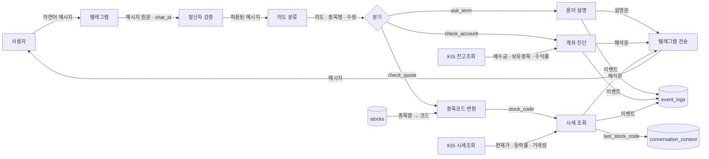
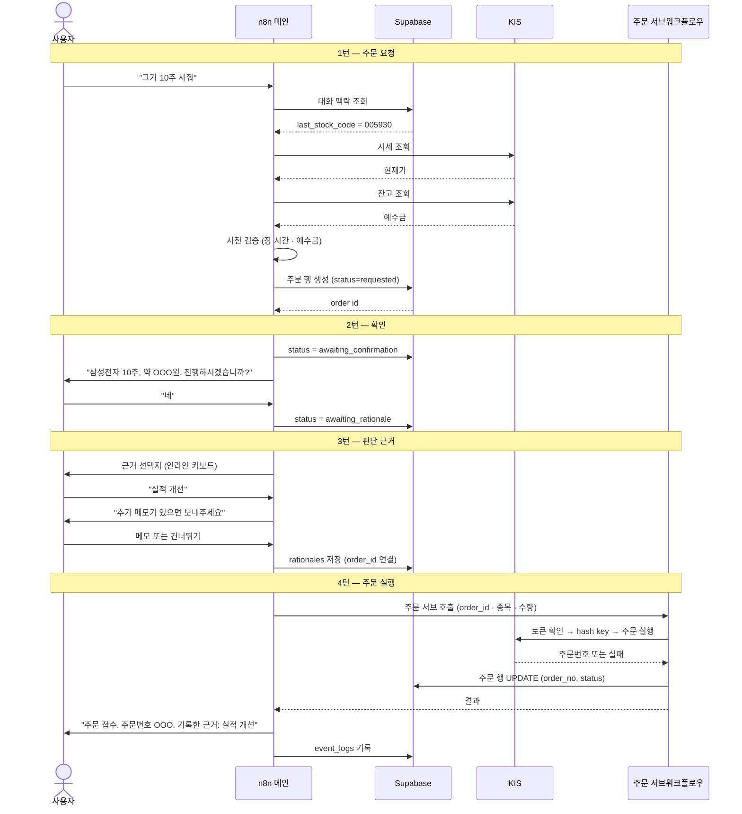
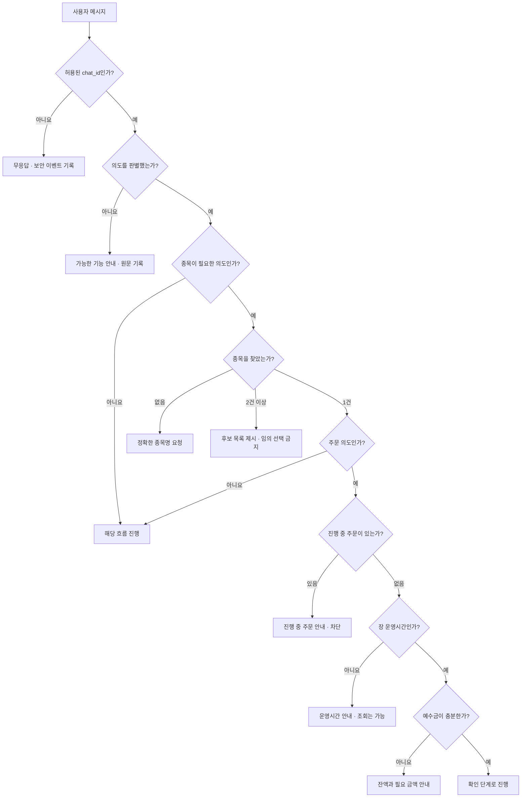
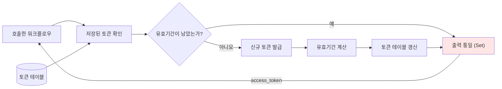

# 데이터 흐름

- 작성일: 2026-08-04
- 근거 교안: 5교시

---

## 1. 업무 흐름과 데이터 흐름의 차이

교안 5교시는 둘을 구분하라고 요구합니다.

| 구분 | 보는 것 | 이 프로젝트의 예 |
|---|---|---|
| **업무 흐름** | 사람이 하는 일의 순서 | 사용자가 종목을 묻고 → 이해하고 → 주문한다 |
| **데이터 흐름** | 데이터가 어디서 발생해 어디로 가는지 | `삼성전자` → 종목코드 `005930` → KIS 시세 → 해석문 → 텔레그램 |

3교시에서 업무 흐름을 작성했습니다. 이 문서는 **같은 흐름을 데이터의 이동으로 다시 그립니다.**

같은 흐름을 두 번 그리는 이유: 업무 흐름만 보면 "종목명이 종목코드로 바뀌는 지점"이 안 보입니다. 데이터 흐름으로 그리면 **변환이 일어나는 자리와 그것을 담당할 구성요소가 드러납니다.**

---

## 2. 기본 데이터 흐름 — 조회

흐름 A(용어), B(계좌), C(시세)를 하나로 그린 것입니다.



### 이 그림에서 읽어야 할 것

| 지점 | 의미 |
|---|---|
| `발신자 검증`이 가장 앞 | 화이트리스트를 통과하지 못한 메시지는 **어떤 데이터로도 취급하지 않습니다** |
| `의도 분류`가 유일한 관문 | 자연어를 쓰기로 했으므로 모든 흐름이 여기를 지납니다 |
| `stocks`가 변환을 담당 | LLM이 종목코드를 만들지 않습니다. **테이블 조회로만 확정합니다** |
| `conversation_context` 저장 | 시세 조회 결과가 다음 턴의 `그거`가 됩니다 |
| 잔고·시세는 저장 안 함 | 화살표가 들어오기만 하고 DB로 나가지 않습니다 |

---

## 3. 주문 데이터 흐름 — 4턴 시퀀스

주문은 4턴에 걸쳐 진행되므로 flowchart로는 **턴 구분이 보이지 않습니다.** 시퀀스 다이어그램으로 그립니다.



### 이 그림에서 읽어야 할 것

**1. 주문 행이 KIS 호출보다 먼저 생성됩니다.**
1턴에서 `status=requested`로 행을 만들고, 4턴에서 UPDATE합니다. 기존 워크플로우는 주문 성공 후 `create`였으므로 이 부분을 바꿔야 합니다.

**2. 판단 근거가 KIS 호출 앞에 있습니다.**
근거가 저장되기 전에는 주문이 나가지 않습니다. **근거 입력이 주문 흐름의 필수 관문입니다.**

**3. 상태 변경이 매 턴 일어납니다.**
`requested → awaiting_confirmation → awaiting_rationale → submitted`. 각 턴 사이에 사용자를 기다리므로, **상태를 DB에 남기지 않으면 다음 메시지가 왔을 때 무슨 일을 하던 중인지 알 수 없습니다.**

**4. 사전 검증이 메인에 있습니다.**
예수금 부족이면 주문 서브를 호출하지 않습니다. 토큰 발급과 hash key 발급을 헛되게 태우지 않기 위해서입니다.

---

## 4. 오류 데이터 흐름



### 검증 순서가 중요합니다

위에서 아래로 **비용이 낮은 검증부터** 배치했습니다.

| 순서 | 검증 | 비용 |
|---|---|---|
| 1 | 발신자 | DB 조회 없음 (환경변수 비교) |
| 2 | 의도 | LLM 1회 |
| 3 | 종목 | DB 조회 1회 |
| 4 | 중복 주문 | DB 조회 1회 |
| 5 | 장 시간 | 계산만 |
| 6 | 예수금 | **KIS 호출 2회** (시세 + 잔고) |

**가장 비싼 예수금 검증이 마지막입니다.** 미등록 사용자의 메시지 때문에 KIS를 호출하는 일이 없습니다.

---

## 5. 토큰 데이터 흐름 (기존 + 수정)



### 🔴 `출력 통일` 노드가 신규입니다

현재 워크플로우는 두 분기가 **각각 다른 노드에서 끝납니다.**

| 분기 | 현재 마지막 노드 | 반환하는 데이터 |
|---|---|---|
| 유효 | `유효기간 검증` | Supabase 조회 결과 |
| 만료 | `db 갱신` | Supabase update 결과 |

n8n 서브워크플로우는 마지막 실행 노드의 출력을 반환합니다. **두 경로의 데이터 모양이 다릅니다.**

호출하는 쪽은 토큰을 특정 필드에서 읽으므로 한쪽에서만 동작할 위험이 있습니다. 그리고 이 문제는 **토큰이 만료되는 순간에만 드러납니다** — 24시간 내에 계속 테스트했다면 `유효` 경로만 탔습니다.

**수정**: 두 분기를 하나의 `Set` 노드에 연결해 `{ access_token: ... }` 형태로 통일합니다. **약 20분.**

**추가**: `유효기간 검증`에 **10분 여유**를 둡니다. `만료시각 > 지금`으로만 비교하면 10초 뒤 만료될 토큰이 검증을 통과하고 API 호출에서 실패합니다.

---

## 6. AI는 여기서 무엇을 하고 무엇을 하지 않습니까?

교안 5교시 11장의 구분을 적용합니다.

### 6.1 AI 입력

| 흐름 | AI에게 주는 것 |
|---|---|
| 의도 분류 | 사용자 메시지 원문, 직전 대화 맥락, 가능한 의도 목록 |
| 용어 설명 | 질문한 용어, 초보자 대상이라는 조건 |
| 계좌 진단 | KIS 잔고조회 결과 (예수금, 보유종목, 평균단가, 수익률) |
| 시세 해석 | KIS 시세조회 결과 (현재가, 등락률, 거래량), 종목명 |

### 6.2 AI 처리

```
의도 분류
→ 자연어에서 의도 · 종목명 · 수량을 구조화된 값으로 추출

용어 설명
→ 전문 용어를 초보자 문장으로 변환

계좌 · 시세 해석
→ 숫자를 "무엇을 의미하는가"로 변환
```

### 6.3 AI 출력

| 출력 | 형태 |
|---|---|
| 의도 분류 | 구조화된 값 (`intent`, `stock_name`, `qty`) |
| 설명·해석 | 자연어 문장 |

### 6.4 🔴 AI가 하지 않는 것

| 금지 | 이유 | 대신 누가 하는가 |
|---|---|---|
| 종목코드 생성 | 존재하지 않는 코드를 만들 수 있습니다 | `stocks` 테이블 조회 |
| 가격·수익률 계산 | 숫자를 틀릴 수 있습니다 | 코드 계산 |
| 수량 최종 확정 | 음수·0·과도한 수량이 나올 수 있습니다 | LLM이 추출하고 **코드가 검증** |
| 매수·매도 권유 | 유사투자자문 영역 | 아무도 하지 않습니다 |
| 수익 예측 | 검증 불가하고 목적과 무관 | 아무도 하지 않습니다 |

> **LLM이 만든 값은 주문 파라미터로 바로 쓰지 않습니다.** 종목코드는 테이블에서, 금액은 시세에서, 검증은 코드에서 확정합니다.

---

## 7. 장애 시 데이터 흐름이 어디까지 살아 있는가

발표 시연 순서를 정하기 위해 필요한 정보입니다.

| 장애 | 살아 있는 흐름 | 죽는 흐름 |
|---|---|---|
| LLM 장애 | 없음 (의도 분류가 막힘) | 전부 |
| KIS 토큰 발급 실패 | A (용어 설명) | B, C, D |
| KIS 잔고조회 실패 | A, C | B, D |
| KIS 시세조회 실패 | A, B | C, D |
| KIS 주문 실패 | A, B, C | D |
| Supabase 장애 | 없음 (맥락·상태를 읽을 수 없음) | 전부 |
| 장 마감 | A, B, C | D |

### 시연 순서 결론

```
1. 용어 설명    ← KIS에 의존하지 않음
2. 계좌 진단    ← 잔고조회만 필요
3. 시세 조회    ← 시세조회만 필요
4. 주문         ← 전부 필요 + 장 시간 제약
```

**의존성이 낮은 순서로 배치합니다.** 뒤에서 터져도 앞은 이미 보여준 상태가 됩니다. 반대로 주문부터 보여주다 실패하면 아무것도 못 보여줍니다.

> **장 시간 밖에 발표한다면 1~3만 라이브로 하고 4는 녹화 영상으로 대체합니다.** 이것이 Day 4에 녹화를 해두는 이유입니다.

---

## 관련 문서

- [[02_architecture|아키텍처]]
- [[../02_Domain/03_workflow|정상·예외 업무 흐름]]
- [[../03_Data_Event/02_data_sources|데이터 소스]]
- [[../01_Baseline/02_project_baseline|프로젝트 기준선]]
