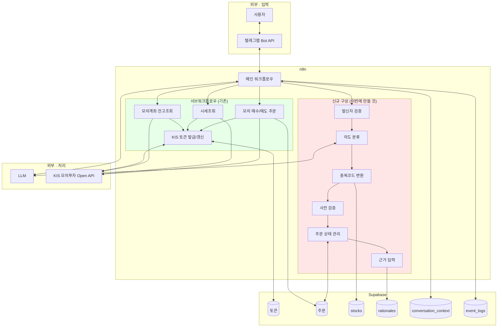

# 아키텍처

- 작성일: 2026-08-04
- 근거 교안: 5교시

---

## 1. 여기서 말하는 아키텍처는 무엇입니까?

교안 5교시의 정의를 따릅니다. 서버 대수나 배포 구성이 아니라 **"사용자의 요청이 어떤 구성요소를 거쳐 결과가 되는가"**입니다.

이 프로젝트의 특수성: **대부분의 구성요소가 이미 존재합니다.** 따라서 아키텍처 문서의 목적이 일반적인 경우와 다릅니다.

| 일반적인 프로젝트 | 이 프로젝트 |
|---|---|
| 무엇을 만들지 정하기 위해 그린다 | **무엇이 이미 있고 무엇이 없는지 구분하기 위해 그린다** |

---

## 2. 구성요소 찾기

교안 5교시 5절의 8가지 질문에 답합니다.

| 질문 | 답 |
|---|---|
| **사람은 누구인가** | 초보 투자자 (본인 단일 사용자) |
| **화면은 무엇인가** | 텔레그램 대화창. 별도 화면 없음 |
| **입력 데이터는 무엇인가** | 자연어 메시지, 근거 선택, 확인 응답 |
| **처리 기능은 무엇인가** | 발신자 검증, 의도 분류, 종목코드 변환, 사전 검증, 상태 관리, 주문 실행 |
| **참고 데이터는 무엇인가** | 종목 마스터, KIS 잔고·시세, 대화 맥락 |
| **결과는 무엇인가** | 설명문, 해석문, 주문번호 |
| **저장할 정보는 무엇인가** | 주문, 판단 근거, 대화 맥락, 이벤트, 토큰 |
| **실패 상황은 무엇인가** | 예외 흐름 11개 (3교시 문서 참고) |

---

## 3. 전체 구성도



**초록색이 이미 있는 것, 붉은색이 이번에 만들 것입니다.**

---

## 4. 구성요소별 상태

### 4.1 n8n 워크플로우

| 워크플로우 | 상태 | 이번에 할 일 |
|---|---|---|
| 메인 | ✅ 존재 | **신규 노드 6종 추가** (아래 4.2) |
| `KIS 토큰 발급/갱신` | ✅ 동작 | 🔴 출력 통일 `Set` 노드 추가 (20분), 유효기간 여유 10분 |
| `모의계좌 잔고조회` | ✅ 동작 | 변경 없음 |
| `시세조회` | ✅ 동작 | 변경 없음 |
| `모의 매수/매도 주문` | ✅ 동작 | 🔴 `order_id` 파라미터 수신 + 마지막 노드 `create` → `update` (1h), 주문 실패 분기 추가 |

> ⚠️ **확인 필요**: 실제 워크플로우 이름과 위 표의 이름이 일치하는지 확인해 기록하십시오.

### 4.2 메인 워크플로우에 추가할 신규 노드

| 노드 | 역할 | 예상 |
|---|---|---:|
| 발신자 검증 | 허용된 `chat_id`가 아니면 무응답 종료 | 0.5h |
| 의도 분류 | LLM으로 의도·종목명·수량을 구조화 추출 | 4h |
| 종목코드 변환 | `stocks` 조회, 모호하면 후보 제시 | 2h |
| 대화 맥락 관리 | `conversation_context` upsert / 조회 | 3h |
| 사전 검증 | 장 시간, 예수금, 중복 주문 확인 | 2h |
| 주문 상태 관리 | 상태 전이, 만료 정리 | 2.5h |
| 근거 입력 | 인라인 키보드 제시, `rationales` 저장 | 3h |
| 이벤트 기록 | `event_logs` 기록 | 2h |

### 4.3 Supabase 테이블

| 테이블 | 상태 | 이번에 할 일 |
|---|---|---|
| 토큰 | ✅ 존재 | 변경 없음 |
| 주문 | ✅ 존재 | 🔴 컬럼 6개 추가, `chat_id` 버그 수정, 부분 유니크 인덱스 |
| `stocks` | ❌ 없음 | 신규 생성 + 상위 200종목 적재 |
| `rationales` | ❌ 없음 | 신규 생성 |
| `conversation_context` | ❌ 없음 | 신규 생성 |
| `event_logs` | ❌ 없음 | 신규 생성 |

> 기존 2개 + 신규 4개 = **총 6개 테이블**입니다. 잔고·시세 테이블은 만들지 않습니다 — 실시간으로 변하는 값을 복제하면 곧 틀린 값이 됩니다.

### 4.4 외부 시스템

| 시스템 | 역할 | 우리가 통제하는가 |
|---|---|---|
| 텔레그램 Bot API | 메시지 송수신 | ❌ |
| LLM | 의도 분류, 설명·해석 생성 | ❌ |
| KIS 모의투자 Open API (`openapivts`) | 토큰, 잔고, 시세, 주문 | ❌ |

**세 개 모두 외부입니다.** 즉 우리 시스템의 역할은 **"외부 사이를 연결하고 상태를 관리하는 것"**입니다. 이것이 이 프로젝트의 본질입니다.

---

## 5. 이번 프로젝트가 만들어내는 것

이미 다 있는데 무엇을 만드는가 — 발표에서 반드시 나올 질문입니다.

```
기존:  텔레그램에서 명령을 주면 KIS 기능이 각각 동작한다
이번:  자연어로 대화하면 여러 기능이 하나의 판단 과정으로 이어지고,
       그 판단의 근거가 기록된다
```

| 이번에 새로 생기는 것 | 왜 없었는가 |
|---|---|
| **자연어 → 의도** | 기존에는 어떤 기능을 부를지 사람이 정해야 했습니다 |
| **종목명 → 종목코드** | 기존에는 사용자가 `005930`을 알아야 했습니다 |
| **대화 맥락** | 기존에는 매 요청이 독립적이었습니다. `그거`가 없었습니다 |
| **주문 상태 관리** | 기존에는 주문이 한 번에 실행됐습니다. 확인 단계가 없었습니다 |
| **판단 근거** | **어디에도 존재하지 않던 데이터입니다** |

마지막 항목이 핵심입니다. 나머지는 편의성 개선이지만, **판단 근거는 이 프로젝트가 새로 만들어내는 유일한 가치이자 성공 기준을 측정하는 대상**입니다.

---

## 6. 설계 판단과 근거

발표에서 "왜 이렇게 했느냐"는 질문이 나올 지점들입니다.

| 판단 | 근거 |
|---|---|
| 잔고·시세를 저장하지 않는다 | 실시간으로 변합니다. 저장하면 곧 틀린 값이 됩니다. 조회했다는 사실만 이벤트로 남깁니다 |
| 주문 대기 상태를 별도 테이블로 안 만든다 | 같은 주문이 두 테이블을 옮겨 다니면 상태 불일치가 생깁니다. `status` 컬럼 하나로 전 생애주기를 담습니다 |
| 사전 검증을 메인에 둔다 | 예수금 부족인데 주문 서브를 호출하면 토큰·hash key 발급을 헛되게 태웁니다 |
| 중복 주문을 DB 제약으로 막는다 | n8n은 동시 실행이 가능합니다. 애플리케이션 로직만으로는 빠른 연속 메시지를 놓칩니다 |
| 근거를 주문 **전에** 받는다 | 주문 후엔 사용자가 이탈합니다. 그리고 주문 직전에 이유를 말하게 만들면 판단을 한 번 더 점검하게 됩니다 |
| 종목코드를 LLM에 맡기지 않는다 | 존재하지 않는 코드를 생성할 수 있습니다. 테이블 조회로만 확정합니다 |
| 체결 조회를 하지 않는다 | 성공 기준은 체결과 무관합니다. 버퍼가 0인 일정에서 3h를 쓸 이유가 없습니다 |
| 검증을 싼 것부터 배치한다 | 미등록 사용자의 메시지 때문에 KIS를 호출하지 않기 위해서입니다 |

---

## 7. 이 아키텍처의 가장 약한 지점

정직하게 기록합니다. 발표에서 "한계는 무엇입니까"에 답할 내용입니다.

### 7.1 의도 분류가 단일 실패점입니다

LLM이 의도를 잘못 분류하면 그 아래 모든 흐름이 어긋납니다. 특히 위험한 오분류:

| 오분류 | 결과 |
|---|---|
| `check_quote` → `place_buy_order` | **의도하지 않은 주문 흐름 시작** |
| `cancel` → `confirm` | **취소하려 했는데 주문 진행** |

**완화**: 확인 단계가 최종 방어선입니다. 오분류로 주문 흐름이 시작돼도, 사용자가 확인에 동의하지 않으면 주문이 나가지 않습니다. **확인 단계를 생략하면 이 방어선이 사라집니다.**

### 7.2 대화 맥락이 1건뿐입니다

`conversation_context`는 `chat_id`당 1행이고 최근 종목 1개만 기억합니다. `아까 본 하이닉스 말고 그 전에 본 거` 같은 요청은 처리할 수 없습니다.

**판단**: 5일 일정에서는 충분합니다. `그거`는 거의 항상 직전 종목을 가리킵니다. 다만 **맥락에 30분 유효기간을 둡니다** — 어제 본 종목을 오늘 `그거`로 주문하면 사고입니다.

### 7.3 단일 사용자 전제입니다

`chat_id`를 데이터에 남겨 두었으므로 확장 여지는 있지만, KIS 계좌가 1개이므로 여러 사용자를 받으면 모두 같은 계좌로 주문하게 됩니다.

**완화**: 화이트리스트로 1명만 허용합니다. 확장은 범위 밖으로 명시합니다.

---

## 8. 배포·운영

| 항목 | 내용 |
|---|---|
| 실행 환경 | n8n (기존 환경 그대로) |
| 자격증명 | n8n Credential (KIS 앱키·시크릿, 텔레그램 봇 토큰, LLM 키, Supabase 키) |
| 계좌번호 | 환경변수 또는 Credential. **DB·문서·발표자료에 남기지 않습니다** |
| 허용 `chat_id` | 환경변수 |
| 모니터링 | n8n Executions 화면 + `event_logs` 테이블 |

> 🔴 **GitHub 업로드 시**: 워크플로우 JSON을 내보낼 때 Credential 값이 포함되지 않는지 확인하고 `.gitignore`를 설정합니다. **시연 영상과 발표자료 스크린샷에 계좌번호·`chat_id`·토큰값이 보이지 않는지 확인합니다.**

---

## 관련 문서

- [데이터 흐름](01_data_flow.md)
- [정상·예외 업무 흐름](../02_Domain/03_workflow.md)
- [데이터 구조 초안](../03_Data_Event/01_data_structure.md)
- [프로젝트 기준선](../01_Baseline/02_project_baseline.md)
