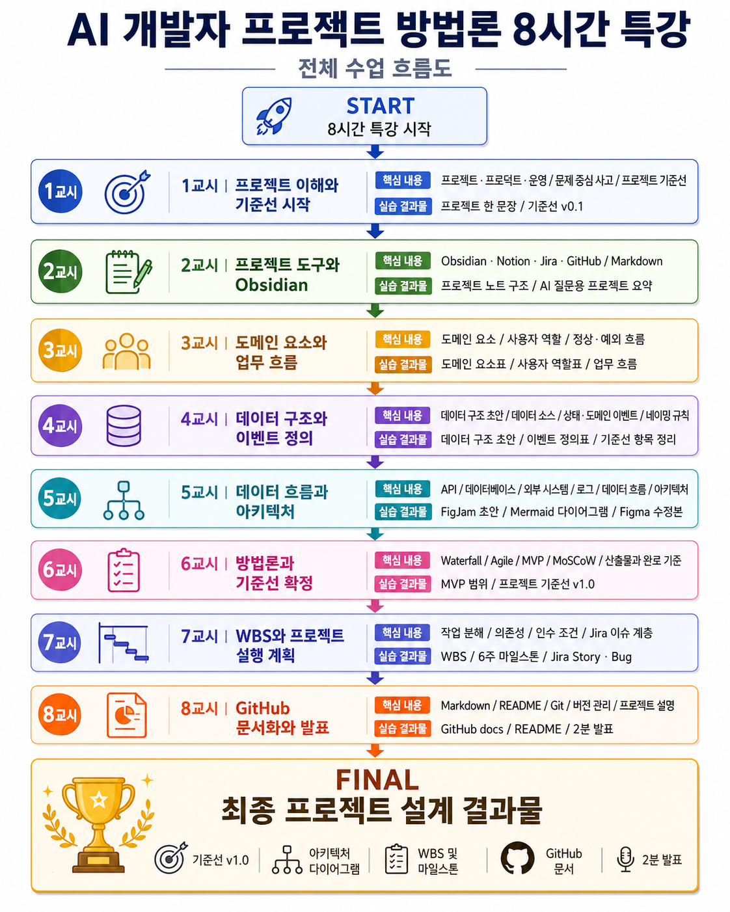
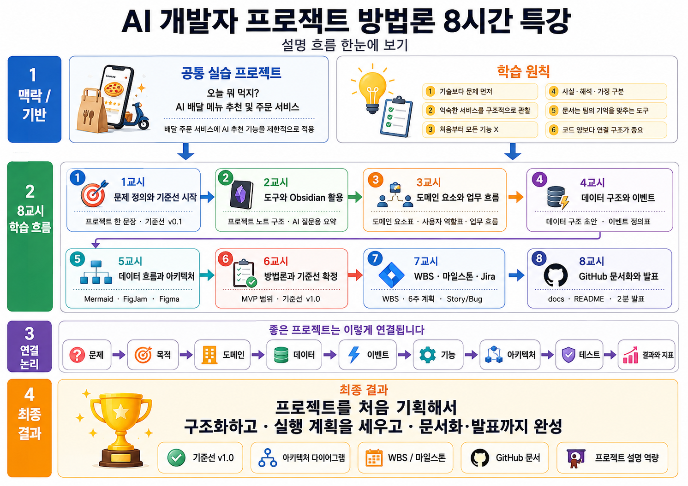
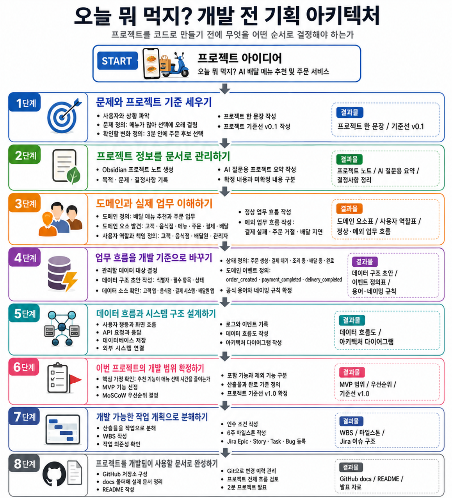
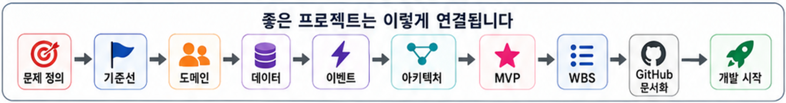
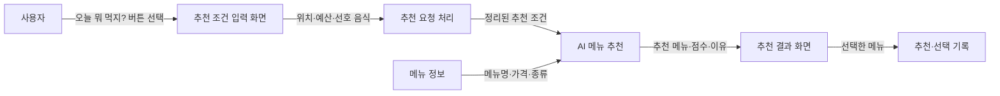
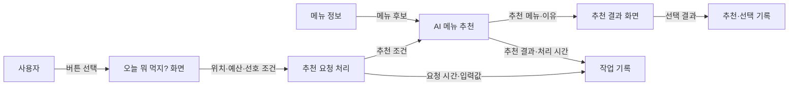
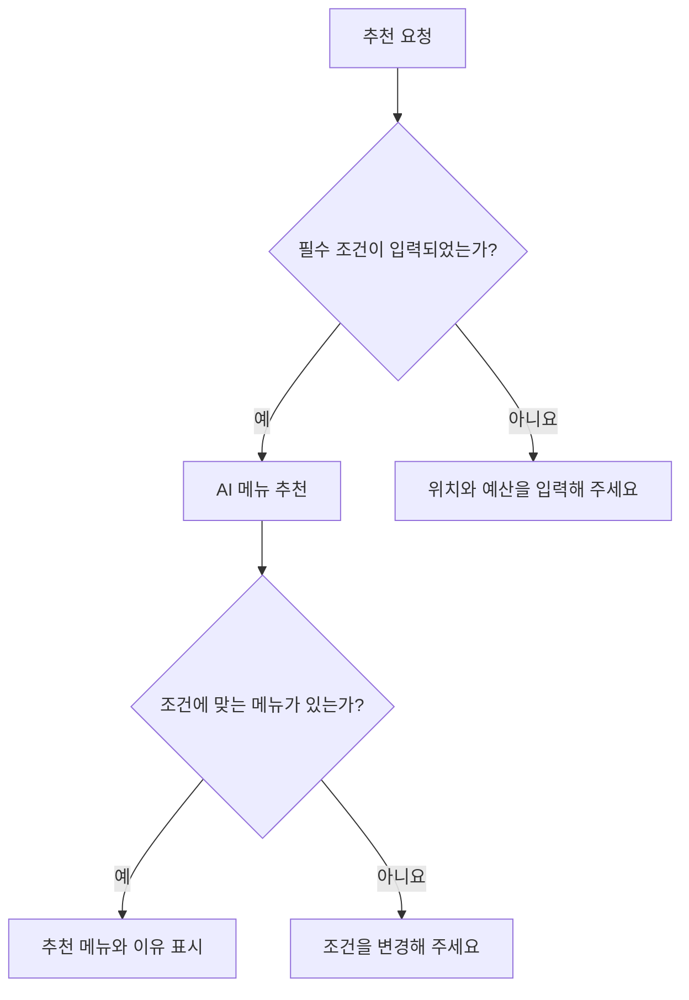
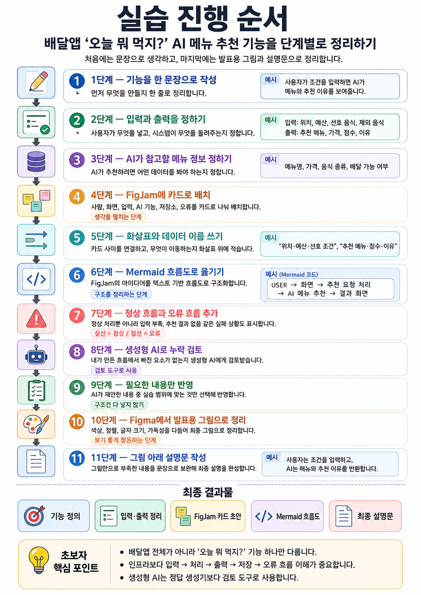

교육일정: 09:00~18:00, 점심 12:00~13:00
교육대상: AI 에이전트 엔지니어 트랙 훈련생 28명

> **서비스를 도메인·데이터·아키텍처·실행 계획으로 바꾸는 방법**
   8시간 특강 · 공통 실습 프로젝트: **오늘 뭐 먹지? AI 배달 메뉴 추천 및 주문 서비스**
> 

# 1. 학습 목표

특강을 마치면 다음 내용을 수행할 수 있습니다.

1. 프로젝트, 프로덕트, 운영의 차이를 설명할 수 있습니다.
2. 사용자 문제를 프로젝트 목적과 문제 정의 문장으로 작성할 수 있습니다.
3. 도메인과 도메인 요소를 찾고 데이터·API·코드·이벤트로 연결할 수 있습니다.
4. 사용자 역할과 정상·예외 업무 흐름을 작성할 수 있습니다.
5. 도메인 요소와 업무 흐름을 바탕으로 프로젝트에서 관리해야 할 데이터와 상태를 정리할 수 있습니다.
6. 핵심 도메인 이벤트와 공식 용어·네이밍 규칙을 프로젝트 기준선에 작성할 수 있습니다.
7. 프로젝트 기준선의 12개 항목을 작성할 수 있습니다.
8. FigJam, Mermaid 다이어그램, 생성형 AI, Figma를 활용해 데이터 흐름과 아키텍처를 표현할 수 있습니다.
9. Waterfall, Agile, MVP를 프로젝트 상황에 맞게 선택할 수 있습니다.
10. WBS와 마일스톤의 차이를 설명하고 작업의 담당자·예상 시간·선행 작업·완료 조건을 작성할 수 있습니다.
11. Obsidian의 Markdown 문서를 GitHub `docs`와 README에 활용할 수 있습니다.
12. 1교시부터 7교시까지의 내용을 2분 분량의 발표자료로 구성할 수 있습니다.

# 2. 8시간 전체 학습 흐름

1. **1교시 :** 프로젝트를 바라보는 방법과 기준선 시작
    - 핵심 내용: 프로젝트·프로덕트·운영, 문제 중심 사고, 프로젝트 기준선
    - 실습 결과물: 프로젝트 한 문장, 기준선 `v0.1`
2. **2교시 :** 프로젝트 도구와 Obsidian 활용
    - 핵심 내용: Obsidian·Notion·Jira·GitHub의 역할, Markdown
    - 실습 결과물: 프로젝트 노트 구조, AI 질문용 프로젝트 요약
3. **3교시 :** 도메인 요소, 사용자 역할, 업무 흐름
    - 핵심 내용: 도메인, 도메인 요소, 사용자 역할, 정상·예외 흐름
    - 실습 결과물: 도메인 요소표, 사용자 역할표, 업무 흐름
4. **4교시 :** 기준선에 데이터 구조·이벤트·이름 규칙 담기
    - 핵심 내용: 개념 수준의 데이터 구조, 데이터 소스, 상태·도메인 이벤트, 공식 용어와 네이밍 규칙
    - 실습 결과물: 데이터 구조 초안, 이벤트 정의표, 기준선 6·7·8·10번 항목
5. **5교시 :** 데이터 흐름과 아키텍처 시각화
    - 핵심 내용: API, 데이터베이스, 외부 시스템, 로그, 데이터 흐름, 아키텍처
    - 실습 결과물: FigJam 초안, Mermaid 다이어그램, Figma 수정본
6. **6교시 :** 방법론과 프로젝트 기준선 확정
    - 핵심 내용: Waterfall, Agile, MVP, MoSCoW, 산출물과 완료 기준
    - 실습 결과물: MVP 범위, 기준선 `v1.0`
7. **7교시 :** WBS와 마일스톤으로 실행 계획 만들기
    - 핵심 내용: 작업 분해, 담당자, 예상 시간, 선행 작업, 완료 조건, 위험과 버퍼
    - 실습 결과물: 개발 작업 WBS, 6주 마일스톤, 프로젝트 위험 대응표
8. **8교시 :** GitHub 문서화와 발표자료 작성
    - 핵심 내용: Markdown, README, Git, 버전 관리, 프로젝트 설명
    - 실습 결과물: GitHub `docs`, README, 2분 발표자료



> **이미지 읽기 안내**
>
> - 그림의 `2분 발표`는 실제 발표가 아니라 **2분 분량의 발표자료와 발표자 노트를 작성하는 활동**을 의미합니다.
> - 그림의 `Jira Story·Bug` 또는 `Epic·Story·Task·Bug`는 현업에서 WBS 작업을 관리하는 예시입니다. 이번 특강에서는 Jira 실습을 진행하지 않고, Jira가 담당자·일정·상태를 관리하는 도구라는 점만 확인합니다.



# 3. 공통 실습 프로젝트

## 3.1 프로젝트명

오늘 뭐 먹지? AI 배달 메뉴 추천 및 주문 서비스



> 이 그림은 코드를 작성하기 전에 문제, 도메인, 데이터, 아키텍처, 범위와 실행 계획을 차례로 정리하는 전체 흐름을 보여 줍니다.



## 3.2 기본 상황

사용자는 배달 앱에서 다음 과정을 경험합니다.

1. 현재 위치 또는 배달 주소를 설정합니다.
2. 음식점이나 메뉴를 검색합니다.
3. 가격, 거리, 음식 종류, 평점 등을 비교합니다.
4. 메뉴를 장바구니에 담습니다.
5. 주문서를 확인하고 결제합니다.
6. 음식점의 주문 접수와 조리 상태를 확인합니다.
7. 배달원의 배정과 이동 상태를 확인합니다.
8. 음식을 받은 후 리뷰를 작성합니다.

이 프로젝트에서는 여기에 다음과 같은 AI 기능을 프로젝트의 핵심 문제에 필요한 범위로만 추가합니다.

- 사용자의 선호 음식, 최근 주문, 예산, 시간대를 활용한 메뉴 추천
- 알레르기 또는 제외 식재료 주의 표시
- “예산에 맞고 최근에 주문하지 않은 메뉴입니다”와 같은 추천 이유 제공

AI는 프로젝트 전체가 아닙니다. 사용자의 특정 문제를 해결하는 **하나의 기능**입니다.

## 3.3 해결하려는 문제

```
배달 앱에는 음식점과 메뉴가 너무 많습니다.
사용자는 무엇을 먹을지 결정하는 데 많은 시간을 사용합니다.
추천 메뉴가 표시되더라도 왜 추천되었는지 이해하기 어렵습니다.
```

## 3.4 프로젝트 목적

```
혼자 점심을 주문하는 직장인이 메뉴 선택 시간을 줄일 수 있도록
예산, 거리, 선호 음식, 최근 주문을 활용한 메뉴 후보와 추천 이유를 제공하고,
추천 결과에서 주문까지 이어지는 흐름을 설계합니다.
```

## 3.5 프로젝트 한 문장

```
혼자 점심을 주문하는 직장인이 메뉴가 많아 선택에 오래 걸리는 문제를
예산, 거리, 선호 음식 기반 추천으로 줄여
3분 안에 주문 후보를 선택할 수 있도록 합니다.
```

# 4. 프로젝트 설계 원칙

## 4.1 기술보다 문제를 먼저 봅니다

주니어 개발자는 다음처럼 기술 이름에서 프로젝트를 시작하기 쉽습니다.

```
LLM을 사용하는 서비스를 만들겠습니다.
RAG 챗봇을 만들겠습니다.
실시간 데이터 처리를 적용하겠습니다.
추천 시스템을 만들겠습니다.
```

하지만 기술 이름만으로는 누가 왜 사용해야 하는지 알 수 없습니다.

다음과 같이 사용자와 문제를 먼저 설명해야 합니다.

```
혼자 식사하는 사용자가 메뉴를 고르는 데 오래 걸리는 시간 문제를
선호 음식, 예산, 거리 정보를 활용한 추천으로 메뉴를 고르는 시간을 줄입니다.
```

### 💡 용어 설명

**LLM**

LLM(Large Language Model, 대규모 언어 모델)은 많은 텍스트를 학습하여 질문에 답하거나 문장을 생성하는 AI 모델입니다. ChatGPT, Claude, Gemini와 같은 서비스에서 활용됩니다.

**RAG**

RAG(Retrieval-Augmented Generation, 검색 증강 생성)는 AI가 답변을 만들기 전에 관련 문서를 검색하고, 검색한 자료를 근거로 답변하도록 하는 방식입니다.

기술은 문제를 해결할 때 필요한 수단입니다. 기술을 먼저 선택하면 기술을 사용하기 위한 억지 기능이 만들어질 수 있습니다.

## 4.2 익숙한 서비스를 낯설게 관찰합니다

배달 앱을 사용해 본 사람은 많지만, 개발자의 관점에서 다음 질문을 해 본 사람은 많지 않습니다.
- 사용자는 어떤 순서로 행동합니까?
- 화면에서 입력한 정보는 어디로 이동합니까?
- 주문 상태는 언제 바뀝니까?
- 결제가 실패하면 주문은 어떻게 됩니까?
- 음식점이 주문을 거절하면 어떤 안내가 필요합니까?
- 배달원의 위치 정보는 어디에서 발생합니까?
- 어떤 사건을 기록해야 나중에 문제를 분석할 수 있습니까?

익숙한 서비스를 구조적으로 관찰하는 연습을 하면 쇼핑몰, 예약, 교육, 금융, 물류 서비스도 같은 방법으로 분석할 수 있습니다.

## 4.3 처음부터 모든 기능을 만들지 않습니다

처음부터 회원가입, 추천, 주문, 결제, 리뷰, 채팅, 쿠폰, 정산, 광고, 음성 검색까지 모두 만들려고 하면 프로젝트를 끝내기 어렵습니다.

프로젝트를 시작할 때는 다음 내용을 구분합니다.
- 이번 기간에 반드시 해결할 문제
- 반드시 필요한 기능
- 시간이 남으면 추가할 기능
- 이번 프로젝트에서는 만들지 않을 기능
- 완료 여부를 판단할 기준

## 4.4 사실, 해석, 가정을 구분합니다

```
사용자는 메뉴가 많아서 주문을 포기할 것입니다.
```

위 문장은 사실처럼 보이지만, 조사하지 않았다면 가정입니다.

| 구분 | 의미 | 예시 |
| --- | --- | --- |
| 사실 | 인터뷰, 통계, 로그 등으로 확인한 내용 | 테스트 사용자 10명 중 6명이 메뉴 선택에 5분 이상 사용했습니다. |
| 해석 | 사실을 바탕으로 팀이 판단한 내용 | 메뉴 수와 필터 부족이 선택 시간을 늘렸다고 판단했습니다. |
| 가정 | 아직 확인하지 못한 예상 | 개인화 추천이 선택 시간을 줄일 것이라고 예상했습니다. |
| 검증 방법 | 가정이 맞는지 확인하는 방법 | 기존 화면과 추천 화면의 선택 시간을 비교합니다. |

프로젝트는 가정을 감추는 과정이 아니라, 가정을 확인하고 수정하는 과정입니다.

## 4.5 문서는 팀의 기억을 맞추는 도구입니다

문서는 보고서를 만들기 위해서만 작성하지 않습니다. 다음 내용을 팀원이 같은 의미로 이해하도록 만들기 위해 작성합니다.

- 어떤 문제를 해결하는가
- 어떤 업무 범위를 다루는가
- 어떤 사용자가 등장하는가
- 어떤 데이터를 사용하는가
- 같은 대상을 어떤 이름으로 부르는가
- 어떤 사건을 이벤트로 기록하는가
- 무엇이 완료된 상태인가

## 4.6 프로젝트의 성공은 코드의 양으로 판단하지 않습니다

다음 항목이 서로 연결되어 있어야 좋은 프로젝트입니다.

```
문제
→ 프로젝트 목적
→ 도메인 요소
→ 데이터
→ 이벤트
→ 기능
→ 아키텍처
→ 테스트
→ 결과와 지표
```

---

# 1교시｜프로젝트를 바라보는 방법과 기준선 시작

## 🎯 이번 교시에서 하는 일

- 프로젝트, 프로덕트, 운영을 구분할 수 있습니다.
- 기술이 아니라 문제에서 프로젝트를 시작할 수 있습니다.
- 프로젝트 기준선이 필요한 이유를 설명할 수 있습니다.
- 프로젝트 기준선 `v0.1`을 작성할 수 있습니다.

## 1. 프로젝트, 프로덕트, 운영

### 1.1 프로젝트란 무엇입니까?

프로젝트는 특정 문제를 해결하기 위해 일정 기간 동안 수행하여 고유한 결과물을 만드는 활동입니다.

프로젝트에는 일반적으로 다음 요소가 필요합니다.
- 해결하려는 문제
- 프로젝트 목적
- 시작일과 종료일
- 참여 인원과 역할
- 범위와 제약
- 만들어야 할 산출물
- 완료 여부를 판단할 기준

예를 들어 다음 활동은 프로젝트입니다.

```
6주 동안 AI 메뉴 추천 MVP를 만들어
테스트 사용자의 메뉴 선택 시간을 평균 5분에서 3분 이하로 줄입니다.
```

### 💡 용어 설명

- 스토리보드 (Storyboard): 화면 설계도 (그림)
- PoC (개념 검증, Proof of Concept): 기술이 구현 가능한지 검증 (실험)
- 프로토타입 (Prototype): 작동 방식 확인 (시제품)
- MVP (최소 기능 제품): 핵심 가치를 실제 사용자 흐름으로 검증하는 최소 제품


반면 다음 활동은 종료 기준이 없으므로 프로젝트보다는 운영에 가깝습니다.

```
매일 결제 오류를 확인합니다.
고객 문의에 계속 답변합니다.
추천 결과의 품질을 정기적으로 점검합니다.
```

### 1.2 프로덕트란 무엇입니까?

프로덕트(Product)는 특정 사용자의 문제를 반복적으로 해결하며 지속적으로 가치를 제공하는 제품이나 서비스입니다.

배달 앱 전체는 프로덕트입니다. 사용자는 한 번만 사용하는 것이 아니라 필요할 때 반복해서 사용합니다.

### 1.3 운영이란 무엇입니까?

운영(Operation)은 프로덕트가 배포된 후에도 안정적으로 가치를 제공하도록 유지하는 반복 업무입니다.

예를 들면 다음과 같습니다.
- 서버 장애 확인
- 결제 오류 대응
- 고객 문의 처리
- 추천 품질 점검
- 비용과 성능 확인

### 1.4 세 개념 비교

| 구분 | 핵심 질문 | 배달 서비스 예시 |
| --- | --- | --- |
| 프로덕트 | 어떤 가치를 계속 제공합니까? | 음식 검색부터 배달 완료까지 제공하는 서비스 |
| 프로젝트 | 언제까지 무엇을 변화시킵니까? | 6주 동안 AI 메뉴 추천 MVP 개발 |
| 운영 | 만든 가치를 어떻게 유지합니까? | 장애, 오류, 문의, 추천 품질 관리 |

## 2. 문제에서 프로젝트를 시작하는 방법

좋은 프로젝트 문장은 다음 구조로 작성할 수 있습니다.

```
[사용자]가 [상황]에서 겪는 [문제]를
[해결 방식]으로 줄여
[확인 가능한 변화]를 만듭니다.
```

**나쁜 예시**

```
AI 추천 시스템을 만듭니다.
```

이 문장에서는 사용자, 문제, 기대 변화가 보이지 않습니다.

**개선 예시**

```
혼자 점심을 주문하는 직장인이 메뉴가 많아 선택에 오래 걸리는 문제를
예산, 거리, 선호 음식 기반 추천으로 줄여
3분 안에 주문 후보를 선택할 수 있도록 합니다.
```

### ✍️ 실습 1. 프로젝트를 한 문장으로 정의하기

이번 실습의 목적은 만들 기능을 나열하는 것이 아니라,  
누구의 어떤 문제를 해결하려는 프로젝트인지 한 문장으로 정리하는 것입니다.

#### 1단계. 다음 내용을 작성합니다

|항목|작성할 내용|예시|
|---|---|---|
|사용자|누가 사용합니까?|혼자 점심을 주문하는 직장인|
|상황|언제 사용합니까?|점심시간에 배달 메뉴를 고를 때|
|문제|어떤 불편을 겪습니까?|메뉴가 많아 선택에 오래 걸림|
|해결 방식|무엇을 제공합니까?|예산·거리·선호 음식 기반 메뉴 추천|
|확인할 변화|무엇이 좋아져야 합니까?|3분 안에 주문 후보 선택|

#### 2단계. 한 문장으로 연결합니다

```markdown
## 프로젝트 한 문장

[사용자]가 [상황]에서 겪는 [문제]를
[해결 방식]으로 줄여
[확인할 수 있는 변화]를 만듭니다.
```

#### 작성 공간

```markdown
## 프로젝트 한 문장

________________________ 가

________________________ 상황에서 겪는

________________________ 문제를

________________________ 방식으로 줄여

________________________ 변화를 만듭니다.
```

### ✅ 예시 답안

```markdown
## 프로젝트 한 문장

혼자 점심을 주문하는 직장인이
점심시간에 배달 메뉴를 고를 때 메뉴가 너무 많아 선택에 오래 걸리는 문제를

예산, 거리, 선호 음식, 최근 주문을 활용한 메뉴 추천으로 줄여

3분 안에 주문 후보를 선택할 수 있도록 합니다.
```

### ✅ 작성 확인

- 누가 사용하는지 보입니까?
- 사용자가 겪는 문제가 보입니까?
- 문제와 해결 방식이 연결됩니까?
- 좋아졌는지를 시간이나 비율로 확인할 수 있습니까?
- `AI`라는 단어를 빼도 프로젝트의 가치가 보입니까?
    

### 📦 실습 결과물

- 프로젝트 한 문장
- 아직 확인이 필요한 가정 한 가지
    
```markdown
## 확인이 필요한 가정

추천 메뉴와 추천 이유를 제공하면 사용자의 메뉴 선택 시간이 줄어드는가?
```

## 3. 프로젝트 기준선

### 3.1 기준선이란 무엇입니까?

프로젝트 기준선(Project Baseline)은 프로젝트를 시작할 때 팀이 합의한 목적, 용어, 데이터, 흐름, 산출물, 완료 조건을 기록한 기준 문서입니다.

기준선은 모든 내용을 처음부터 완벽하게 확정하는 문서가 아닙니다. 현재 알고 있는 내용과 아직 확인해야 하는 내용을 구분하고, 변경이 발생했을 때 무엇이 달라졌는지 판단하기 위한 출발점입니다.

### 3.2 문서 없이 개발하면 생기는 문제

```
팀원마다 프로젝트 목적을 다르게 이해합니다.
같은 데이터를 서로 다른 이름으로 부릅니다.
DB 테이블 이름과 API 이름이 제각각이 됩니다.
클래스, 함수, 변수 이름이 서로 연결되지 않습니다.
브랜치 이름이 뒤죽박죽이 됩니다.
정상 흐름만 개발하고 실패 흐름을 빠뜨립니다.
완료 기준이 없어 각자 다른 시점에 완료했다고 판단합니다.
```

### 💡 용어 설명

**DB**

DB(Database, 데이터베이스)는 데이터를 구조적으로 저장하고 조회하는 시스템입니다. 주문, 사용자, 메뉴, 결제 정보 등을 저장할 수 있습니다.

**API**

API(Application Programming Interface)는 서로 다른 프로그램이나 시스템이 정해진 방식으로 요청과 응답을 주고받도록 만든 연결 규칙입니다.

예를 들어 배달 앱이 주문을 생성하기 위해 서버에 `POST /orders` 요청을 보낼 수 있습니다.

### 3.3 기준선 문서가 있으면 좋은 점

```
프로젝트 목표가 고정됩니다.
팀원들이 같은 용어를 사용합니다.
도메인 요소와 기능의 관계가 보입니다.
데이터가 어디에서 발생하고 이동하는지 확인할 수 있습니다.
기능 구현 순서가 명확해집니다.
테이블, API, 클래스, 함수 이름을 일관되게 작성할 수 있습니다.
브랜치와 산출물 기준이 정리됩니다.
완료 여부를 다른 팀원이 확인할 수 있습니다.
```

### 3.4 기준선 필수 항목

1. 프로젝트 목적
2. 문제 정의
3. 도메인 정의
4. 사용자 역할
5. 업무 흐름
6. 데이터 소스
7. 데이터 유형
8. 도메인 이벤트
9. 데이터 흐름
10. 용어와 네이밍 컨벤션
11. 산출물 기준
12. 완료 체크리스트

### ✍️ 실습 2. 프로젝트 기준선 초기 버전 `v0.1` 작성

프로젝트 기준선은 처음부터 모든 내용을 완성하는 문서가 아닙니다.

1교시에서는 현재 확인할 수 있는 **프로젝트 목적, 문제, 범위, 가정**을 먼저 작성합니다.  
사용자 역할, 데이터, 이벤트, 아키텍처 등은 이후 교시에서 배우면서 추가합니다.

#### 작성 원칙

- 결정한 내용은 구체적으로 작성합니다.
- 확인하지 않은 내용은 사실처럼 작성하지 않습니다.
- 아직 정하지 못한 항목은 `미정` 또는 `추후 작성`으로 표시합니다.
    
```markdown
# 프로젝트 기준선

## 문서 정보

- 프로젝트명: 오늘 뭐 먹지? AI 배달 메뉴 추천 및 주문 서비스
- 문서 버전: v0.1
- 작성일:
- 작성자:
- 현재 상태: 1교시 초기 기준선

## 1. 프로젝트 목적

혼자 점심을 주문하는 직장인이 메뉴 선택 시간을 줄일 수 있도록
예산, 거리, 선호 음식, 최근 주문을 활용한 메뉴 후보와 추천 이유를 제공합니다.

## 2. 문제 정의

- 사용자: 혼자 점심을 주문하는 직장인
- 사용 상황: 점심시간에 배달 메뉴를 선택하는 상황
- 문제: 메뉴가 너무 많아 선택에 시간이 오래 걸립니다.
- 기대 변화: 3분 안에 주문 후보를 선택할 수 있도록 합니다.

## 3. 프로젝트 범위 초안

### 이번 프로젝트에서 다룰 내용

- 메뉴 검색
- 메뉴 추천
- 추천 이유 표시
- 장바구니
- 주문과 결제 흐름

### 이번 프로젝트에서 다루지 않을 내용

- 쿠폰과 포인트
- 음식점 정산
- 실시간 채팅
- 광고 기능

## 4. 확인한 사실

- 배달 앱에는 여러 음식점과 메뉴가 제공됩니다.
- 사용자는 메뉴를 선택한 후 주문과 결제를 진행합니다.

## 5. 아직 확인하지 않은 가정

- 사용자는 메뉴가 많을수록 선택에 더 오래 걸릴 것입니다.
- 개인화 추천과 추천 이유가 선택 시간을 줄일 것입니다.
- 3분이라는 목표 시간이 적절할 것입니다.

## 6. 이후 작성할 항목

- 도메인 정의: 3교시 작성
- 사용자 역할과 업무 흐름: 3교시 작성
- 데이터 소스와 데이터 유형: 4교시 작성
- 도메인 이벤트와 네이밍 규칙: 4교시 작성
- 데이터 흐름과 아키텍처: 5교시 작성
- 산출물 기준과 완료 체크리스트: 6교시 확정
```

### ✅ 작성 확인

- 누구의 어떤 문제를 해결하는지 보입니까?
- 이번 프로젝트에서 만들 범위가 보입니까?
- 제외할 기능이 구분되어 있습니까?
- 사실과 가정이 구분되어 있습니까?
- 아직 배우지 않은 항목을 임의로 작성하지 않았습니까?
    
---
## 4. 1교시 결과를 Obsidian에 저장하기

### 📦 1교시 결과물

- 프로젝트 한 문장
- 프로젝트 기준선 초기 버전 `v0.1`
    
| 실습   | 산출물            | 파일명                           |
| ---- | -------------- | ----------------------------- |
| 실습 1 | 프로젝트 한 문장      | `01_project_statement.md`     |
| 실습 2 | 프로젝트 기준선 초기 버전 | `02_project_baseline.md` |

1교시에서 작성한 두 개의 산출물을 Obsidian Vault의 `01_Baseline` 폴더에 저장합니다.
```
Delivery-Project-Notes/
├─ 00_Inbox/
├─ 01_Baseline/
│  ├─ 01_project_statement.md
│  └─ 02_project_baseline.md
├─ 02_Domain/
├─ 03_Data_Event/
├─ 04_Architecture/
├─ 05_Scope/
├─ 06_WBS/
├─ 07_GitHub/
├─ 08_Questions/
└─ Templates/
```

이후 8교시에서 Obsidian의 Markdown 문서를 GitHub 프로젝트의 `docs/` 폴더로 복사하여 재사용합니다.

---

# 2교시｜프로젝트 도구와 Obsidian 활용

## 🎯 이번 교시에서 하는 일

- Obsidian, Notion, Jira, GitHub의 역할을 구분할 수 있습니다.
- Markdown의 기본 문법을 사용할 수 있습니다.
- Obsidian에 프로젝트 기준선과 학습 노트를 정리할 수 있습니다.
- 작성한 문서를 생성형 AI 질문과 GitHub 문서로 재사용할 수 있습니다.

## 1. 프로젝트 도구는 목적에 따라 선택합니다

도구는 기능이 많거나 유명하다는 이유로 선택하지 않습니다. 
어떤 문제를 해결할 것인지에 따라 선택합니다.

| 도구 | 주된 목적 | 수업에서 사용하는 내용 |
| --- | --- | --- |
| Obsidian | 개인 학습과 생각 연결 | 수업 노트, 기준선, 용어집, 질문 관리 |
| Notion | 팀 문서 공유와 협업 | 회의록, 결정 사항, 일정 공유 |
| FigJam | 자유로운 아이디어와 흐름 탐색 | 도메인 요소와 아키텍처 초안 |
| Mermaid | 텍스트 기반 다이어그램 | 업무 흐름, 데이터 흐름, 아키텍처 |
| Figma | 정돈된 화면과 시각 자료 | 최종 아키텍처와 발표자료 |
| Jira | 현업의 개발 작업과 진행 상태 관리 | 작업, 담당자, 일정, 상태 확인 |
| GitHub | 코드와 문서의 버전 관리 | Commit, Branch, Pull Request, `docs` |
| VS Code | 코드와 Markdown 문서 편집 | 프로젝트 파일 작성 |
| 생성형 AI | 초안 작성과 누락 검토 | 구조 검토, 용어 불일치 확인 |

### 도구 연결 흐름

```
Obsidian에서 개인 생각과 수업 내용을 정리합니다.
→ FigJam에서 도메인과 흐름을 자유롭게 배치합니다.
→ Mermaid로 구조화된 다이어그램을 작성합니다.
→ 생성형 AI로 빠진 요소를 검토합니다.
→ Figma에서 발표용 결과를 수정합니다.
→ Notion에서 팀과 결정 내용을 공유합니다.
→ 현업에서는 Jira와 같은 도구에서 실행 작업과 진행 상태를 관리합니다.
→ GitHub에서 코드와 문서를 버전 관리합니다.
```

## 2. Obsidian이란 무엇입니까?

Obsidian은 Markdown 파일을 기반으로 개인 지식과 프로젝트 문서를 연결해 관리하는 노트 도구입니다.

### 💡 용어 설명

**Vault**

Vault(볼트)는 Obsidian에서 여러 Markdown 노트를 저장하는 하나의 작업 폴더입니다. 일반 폴더이므로 Obsidian이 없어도 내부의 `.md` 파일을 다른 편집기에서 열 수 있습니다.

**Markdown**

Markdown은 `#`, `-`, `[]` 같은 간단한 기호로 문서의 제목, 목록, 링크, 코드 블록 등을 표현하는 문서 작성 형식입니다. 파일 확장자는 `.md`입니다.

Markdown은 다음 장점이 있습니다.
- 일반 텍스트이므로 가볍습니다.
- Obsidian, VS Code, GitHub에서 사용할 수 있습니다.
- 생성형 AI에 문서 구조를 전달하기 쉽습니다.
- 변경 내용을 Git으로 비교하기 쉽습니다.

## 3. Markdown 기본 문법

### 제목

```markdown
# 1단계 제목
## 2단계 제목
### 3단계 제목
```

### 목록

```markdown
- 프로젝트 목적
- 문제 정의
- 도메인 요소
```

### 번호 목록

```markdown
1. 주소를 선택합니다.
2. 메뉴를 검색합니다.
3. 주문을 생성합니다.
```

### ✅ 체크리스트

```markdown
- [ ] 프로젝트 목적 작성
- [ ] 도메인 요소 정리
- [x] 프로젝트명 확정
```

### 표

```markdown
| 항목 | 내용 |
|---|---|
| 프로젝트명 | 오늘 뭐 먹지? |
| 사용자 | 직장인 |
```

### 코드 블록

````markdown
```python
print("Hello")
```
````

### 링크

```markdown
[GitHub](https://github.com)
```

### Obsidian 내부 링크

```markdown
[[project_baseline]]
[[domain_glossary]]
```

## 4. Obsidian 프로젝트 구조 만들기

다음과 같이 Vault 안의 폴더를 구성합니다.

```
Delivery-Project-Notes/
├─ 00_Inbox/
├─ 01_Baseline/
│  ├─ 01_project_statement.md
│  └─ 02_project_baseline.md
├─ 02_Domain/
│  ├─ 01_domain_elements.md
│  ├─ 02_user_roles.md
│  └─ 03_workflow.md
├─ 03_Data_Event/
│  ├─ 01_data_structure.md
│  ├─ 02_data_sources.md
│  ├─ 03_event_catalog.md
│  └─ 04_naming_convention.md
├─ 04_Architecture/
│  ├─ 01_data_flow.md
│  └─ 02_architecture.md
├─ 05_Scope/
│  ├─ 01_mvp_scope.md
│  └─ 02_definition_of_done.md
├─ 06_WBS/
│  ├─ 01_wbs.md
│  └─ 02_milestones.md
├─ 07_GitHub/
│  ├─ 01_readme_draft.md
│  └─ 02_presentation.md
├─ 08_Questions/
└─ Templates/
```

### 폴더별 역할
| 폴더                |  교시 | 저장할 내용                      |
| ----------------- | ---: | --------------------------- |
| `00_Inbox`        |  전체 | 아직 분류하지 않은 아이디어와 메모         |
| `01_Baseline`     | 1교시 | 프로젝트 한 문장, 프로젝트 기준선         |
| `02_Domain`       | 3교시 | 도메인 요소, 사용자 역할, 정상·예외 업무 흐름 |
| `03_Data_Event`   | 4교시 | 데이터 구조, 데이터 소스, 이벤트, 네이밍 규칙 |
| `04_Architecture` | 5교시 | 데이터 흐름도, Mermaid, 아키텍처 설명   |
| `05_Scope`        | 6교시 | MVP 범위, 완료 기준, 기준선 확정 내용    |
| `06_WBS`          | 7교시 | WBS, 작업 의존성, 마일스톤           |
| `07_GitHub`       | 8교시 | README 초안, 2분 발표자료         |
| `08_Questions`    |  전체 | 생성형 AI 질문, 미해결 문제, 확인할 가정   |
| `Templates`       |  전체 | 반복해서 사용할 문서 양식              |
> 2교시에는 전체 폴더 구조를 먼저 만들고, 아직 배우지 않은 교시의 파일은 빈 문서로 만들어 두어도 됩니다.

## 5. 1교시 산출물 저장하기

1교시에서 작성한 두 개의 산출물을 `01_Baseline` 폴더에 저장합니다.

| 실습   | 산출물            | 저장 파일                                 |
| ---- | -------------- | ------------------------------------- |
| 실습 1 | 프로젝트 한 문장      | `01_Baseline/01_project_statement.md` |
| 실습 2 | 프로젝트 기준선 초기 버전 | `01_Baseline/02_project_baseline.md`  |

**파일명**
```
01_project_statement.md
```

**내용**
```markdown

## 프로젝트명

오늘 뭐 먹지? AI 배달 메뉴 추천 및 주문 서비스

## 프로젝트 한 문장

혼자 점심을 주문하는 직장인이
점심시간에 메뉴가 너무 많아 선택에 오래 걸리는 문제를

예산, 거리, 선호 음식, 최근 주문을 활용한 메뉴 추천으로 줄여

3분 안에 주문 후보를 선택할 수 있도록 합니다.

## 확인이 필요한 가정

추천 메뉴와 추천 이유를 제공하면
사용자의 메뉴 선택 시간이 줄어드는가?
```


**파일명**
```
02_project_baseline.md
```

**내용**
1교시에서 작성한 프로젝트 목적, 문제 정의, 범위 초안, 확인한 사실과 가정을 저장합니다.
이 문서는 이후 교시의 결과를 계속 추가하는 **프로젝트의 중심 문서**로 사용합니다.
```markdown
# 프로젝트 기준선

## 문서 정보

- 프로젝트명: 오늘 뭐 먹지? AI 배달 메뉴 추천 및 주문 서비스
- 현재 상태: 1교시 초기 기준선
- 작성일:
- 작성자:

## 1. 프로젝트 목적

## 2. 문제 정의

## 3. 프로젝트 범위 초안

## 4. 확인한 사실

## 5. 아직 확인하지 않은 가정

## 6. 이후 추가할 항목

- 도메인 정의
- 사용자 역할과 업무 흐름
- 데이터 소스와 데이터 유형
- 도메인 이벤트와 네이밍 규칙
- 데이터 흐름과 아키텍처
- MVP 범위와 완료 기준
```
---
## 6. 생성형 AI 질문용 프로젝트 요약 만들기

생성형 AI에 질문할 때는 프로젝트 전체 내용을 반복해서 설명하지 않고, 현재까지 결정한 기준을 요약하여 전달합니다.

**파일명**
```
08_Questions/01_ai_project_context.md
```

```markdown
# AI 질문용 프로젝트 요약

## 프로젝트 배경

오늘 뭐 먹지? AI 배달 메뉴 추천 및 주문 서비스

## 현재까지 결정한 내용

- 주요 사용자:
- 해결할 문제:
- 프로젝트 범위:
- 현재 작성한 산출물:

## 변경하면 안 되는 기준

- 프로젝트 범위를 임의로 확장하지 않습니다.
- 확인되지 않은 내용을 사실처럼 작성하지 않습니다.

## 아직 결정하지 못한 내용

## AI에게 요청할 작업

## 원하는 결과 형식
```

**예시**
```
현재 프로젝트는 배달 메뉴 추천 및 주문 서비스입니다.

혼자 점심을 주문하는 직장인이 메뉴를 선택하는 데
오래 걸리는 문제를 해결하려고 합니다.

현재 작성한 프로젝트 한 문장과 기준선을 검토하고,
빠진 가정만 표로 정리해 주세요.

프로젝트 범위를 임의로 추가하지 마세요.
```

### ⚠️ 주의할 점

- 개인정보, 실제 결제 정보, 회사 내부 자료는 입력하지 않습니다.
- AI가 제안한 내용을 바로 확정하지 않습니다.
- 기존 기준선과 일치하는지 확인한 후 문서에 반영합니다.

## 7. 프로젝트 노트 연결하기

각 문서를 따로 저장하는 것에서 끝내지 않고, 프로젝트 기준선에서 관련 문서로 이동할 수 있도록 Obsidian 내부 링크를 작성합니다.

```
01_Baseline/02_project_baseline.md
```
아래에 다음 내용을 추가합니다.

```markdown
## 관련 프로젝트 문서

### 1교시

- [[01_project_statement]]

### 3교시

- [[01_domain_elements]]
- [[02_user_roles]]
- [[03_workflow]]

### 4교시

- [[01_data_structure]]
- [[02_data_sources]]
- [[03_event_catalog]]
- [[04_naming_convention]]

### 5교시

- [[01_data_flow]]
- [[02_architecture]]

### 6교시

- [[01_mvp_scope]]
- [[02_definition_of_done]]

### 7교시

- [[01_wbs]]
- [[02_milestones]]

### 8교시

- [[01_readme_draft]]
- [[02_presentation]]
```

아직 작성하지 않은 문서의 링크를 먼저 만들어도 됩니다.
Obsidian에서 링크를 클릭하면 해당 문서를 새로 생성할 수 있습니다.

### ✍️ 2교시 실습

1. Obsidian을 설치하고 실행합니다.
2. `Delivery-Project-Notes` Vault를 만듭니다.
3. 1~8교시 산출물을 저장할 전체 폴더 구조를 만듭니다.
4. `01_Baseline` 폴더에 1교시 산출물 두 개를 저장합니다.
5. `08_Questions/01_ai_project_context.md`를 작성합니다.
6. 프로젝트 기준선에 전체 산출물 문서의 내부 링크를 추가합니다.
7. 그래프 보기에서 문서의 연결 관계를 확인합니다.

---

### ✅ 2교시 핵심 정리

* Obsidian은 1~8교시 산출물을 누적하여 관리하는 프로젝트 문서 공간입니다.
* 각 교시의 결과물은 별도 Markdown 파일로 저장합니다.
* 프로젝트 기준선은 관련 문서를 연결하는 중심 문서 역할을 합니다.
* Obsidian에서 작성한 문서는 이후 GitHub의 `docs` 문서로 재사용할 수 있습니다.

### 📦 2교시 결과물

* `Delivery-Project-Notes` Obsidian Vault
* 1~8교시 전체 프로젝트 문서 구조
* 저장된 1교시 산출물 두 개
* AI 질문용 프로젝트 요약
* 프로젝트 기준선과 산출물 간 내부 링크


---

# 3교시｜도메인 요소, 사용자 역할, 업무 흐름

## 🎯 이번 교시에서 하는 일

3교시를 마치면 다음 내용을 작성할 수 있습니다.

- 프로젝트가 다루는 도메인을 설명할 수 있습니다.
- 서비스에 등장하는 도메인 요소를 구분할 수 있습니다.
- 사용자별 역할과 책임을 정리할 수 있습니다.
- 정상 업무 흐름과 예외 업무 흐름을 작성할 수 있습니다.
- 작성한 결과를 Obsidian 프로젝트 문서에 저장할 수 있습니다.
    
---

# 1. 도메인이란 무엇입니까?

도메인(Domain)은 **프로젝트가 다루는 실제 업무와 문제의 범위**입니다.

쉽게 말하면 다음 내용을 이해하는 것입니다.

```text
누가 참여하는가?
→ 무엇을 처리하는가?
→ 어떤 순서로 일이 진행되는가?
→ 어떤 규칙과 예외가 있는가?
```

`오늘 뭐 먹지?` 프로젝트는 단순히 메뉴 추천 화면 하나를 만드는 프로젝트가 아닙니다.

```text
고객이 조건을 입력합니다.
→ 메뉴 후보와 추천 이유를 확인합니다.
→ 메뉴를 장바구니에 담습니다.
→ 주문과 결제를 진행합니다.
→ 음식점이 주문을 접수하고 조리합니다.
→ 배달원이 음식을 전달합니다.
```

따라서 이 프로젝트의 도메인은 다음과 같이 정의할 수 있습니다.

```text
사용자의 조건에 맞는 메뉴를 추천하고,
추천 결과에서 주문·결제·조리·배달까지 이어지도록 처리하는
배달 메뉴 추천 및 주문 업무
```

## 💡 쉽게 이해하기

도메인은 화면 목록이나 기술 목록이 아닙니다.

```text
도메인이 아닌 것

- React
- Python
- AI
- 로그인 화면
- 추천 버튼
```

```text
도메인에 해당하는 것

- 고객이 메뉴를 선택하는 업무
- 음식점이 주문을 접수하는 업무
- 결제가 성공하거나 실패하는 과정
- 배달원이 음식을 전달하는 과정
```

---

# 2. 도메인 요소란 무엇입니까?

도메인 요소(Domain Element)는 서비스 안에서 관리하거나 처리해야 하는 핵심 요소입니다.

|구분|의미|오늘 뭐 먹지? 예시|
|---|---|---|
|사람·역할|서비스를 사용하거나 업무를 수행하는 주체|고객, 음식점 운영자, 배달원, 관리자|
|핵심 대상|정보를 저장하고 관리해야 하는 대상|메뉴, 장바구니, 주문, 결제, 배달|
|행동|사람이나 시스템이 수행하는 일|검색, 추천, 주문, 결제, 주문 수락|
|규칙|반드시 지켜야 하는 업무 조건|결제가 완료된 주문만 음식점에 전달|
|상태|대상이 현재 어느 단계에 있는지 나타내는 값|결제 대기, 조리 중, 배달 중, 완료|
|이벤트|업무에서 중요한 변화가 발생한 순간|주문 생성, 결제 실패, 배달 완료|

## 💡 엔티티

엔티티(Entity)는 시스템에서 고유하게 구분하고 정보를 저장해야 하는 핵심 대상입니다.

예를 들어 주문은 주문마다 고유한 `order_id`를 가지므로 엔티티에 해당합니다.

```text
주문 번호: order_id
메뉴 번호: menu_id
고객 번호: customer_id
결제 번호: payment_id
```

## 오늘 뭐 먹지?의 주요 도메인 요소

|도메인 요소|설명|코드 이름 예시|
|---|---|---|
|고객|메뉴를 검색하고 주문하는 사람|`Customer`|
|음식점|메뉴를 제공하고 주문을 처리하는 사업자|`Restaurant`|
|메뉴|고객이 주문할 수 있는 음식|`MenuItem`|
|추천 결과|고객 조건에 맞게 추천된 메뉴 후보|`Recommendation`|
|장바구니|주문 전 메뉴를 임시로 담는 대상|`Cart`|
|주문|고객이 구매를 요청한 거래 단위|`Order`|
|결제|주문 금액을 지불하는 처리|`Payment`|
|배달|음식을 고객에게 전달하는 과정|`Delivery`|
|배달원|음식을 전달하는 역할|`Rider`|
|리뷰|주문 완료 후 작성하는 평가|`Review`|

쉽게 설명하면 다음과 같습니다.
```
프로젝트
→ 일정 안에 ‘오늘 뭐 먹지?’ 기능을 설계하고 구현하는 개발 활동

도메인
→ 배달 앱에서 메뉴를 추천하고 주문·결제·조리·배달을 처리하는 업무

도메인 요소
→ 그 업무에 필요한 고객, 메뉴, 주문, 결제, 상태, 규칙과 사건

화면
→ 사용자가 추천 조건을 입력하고 결과를 확인하는 화면

버튼
→ 추천받기, 장바구니 담기, 주문하기, 결제하기 버튼
```

---

# 3. 도메인 요소가 개발로 연결되는 과정

도메인 요소는 단어를 찾는 것으로 끝나지 않습니다.

```text
도메인 요소
→ 필요한 정보
→ 화면과 기능
→ API와 코드
→ 이벤트와 테스트
→ 개발 작업
```

예를 들어 `주문`이라는 도메인 요소를 찾으면 다음 내용이 함께 필요합니다.

|연결 대상|주문에서 필요한 내용|
|---|---|
|데이터|주문 번호, 고객, 음식점, 금액, 상태, 주문 시간|
|화면|주문서, 주문 내역, 주문 상태|
|API|주문 생성, 주문 조회, 주문 취소|
|코드|`Order`, `OrderService`, `create_order()`|
|이벤트|`order_created`, `order_cancelled`|
|테스트|정상 주문, 결제 실패, 취소 불가 상태|
|개발 작업|주문 구조 작성, 주문 API 작성, 주문 테스트|

> 도메인 요소를 먼저 찾으면 무엇을 개발해야 하는지 구체적으로 보이기 시작합니다.

---

# 4. 사용자 역할이란 무엇입니까?

사용자 역할(User Role)은 시스템 안에서 특정 책임을 맡는 사람이나 외부 시스템입니다.

사용자 역할을 정의하면 다음 내용을 구분할 수 있습니다.

- 어떤 화면을 사용하는가
- 어떤 행동을 할 수 있는가
- 어떤 데이터를 볼 수 있는가
- 어떤 데이터를 수정할 수 있는가
- 언제 알림을 받아야 하는가
    
## 오늘 뭐 먹지?의 사용자 역할

| 역할              | 주요 책임               | 주요 행동                    | 접근 데이터              |
| --------------- | ------------------- | ------------------------ | ------------------- |
| 고객              | 메뉴를 선택하고 주문합니다.     | 조건 입력, 추천 확인, 주문, 결제, 리뷰 | 자신의 주소, 장바구니, 주문 내역 |
| 음식점 운영자 | 주문을 접수하고 음식을 준비합니다. | 메뉴 관리, 주문 수락, 조리 상태 변경   | 자신의 메뉴와 주문          |
| 배달원             | 음식을 고객에게 전달합니다.     | 배달 수락, 픽업, 위치 갱신, 완료     | 담당 배달 정보            |
| 관리자             | 서비스 운영 상태를 관리합니다.   | 사용자 관리, 신고 처리, 지표 확인     | 운영에 필요한 제한된 데이터     |
| 결제 시스템      | 결제 결과를 전달합니다.       | 승인, 실패, 취소 결과 전달         | 결제 요청과 처리 결과        |

## 💡 사용자와 역할의 차이

**사용자는** 실제 사람이나 시스템이고, 
**역할은** 그 사용자가 맡은 책임입니다.

한 사람이 고객이면서 음식점 운영자일 수도 있지만, 
시스템에서는 두 역할의 권한을 구분해야 합니다.

## 💡 권한

권한(Permission)은 사용자가 어떤 데이터와 기능을 사용할 수 있는지 정한 규칙입니다.

```text
고객
→ 자신의 주문 내역만 확인

음식점 운영자
→ 자신의 음식점 주문만 확인

배달원
→ 자신에게 배정된 배달 정보만 확인
```

---

# 5. 업무 흐름이란 무엇입니까?

업무 흐름(Workflow)은 실제 업무가 처리되는 순서입니다.

업무 흐름을 작성할 때는 다음 두 가지를 모두 작성해야 합니다.

```text
정상 흐름
→ 업무가 문제없이 진행되는 과정

예외 흐름
→ 실패, 취소, 지연 등이 발생한 과정
```

## 5.1 정상 업무 흐름

`오늘 뭐 먹지?` 프로젝트의 정상 흐름은 다음과 같습니다.

```text
1. 고객이 배달 주소를 선택합니다.
2. 예산, 거리, 선호 음식 등의 조건을 입력합니다.
3. 시스템이 메뉴 후보와 추천 이유를 제공합니다.
4. 고객이 메뉴를 장바구니에 담습니다.
5. 고객이 주문서를 확인하고 결제를 요청합니다.
6. 결제가 완료됩니다.
7. 음식점이 주문을 수락하고 조리를 시작합니다.
8. 배달원이 배정되어 음식을 전달합니다.
9. 주문이 완료됩니다.
10. 고객이 리뷰를 작성합니다.
```

## 5.2 예외 업무 흐름

실제 서비스에서는 정상 흐름만 발생하지 않습니다.

```text
추천 조건에 맞는 메뉴가 없습니다.
메뉴가 품절되었습니다.
결제가 실패했습니다.
음식점이 주문을 거절했습니다.
배달원이 배정되지 않았습니다.
고객이 주문을 취소했습니다.
배달이 지연되었습니다.
```

예외 흐름은 다음 순서로 작성합니다.

```text
무엇이 실패했는가?
→ 현재 상태를 어떻게 유지하거나 변경하는가?
→ 사용자에게 무엇을 안내하는가?
→ 다시 시도할 수 있는가?
→ 어떤 기록을 남기는가?
```

### 예시: 결제 실패

```text
고객이 결제를 요청합니다.
→ 결제 시스템이 실패 결과를 반환합니다.
→ 주문을 결제 완료 상태로 변경하지 않습니다.
→ payment_failed 이벤트를 기록합니다.
→ 고객에게 실패 사유와 다시 시도 버튼을 표시합니다.
```

### 예시: 음식점 주문 거절

```text
음식점이 주문을 확인합니다.
→ 품절 등의 이유로 주문을 거절합니다.
→ 주문 상태를 주문 거절로 변경합니다.
→ 고객에게 거절 사유를 안내합니다.
→ 결제 취소 또는 환불 처리를 요청합니다.
```

---

# 6. 상태와 이벤트

상태(State)는 대상이 현재 어떤 단계에 있는지를 나타냅니다.

```text
created
→ payment_pending
→ paid
→ restaurant_accepted
→ cooking
→ delivering
→ completed
```

실패나 취소 상태도 필요합니다.

```text
payment_failed
restaurant_rejected
cancelled
```

이벤트(Event)는 상태를 바꾸는 중요한 사건입니다.

```text
payment_completed 이벤트 발생
→ 주문 상태가 payment_pending에서 paid로 변경
```

> 상태는 “지금 어떤 단계인가”를 나타내고, 이벤트는 “무슨 일이 발생했는가”를 나타냅니다.

상태와 이벤트는 4교시에서 더 구체적으로 작성합니다.  
3교시에서는 업무 흐름 안에서 어떤 상태와 사건이 필요한지만 찾아봅니다.

---

# ✍️ 실습 1. 도메인 요소 분류하기

다음 항목을 분류합니다.

```text
고객, 음식점, 메뉴, 장바구니, 주문, 결제,
배달원, 리뷰, 검색, 조리 중, 결제 실패, 배달 완료
```

|항목|분류|분류한 이유|
|---|---|---|
|고객|사람·역할|메뉴를 선택하고 주문하는 주체|
|메뉴|핵심 대상|시스템에서 저장하고 관리해야 하는 음식 정보|
|검색|행동|고객이 메뉴를 찾기 위해 수행하는 일|
|조리 중|상태|주문이 현재 조리 단계에 있음을 나타냄|
|결제 실패|이벤트|결제 처리에 실패한 중요한 사건|
|배달 완료|이벤트|배달 업무가 끝난 사건|

## 직접 작성하기

|항목|분류|분류한 이유|
|---|---|---|
|음식점|||
|장바구니|||
|주문|||
|결제|||
|배달원|||
|리뷰|||

##### ✅ 정답과 해설
<details>

| 항목 | 분류 | 분류한 이유 |
|---|---|---|
| 음식점 | 핵심 대상 | 메뉴를 등록하고 고객의 주문을 처리하기 위해 시스템에서 관리해야 하는 대상 |
| 장바구니 | 핵심 대상 | 고객이 주문하기 전에 선택한 메뉴와 수량을 임시로 저장하는 대상 |
| 주문 | 핵심 대상 | 고객이 어떤 메뉴를 얼마에 요청했는지 저장하고 상태를 관리해야 하는 거래 단위 |
| 결제 | 핵심 대상 | 주문 금액의 요청, 성공, 실패, 취소 결과를 저장하고 관리해야 하는 대상 |
| 배달원 | 사람·역할 | 음식점에서 음식을 받아 고객에게 전달하는 업무를 수행하는 주체 |
| 리뷰 | 핵심 대상 | 주문 완료 후 고객이 작성한 평점과 의견을 저장하고 관리해야 하는 대상 |

</details>

##### 헷갈리기 쉬운 부분
<details>

`음식점`은 음식점 운영자를 뜻하면 **사람·역할**로 볼 수 있지만, 음식점명·주소·메뉴·영업 상태를 
관리하는 음식점 정보라면 **핵심 대상**으로 분류합니다.

```
음식점 운영자 → 사람·역할
음식점 → 핵심 대상
```

`결제`는 문맥에 따라 구분할 수 있습니다.

```
결제한다 → 행동
결제 정보 → 핵심 대상
결제 대기 → 상태
결제 실패 → 이벤트
```

이번 실습의 `결제`는 결제 금액과 처리 결과를 저장하고 관리하는 대상을 뜻하므로 **핵심 대상**으로 분류합니다.
</details>

### 실습 결과

완성한 표를 다음 Obsidian 파일에 저장합니다.

```text
02_Domain/01_domain_elements.md
```

---

# ✍️ 실습 2. 사용자 역할표 작성하기

오늘 뭐 먹지? 프로젝트의 사용자 역할을 작성합니다.

|역할|책임|주요 행동|필요한 화면|접근 데이터|
|---|---|---|---|---|
|고객|메뉴 선택과 주문|조건 입력, 추천 확인, 주문, 결제|메뉴 추천, 장바구니, 주문 내역|자신의 주소와 주문 정보|
|음식점 운영자|주문 접수와 조리|주문 수락, 거절, 조리 상태 변경|주문 관리 화면|자신의 음식점 메뉴와 주문|
|배달원|음식 전달|배달 수락, 픽업, 완료|배달 업무 화면|담당 배달 정보|
|관리자|서비스 운영|사용자 관리, 신고 처리|관리자 화면|운영에 필요한 제한 정보|

## 작성 확인

- 각 역할의 책임이 서로 구분됩니까?
- 역할별로 사용할 화면이 다릅니까?
- 접근할 수 있는 데이터가 필요한 범위로 제한되어 있습니까?
    

### 실습 결과

실습 결과는 다음 파일에 저장합니다.

```text
02_Domain/02_user_roles.md
```

---

# ✍️ 실습 3. 정상·예외 업무 흐름 작성하기

### 1단계. 정상 흐름 작성

다음 시작점과 끝점을 기준으로 작성합니다.

```text
시작: 고객이 메뉴 추천 조건을 입력합니다.
끝: 고객이 음식을 전달받습니다.
```

```markdown
## 정상 업무 흐름

1. 고객이 배달 주소를 선택합니다.
2. 고객이 예산, 거리, 선호 음식 조건을 입력합니다.
3. 시스템이 메뉴 후보와 추천 이유를 제공합니다.
4. 고객이 메뉴를 장바구니에 담습니다.
5. 고객이 주문과 결제를 진행합니다.
6. 음식점이 주문을 수락하고 조리합니다.
7. 배달원이 음식을 전달합니다.
8. 주문이 완료됩니다.
```

### 2단계. 예외 흐름 작성

다음 세 가지 예외 상황을 작성합니다.

```markdown
## 예외 업무 흐름

### 결제 실패

1. 고객이 결제를 요청합니다.
2. 결제 시스템이 실패 결과를 반환합니다.
3. 주문 상태를 결제 완료로 변경하지 않습니다.
4. 고객에게 실패 사유와 재시도 방법을 안내합니다.

### 주문 거절

1. 음식점이 주문을 확인합니다.
2. 음식점이 품절 등의 이유로 주문을 거절합니다.
3. 고객에게 거절 사유를 안내합니다.
4. 결제 취소 또는 환불을 요청합니다.

### 배달 지연

1. 예상 배달 시간이 초과됩니다.
2. 고객에게 지연 상황을 안내합니다.
3. 변경된 예상 배달 시간을 제공합니다.
4. 지연 사실을 기록합니다.
```

### 실습 결과

실습 결과는 다음 파일에 저장합니다.

```text
02_Domain/03_workflow.md
```

---

# 7. Obsidian에 3교시 산출물 저장하기

2교시에서 만든 Obsidian Vault의 `02_Domain` 폴더를 사용합니다.

```text
Delivery-Project-Notes/
├─ 00_Inbox/
├─ 01_Baseline/
│  ├─ 01_project_statement.md
│  └─ 02_project_baseline.md
├─ 02_Domain/
│  ├─ 01_domain_elements.md
│  ├─ 02_user_roles.md
│  └─ 03_workflow.md
├─ 03_Data_Event/
├─ 04_Architecture/
├─ 05_Scope/
├─ 06_WBS/
├─ 07_GitHub/
├─ 08_Questions/
└─ Templates/
```

### 7.1 `01_domain_elements.md`

```markdown
# 도메인 정의와 도메인 요소

## 도메인 정의

사용자의 조건에 맞는 메뉴를 추천하고,
추천 결과에서 주문·결제·조리·배달까지 이어지도록 처리하는
배달 메뉴 추천 및 주문 업무입니다.

## 주요 도메인 요소

| 구분 | 도메인 요소 |
|---|---|
| 사람·역할 | 고객, 음식점 운영자, 배달원, 관리자 |
| 핵심 대상 | 음식점, 메뉴, 추천 결과, 장바구니, 주문, 결제, 배달 |
| 행동 | 검색, 추천 확인, 주문, 결제, 주문 수락, 배달 |
| 규칙 | 결제가 완료된 주문만 음식점에 전달합니다. |
| 상태 | 결제 대기, 조리 중, 배달 중, 완료 |
| 이벤트 | 주문 생성, 결제 실패, 주문 수락, 배달 완료 |
```

### 7.2 `02_user_roles.md`

```markdown
# 사용자 역할

| 역할 | 책임 | 주요 행동 | 필요한 화면 | 접근 데이터 |
|---|---|---|---|---|
| 고객 | 메뉴 선택과 주문 | 추천 확인, 주문, 결제 | 추천, 장바구니, 주문 내역 | 자신의 주소와 주문 |
| 음식점 운영자 | 주문 접수와 조리 | 주문 수락, 거절, 조리 상태 변경 | 주문 관리 | 자신의 메뉴와 주문 |
| 배달원 | 음식 전달 | 배달 수락, 픽업, 완료 | 배달 업무 | 담당 배달 정보 |
| 관리자 | 서비스 운영 | 사용자 관리, 신고 처리 | 관리자 화면 | 제한된 운영 정보 |
```

### 7.3 `03_workflow.md`

```markdown
# 정상·예외 업무 흐름

## 정상 업무 흐름

1. 고객이 배달 주소와 추천 조건을 입력합니다.
2. 시스템이 메뉴 후보와 추천 이유를 제공합니다.
3. 고객이 메뉴를 장바구니에 담습니다.
4. 고객이 주문과 결제를 진행합니다.
5. 음식점이 주문을 수락하고 조리합니다.
6. 배달원이 음식을 전달합니다.
7. 주문이 완료됩니다.

## 예외 업무 흐름

### 결제 실패

1. 결제 시스템이 실패 결과를 반환합니다.
2. 주문을 결제 완료 상태로 변경하지 않습니다.
3. 고객에게 실패 사유와 재시도 방법을 안내합니다.

### 주문 거절

1. 음식점이 주문을 거절합니다.
2. 고객에게 거절 사유를 안내합니다.
3. 결제 취소 또는 환불을 요청합니다.

### 배달 지연

1. 예상 배달 시간이 초과됩니다.
2. 고객에게 지연 상황을 안내합니다.
3. 변경된 예상 배달 시간을 제공합니다.
```

---

# 8. 프로젝트 기준선에 3교시 결과 반영하기

`01_Baseline/02_project_baseline.md`의 관련 문서 영역에 다음 링크를 추가합니다.

```markdown
## 관련 프로젝트 문서

### 1교시

- [[01_project_statement]]

### 3교시

- [[01_domain_elements]]
- [[02_user_roles]]
- [[03_workflow]]
```

프로젝트 기준선의 다음 항목에도 3교시 결과를 요약하여 반영합니다.

```markdown
## 3. 도메인 정의

사용자의 조건에 맞는 메뉴를 추천하고,
추천 결과에서 주문과 배달까지 이어지도록 처리하는
배달 메뉴 추천 및 주문 업무입니다.

## 4. 사용자 역할

- 고객
- 음식점 운영자
- 배달원
- 관리자
- 결제 시스템

## 5. 업무 흐름

상세 내용은 [[03_workflow]] 문서를 참고합니다.
```

---

### ✅ 3교시 핵심 정리

- 도메인은 프로젝트에서 다루는 실제 업무와 문제의 범위입니다.
- 도메인 요소는 사람, 대상, 행동, 규칙, 상태, 이벤트로 구분할 수 있습니다.
- 사용자 역할을 정의하면 책임, 화면, 권한, 접근 데이터를 구분할 수 있습니다.
- 업무 흐름에는 정상 상황과 예외 상황을 모두 작성해야 합니다.
- 3교시 결과는 프로젝트 기준선의 도메인, 사용자 역할, 업무 흐름 항목에 반영합니다.
    
### 📦 3교시 결과물

|산출물|Obsidian 저장 파일|
|---|---|
|도메인 정의와 도메인 요소표|`02_Domain/01_domain_elements.md`|
|사용자 역할표|`02_Domain/02_user_roles.md`|
|정상·예외 업무 흐름|`02_Domain/03_workflow.md`|

> 3교시에서는 업무의 구조를 정합니다. 데이터 항목, 데이터 소스, 상태와 이벤트의 상세 정의는 4교시에서 이어서 작성합니다.
---

# 4교시｜업무 흐름을 개발 기준으로 바꾸기

## 🎯 학습 목표

4교시를 마치면 다음 내용을 수행할 수 있습니다.

- 3교시에서 작성한 업무 흐름에서 필요한 데이터를 찾을 수 있습니다.
- 데이터, 상태, 이벤트의 차이를 설명할 수 있습니다.
- 화면에서 발생하는 중요한 사건을 이벤트로 정리할 수 있습니다.
- 프로젝트에서 사용할 공식 용어와 이름 규칙을 정할 수 있습니다.
- 작성한 결과를 프로젝트 기준선과 Obsidian에 저장할 수 있습니다.
    
---

# 1. 이번 교시에서 하는 일

3교시에서는 사용자가 서비스를 이용하는 순서를 작성했습니다.

```text
고객이 추천 조건을 입력합니다.
→ 추천받기 버튼을 누릅니다.
→ 메뉴 후보와 추천 이유를 확인합니다.
→ 메뉴를 선택합니다.
→ 장바구니에 담습니다.
→ 주문과 결제를 진행합니다.
```

이것은 사람이 이해하기 위한 **업무 흐름**입니다.

하지만 개발을 시작하려면 각 단계에서 다음 내용을 추가로 정해야 합니다.

```text
무슨 정보를 입력받는가?
→ 어떤 정보를 사용해 처리하는가?
→ 현재 처리 상태는 무엇인가?
→ 어떤 중요한 사건을 기록하는가?
→ 문서와 코드에서 어떤 이름을 사용하는가?
```

따라서 4교시에서는 3교시의 업무 흐름을 다음과 같이 바꿉니다.

```text
업무 흐름
→ 필요한 데이터
→ 상태
→ 이벤트
→ 이름 규칙
→ 개발 기준
```

> 이번 교시는 실제 데이터베이스나 API를 만드는 시간이 아닙니다.  
> 개발자가 다음 단계에서 무엇을 만들어야 하는지 알 수 있도록 공통 기준을 정하는 시간입니다.

---

# 2. 프로젝트 기준선이란 무엇입니까?

프로젝트 기준선(Project Baseline)은 프로젝트를 개발할 때 팀이 공통으로 따르기로 정한 기준을 기록한 문서입니다.

쉽게 말하면 다음 내용을 적어 놓은 **프로젝트의 공식 기준표**입니다.

```text
무엇을 만들 것인가?
누구를 위한 서비스인가?
어떤 데이터를 사용하는가?
어떤 사건을 기록하는가?
같은 대상을 어떤 이름으로 부르는가?
무엇이 완료된 상태인가?
```

## 2.1 기준선이 필요한 이유

팀원마다 같은 내용을 다르게 생각하면 서로 다른 결과물이 만들어집니다.

### 기준선이 없는 경우

```text
기획 문서: 사용자
화면: 회원
데이터: customer
코드: user
```

네 단어가 같은 사람을 뜻하는지 서로 다른 사람을 뜻하는지 알기 어렵습니다.

결제 완료 시점도 다르게 판단할 수 있습니다.

```text
기획자: 결제 버튼을 누르면 결제 완료입니다.
개발자 A: 결제 요청을 보내면 결제 완료입니다.
개발자 B: 결제 시스템의 성공 결과를 받아야 결제 완료입니다.
```

이렇게 기준이 다르면 다음 문제가 생깁니다.

- 화면과 코드에서 서로 다른 이름을 사용합니다.
    
- 이벤트가 발생하는 시점이 달라집니다.
    
- 테스트 결과가 담당자마다 달라집니다.
    
- 개발한 기능을 다시 수정해야 합니다.
    
- 오류가 발생했을 때 원인을 찾기 어렵습니다.
    

### 기준선이 있는 경우

```text
공식 한글 용어: 고객
영문 기준 이름: customer
고유 번호: customer_id

결제 완료 기준:
결제 시스템에서 성공 결과를 받은 시점

결제 완료 이벤트:
payment_completed
```

팀원들이 같은 기준을 사용하면 화면, 데이터, API, 코드, 테스트를 연결하기 쉬워집니다.

> 기준선은 모든 내용을 처음부터 완벽하게 정하는 문서가 아닙니다.  
> 현재 결정한 내용을 기록하고, 이후 교시의 결과를 계속 추가하는 문서입니다.

---

# 3. 화면의 행동을 개발 기준으로 바꾸기

`오늘 뭐 먹지?`의 메뉴 추천 화면에는 다음 기능이 있습니다.

```text
예산 입력
음식 종류 선택
제외 음식 입력
배달 위치 선택
추천받기 버튼
추천 결과
추천 이유
장바구니 담기 버튼
```

사용자가 `추천받기` 버튼을 누르는 상황을 살펴봅니다.

```text
고객이 예산과 음식 조건을 입력합니다.
→ 추천받기 버튼을 누릅니다.
→ 시스템이 조건에 맞는 메뉴를 찾습니다.
→ 메뉴 후보와 추천 이유를 보여 줍니다.
```

이 흐름을 개발하려면 다음 기준을 정해야 합니다.

|구분|확인할 내용|오늘 뭐 먹지? 예시|
|---|---|---|
|입력 데이터|사용자가 무엇을 입력했는가?|예산, 음식 종류, 제외 음식, 위치|
|메뉴 데이터|무엇과 조건을 비교하는가?|메뉴명, 가격, 음식 종류, 주문 가능 여부|
|상태|현재 처리가 어느 단계인가?|추천 전, 추천 중, 추천 완료, 추천 실패|
|이벤트|어떤 중요한 일이 발생했는가?|추천 요청, 추천 생성, 추천 실패|
|결과 데이터|무엇을 사용자에게 보여 주는가?|추천 메뉴, 가격, 추천 이유|

---

# 4. 데이터란 무엇입니까?

데이터(Data)는 시스템이 업무를 처리하거나 결과를 보여 주기 위해 사용하는 정보입니다.

예를 들어 사용자가 다음 조건을 입력했다고 가정합니다.

```text
예산: 15,000원
음식 종류: 한식
제외 음식: 매운 음식
현재 위치: 강남역
```

이 정보가 바로 추천 기능의 입력 데이터입니다.

시스템은 입력 데이터만으로 메뉴를 추천할 수 없습니다. 입력 조건과 비교할 메뉴 정보도 필요합니다.

```text
메뉴명: 불고기 덮밥
가격: 12,000원
음식 종류: 한식
매운 음식 여부: 아니요
배달 가능 여부: 가능
```

추천 처리가 완료되면 다음과 같은 결과 데이터가 만들어집니다.

```text
추천 메뉴: 불고기 덮밥
추천 이유: 예산에 맞고 최근 주문하지 않은 한식 메뉴입니다.
```

## 4.1 데이터 항목

데이터 항목(Data Field)은 하나의 대상을 설명하는 개별 정보입니다.

예를 들어 메뉴라는 대상을 설명하려면 다음 데이터 항목이 필요합니다.

```text
메뉴 번호
메뉴명
가격
음식 종류
품절 여부
배달 가능 여부
```

## 4.2 필수 데이터와 선택 데이터

**필수 데이터**는 값이 없으면 해당 업무를 처리할 수 없는 정보입니다.

**선택 데이터**는 값이 없어도 기본 업무를 처리할 수 있는 정보입니다.

|데이터|구분|이유|
|---|---|---|
|예산|필수|예산 범위에 맞는 메뉴를 찾기 위해 필요|
|음식 종류|필수|원하는 종류의 메뉴를 찾기 위해 필요|
|배달 위치|필수|배달 가능한 음식점을 찾기 위해 필요|
|제외 음식|선택|입력하지 않아도 기본 추천은 가능|
|요청 사항|선택|주문은 가능하지만 추가 전달 사항으로 사용|

---

# 5. 식별자란 무엇입니까?

식별자(Identifier)는 여러 데이터 중 하나를 고유하게 구분하는 값입니다.

예를 들어 이름이 같은 메뉴가 여러 개 있을 수 있습니다.

```text
A 음식점의 김치찌개
B 음식점의 김치찌개
C 음식점의 김치찌개
```

메뉴명만으로는 어떤 김치찌개인지 구분하기 어렵습니다. 따라서 각 메뉴에 고유한 번호를 부여합니다.

```text
menu_id: 101
menu_id: 205
menu_id: 309
```

프로젝트에서는 식별자 이름 뒤에 `_id`를 붙입니다.

```text
customer_id
menu_id
recommendation_id
cart_id
order_id
payment_id
```

---

# 6. 데이터 소스란 무엇입니까?

데이터 소스(Data Source)는 데이터가 처음 발생하거나 시스템으로 들어오는 곳입니다.

```text
데이터 소스
= 데이터가 처음 만들어지는 곳
```

예를 들어 예산과 선호 음식은 고객이 화면에서 입력합니다.

따라서 이 데이터의 소스는 고객 화면입니다.

|데이터|데이터 소스|
|---|---|
|예산, 음식 종류, 제외 음식|고객 화면|
|메뉴명, 가격, 품절 여부|음식점 정보|
|추천 메뉴, 추천 이유|추천 기능|
|결제 성공·실패 결과|결제 시스템|
|배달 상태와 위치|배달원 앱|

## 6.1 데이터 소스와 데이터 저장소의 차이

데이터 소스와 데이터 저장소는 서로 다릅니다.

```text
데이터 소스
= 데이터가 처음 발생하는 곳

데이터 저장소
= 전달받은 데이터를 보관하는 곳
```

예를 들어 결제 성공 여부는 결제 시스템에서 발생합니다.

```text
결제 시스템에서 결제 성공 결과 발생
→ 우리 서비스가 결과를 전달받음
→ 주문 데이터에 결제 완료 상태 저장
```

4교시에서는 어떤 데이터베이스에 저장할지 정하지 않습니다.  
어떤 정보가 어디에서 처음 들어오는지만 확인합니다.

---

# 7. 상태란 무엇입니까?

상태(State)는 대상이 현재 어떤 단계에 있는지를 나타내는 값입니다.

AI 메뉴 추천 기능의 상태는 다음과 같이 바뀔 수 있습니다.

```text
추천 전
→ 추천 중
→ 추천 완료
```

추천 과정에서 문제가 발생하면 다음 상태가 될 수 있습니다.

```text
추천 실패
추천 결과 없음
```

주문의 상태도 시간에 따라 바뀝니다.

```text
주문 생성
→ 결제 대기
→ 결제 완료
→ 음식점 접수
→ 조리 중
→ 배달 중
→ 완료
```

상태는 다음 질문에 답합니다.

> 지금 이 대상은 어느 단계에 있는가?

---

# 8. 이벤트란 무엇입니까?

이벤트(Event)는 업무에서 중요한 일이 발생했다는 기록입니다.

예를 들어 사용자가 추천받기 버튼을 누르면 추천 처리가 시작됩니다.

```text
추천 요청이 발생함
→ recommendation_requested
```

추천 결과가 완성되면 다음 이벤트가 발생합니다.

```text
추천 결과가 생성됨
→ recommendation_created
```

추천 처리에 실패하면 다음 이벤트가 발생합니다.

```text
추천 처리에 실패함
→ recommendation_failed
```

이벤트는 다음 질문에 답합니다.

> 어떤 일이 발생했는가?

## 8.1 상태와 이벤트의 차이

```text
상태
= 지금 어떤 단계인가?

이벤트
= 무슨 일이 발생했는가?
```

예를 들어 다음과 같이 연결됩니다.

```text
recommendation_requested 이벤트 발생
→ 추천 전 상태에서 추천 중 상태로 변경

recommendation_created 이벤트 발생
→ 추천 중 상태에서 추천 완료 상태로 변경
```

|이벤트|이전 상태|변경된 상태|
|---|---|---|
|`recommendation_requested`|추천 전|추천 중|
|`recommendation_created`|추천 중|추천 완료|
|`recommendation_failed`|추천 중|추천 실패|

---

# 9. 도메인 이벤트란 무엇입니까?

도메인 이벤트(Domain Event)는 서비스의 주요 업무에 의미 있는 변화가 발생한 사건입니다.

화면에서 발생하는 모든 클릭이 도메인 이벤트는 아닙니다.

|화면에서 발생한 일|도메인 이벤트 여부|이유|
|---|---|---|
|화면을 스크롤함|낮음|추천이나 주문 상태가 바뀌지 않음|
|설명 문구를 클릭함|낮음|다음 업무가 시작되지 않음|
|추천받기 버튼을 누름|높음|추천 업무가 시작됨|
|추천 결과가 생성됨|높음|사용자에게 결과를 제공할 수 있음|
|메뉴를 장바구니에 담음|높음|주문할 대상이 변경됨|
|결제에 실패함|높음|주문 진행이 중단됨|

다음 중 하나에 해당하면 핵심 도메인 이벤트로 기록합니다.

- 대상의 상태가 바뀝니다.
    
- 다음 업무가 시작됩니다.
    
- 중요한 성공 또는 실패 결과가 발생합니다.
    
- 다시 처리하거나 원인을 추적해야 합니다.
    
- 사용자에게 알림이나 안내가 필요합니다.
    

---

# 10. 네이밍 컨벤션이란 무엇입니까?

네이밍 컨벤션(Naming Convention)은 프로젝트에서 이름을 작성하는 공통 규칙입니다.

쉽게 말하면 다음과 같습니다.

```text
같은 대상을 같은 이름으로 부르기 위한 약속
```

## 10.1 컨벤션이 없는 경우

```text
기획 문서: 추천 결과
화면: AI 추천
데이터: menu_suggestion
코드: recommend_result
```

같은 대상을 여러 이름으로 사용하면 서로 다른 기능이나 데이터로 오해할 수 있습니다.

## 10.2 컨벤션이 있는 경우

```text
공식 한글 용어: 추천 결과
영문 기준 이름: recommendation
고유 번호: recommendation_id
추천 요청 이벤트: recommendation_requested
추천 생성 이벤트: recommendation_created
```

같은 뿌리인 `recommendation`을 유지하면 관련된 데이터와 이벤트임을 쉽게 알 수 있습니다.

## 10.3 공식 용어

공식 용어는 프로젝트 안에서 같은 대상을 부르기로 정한 대표 이름입니다.

```text
사용자 / 회원 / 구매자 / 고객
```

이번 프로젝트에서는 `고객`을 공식 용어로 사용합니다.

|공식 한글 용어|영문 기준 이름|
|---|---|
|고객|`customer`|
|음식점|`restaurant`|
|메뉴|`menu`|
|추천 결과|`recommendation`|
|장바구니|`cart`|
|주문|`order`|
|결제|`payment`|
|배달|`delivery`|

---

# 11. snake_case란 무엇입니까?

snake_case는 여러 영문 단어를 소문자로 작성하고 단어 사이를 밑줄로 연결하는 방식입니다.

```text
delivery_address
recommendation_reason
payment_completed
```

단어가 밑줄로 이어진 모습이 뱀처럼 보인다고 하여 `snake_case`라고 부릅니다.

이번 프로젝트에서는 다음 이름에 snake_case를 사용합니다.

- 데이터 항목
    
- 식별자
    
- 이벤트 이름
    
- 함수 이름의 기준
    

```text
customer_id
menu_id
food_category
recommendation_created
payment_failed
```

---

# 12. 이벤트 이름을 과거형으로 작성하는 이유

이벤트는 이미 발생한 일을 기록합니다.

따라서 이벤트 이름은 발생이 완료된 사건으로 표현합니다.

```text
추천 결과가 생성되었습니다.
→ recommendation_created

주문이 생성되었습니다.
→ order_created

결제가 완료되었습니다.
→ payment_completed

결제에 실패했습니다.
→ payment_failed
```

`create_order`는 주문을 생성하라는 작업이나 함수 이름에 가깝습니다.

`order_created`는 주문이 실제로 생성되었다는 사건을 나타냅니다.

```text
create_order()
→ 주문을 생성하는 함수

order_created
→ 주문 생성이 완료된 사건
```

---

# 13. 오늘 뭐 먹지?의 최소 이름 규칙

|한글 공식 용어|영문 기준 이름|고유 번호|
|---|---|---|
|고객|`customer`|`customer_id`|
|음식점|`restaurant`|`restaurant_id`|
|메뉴|`menu`|`menu_id`|
|추천 결과|`recommendation`|`recommendation_id`|
|장바구니|`cart`|`cart_id`|
|주문|`order`|`order_id`|
|결제|`payment`|`payment_id`|

다음 규칙을 프로젝트 기준으로 사용합니다.

```text
1. 고유 번호는 이름 뒤에 _id를 붙입니다.
2. 여러 영문 단어는 snake_case로 작성합니다.
3. 이벤트는 이미 발생한 사건을 과거형으로 작성합니다.
4. 같은 대상은 문서, 데이터, 이벤트에서 같은 뿌리 단어를 사용합니다.
5. 합의하지 않은 줄임말은 사용하지 않습니다.
```

---

# ✍️ 실습 1. 추천 기능에 필요한 데이터 찾기

#### 실습 목적

사용자가 `추천받기` 버튼을 눌렀을 때, 시스템이 메뉴를 추천하려면 어떤 정보가 필요한지 찾습니다.

이번 실습에서는 다음 두 가지를 구분합니다.

```text
사용자가 화면에 입력하는 정보
+
시스템이 이미 가지고 있어야 하는 메뉴 정보
```

이 두 종류의 정보가 있어야 추천 결과를 만들 수 있습니다.

---

#### 실습 상황

사용자가 메뉴 추천 화면에서 다음 조건을 입력했다고 가정합니다.

```text
예산: 15,000원
음식 종류: 한식
제외 음식: 매운 음식
현재 위치: 강남역
```

사용자는 입력을 마친 후 `추천받기` 버튼을 누릅니다.

시스템은 다음과 같은 추천 결과를 보여 주어야 합니다.

```text
추천 메뉴: 불고기 덮밥
가격: 12,000원
추천 이유: 예산에 맞고 맵지 않은 한식 메뉴입니다.
```

---

### 1단계. 사용자가 입력한 정보를 찾습니다

화면에서 사용자가 직접 입력하거나 선택한 정보를 확인합니다.

|사용자 입력|사용하는 이유|
|---|---|
|예산|예산을 초과하는 메뉴를 제외하기 위해 사용|
|음식 종류|원하는 종류의 메뉴를 찾기 위해 사용|
|제외 음식|원하지 않는 음식이나 식재료를 제외하기 위해 사용|
|현재 위치|배달 가능한 음식점과 메뉴를 찾기 위해 사용|

---

### 2단계. 시스템에 필요한 메뉴 정보를 찾습니다

사용자가 입력한 조건과 비교하려면 시스템이 메뉴에 대한 정보도 가지고 있어야 합니다.

|메뉴 정보|사용하는 이유|
|---|---|
|메뉴명|추천 결과에 메뉴 이름을 표시하기 위해 사용|
|가격|사용자의 예산과 비교하기 위해 사용|
|음식 종류|사용자가 선택한 음식 종류와 비교하기 위해 사용|
|매운 음식 여부|제외 음식 조건과 비교하기 위해 사용|
|배달 가능 여부|현재 위치까지 배달할 수 있는지 확인하기 위해 사용|
|품절 여부|현재 주문할 수 없는 메뉴를 제외하기 위해 사용|

---

### 3단계. 추천 결과에 필요한 정보를 찾습니다

추천이 끝나면 사용자에게 보여 줄 결과도 데이터로 만들어야 합니다.

|추천 결과|사용하는 이유|
|---|---|
|추천 메뉴|사용자에게 선택할 메뉴 후보를 제공|
|가격|예산에 맞는 메뉴인지 확인|
|추천 이유|왜 이 메뉴가 추천되었는지 설명|
|주문 가능 여부|현재 주문할 수 있는 메뉴인지 안내|

---

### 실습 결과 정리

|구분|데이터 항목|필요한 이유|
|---|---|---|
|사용자 입력|예산|예산을 넘는 메뉴 제외|
|사용자 입력|음식 종류|선호하는 음식 후보 검색|
|사용자 입력|제외 음식|원하지 않는 메뉴 제외|
|사용자 입력|현재 위치|배달 가능한 음식점 검색|
|메뉴 정보|메뉴명|추천 결과 표시|
|메뉴 정보|가격|예산 조건 비교|
|메뉴 정보|음식 종류|선호 조건 비교|
|메뉴 정보|매운 음식 여부|제외 조건 비교|
|메뉴 정보|배달 가능 여부|주문 가능한 메뉴 확인|
|메뉴 정보|품절 여부|주문할 수 없는 메뉴 제외|
|추천 결과|추천 메뉴|사용자에게 후보 제공|
|추천 결과|가격|예산 확인|
|추천 결과|추천 이유|추천 근거 설명|
|추천 결과|주문 가능 여부|실제 주문 가능 여부 안내|

### 핵심 이해

```text
사용자가 입력한 조건
+
음식점과 메뉴 정보
→
조건에 맞는 메뉴 후보
+
추천 이유
```

예를 들어 사용자가 예산을 입력해도 메뉴 가격 정보가 없다면 예산에 맞는 메뉴를 찾을 수 없습니다.

따라서 추천 기능을 개발할 때는 화면에서 입력받는 정보뿐 아니라, 비교에 필요한 메뉴 정보도 함께 정해야 합니다.

---

# ✍️ 실습 2. 추천 버튼 이후 상태와 이벤트 연결하기

### 실습 목적

사용자가 `추천받기` 버튼을 누른 뒤 시스템 안에서 어떤 단계가 진행되는지 정리합니다.

이번 실습에서는 다음 세 가지를 연결합니다.

```text
무슨 일이 발생했는가?
→ 이벤트

현재 어느 단계인가?
→ 상태

그다음 무엇을 처리하는가?
→ 다음 처리
```

---

### 실습 상황

사용자가 메뉴 추천 조건을 입력하고 `추천받기` 버튼을 누릅니다.

이후 시스템에서는 다음과 같은 일이 진행됩니다.

```text
추천 전
→ 추천 요청
→ 메뉴 검색 중
→ 추천 결과 생성
→ 추천 결과 표시
```

문제가 발생하면 다음과 같이 진행될 수도 있습니다.

```text
추천 전
→ 추천 요청
→ 메뉴 검색 중
→ 오류 발생
→ 추천 실패 안내
```

---

### 1단계. 추천 요청 이벤트를 확인합니다

사용자가 `추천받기` 버튼을 누르면 추천 처리가 시작됩니다.

```text
발생한 사건:
사용자가 추천을 요청함

이벤트 이름:
recommendation_requested

상태 변화:
추천 전 → 추천 중

다음 처리:
조건에 맞는 메뉴 검색
```

---

### 2단계. 추천 성공 이벤트를 작성합니다

메뉴 후보와 추천 이유가 정상적으로 만들어졌다고 가정합니다.

다음 질문에 답합니다.

```text
어떤 사건이 발생했습니까?
추천 결과가 생성되었습니다.

이전 상태는 무엇입니까?
추천 중

어떤 상태로 바뀝니까?
추천 완료

그다음 무엇을 합니까?
화면에 추천 결과를 표시합니다.
```

이벤트 이름은 다음과 같습니다.

```text
recommendation_created
```

---

### 3단계. 추천 실패 이벤트를 작성합니다

추천 처리 중 오류가 발생했다고 가정합니다.

다음 질문에 답합니다.

```text
어떤 사건이 발생했습니까?
추천 처리에 실패했습니다.

이전 상태는 무엇입니까?
추천 중

어떤 상태로 바뀝니까?
추천 실패

그다음 무엇을 합니까?
오류 메시지와 다시 시도 버튼을 표시합니다.
```

이벤트 이름은 다음과 같습니다.

```text
recommendation_failed
```

---

### 4단계. 장바구니 추가 이벤트를 작성합니다

사용자가 추천 결과 중 하나를 선택하고 `장바구니 담기` 버튼을 누릅니다.

```text
어떤 사건이 발생했습니까?
추천 메뉴가 장바구니에 추가되었습니다.

이전 상태는 무엇입니까?
추천 완료

어떤 상태로 바뀝니까?
장바구니 추가 완료

그다음 무엇을 합니까?
주문서 작성을 준비합니다.
```

이벤트 이름은 다음과 같습니다.

```text
cart_item_added
```

---

### 직접 작성하기

|이벤트|발생 조건|이전 상태|변경 상태|다음 처리|
|---|---|---|---|---|
|`recommendation_requested`|사용자가 추천받기 버튼을 누름|추천 전|추천 중|메뉴 후보 검색|
|`recommendation_created`|메뉴 후보와 추천 이유 생성 완료||||
|`recommendation_failed`|추천 처리 중 오류 발생||||
|`cart_item_added`|사용자가 추천 메뉴를 장바구니에 담음||||

|이벤트|발생 조건|이전 상태|변경 상태|다음 처리|
|---|---|---|---|---|
|`recommendation_requested`|사용자가 추천받기 버튼을 누름|추천 전|추천 중|메뉴 후보 검색|
|`recommendation_created`|메뉴 후보와 추천 이유 생성 완료|추천 중|추천 완료|추천 결과 표시|
|`recommendation_failed`|추천 처리 중 오류 발생|추천 중|추천 실패|오류 안내와 재시도 제공|
|`cart_item_added`|사용자가 추천 메뉴를 장바구니에 담음|추천 완료|장바구니 추가 완료|주문서 작성 준비|

### 핵심 이해

```text
추천받기 버튼 클릭
→ recommendation_requested
→ 추천 중

추천 결과 생성
→ recommendation_created
→ 추천 완료

추천 처리 오류
→ recommendation_failed
→ 추천 실패
```

버튼 클릭 자체만 보는 것이 아니라, 버튼을 누른 뒤 시스템의 상태가 어떻게 바뀌는지까지 작성하는 것이 이번 실습의 목적입니다.

---

# ✍️ 실습 3. 추천 결과를 주문과 결제로 연결하기

### 실습 목적

추천 기능이 끝난 뒤 사용자가 실제 주문까지 진행하는 흐름을 이벤트 이름으로 바꿉니다.

이번 실습에서는 다음 흐름을 다룹니다.

```text
추천 메뉴 선택
→ 장바구니 담기
→ 주문 생성
→ 결제 요청
→ 결제 성공 또는 실패
```

---

### 1단계. 메뉴를 장바구니에 담습니다

사용자가 추천 메뉴에서 `장바구니 담기` 버튼을 누릅니다.

```text
발생한 사건:
메뉴가 장바구니에 추가됨

이벤트:
cart_item_added
```

---

### 2단계. 주문을 생성합니다

사용자가 장바구니를 확인하고 `주문하기` 버튼을 누릅니다.

주문 번호와 주문 내용이 정상적으로 저장되면 주문이 생성된 것입니다.

```text
발생한 사건:
주문이 생성됨

이벤트:
order_created
```

`주문하기 버튼을 누른 순간`과 `주문이 실제로 저장된 순간`은 다를 수 있습니다.

이번 프로젝트에서는 주문 번호와 주문 내용이 저장된 시점을 `order_created` 발생 시점으로 정합니다.

---

### 3단계. 결제를 요청합니다

주문이 생성된 후 결제 시스템에 결제를 요청합니다.

```text
발생한 사건:
결제 요청을 보냄

이벤트:
payment_requested
```

이때 주문 상태는 결제 결과를 기다리는 단계가 됩니다.

```text
주문 생성
→ 결제 대기
```

---

### 4단계. 결제 결과를 받습니다

결제 시스템에서 성공 결과를 받으면 다음 이벤트를 기록합니다.

```text
payment_completed
```

결제 시스템에서 실패 결과를 받으면 다음 이벤트를 기록합니다.

```text
payment_failed
```

결제 성공과 실패는 다음 처리도 다릅니다.

|결제 결과|이벤트|다음 처리|
|---|---|---|
|성공|`payment_completed`|음식점에 주문 전달|
|실패|`payment_failed`|실패 이유 안내와 재시도 제공|

---

### 실습 결과 정리

|화면 또는 시스템에서 발생한 상황|이벤트 이름|이벤트 발생 기준|
|---|---|---|
|메뉴를 장바구니에 담음|`cart_item_added`|장바구니에 메뉴 정보가 저장됨|
|주문이 생성됨|`order_created`|주문 번호와 주문 내용이 저장됨|
|결제를 요청함|`payment_requested`|결제 시스템에 요청을 보냄|
|결제에 성공함|`payment_completed`|결제 시스템의 성공 결과를 받음|
|결제에 실패함|`payment_failed`|결제 시스템의 실패 결과를 받음|

### 전체 연결

```text
추천 메뉴 선택
→ cart_item_added

주문 내용 저장
→ order_created

결제 시스템에 요청
→ payment_requested

결제 성공 결과 수신
→ payment_completed

또는

결제 실패 결과 수신
→ payment_failed
```

### 핵심 이해

이 실습은 영어 이벤트 이름을 외우는 것이 목적이 아닙니다.

다음 내용을 구분하는 것이 목적입니다.

```text
사용자가 화면에서 한 행동
→ 시스템에서 실제로 완료된 처리
→ 기록해야 할 이벤트
→ 다음에 실행할 업무
```

예를 들어 사용자가 `결제하기` 버튼을 눌렀다고 바로 결제 완료가 되는 것은 아닙니다.

```text
결제하기 버튼 클릭
→ 결제 요청
→ payment_requested

결제 시스템 성공 결과 수신
→ 결제 완료
→ payment_completed
```

---

### 📦 실습 결과

이번 실습에서 작성한 내용은 다음 Obsidian 파일에 나누어 저장합니다.

|실습 내용|저장 파일|
|---|---|
|추천 기능에 필요한 데이터|`03_Data_Event/01_data_structure.md`|
|각 데이터가 처음 발생하는 위치|`03_Data_Event/02_data_sources.md`|
|추천·장바구니·주문·결제 이벤트|`03_Data_Event/03_event_catalog.md`|
|이벤트와 데이터 이름 규칙|`03_Data_Event/04_naming_convention.md`|

> 4교시에서는 화면의 업무 흐름을 데이터, 상태, 이벤트로 바꾸는 기준을 만듭니다. 실제 화면, API, 데이터베이스, 외부 시스템이 어떻게 연결되는지는 5교시에서 아키텍처로 표현합니다.

---

### 14. Obsidian에 4교시 결과 저장하기

4교시 결과는 2교시에 만든 `03_Data_Event` 폴더에 저장합니다.

```text
Delivery-Project-Notes/
└─ 03_Data_Event/
   ├─ 01_data_structure.md
   ├─ 02_data_sources.md
   ├─ 03_event_catalog.md
   └─ 04_naming_convention.md
```

---

### 14.1 `01_data_structure.md`

AI 메뉴 추천에 필요한 입력 데이터, 메뉴 데이터, 추천 결과 데이터를 저장합니다.

```markdown
# 데이터 구조 초안

## 1. AI 메뉴 추천 입력 데이터

| 데이터 항목 | 설명 | 필수 여부 |
|---|---|---|
| `budget` | 사용자의 최대 예산 | 필수 |
| `food_category` | 선호 음식 종류 | 필수 |
| `excluded_foods` | 제외할 음식 또는 식재료 | 선택 |
| `delivery_address` | 배달 가능한 음식점을 찾기 위한 위치 | 필수 |

## 2. 메뉴 데이터

| 데이터 항목 | 설명 | 필수 여부 |
|---|---|---|
| `menu_id` | 메뉴 고유 번호 | 필수 |
| `restaurant_id` | 메뉴를 제공하는 음식점 번호 | 필수 |
| `menu_name` | 메뉴명 | 필수 |
| `price` | 메뉴 가격 | 필수 |
| `food_category` | 음식 종류 | 필수 |
| `is_spicy` | 매운 음식 여부 | 필수 |
| `is_available` | 주문 가능 여부 | 필수 |
| `delivery_area` | 배달 가능한 지역 | 필수 |

## 3. 추천 결과 데이터

| 데이터 항목 | 설명 |
|---|---|
| `recommendation_id` | 추천 결과 고유 번호 |
| `menu_id` | 추천된 메뉴 번호 |
| `recommendation_score` | 조건과의 적합도를 나타내는 추천 점수 |
| `recommendation_reason` | 추천 이유 |
```

---

### 14.2 `02_data_sources.md`

각 데이터가 처음 발생하는 위치를 저장합니다.

```markdown
# 데이터 소스

## 데이터 소스란?

데이터가 처음 발생하거나 프로젝트 시스템으로 들어오는 곳입니다.

| 데이터 | 처음 발생하는 곳 | 사용하는 이유 |
|---|---|---|
| 예산과 선호 조건 | 고객 화면 | 추천 조건 설정 |
| 배달 주소 | 고객 화면 | 배달 가능한 음식점 검색 |
| 메뉴명과 가격 | 음식점 정보 | 추천 후보 구성 |
| 품절 여부 | 음식점 정보 | 주문할 수 없는 메뉴 제외 |
| 추천 메뉴와 추천 이유 | 추천 기능 | 고객의 메뉴 선택 지원 |
| 결제 결과 | 결제 시스템 | 주문 진행 여부 결정 |
```

---

### 14.3 `03_event_catalog.md`

추천과 주문 과정에서 기록할 핵심 이벤트를 저장합니다.

```markdown
# 이벤트 카탈로그

## 이벤트란?

업무에서 중요한 일이 발생했다는 기록입니다.

| 이벤트 | 발생 조건 | 상태 변화 | 다음 처리 |
|---|---|---|---|
| `recommendation_requested` | 고객이 추천받기 버튼을 누름 | 추천 전 → 추천 중 | 메뉴 후보 검색 |
| `recommendation_created` | 추천 메뉴와 이유가 생성됨 | 추천 중 → 추천 완료 | 추천 결과 표시 |
| `recommendation_failed` | 추천 처리 중 오류 발생 | 추천 중 → 추천 실패 | 오류 안내와 재시도 |
| `cart_item_added` | 메뉴를 장바구니에 담음 | 장바구니 항목 추가 | 주문서 준비 |
| `order_created` | 주문 번호와 주문 내용이 저장됨 | 없음 → 주문 생성 | 결제 요청 준비 |
| `payment_completed` | 결제 시스템의 성공 결과를 받음 | 결제 대기 → 결제 완료 | 음식점에 주문 전달 |
| `payment_failed` | 결제 시스템의 실패 결과를 받음 | 결제 대기 → 결제 실패 | 실패 안내와 재시도 |
```

---

### 14.4 `04_naming_convention.md`

프로젝트에서 사용할 공식 용어와 이름 규칙을 저장합니다.

```markdown
# 용어와 네이밍 컨벤션

## 네이밍 컨벤션이란?

프로젝트에서 같은 대상을 같은 이름으로 표현하기 위한 공통 규칙입니다.

## 공식 용어

| 한글 공식 용어 | 영문 기준 이름 | 고유 번호 |
|---|---|---|
| 고객 | `customer` | `customer_id` |
| 음식점 | `restaurant` | `restaurant_id` |
| 메뉴 | `menu` | `menu_id` |
| 추천 결과 | `recommendation` | `recommendation_id` |
| 장바구니 | `cart` | `cart_id` |
| 주문 | `order` | `order_id` |
| 결제 | `payment` | `payment_id` |

## 이름 규칙

- 고유 번호는 이름 뒤에 `_id`를 붙입니다.
- 여러 영문 단어는 소문자와 밑줄을 사용하는 `snake_case`로 작성합니다.
- 이벤트는 이미 발생한 사건을 과거형으로 작성합니다.
- 같은 대상은 문서, 데이터, 이벤트에서 같은 뿌리 단어를 사용합니다.
- 합의하지 않은 줄임말은 사용하지 않습니다.

## 이벤트 이름 예시

- `recommendation_requested`
- `recommendation_created`
- `recommendation_failed`
- `cart_item_added`
- `order_created`
- `payment_completed`
- `payment_failed`
```

---

### 15. 프로젝트 기준선에 반영하기

`01_Baseline/02_project_baseline.md`에 4교시에서 결정한 내용을 추가합니다.

```markdown
## 6. 데이터 소스

데이터 소스는 데이터가 처음 발생하거나 시스템으로 들어오는 곳입니다.

- 고객 화면: 예산, 선호 음식, 제외 음식, 배달 주소
- 음식점 정보: 메뉴, 가격, 음식 종류, 품절 여부
- 추천 기능: 추천 메뉴, 추천 이유
- 결제 시스템: 결제 성공·실패 결과

자세한 내용은 [[02_data_sources]] 문서를 참고합니다.

## 7. 데이터 유형

- 기준 정보: 음식점, 메뉴, 음식 종류
- 거래 정보: 장바구니, 주문, 결제
- 상태 정보: 추천 상태, 주문 상태, 결제 상태
- 사건 기록: 추천 생성, 주문 생성, 결제 성공·실패
- 개인정보: 배달 주소, 연락처

자세한 내용은 [[01_data_structure]] 문서를 참고합니다.

## 8. 도메인 이벤트

도메인 이벤트는 프로젝트의 주요 업무에서 의미 있는 변화가 발생한 사건입니다.

자세한 내용은 [[03_event_catalog]] 문서를 참고합니다.

## 10. 용어와 네이밍 컨벤션

네이밍 컨벤션은 프로젝트에서 같은 대상을 같은 이름으로 표현하기 위한 공통 규칙입니다.

자세한 내용은 [[04_naming_convention]] 문서를 참고합니다.
```

---

### ✅ 4교시 핵심 정리

- 프로젝트 기준선은 팀이 공통으로 따를 프로젝트의 공식 기준입니다.
- 기준선이 없으면 화면, 데이터, 코드, 이벤트에서 서로 다른 기준을 사용할 수 있습니다.
- 데이터는 업무를 처리하는 데 필요한 정보입니다.
- 데이터 소스는 데이터가 처음 발생하는 곳입니다.
- 식별자는 여러 데이터 중 하나를 고유하게 구분하는 값입니다.
- 상태는 현재 단계이고, 이벤트는 중요한 일이 발생한 기록입니다.
- 모든 클릭이 아니라 업무 상태나 다음 처리를 바꾸는 사건을 핵심 이벤트로 기록합니다.
- 네이밍 컨벤션은 같은 대상을 같은 이름으로 표현하기 위한 약속입니다.
- `snake_case`는 여러 영문 단어를 소문자와 밑줄로 연결하는 방식입니다.
- 4교시 결과는 5교시의 데이터 흐름과 아키텍처를 작성하는 기준으로 사용합니다.
    
### 📦 4교시 결과물

|결과물|Obsidian 저장 파일|
|---|---|
|AI 추천 데이터 구조 초안|`03_Data_Event/01_data_structure.md`|
|데이터가 처음 발생하는 위치|`03_Data_Event/02_data_sources.md`|
|추천·주문 핵심 이벤트표|`03_Data_Event/03_event_catalog.md`|
|공식 용어와 이름 규칙|`03_Data_Event/04_naming_convention.md`|
|기준선 6·7·8·10번 반영|`01_Baseline/02_project_baseline.md`|

---

# 5교시｜FigJam, Mermaid, 생성형 AI, Figma로 데이터 흐름과 아키텍처 만들기

## 🎯 학습 목표

이번 시간에는 배달앱 전체를 설계하지 않습니다.

배달앱 안에 있는 **‘오늘 뭐 먹지?’ 버튼 하나**를 기준으로 다음 내용을 확인합니다.

- 사용자가 어떤 정보를 입력하는지 설명할 수 있습니다.
- 입력 정보가 어디로 전달되는지 설명할 수 있습니다.
- AI가 어떤 정보를 보고 메뉴를 추천하는지 설명할 수 있습니다.
- 추천 결과가 화면에 어떻게 표시되는지 설명할 수 있습니다.
- FigJam에서 생각을 카드로 펼칠 수 있습니다.
- Mermaid로 데이터 흐름을 구조화할 수 있습니다.
- 생성형 AI에게 흐름도 검토를 요청할 수 있습니다.

## 1. 아키텍처란 무엇입니까?

**아키텍처(Architecture)**는 시스템을 구성하는 주요 요소와 요소 사이의 관계를 설명하는 구조입니다.

아키텍처 그림은 박스를 예쁘게 배치하는 그림이 아닙니다. 다음 내용을 다른 사람이 이해할 수 있게 설명하는 그림입니다.

- 누가 시스템을 사용합니까?
- 데이터는 어디에서 들어옵니까?
- 어떤 구성요소가 데이터를 처리합니까?
- 어디에 저장합니까?
- 어떤 외부 시스템과 연결합니까?
- 결과는 어디로 전달합니까?
- 오류와 로그는 어디에 남깁니까?

> 아키텍처는 기술 목록이 아니라 데이터와 책임의 흐름입니다.
> 

## 2. 아키텍처를 그리기 전에 업무 흐름과 데이터 흐름을 구분합니다

### 2.1 업무 흐름

사람과 시스템이 업무를 처리하는 순서입니다.

```
고객이 메뉴를 선택합니다.
→ 주문을 요청합니다.
→ 결제합니다.
→ 음식점이 주문을 수락합니다.
→ 배달원이 음식을 전달합니다.
```

### 2.2 데이터 흐름

업무가 진행될 때 데이터가 어디에서 어디로 이동하고 어떻게 처리되는지를 나타냅니다.

```
고객 앱의 주문 요청 JSON
→ 주문 API
→ 입력 검증
→ 주문 데이터베이스 저장
→ 결제 시스템 요청
→ 결제 결과 수신
→ 고객 앱에 결과 표시
→ 이벤트·로그 저장
```

업무 흐름에서 “고객이 결제합니다”라고 표현한 한 단계가 데이터 흐름에서는 여러 시스템과 처리 단계로 나뉠 수 있습니다.

## 3. 여기서 말하는 아키텍처는 무엇입니까?

이번 시간에 그리는 것은 서버 배치도나 클라우드 구조가 아닙니다.

정확히는 다음 두 가지를 함께 표현한 **기능 중심의 논리적 데이터 흐름도**입니다.

### 3.1 사용자 흐름

사용자가 화면에서 어떤 행동을 하는지 나타냅니다.

```
배달앱 실행
→ 오늘 뭐 먹지? 버튼 선택
→ 조건 입력
→ 추천 요청
→ 추천 메뉴 확인
→ 메뉴 선택
```

### 3.2 데이터 흐름

사용자가 입력한 데이터가 어디로 이동하고 어떻게 처리되는지 나타냅니다.

```
위치·예산·선호 정보
→ 고객 앱
→ 추천 API
→ AI 추천 처리
→ 추천 결과
→ 고객 앱
→ 선택 결과 저장
```

따라서 이번 그림은 다음과 같이 부를 수 있습니다.

> **‘오늘 뭐 먹지?’ 기능의 사용자 흐름과 데이터 흐름을 함께 표현한 논리적 서비스 흐름도**
> 

이번 시간에는 다음 내용은 그리지 않습니다.

- AWS 서버 구성
- Docker 컨테이너
- 서버 개수
- IP 주소
- 네트워크 구성
- 실제 배포 환경
- 결제와 배달 전체 과정

---

#### 주니어 개발자가 먼저 이해해야 하는 핵심 용어

#### 고객 앱

사용자가 직접 보는 배달앱 화면입니다.

이번 실습에서는 다음 화면이 고객 앱에 포함됩니다.

```
오늘 뭐 먹지? 버튼
선호 음식 입력 화면
예산 입력 화면
추천 결과 화면
```

---

#### 추천 API

고객 앱이 보낸 추천 요청을 받아 처리하는 프로그램입니다.

쉽게 말하면 고객 앱과 AI 추천 기능 사이에서 요청과 결과를 전달하는 창구입니다.

```
고객 앱:
“매운 음식 중에서 15,000원 이하 메뉴를 추천해 주세요.”

추천 API:
요청을 확인한 후 AI 추천 기능에 전달합니다.
```

처음 배우는 학생은 추천 API를 다음처럼 이해하면 됩니다.

> 추천 버튼을 눌렀을 때 사용자의 조건을 받아 AI 추천 결과를 돌려주는 서버 기능
> 

---

#### AI 추천 기능

입력된 조건을 보고 적절한 메뉴를 선택하고 추천 이유를 만드는 기능입니다.

AI가 확인할 수 있는 조건은 다음과 같습니다.

- 사용자의 선호 음식
- 먹고 싶지 않은 음식
- 예산
- 현재 위치
- 현재 시간
- 주문 이력
- 음식점 메뉴 정보

AI의 역할은 단순히 메뉴 이름 하나를 무작위로 선택하는 것이 아닙니다.

```
입력 조건을 확인합니다.
→ 조건에 맞지 않는 메뉴를 제외합니다.
→ 적합한 메뉴 후보를 비교합니다.
→ 추천 순서를 정합니다.
→ 추천 이유를 작성합니다.
```

---

#### 데이터베이스

필요한 정보를 저장하는 장소입니다.

이번 실습에서는 다음 데이터를 저장할 수 있습니다.

```
사용자의 음식 선호
이전에 주문한 메뉴
추천받은 메뉴
사용자가 실제로 선택한 메뉴
추천한 시간
```

처음부터 실제 데이터베이스를 만들 필요는 없습니다.

FigJam과 Mermaid에서는 다음처럼 카드 하나로 표현합니다.

```
사용자 선호·선택 기록
```

---

#### 로그

로그는 프로그램이 어떻게 동작했는지 남기는 기록입니다.

예를 들면 다음과 같습니다.

```
오후 7시 03분 추천 요청이 들어왔습니다.
추천 조건은 매운 음식, 15,000원 이하입니다.
추천 결과로 제육볶음을 반환했습니다.
추천 처리에 1.2초가 걸렸습니다.
```

주니어 개발자는 로그를 다음처럼 이해하면 됩니다.

> 프로그램이 언제 무엇을 처리했고 문제가 있었는지 확인하기 위한 작업 기록
> 

---

#### 오류

요청을 정상적으로 처리하지 못한 상황입니다.

예를 들면 다음과 같습니다.

- 위치 정보가 없습니다.
- 예산이 입력되지 않았습니다.
- 주문 가능한 메뉴가 없습니다.
- AI 응답이 늦어집니다.
- 추천 서버에 연결되지 않습니다.

이번 실습에서는 오류를 복잡하게 처리하지 않고 다음 두 가지만 표현합니다.

```
입력 정보 부족
추천 결과 없음
```

---

## 4. 실습 기능의 구성요소

기존 배달 서비스의 모든 기능을 사용하지 않고, 이번 실습에 필요한 최소한의 구성요소만 사용합니다.

| 구성요소 | 쉬운 설명 | 주요 역할 | 입력받는 정보 | 만들어 내는 결과 |
|---|---|---|---|---|
| 사용자 | 메뉴를 추천받는 사람 | 위치, 예산, 선호 음식을 입력하고 추천 메뉴를 선택합니다. | 추천 메뉴, 가격, 추천 이유 | 위치, 예산, 선호 음식, 선택한 메뉴 |
| 고객 앱 | 사용자가 직접 보는 화면 | 사용자 입력을 받고 추천 결과를 화면에 보여 줍니다. | 위치, 예산, 선호 음식, 추천 결과 | 추천 요청, 메뉴 선택 정보 |
| 추천 API | 고객 앱과 추천 기능을 연결하는 기능 | 입력값을 확인하고 AI 추천 기능에 메뉴 추천을 요청합니다. | 위치, 예산, 선호 음식 | 추천 결과 또는 오류 안내 |
| AI 추천 기능 | 조건에 맞는 메뉴를 판단하는 기능 | 사용자 조건과 메뉴 정보를 비교하여 추천 메뉴와 이유를 만듭니다. | 사용자 조건, 메뉴 정보, 이전 선택 기록 | 추천 메뉴, 추천 점수, 추천 이유 |
| 메뉴 데이터 | 추천에 사용하는 음식 정보 | 메뉴명, 가격, 음식 종류, 주문 가능 여부 등의 정보를 제공합니다. | 음식점이 등록한 메뉴 정보 | 조건에 맞는 메뉴 후보 |
| 사용자 기록 저장소 | 추천과 선택 기록을 보관하는 장소 | 사용자가 어떤 메뉴를 추천받고 선택했는지 저장합니다. | 추천 결과, 메뉴 선택 결과 | 이전 추천 기록, 이전 선택 기록 |
| 작업 기록 | 프로그램의 처리 과정을 남기는 기록 | 추천 요청, 처리 결과, 오류 발생 내용을 시간 순서대로 기록합니다. | 요청 정보, 처리 결과, 오류 정보 | 문제 확인과 분석에 사용하는 기록 |

이 표는 코드를 작성하는 표가 아닙니다.

각 구성요소가 **어떤 책임을 맡는지**, **어떤 정보를 받고**, **어떤 결과를 만드는지** 먼저 정리하는 표입니다.

```text
사용자
→ 고객 앱에 조건 입력
→ 추천 API에 추천 요청
→ AI 추천 기능이 메뉴 데이터 확인
→ 추천 메뉴와 이유 생성
→ 고객 앱에 결과 표시
→ 추천 결과와 선택 내용을 저장
→ 처리 과정과 오류를 작업 기록에 남김
```

이 표를 작성하면 다음 문제를 줄일 수 있습니다.

- 하나의 구성요소가 너무 많은 일을 담당하는 문제
- 어떤 정보가 어디에서 들어오고 어디로 이동하는지 알 수 없는 문제
- 고객 앱과 서버의 역할을 혼동하는 문제
- AI 추천 기능이 어떤 데이터를 사용해야 하는지 불분명한 문제
- 추천 결과와 사용자 선택 기록이 남지 않는 문제
- 오류가 발생했을 때 원인을 확인할 기록이 없는 문제

> 구성요소는 화면에 보이는 버튼만 의미하지 않습니다. 사용자, 화면, 연결 기능, AI 처리, 데이터 저장소와 작업 기록까지 포함합니다.

---

## 5. 주니어 개발자는 구성요소를 어떻게 찾습니까?

처음부터 `추천 API`, `로그 저장소`, `데이터베이스`라는 단어를 떠올리기는 어렵습니다.

따라서 기술 용어로 시작하지 않고, 일상적인 질문으로 시작합니다.

### 5.1 사람 찾기

```
이 기능을 누가 사용합니까?
```

답:

```
배달앱 사용자
```

카드:

```
[사용자] 고객
```

---

### 5.2 화면 찾기

```
사용자는 어디에서 버튼을 누릅니까?
```

답:

```
배달앱의 오늘 뭐 먹지? 화면
```

카드:

```
[화면] 오늘 뭐 먹지? 화면
```

---

### 5.3 입력 데이터 찾기

```
메뉴를 추천하려면 사용자에게 무엇을 물어봐야 합니까?
```

답:

```
현재 위치
예산
선호 음식
먹고 싶지 않은 음식
```

카드:

```
[입력 데이터] 위치·예산·선호 조건
```

---

### 5.4 처리 기능 찾기

```
입력받은 조건을 보고 누가 메뉴를 골라줍니까?
```

답:

```
AI 메뉴 추천 기능
```

카드:

```
[내부 기능] AI 메뉴 추천
```

---

### 5.5 참고 데이터 찾기

```
AI가 추천하려면 어떤 정보가 필요합니까?
```

답:

```
메뉴 이름
가격
음식 종류
배달 가능 지역
영업 여부
```

카드:

```
[데이터] 메뉴 정보
```

---

### 5.6 결과 찾기

```
사용자에게 무엇을 보여줘야 합니까?
```

답:

```
추천 메뉴
추천 이유
가격
추천 점수
```

카드:

```
[출력 데이터] 추천 메뉴·이유
```

---

### 5.7 저장할 정보 찾기

```
다음 추천을 더 잘하려면 무엇을 기억해야 합니까?
```

답:

```
추천받은 메뉴
실제로 선택한 메뉴
선호하지 않은 메뉴
```

카드:

```
[저장소] 추천·선택 기록
```

---

### 5.8 실패 상황 찾기

```
추천을 할 수 없는 상황은 무엇입니까?
```

답:

```
조건이 입력되지 않은 경우
조건에 맞는 메뉴가 없는 경우
AI 응답이 실패한 경우
```

카드:

```
[오류] 입력 정보 부족
[오류] 추천 결과 없음
```

---

## 6. 1단계 실습｜기능을 문장으로 작성하기

FigJam을 열기 전에 기능을 한 문장으로 작성합니다.

```
사용자가 배달앱에서 ‘오늘 뭐 먹지?’ 버튼을 누르고
위치, 예산, 선호 음식을 입력하면
AI가 조건에 맞는 메뉴와 추천 이유를 보여줍니다.
```

### ✍️ 작성 템플릿

```
사용자가 __________________에서
__________________ 버튼을 누르고
__________________ 정보를 입력하면
AI가 __________________을 판단하여
__________________ 결과를 보여줍니다.
```

### 작성 예시

```
사용자가 배달앱에서
오늘 뭐 먹지? 버튼을 누르고
위치, 예산, 선호 음식 정보를 입력하면
AI가 메뉴 조건을 비교하여
추천 메뉴와 추천 이유를 보여줍니다.
```

---

## 7. 2단계 실습｜입력과 출력 정하기

### 7.1 입력 데이터

다음 항목 중 최소 세 가지를 선택합니다.

```
현재 위치
예산
선호 음식
제외 음식
현재 시간
혼밥 여부
배달 시간
이전 주문 메뉴
```

실습에서는 다음 조건을 사용합니다.

```
현재 위치: 서울 강남구
예산: 15,000원 이하
선호 음식: 매운 음식
제외 음식: 햄버거
현재 시간: 오후 7시
```

### 7.2 출력 데이터

```
추천 메뉴 이름
추천 이유
예상 가격
추천 점수
```

예시:

```
메뉴: 제육볶음
예상 가격: 13,000원
추천 점수: 92점
추천 이유: 매운 음식 선호와 예산 조건에 적합합니다.
```

---

## 8. 3단계 실습｜FigJam 카드 만들기

### 8.1 필요한 카드

FigJam에 다음 카드를 작성합니다.

```
[사용자] 고객

[화면] 오늘 뭐 먹지? 화면

[입력] 위치·예산·선호 음식

[내부 기능] 추천 요청 처리

[AI 기능] AI 메뉴 추천

[데이터] 메뉴 정보

[출력] 추천 메뉴·추천 이유

[저장소] 추천·선택 기록

[기록] 작업 기록

[오류] 입력 정보 부족

[오류] 추천 결과 없음
```

### 8.2 카드 색상

| 분류 | 색상 | 카드 예시 |
| --- | --- | --- |
| 사용자 | 노란색 | 고객 |
| 화면 | 파란색 | 오늘 뭐 먹지? 화면 |
| 입력·출력 데이터 | 하늘색 | 위치·예산·추천 결과 |
| 내부 처리 | 초록색 | 추천 요청 처리 |
| AI 기능 | 진한 초록색 | AI 메뉴 추천 |
| 참고 데이터·저장소 | 보라색 | 메뉴 정보, 추천 기록 |
| 작업 기록 | 회색 | 요청·결과 기록 |
| 오류 | 빨간색 | 입력 부족, 추천 결과 없음 |

### 8.3 카드 배치

왼쪽에서 오른쪽으로 다음 순서로 배치합니다.

```
[사용자] 고객
→ [화면] 오늘 뭐 먹지? 화면
→ [입력] 위치·예산·선호 음식
→ [내부 기능] 추천 요청 처리
→ [AI 기능] AI 메뉴 추천
→ [출력] 추천 메뉴·추천 이유
→ [화면] 추천 결과 표시
```

AI 메뉴 추천 카드 아래에는 다음 카드를 배치합니다.

```
[데이터] 메뉴 정보
```

추천 결과 표시 카드 아래에는 다음 카드를 배치합니다.

```
[저장소] 추천·선택 기록
```

전체 흐름 아래에는 다음 카드를 배치합니다.

```
[기록] 작업 기록
```

오류 카드는 정상 흐름 아래쪽에 빨간색으로 배치합니다.

```
[오류] 입력 정보 부족
[오류] 추천 결과 없음
```

---

## 9. 4단계 실습｜화살표에 데이터 이름 작성하기

카드끼리 단순히 화살표만 연결하지 않습니다.

화살표 위에 무엇이 이동하는지 작성합니다.

| 출발 | 도착 | 화살표에 작성할 내용 |
| --- | --- | --- |
| 고객 | 오늘 뭐 먹지? 화면 | 버튼 선택 |
| 오늘 뭐 먹지? 화면 | 추천 요청 처리 | 위치·예산·선호 조건 |
| 추천 요청 처리 | AI 메뉴 추천 | 정리된 추천 조건 |
| 메뉴 정보 | AI 메뉴 추천 | 메뉴명·가격·음식 종류 |
| AI 메뉴 추천 | 추천 결과 화면 | 추천 메뉴·점수·이유 |
| 추천 결과 화면 | 추천·선택 기록 | 사용자가 선택한 메뉴 |
| 추천 요청 처리 | 작업 기록 | 요청 시간·입력 조건 |
| AI 메뉴 추천 | 작업 기록 | 추천 결과·오류 내용 |

잘못된 작성:

```
고객 앱 → AI
```

개선된 작성:

```
오늘 뭐 먹지? 화면
→ 위치·예산·선호 조건 전달
→ AI 메뉴 추천
```

---

## 10. 5단계 실습｜Mermaid로 데이터 흐름 작성하기

### 10.1 기본 흐름



### 10.2 작업 기록 추가



### 10.3 오류 흐름 추가



---

## 11. AI는 여기서 무엇을 추론합니까?

AI가 모든 것을 자유롭게 상상하는 것은 아닙니다.

주어진 입력과 메뉴 데이터를 비교하여 적합한 결과를 선택합니다.

### 11.1 AI 입력

```
사용자 위치
예산
선호 음식
제외 음식
현재 시간
메뉴 목록
메뉴 가격
배달 가능 여부
```

### 11.2 AI 처리

```
1. 배달할 수 없는 메뉴를 제외합니다.
2. 예산을 초과한 메뉴를 제외합니다.
3. 제외 음식에 해당하는 메뉴를 제외합니다.
4. 선호 음식과 가까운 메뉴에 높은 점수를 줍니다.
5. 최종 추천 순서를 정합니다.
6. 추천 이유를 문장으로 작성합니다.
```

### 11.3 AI 출력

```json
{
  "recommended_menu": "제육볶음",
  "score": 92,
  "estimated_price": 13000,
  "reason": "매운 음식 선호와 예산 조건에 적합합니다."
}
```

이 단계에서 중요한 것은 실제 AI 모델을 구현하는 것이 아닙니다.

> AI가 어떤 정보를 입력받고, 무엇을 판단하며, 어떤 결과를 반환해야 하는지 설계하는 것이 목적입니다.
> 

---

## 12. 생성형 AI에게 처음 요청하는 방법

주니어 개발자는 “아키텍처를 그려 주세요”라고만 요청하지 않는 것이 좋습니다.

다음처럼 기능의 범위와 입력, 출력을 함께 제공합니다.

### 12.1 FigJam 카드 찾기 요청

```
배달앱의 ‘오늘 뭐 먹지?’ 기능을 설계하려고 합니다.

사용자는 현재 위치, 예산, 선호 음식, 제외 음식을 입력합니다.
AI는 메뉴 이름, 가격, 추천 점수, 추천 이유를 반환합니다.

주니어 개발자가 FigJam에 배치할 카드를 다음 분류로 정리해 주세요.

1. 사용자
2. 화면
3. 입력 데이터
4. 내부 처리 기능
5. AI 기능
6. 참고 데이터
7. 저장할 데이터
8. 오류 상황

어려운 기술 용어는 피하고 각 카드를 한 문장으로 설명해 주세요.
```

### 12.2 Mermaid 작성 요청

```
다음 기능의 데이터 흐름을 Mermaid flowchart로 작성해 주세요.

기능:
배달앱의 ‘오늘 뭐 먹지?’ 메뉴 추천

입력:
현재 위치, 예산, 선호 음식, 제외 음식

처리:
추천 요청 확인
메뉴 데이터 조회
AI 메뉴 추천

출력:
추천 메뉴, 가격, 추천 점수, 추천 이유

저장:
추천한 메뉴와 사용자가 선택한 메뉴

오류:
필수 조건이 없는 경우
조건에 맞는 메뉴가 없는 경우

조건:
- 왼쪽에서 오른쪽으로 작성해 주세요.
- 화살표에 이동하는 데이터 이름을 작성해 주세요.
- 주니어 개발자가 이해할 수 있는 한글 용어를 사용해 주세요.
- AWS, Docker, Kafka 등의 기술은 추가하지 마세요.
```

### 12.3 AI 추론 과정 요청

```
‘오늘 뭐 먹지?’ 메뉴 추천 AI가 어떤 순서로 판단해야 하는지 설명해 주세요.

입력:
- 위치
- 예산
- 선호 음식
- 제외 음식
- 현재 시간
- 메뉴 정보

다음 형식으로 작성해 주세요.

1. 확인하는 입력
2. 제외하는 조건
3. 추천 점수를 계산하는 기준
4. 최종 출력
5. 추천할 수 없을 때의 오류 메시지

주니어 개발자가 이해할 수 있도록 기술 용어를 최소화해 주세요.
```

---

## 13. 생성형 AI 검토 실습

학생이 먼저 FigJam이나 Mermaid를 작성한 후 검토를 요청합니다.

```
다음은 제가 작성한 ‘오늘 뭐 먹지?’ 메뉴 추천 기능의 데이터 흐름입니다.

[여기에 Mermaid 코드 붙여넣기]

다음 기준으로 검토해 주세요.

1. 사용자의 입력이 빠지지 않았는지 확인해 주세요.
2. AI가 참고할 메뉴 데이터가 연결되어 있는지 확인해 주세요.
3. 추천 결과가 사용자 화면으로 돌아오는지 확인해 주세요.
4. 추천 결과와 사용자의 선택이 저장되는지 확인해 주세요.
5. 입력 정보 부족과 추천 결과 없음 흐름이 있는지 확인해 주세요.
6. 주니어 개발자 실습 범위를 벗어나는 기술은 추가하지 마세요.
7. 잘된 점과 수정할 점을 구분해서 작성해 주세요.
```

---

## 14. Figma에서 최종 정리하기

Figma에서는 새로운 구조를 설계하지 않습니다.

FigJam과 Mermaid에서 정리한 내용을 발표용 그림으로 정돈합니다.

#### 수정 기준

- 사용자는 노란색으로 표시합니다.
- 화면은 파란색으로 표시합니다.
- 내부 처리와 AI 기능은 초록색으로 표시합니다.
- 메뉴 정보와 저장소는 보라색으로 표시합니다.
- 오류는 빨간색으로 표시합니다.
- 화살표에는 이동하는 데이터 이름을 작성합니다.
- 정상 흐름은 실선으로 표시합니다.
- 오류 흐름은 점선으로 표시합니다.
- 전체 흐름을 30초 안에 설명할 수 있도록 단순하게 구성합니다.

---

## 15. 실습 결과 설명문

```
## ‘오늘 뭐 먹지?’ 기능 설명

1. 사용자는 배달앱에서 ‘오늘 뭐 먹지?’ 버튼을 선택합니다.
2. 사용자는 현재 위치, 예산, 선호 음식, 제외 음식을 입력합니다.
3. 고객 앱은 입력한 조건을 추천 요청 처리 기능으로 전달합니다.
4. 추천 요청 처리 기능은 필수 정보가 입력되었는지 확인합니다.
5. AI 메뉴 추천 기능은 사용자 조건과 메뉴 정보를 비교합니다.
6. 예산을 초과하거나 제외 음식에 해당하는 메뉴는 후보에서 제외합니다.
7. AI는 적합한 메뉴의 추천 점수를 계산하고 추천 이유를 만듭니다.
8. 추천 메뉴, 가격, 점수, 이유가 고객 앱에 표시됩니다.
9. 사용자가 선택한 메뉴는 추천·선택 기록에 저장됩니다.
10. 조건이 부족하거나 추천 결과가 없으면 안내 메시지를 표시합니다.
11. 요청과 추천 결과는 작업 기록에 남깁니다.
```

---

## 16. 실습 결과물 템플릿

```
# 오늘 뭐 먹지? AI 메뉴 추천 기능

## 1. 기능 설명

## 2. 사용자

## 3. 입력 데이터

## 4. AI가 참고하는 데이터

## 5. AI 판단 기준

## 6. 출력 데이터

## 7. 저장할 데이터

## 8. 정상 흐름

## 9. 오류 흐름

## 10. FigJam 카드 초안

## 11. Mermaid 다이어그램

## 12. 생성형 AI 검토 결과

## 13. 수정한 내용

## 14. 최종 설명문
```

---

## 17. 실습 진행 순서



### 1단계

기능을 한 문장으로 작성합니다.

```
사용자가 조건을 입력하면 AI가 메뉴와 추천 이유를 보여줍니다.
```

### 2단계

입력과 출력을 정합니다.

```
입력: 위치, 예산, 선호 음식, 제외 음식
출력: 추천 메뉴, 가격, 점수, 이유
```

### 3단계

AI가 참고할 메뉴 정보를 정합니다.

```
메뉴명, 가격, 음식 종류, 배달 가능 여부
```

### 4단계

FigJam에 카드로 배치합니다.

### 5단계

카드를 화살표로 연결하고 이동하는 데이터를 작성합니다.

### 6단계

Mermaid 흐름도로 옮깁니다.

### 7단계

정상 흐름과 오류 흐름을 추가합니다.

### 8단계

생성형 AI에게 누락된 흐름을 검토받습니다.

### 9단계

검토 결과 중 필요한 내용만 반영합니다.

### 10단계

Figma에서 발표용 그림으로 정돈합니다.

### 11단계

그림 아래에 설명문을 작성합니다.

---

## ✅ 5교시 핵심 정리

- 이번 실습은 배달앱 전체 아키텍처를 만드는 시간이 아닙니다.
- ‘오늘 뭐 먹지?’ 버튼 하나의 흐름만 설계합니다.
- 사용자가 입력한 정보가 AI까지 어떻게 이동하는지 확인합니다.
- AI가 어떤 데이터를 참고하고 무엇을 판단하는지 정의합니다.
- FigJam은 생각을 카드로 펼치는 데 사용합니다.
- Mermaid는 카드의 관계를 텍스트 흐름도로 구조화하는 데 사용합니다.
- 생성형 AI는 처음부터 정답을 만드는 도구가 아니라 누락을 확인하는 검토 도구로 사용합니다.
- Figma는 최종 그림을 보기 좋게 정돈하는 데 사용합니다.
- 주니어 개발자 실습에서는 인프라나 배포 구조보다 입력, 처리, 출력, 저장, 오류의 흐름을 이해하는 것이 중요합니다.

## 📦 5교시 최종 결과물

- ‘오늘 뭐 먹지?’ 기능 정의
- 입력·출력 데이터 표
- AI 판단 기준
- FigJam 카드 초안
- Mermaid 데이터 흐름도
- 정상·오류 흐름
- 생성형 AI 검토 결과
- Figma 최종 수정본
- 기능 설명문

---

# 6교시｜개발 범위와 완료 기준을 정하고 기준선 확정하기

## 🎯 학습 목표

6교시를 마치면 다음 내용을 수행할 수 있습니다.

- Waterfall과 Agile의 기본 차이를 설명할 수 있습니다.
    
- 프로젝트에서 고정할 내용과 실험할 내용을 구분할 수 있습니다.
    
- `오늘 뭐 먹지?` 프로젝트의 MVP 범위를 정할 수 있습니다.
    
- MoSCoW 방법으로 기능의 우선순위를 구분할 수 있습니다.
    
- 프로젝트에서 만들 기능과 만들지 않을 기능을 구분할 수 있습니다.
    
- 산출물과 완료 기준을 작성할 수 있습니다.
    
- 지금까지 작성한 프로젝트 기준선을 `v1.0`으로 확정할 수 있습니다.
    
- 6교시 결과를 정해진 Obsidian 파일에 저장할 수 있습니다.
    

---

# 1. 이번 교시에서 하는 일

지금까지 다음 내용을 정리했습니다.

```text
1교시
→ 프로젝트 목적과 문제 정의

3교시
→ 도메인 요소, 사용자 역할, 업무 흐름

4교시
→ 데이터, 상태, 이벤트, 이름 규칙

5교시
→ 데이터 흐름과 아키텍처
```

하지만 지금까지 작성한 모든 기능을 실제로 개발하려고 하면 프로젝트 규모가 너무 커질 수 있습니다.

예를 들어 `오늘 뭐 먹지?` 프로젝트에 다음 기능을 모두 넣으려고 할 수 있습니다.

```text
회원가입
메뉴 검색
AI 메뉴 추천
추천 이유
장바구니
주문
실제 카드 결제
실시간 배달 위치
리뷰
쿠폰
포인트
음성 검색
공동 주문
음식점 정산
관리자 통계
```

짧은 프로젝트에서 이 기능을 모두 만들기는 어렵습니다.

따라서 6교시에서는 다음 내용을 결정합니다.

```text
어떤 방식으로 프로젝트를 진행할 것인가?
→ 이번 프로젝트에서 반드시 만들 기능은 무엇인가?
→ 시간이 남으면 만들 기능은 무엇인가?
→ 이번에는 만들지 않을 기능은 무엇인가?
→ 어느 상태까지 만들어야 완료인가?
```

## 이번 교시의 핵심 결과

```text
프로젝트 범위 확정
+
기능 우선순위 확정
+
완료 기준 확정
+
프로젝트 기준선 v1.0 확정
```

> 6교시는 새로운 기능을 추가하는 시간이 아닙니다.  
> 지금까지 나온 아이디어 중 실제로 개발할 범위를 확정하는 시간입니다.

---

# 2. 프로젝트 방법론이란 무엇입니까?

프로젝트 방법론(Project Methodology)은 프로젝트를 어떤 순서와 방식으로 진행할지 정한 공통 운영 방법입니다.

쉽게 말하면 다음 질문에 대한 팀의 약속입니다.

```text
무엇을 먼저 결정합니까?
어떤 순서로 개발합니까?
언제 결과를 확인합니까?
변경이 생기면 어떻게 처리합니까?
언제 완료되었다고 판단합니까?
```

방법론의 목적은 복잡한 절차를 만드는 것이 아닙니다.

팀원들이 제각각 작업하지 않고 같은 방식으로 프로젝트를 진행하도록 돕는 것이 목적입니다.

---

# 3. Waterfall이란 무엇입니까?

Waterfall은 요구사항, 설계, 개발, 테스트, 배포를 큰 단계로 나누어 순서대로 진행하는 방식입니다.

폭포의 물이 위에서 아래로 흐르는 것처럼 앞 단계를 마친 후 다음 단계로 이동합니다.

```text
요구사항 확정
→ 설계
→ 개발
→ 테스트
→ 배포
```

## Waterfall 방식의 예

`오늘 뭐 먹지?` 프로젝트를 Waterfall 방식으로 진행하면 다음과 같습니다.

```text
1. 필요한 기능을 모두 문서로 확정합니다.
2. 화면과 데이터 구조를 설계합니다.
3. 확정된 설계를 기준으로 개발합니다.
4. 전체 기능을 완성한 후 테스트합니다.
5. 최종 결과를 발표하거나 배포합니다.
```

## Waterfall이 적합한 상황

- 요구사항이 이미 명확합니다.
    
- 납품 날짜와 결과물이 고정되어 있습니다.
    
- 단계별 승인과 문서가 필요합니다.
    
- 개발 중 요구사항이 자주 바뀌지 않습니다.
    
- 후반에 변경하면 비용이 매우 큽니다.
    

## Waterfall에서 주의할 점

AI 추천 기능은 실제로 실행해 보기 전까지 결과가 좋은지 알기 어렵습니다.

```text
추천 기준을 모두 설계함
→ 전체 기능 개발
→ 마지막에 사용자 테스트
→ 사용자가 추천을 이해하지 못함
```

마지막 단계에서 문제를 발견하면 이미 많은 기능을 만든 후이므로 수정 범위가 커질 수 있습니다.

---

# 4. Agile이란 무엇입니까?

Agile은 전체 결과를 작은 단위로 나누고, 짧은 주기로 만들고 확인하며 개선하는 방식입니다.

```text
작은 계획
→ 작은 결과 개발
→ 사용자 또는 팀 검토
→ 문제 확인
→ 계획 수정
→ 다음 결과 개발
```

Agile은 계획 없이 즉흥적으로 개발하는 방식이 아닙니다.

처음부터 모든 것을 확정하기 어려울 때, 작은 결과를 확인하면서 계획을 계속 보완하는 방식입니다.

## 오늘 뭐 먹지?의 Agile 진행 예

```text
1차 반복
→ 예산과 음식 종류를 입력받아 메뉴 3개 추천

사용자 확인
→ 추천 결과는 괜찮지만 추천 이유가 부족함

2차 반복
→ 각 메뉴에 추천 이유 추가

사용자 확인
→ 제외 음식이 반영되지 않는 문제 발견

3차 반복
→ 제외 음식 필터 추가
```

이와 같이 작은 기능을 먼저 확인하면 잘못된 방향으로 전체 기능을 개발하는 위험을 줄일 수 있습니다.

---

## 💡 용어 설명

**Iteration**

Iteration은 결과를 한 번에 완성하지 않고 작은 단위로 만들고 검토하며 개선하는 한 번의 반복 과정입니다.

```text
만들기
→ 확인하기
→ 수정하기
```

위 과정을 한 번 수행하면 한 번의 Iteration이라고 볼 수 있습니다.


**Sprint**

Sprint는 Scrum 방식에서 팀이 짧은 기간 동안 정한 목표를 수행하는 개발 기간입니다.
일반적으로 1주에서 4주 단위로 사용합니다.

예를 들어 다음과 같이 정할 수 있습니다.

```text
1주차 Sprint 목표
→ 추천 조건 입력과 메뉴 후보 3개 표시

2주차 Sprint 목표
→ 추천 이유와 장바구니 기능 추가
```


**Scrum**

Scrum은 Agile을 실제 프로젝트에서 운영하기 위한 대표적인 방식입니다.

짧은 Sprint마다 다음 내용을 반복합니다.

```text
이번 Sprint 목표 결정
→ 작업 수행
→ 결과 검토
→ 개선할 내용 확인
```

이번 수업에서는 Scrum의 세부 역할과 회의 방법까지 다루지 않습니다.
짧은 기간에 작은 결과를 만들고 확인한다는 개념만 이해하면 됩니다.

---

# 5. Waterfall과 Agile 비교

|비교 기준|Waterfall|Agile|
|---|---|---|
|요구사항|초기에 비교적 자세히 확정|사용해 보면서 보완|
|개발 방식|큰 단계를 순서대로 진행|작은 결과를 반복하여 개발|
|결과 확인|개발 후반에 전체 결과 확인|반복할 때마다 작은 결과 확인|
|변경 처리|변경 절차와 비용이 큼|작은 범위에서 자주 변경|
|사용자 의견|주요 단계가 끝난 뒤 반영|초기부터 반복적으로 반영|
|적합한 프로젝트|요구사항이 명확한 프로젝트|불확실성이 큰 프로젝트|
|오늘 뭐 먹지? 예|주문·결제 필수 규칙|AI 추천 기준과 화면 실험|

---

# 6. 불확실성이란 무엇입니까?

불확실성(Uncertainty)은 프로젝트를 시작할 때 아직 확실하게 알 수 없는 부분입니다.

`오늘 뭐 먹지?` 프로젝트에는 다음과 같은 불확실성이 있습니다.

```text
사용자가 추천 메뉴를 실제로 선택할 것인가?
추천 이유가 메뉴 선택에 도움이 될 것인가?
추천 메뉴를 몇 개 보여 주는 것이 적절한가?
최근 주문 이력이 추천에 도움이 될 것인가?
규칙 기반 추천만으로 충분한가?
AI 모델이 필요한가?
```

AI 프로젝트는 일반적인 기능 개발보다 불확실성이 클 수 있습니다.

코드가 정상적으로 실행되어도 추천 결과가 사용자에게 도움이 되지 않을 수 있기 때문입니다.

---

# 7. 변경 비용이란 무엇입니까?

변경 비용(Change Cost)은 이미 만든 내용을 수정할 때 필요한 시간, 인력, 비용과 재검토 범위입니다.

예를 들어 프로젝트 후반에 공식 용어를 바꾼다고 가정합니다.

```text
기존 공식 용어: 사용자
새 공식 용어: 고객
```

이 경우 다음 내용을 모두 확인해야 할 수 있습니다.

```text
기획 문서
화면 문구
데이터 이름
API 이름
코드 변수
테스트 코드
이벤트 이름
README
```

초기에 변경하면 수정할 내용이 적지만, 많은 기능을 개발한 뒤 변경하면 비용이 커집니다.

> 모든 변경을 막는 것이 목적은 아닙니다.  
> 변경이 발생했을 때 무엇이 영향을 받는지 확인하고 기록하는 것이 중요합니다.

---

# 8. 오늘 뭐 먹지? 프로젝트의 진행 방식

`오늘 뭐 먹지?` 프로젝트는 Waterfall이나 Agile 중 하나만 사용하는 것보다 혼합형 접근이 적합합니다.

## 💡 용어 설명｜혼합형 접근

혼합형 접근(Hybrid Approach)은 프로젝트 상황에 따라 Waterfall과 Agile의 특징을 함께 사용하는 방식입니다.

```text
반드시 지켜야 하는 내용
→ 미리 정하고 고정

실행해 보기 전에는 알기 어려운 내용
→ 작은 결과로 만들고 반복 확인
```

## 8.1 미리 고정할 내용

다음 내용은 프로젝트의 기본 기준이므로 중간에 자주 바꾸지 않습니다.

- 프로젝트 목적
    
- 핵심 사용자
    
- 프로젝트 기간
    
- 발표 날짜
    
- 공식 용어와 이름 규칙
    
- 개인정보 처리 원칙
    
- 주문과 결제의 기본 흐름
    
- 필수 산출물
    
- 완료 여부를 판단하는 기준
    

## 8.2 반복해서 실험할 내용

다음 내용은 사용해 보기 전에는 좋은지 알기 어려우므로 작은 단위로 실험합니다.

- 추천에 사용할 조건
    
- 추천 메뉴 개수
    
- 추천 이유의 표현 방법
    
- 최근 주문 이력의 반영 여부
    
- AI 추천과 규칙 기반 추천 방식
    
- 추천 화면 배치
    
- 사용자 평가 방법
    

## 오늘 뭐 먹지?의 방법론 선택

```text
프로젝트 기본 범위와 완료 기준
→ 초기에 확정

AI 추천 기준과 추천 화면
→ 작은 결과를 만들며 반복 개선
```

따라서 이 프로젝트는 다음과 같이 정리할 수 있습니다.

> 프로젝트 일정, 기본 주문 흐름, 필수 산출물은 미리 정하고, AI 추천 기준과 추천 이유는 반복적으로 확인하고 개선하는 혼합형 방식을 사용합니다.

---

# 9. MVP란 무엇입니까?

MVP는 Minimum Viable Product의 약자로, 핵심 가정을 확인하기 위해 반드시 필요한 최소 기능만 포함한 제품입니다.

한국어로는 일반적으로 **최소 실행 가능 제품** 또는 **최소 기능 제품**이라고 표현합니다.

## MVP의 핵심 질문

```text
가장 먼저 확인해야 할 가정은 무엇인가?
그 가정을 확인하려면 어떤 기능이 반드시 필요한가?
```

`오늘 뭐 먹지?` 프로젝트에서 확인하려는 핵심 가정은 다음과 같습니다.

```text
예산, 거리, 선호 음식에 맞는 추천 메뉴와 추천 이유를 제공하면
사용자가 메뉴를 선택하는 시간을 줄일 수 있을 것이다.
```

이 가정을 확인하려면 최소한 다음 흐름이 필요합니다.

```text
추천 조건 입력
→ 추천 메뉴와 이유 확인
→ 메뉴 선택
→ 장바구니 담기
→ 주문 생성
→ 가상의 결제 결과 확인
```

## MVP가 아닌 것

MVP는 단순히 기능을 적게 만든 결과가 아닙니다.

다음은 올바른 MVP라고 보기 어렵습니다.

- 버튼만 있고 실제 결과가 나오지 않는 화면
    
- 추천 결과를 확인할 수 없는 디자인 시안
    
- 오류가 나면 아무 안내도 하지 않는 기능
    
- 핵심 사용자 문제와 관계없는 기능만 만든 결과
    
- 여러 기능을 만들었지만 처음부터 끝까지 연결되지 않는 결과
    

## 올바른 MVP의 특징

- 사용자가 처음부터 끝까지 사용할 수 있습니다.
    
- 핵심 문제를 해결하는 흐름이 연결됩니다.
    
- 성공과 실패 상황을 확인할 수 있습니다.
    
- 사용자에게 보여 줄 결과가 있습니다.
    
- 핵심 가정이 맞는지 검토할 수 있습니다.
    

---

# 10. 범위란 무엇입니까?

범위(Scope)는 이번 프로젝트에서 책임지고 만들거나 검증하기로 합의한 내용입니다.

범위를 정할 때는 다음 두 가지를 함께 작성합니다.

```text
이번 프로젝트에서 만들 내용
+
이번 프로젝트에서 만들지 않을 내용
```

## 오늘 뭐 먹지? 프로젝트의 범위

### 이번 프로젝트에서 만들 내용

- 예산 입력
    
- 음식 종류 선택
    
- 제외 음식 입력
    
- 현재 위치 또는 배달 주소 입력
    
- 조건에 맞는 메뉴 후보 제공
    
- 추천 이유 표시
    
- 추천 메뉴 장바구니 담기
    
- 주문 생성
    
- 가상의 결제 성공·실패 처리
    
- 주문 결과 확인
    

### 이번 프로젝트에서 만들지 않을 내용

- 실제 카드 결제
    
- 실제 음식점 주문 전달
    
- 실시간 배달원 GPS
    
- 전국 음식점 데이터 수집
    
- 음식점 정산
    
- 쿠폰과 포인트
    
- 광고 기능
    
- 실시간 채팅
    
- 자체 대규모 AI 모델 학습
    

---

# 11. Scope Creep이란 무엇입니까?

Scope Creep은 프로젝트 중간에 합의하지 않은 기능이 계속 추가되어 범위가 커지는 현상입니다.

예를 들어 처음에는 메뉴 추천 기능만 만들기로 했는데 다음 요구가 계속 추가될 수 있습니다.

```text
음성 검색도 넣으면 좋겠습니다.
공동 주문도 필요합니다.
실제 결제도 연결해 봅시다.
배달 위치도 실시간으로 보여 줍시다.
쿠폰과 포인트도 추가합시다.
```

각 기능은 유용해 보이지만 모두 추가하면 일정 안에 핵심 기능을 완성하지 못할 수 있습니다.

## 새로운 기능이 제안되었을 때 확인할 내용

- 프로젝트의 핵심 문제와 연결됩니까?
    
- MVP 검증에 반드시 필요합니까?
    
- 개발 일정에 어떤 영향을 줍니까?
    
- 추가하려면 어떤 기존 기능을 줄여야 합니까?
    
- 이번 프로젝트에 넣을 것입니까, 이후로 미룰 것입니까?
    

---

# 12. MoSCoW란 무엇입니까?

MoSCoW는 기능의 우선순위를 네 가지로 구분하는 방법입니다.

```text
Must
Should
Could
Won't now
```

대문자를 조합해 `MoSCoW`라고 표현합니다.

## 12.1 Must Have

Must는 이번 프로젝트에서 반드시 필요한 기능입니다.

이 기능이 없으면 핵심 사용자 흐름이나 프로젝트 목적을 확인할 수 없습니다.

```text
예산과 음식 조건 입력
추천 메뉴 표시
추천 이유 표시
메뉴 선택
장바구니 담기
주문 생성
결제 성공·실패 결과 확인
```

## 12.2 Should Have

Should는 중요하지만, 일정이 부족할 경우 간단한 방식으로 대체하거나 다음 버전으로 조정할 수 있는 기능입니다.

```text
최근 주문 이력 반영
알레르기 주의 표시
주문 취소
추천 결과 다시 생성
```

## 12.3 Could Have

Could는 시간과 인력이 남을 경우 추가할 수 있는 기능입니다.

없어도 핵심 흐름을 확인할 수 있습니다.

```text
음성 검색
다크 모드
추천 메뉴 공유
공동 주문
즐겨찾기
```

## 12.4 Won't now

Won't now는 이번 프로젝트 기간에는 만들지 않기로 합의한 기능입니다.

영원히 만들지 않는다는 뜻은 아닙니다.

```text
실제 카드 결제
실시간 GPS 배달 추적
전국 음식점 실데이터
자체 대규모 AI 모델 학습
음식점 정산
```

> `Won't now`를 명확하게 작성하면 팀원마다 서로 다른 완성 모습을 기대하는 문제를 줄일 수 있습니다.

---

# ✍️ 실습 1. 오늘 뭐 먹지? 기능 우선순위 정하기

## 실습 목적

지금까지 나온 기능을 모두 개발하는 것이 아니라, 핵심 문제를 확인하는 데 필요한 기능을 선택합니다.

다음 질문을 기준으로 판단합니다.

```text
이 기능이 없으면 메뉴 추천의 가정을 확인할 수 없는가?
이 기능이 없으면 사용자가 전체 흐름을 끝까지 진행할 수 없는가?
이번 기간 안에 실제로 만들 수 있는가?
간단한 가상 처리로 대체할 수 있는가?
```

## 실습 상황

프로젝트 기간 안에 다음 기능을 모두 만들 수 없다고 가정합니다.

각 기능을 Must, Should, Could, Won't now 중 하나로 분류합니다.

|기능|우선순위|선택 이유|
|---|---|---|
|예산 입력|||
|음식 종류 선택|||
|제외 음식 입력|||
|메뉴 추천|||
|추천 이유 표시|||
|최근 주문 이력 반영|||
|장바구니 담기|||
|주문 생성|||
|가상 결제 성공·실패|||
|실제 카드 결제|||
|음성 검색|||
|실시간 배달원 위치|||

|기능|우선순위|선택 이유|
|---|---|---|
|예산 입력|Must|예산에 맞는 메뉴를 추천하기 위해 반드시 필요|
|음식 종류 선택|Must|사용자의 선호 조건을 반영하기 위해 필요|
|제외 음식 입력|Must|원하지 않는 음식이 추천되는 문제를 줄이기 위해 필요|
|메뉴 추천|Must|프로젝트의 핵심 기능|
|추천 이유 표시|Must|사용자가 추천 결과를 이해하고 신뢰하는지 확인하기 위해 필요|
|최근 주문 이력 반영|Should|개인화에 중요하지만 초기에는 가상 데이터로 대체 가능|
|장바구니 담기|Must|추천 결과를 주문 흐름으로 연결하기 위해 필요|
|주문 생성|Must|전체 사용자 흐름을 완료하기 위해 필요|
|가상 결제 성공·실패|Must|주문의 성공과 실패 흐름을 확인하기 위해 필요|
|실제 카드 결제|Won't now|외부 결제 연동과 보안 범위가 커짐|
|음성 검색|Could|핵심 가설 검증과 직접적인 관련이 낮음|
|실시간 배달원 위치|Won't now|위치 수집과 실시간 처리 범위가 너무 큼|

## 실습 결과

이 표를 기준으로 이번 프로젝트의 MVP 기능을 결정합니다.

---

# 13. 산출물이란 무엇입니까?

산출물(Deliverable)은 프로젝트를 수행하면서 만들어 제출하거나 공유해야 하는 결과물입니다.

산출물은 코드만을 의미하지 않습니다.

`오늘 뭐 먹지?` 프로젝트의 산출물에는 다음 내용이 포함될 수 있습니다.

- 프로젝트 기준선
    
- 도메인 요소표
    
- 사용자 역할표
    
- 정상·예외 업무 흐름
    
- 데이터 구조 초안
    
- 이벤트 카탈로그
    
- 네이밍 규칙
    
- 데이터 흐름도
    
- 아키텍처 다이어그램
    
- MVP 기능
    
- WBS
    
- GitHub README
    
- 발표자료
    

---

# 14. 완료 기준이란 무엇입니까?

완료 기준(Definition of Done)은 기능이나 산출물이 어느 상태가 되어야 완료되었다고 판단할 수 있는지 정한 조건입니다.

## 좋지 않은 완료 기준

```text
추천 기능 완료
주문 기능 구현 완료
테스트 완료
문서 작성 완료
```

위 문장만으로는 무엇을 확인해야 하는지 알기 어렵습니다.

## 확인 가능한 완료 기준

```text
예산과 음식 종류를 입력하면 추천 메뉴가 1개 이상 표시됩니다.

각 추천 메뉴에는 메뉴명, 가격, 추천 이유가 표시됩니다.

추천에 실패하면 오류 안내와 다시 시도 버튼이 표시됩니다.

장바구니가 비어 있으면 주문이 생성되지 않습니다.

결제 성공과 실패 결과에 따라 주문 상태가 다르게 표시됩니다.
```

좋은 완료 기준은 다른 사람이 직접 확인할 수 있어야 합니다.

```text
누가 확인해도
완료인지 미완료인지
같은 결과가 나와야 합니다.
```

---

## 💡 용어 설명

**Definition of Done**

Definition of Done은 팀이 작업을 완료했다고 판단하기 위해 합의한 공통 조건입니다.

줄여서 `DoD`라고 표현하기도 합니다.

예를 들어 코드만 작성했다고 완료되는 것이 아니라 다음 조건을 모두 만족해야 완료라고 정할 수 있습니다.

```text
기능이 정상 작동함
예외 상황을 처리함
테스트를 통과함
문서를 수정함
다른 팀원이 확인함
```


**완료 기준과 성공 기준**

두 용어는 서로 다른 내용을 확인합니다.

```text
완료 기준
→ 우리가 만들기로 한 것을 제대로 만들었는가?

성공 기준
→ 만든 결과가 실제 사용자 문제를 개선했는가?
```

예를 들어 다음과 같습니다.

```text
완료 기준:
추천 메뉴와 추천 이유가 화면에 표시됩니다.

성공 기준:
사용자가 3분 안에 주문 후보를 선택합니다.
```

기능이 정상적으로 완성되어도 사용자의 메뉴 선택 시간이 줄지 않을 수 있습니다.

따라서 완료 여부와 프로젝트 성공 여부는 구분해야 합니다.

---

# ✍️ 실습 2. MVP 완료 기준 작성하기

## 실습 목적

실습 1에서 Must로 선택한 기능이 어느 상태가 되어야 완료인지 작성합니다.

## 작성 방법

다음 문장 구조를 사용합니다.

```text
[어떤 조건에서]
[어떤 행동을 하면]
[어떤 결과가 확인되어야 합니다.]
```

## 예시

```text
예산과 음식 종류를 입력하고 추천받기 버튼을 누르면
조건에 맞는 메뉴가 1개 이상 표시되어야 합니다.
```

## 직접 작성하기

|기능|완료 기준|
|---|---|
|추천 조건 입력||
|메뉴 추천||
|추천 이유||
|장바구니||
|주문 생성||
|결제 성공||
|결제 실패||

|기능|완료 기준|
|---|---|
|추천 조건 입력|예산, 음식 종류, 배달 위치를 입력할 수 있고 필수값이 없으면 안내가 표시됩니다.|
|메뉴 추천|조건을 입력하고 추천받기 버튼을 누르면 주문 가능한 메뉴가 1개 이상 표시됩니다.|
|추천 이유|각 추천 메뉴에 예산, 선호 음식 등 추천 근거가 한 문장 이상 표시됩니다.|
|장바구니|추천 메뉴를 장바구니에 담으면 메뉴명, 가격, 수량이 표시됩니다.|
|주문 생성|장바구니에 메뉴가 있을 때 주문 번호와 주문 내용이 생성됩니다.|
|결제 성공|가상 결제 성공 결과를 받으면 주문 상태가 결제 완료로 변경됩니다.|
|결제 실패|가상 결제 실패 결과를 받으면 주문 상태가 결제 실패로 표시되고 다시 시도할 수 있습니다.|

---

# 15. 완료 체크리스트 작성하기

완료 체크리스트는 프로젝트 결과를 최종 검토할 때 사용하는 확인 목록입니다.

체크리스트에는 실제로 확인할 수 있는 문장을 작성합니다.

```markdown
## 완료 체크리스트

### 프로젝트 목적과 범위

- [ ] 핵심 사용자와 해결하려는 문제가 작성되어 있습니다.
- [ ] 이번 프로젝트에서 만들 기능이 정리되어 있습니다.
- [ ] 이번 프로젝트에서 만들지 않을 기능이 정리되어 있습니다.
- [ ] MVP 기능과 추가 기능이 구분되어 있습니다.

### 추천 기능

- [ ] 사용자가 예산과 음식 조건을 입력할 수 있습니다.
- [ ] 추천받기 버튼을 누르면 메뉴 후보가 표시됩니다.
- [ ] 추천 메뉴에 가격과 추천 이유가 표시됩니다.
- [ ] 조건에 맞는 메뉴가 없을 때 안내가 표시됩니다.
- [ ] 추천 처리에 실패하면 다시 시도할 수 있습니다.

### 주문과 결제

- [ ] 추천 메뉴를 장바구니에 담을 수 있습니다.
- [ ] 빈 장바구니에서는 주문이 생성되지 않습니다.
- [ ] 주문이 생성되면 주문 번호를 확인할 수 있습니다.
- [ ] 가상 결제 성공 시 주문 상태가 결제 완료로 변경됩니다.
- [ ] 가상 결제 실패 시 실패 안내가 표시됩니다.

### 문서

- [ ] 도메인 요소와 사용자 역할이 작성되어 있습니다.
- [ ] 정상 흐름과 예외 흐름이 작성되어 있습니다.
- [ ] 데이터 구조와 데이터 소스가 작성되어 있습니다.
- [ ] 핵심 이벤트의 발생 조건이 작성되어 있습니다.
- [ ] 공식 용어와 네이밍 규칙이 적용되어 있습니다.
- [ ] 데이터 흐름도와 아키텍처가 작성되어 있습니다.
- [ ] Obsidian 내부 문서가 서로 연결되어 있습니다.
```

---

# 16. 프로젝트 기준선 `v1.0`이란 무엇입니까?

지금까지 작성한 프로젝트 기준선을 개발에 사용할 수 있는 공식 기준으로 확정합니다.

## 버전이란 무엇입니까?

버전(Version)은 문서나 결과물이 어느 변경 단계에 있는지 표시하는 번호입니다.

```text
v0.1
→ 처음 작성한 초안

v0.2
→ 일부 내용이 추가된 초안

v1.0
→ 팀이 첫 공식 기준으로 확정한 버전

v1.1
→ 기존 목적과 범위를 유지하며 일부 수정

v2.0
→ 범위나 구조가 크게 변경됨
```

## 기준선 `v1.0`의 의미

기준선 `v1.0`은 다음 의미를 가집니다.

```text
현재 프로젝트에서
무엇을 만들고
어떤 기준을 사용하고
어느 상태까지 완성할지
팀이 합의했습니다.
```

기준선 `v1.0` 이후에도 내용을 변경할 수 있습니다.

다만 변경할 때는 이유와 영향을 기록해야 합니다.

---

# 17. 변경 기록이란 무엇입니까?

변경 기록(Change Log)은 문서나 프로젝트 기준이 어떻게 바뀌었는지 기록한 내용입니다.

|버전|날짜|변경 내용|변경 이유|영향받는 내용|
|---|---|---|---|---|
|`v0.1`||최초 기준선 작성|프로젝트 시작|전체|
|`v0.2`||추천 실패 흐름 추가|예외 흐름 누락 발견|업무 흐름, 이벤트|
|`v0.3`||데이터와 아키텍처 추가|4·5교시 결과 반영|데이터, 아키텍처|
|`v1.0`||MVP 범위와 완료 기준 확정|개발 기준 최종 검토|전체|

변경 기록을 남기면 다음 내용을 확인할 수 있습니다.

- 무엇이 바뀌었는가
    
- 왜 바뀌었는가
    
- 어떤 문서와 기능이 영향을 받는가
    
- 현재 어떤 버전이 공식 기준인가
    

---

# ✍️ 실습 3. 기준선 최종 검토하기

## 실습 목적

지금까지 작성한 문서에 빠진 내용이 없는지 확인하고 프로젝트 기준선을 `v1.0`으로 확정합니다.

다음 내용을 작성합니다.

```markdown
## 기준선 최종 검토

- 문서 버전: v1.0
- 프로젝트 진행 방식:
- 확정한 MVP 범위:
- 범위 밖 기능:
- 아직 검증해야 하는 가정:
- 가장 큰 위험:
- 필수 산출물:
- 완료 판단 방법:
```

```markdown
## 기준선 최종 검토

- 문서 버전: v1.0

- 프로젝트 진행 방식:
  프로젝트의 기간, 기본 주문 흐름, 개인정보 원칙, 필수 산출물은 미리 확정합니다.
  AI 추천 조건과 추천 이유는 작은 결과를 만들고 검토하며 개선하는 혼합형 방식을 사용합니다.

- 확정한 MVP 범위:
  예산, 음식 종류, 제외 음식, 위치를 입력받습니다.
  조건에 맞는 메뉴와 추천 이유를 제공합니다.
  추천 메뉴를 장바구니에 담고 주문을 생성합니다.
  가상의 결제 성공과 실패 결과를 처리합니다.

- 범위 밖 기능:
  실제 카드 결제, 실시간 배달원 GPS, 음식점 정산, 쿠폰, 광고,
  전국 음식점 데이터 수집, 자체 대규모 AI 모델 학습은 제외합니다.

- 아직 검증해야 하는 가정:
  추천 메뉴와 추천 이유를 제공하면 사용자의 메뉴 선택 시간이 줄어드는가?

- 가장 큰 위험:
  추천 결과가 사용자의 선호와 맞지 않거나 추천 이유가 신뢰를 주지 못할 수 있습니다.

- 필수 산출물:
  프로젝트 기준선, 도메인 문서, 데이터·이벤트 문서,
  데이터 흐름도, 아키텍처, MVP 범위, 완료 체크리스트,
  WBS, README, 발표자료

- 완료 판단 방법:
  완료 체크리스트의 필수 항목을 다른 팀원이 직접 확인하여 모두 통과해야 합니다.
```

---

# 18. Obsidian에 6교시 결과 저장하기

6교시 결과는 2교시에서 만들어 둔 `05_Scope` 폴더에 저장합니다.

```text
Delivery-Project-Notes/
├─ 01_Baseline/
│  └─ 02_project_baseline.md
│
└─ 05_Scope/
   ├─ 01_mvp_scope.md
   └─ 02_definition_of_done.md
```

---

## 18.1 `05_Scope/01_mvp_scope.md`

다음 내용을 저장합니다.

```markdown
# MVP 범위와 기능 우선순위

## 1. 프로젝트 진행 방식

오늘 뭐 먹지? 프로젝트는 혼합형 방식을 사용합니다.

프로젝트의 기간, 기본 주문 흐름, 개인정보 원칙,
필수 산출물과 완료 기준은 미리 확정합니다.

AI 추천 조건, 추천 후보 개수, 추천 이유의 표현 방식은
작은 결과를 만들고 확인하면서 반복적으로 개선합니다.

## 2. 핵심 가정

예산, 거리, 선호 음식에 맞는 추천 메뉴와 추천 이유를 제공하면
사용자의 메뉴 선택 시간이 줄어들 것입니다.

## 3. MVP 사용자 흐름

추천 조건 입력
→ 추천 메뉴와 이유 확인
→ 메뉴 선택
→ 장바구니 담기
→ 주문 생성
→ 가상의 결제 성공 또는 실패 확인

## 4. MoSCoW 우선순위

| 기능 | 우선순위 | 선택 이유 |
|---|---|---|
| 예산 입력 | Must | 예산에 맞는 메뉴 추천에 필요 |
| 음식 종류 선택 | Must | 선호 조건 반영에 필요 |
| 제외 음식 입력 | Must | 원하지 않는 메뉴 제외에 필요 |
| 배달 위치 입력 | Must | 배달 가능한 메뉴 확인에 필요 |
| 메뉴 추천 | Must | 프로젝트 핵심 기능 |
| 추천 이유 표시 | Must | 추천 결과의 이해와 신뢰 확인에 필요 |
| 최근 주문 이력 반영 | Should | 개인화에 중요하지만 가상 데이터로 대체 가능 |
| 장바구니 담기 | Must | 추천 결과를 주문으로 연결하기 위해 필요 |
| 주문 생성 | Must | 사용자 흐름 완성에 필요 |
| 가상 결제 성공·실패 | Must | 주문의 정상·예외 흐름 확인에 필요 |
| 추천 다시 받기 | Should | 추천 결과가 맞지 않을 때 필요 |
| 알레르기 주의 표시 | Should | 사용자 안전에 중요 |
| 음성 검색 | Could | 핵심 가설과 직접적인 관련이 낮음 |
| 추천 메뉴 공유 | Could | 시간이 남으면 추가 가능 |
| 실제 카드 결제 | Won't now | 외부 연동과 보안 범위가 큼 |
| 실시간 배달원 위치 | Won't now | 위치 수집과 실시간 처리 범위가 큼 |
| 자체 AI 모델 학습 | Won't now | 데이터와 개발 자원이 많이 필요 |

## 5. 이번 프로젝트 범위

- 추천 조건 입력
- 메뉴 후보 추천
- 추천 이유 표시
- 추천 메뉴 선택
- 장바구니
- 주문 생성
- 가상 결제 성공·실패 처리
- 주문 결과 확인

## 6. 이번 프로젝트 범위 밖

- 실제 카드 결제
- 실제 음식점 주문 연동
- 실시간 배달원 GPS
- 음식점 정산
- 쿠폰과 포인트
- 광고
- 실시간 채팅
- 전국 음식점 실데이터 수집
- 자체 대규모 AI 모델 학습

## 7. 아직 검증할 내용

- 추천 메뉴와 추천 이유가 메뉴 선택 시간을 줄이는가?
- 추천 메뉴 3개가 적절한가?
- 사용자가 추천 이유를 이해하고 신뢰하는가?
- 최근 주문 이력이 추천 품질에 도움이 되는가?
```

---

## 18.2 `05_Scope/02_definition_of_done.md`

다음 내용을 저장합니다.

```markdown
# 완료 기준과 체크리스트

## 1. 완료 기준

| 기능 또는 산출물 | 완료 기준 |
|---|---|
| 추천 조건 입력 | 예산, 음식 종류, 배달 위치를 입력할 수 있고 필수값 누락 시 안내가 표시됩니다. |
| 메뉴 추천 | 추천받기 버튼을 누르면 주문 가능한 메뉴가 1개 이상 표시됩니다. |
| 추천 이유 | 각 추천 메뉴에 가격과 추천 이유가 표시됩니다. |
| 추천 실패 | 추천 처리에 실패하면 오류 안내와 다시 시도 기능이 제공됩니다. |
| 장바구니 | 메뉴를 담으면 메뉴명, 가격, 수량이 표시됩니다. |
| 주문 생성 | 장바구니에 메뉴가 있을 때 주문 번호와 주문 내용이 생성됩니다. |
| 결제 성공 | 가상 결제 성공 결과에 따라 주문 상태가 결제 완료로 변경됩니다. |
| 결제 실패 | 가상 결제 실패 결과에 따라 실패 안내와 재시도 기능이 제공됩니다. |
| 프로젝트 기준선 | 목적, 도메인, 데이터, 이벤트, 아키텍처, 범위와 완료 기준이 작성되어 있습니다. |
| 프로젝트 문서 | Obsidian에서 관련 문서가 내부 링크로 연결되어 있습니다. |

## 2. 완료 체크리스트

### 프로젝트 목적과 범위

- [ ] 핵심 사용자와 해결하려는 문제가 작성되어 있습니다.
- [ ] 이번 프로젝트에서 만들 기능이 정리되어 있습니다.
- [ ] 이번 프로젝트에서 만들지 않을 기능이 정리되어 있습니다.
- [ ] MVP 기능과 추가 기능이 구분되어 있습니다.

### 추천 기능

- [ ] 사용자가 예산과 음식 조건을 입력할 수 있습니다.
- [ ] 추천받기 버튼을 누르면 메뉴 후보가 표시됩니다.
- [ ] 추천 메뉴에 가격과 추천 이유가 표시됩니다.
- [ ] 추천 결과가 없을 때 안내가 표시됩니다.
- [ ] 추천 처리에 실패하면 다시 시도할 수 있습니다.

### 주문과 결제

- [ ] 추천 메뉴를 장바구니에 담을 수 있습니다.
- [ ] 빈 장바구니에서는 주문이 생성되지 않습니다.
- [ ] 주문이 생성되면 주문 번호를 확인할 수 있습니다.
- [ ] 가상 결제 성공 시 주문 상태가 결제 완료로 변경됩니다.
- [ ] 가상 결제 실패 시 실패 안내가 표시됩니다.

### 프로젝트 문서

- [ ] 도메인 요소와 사용자 역할이 작성되어 있습니다.
- [ ] 정상 흐름과 예외 흐름이 작성되어 있습니다.
- [ ] 데이터 구조와 데이터 소스가 작성되어 있습니다.
- [ ] 핵심 이벤트의 발생 조건이 작성되어 있습니다.
- [ ] 공식 용어와 네이밍 규칙이 일관되게 적용되어 있습니다.
- [ ] 데이터 흐름도와 아키텍처가 작성되어 있습니다.
- [ ] MVP 범위와 범위 밖이 작성되어 있습니다.
- [ ] Obsidian 내부 문서가 서로 연결되어 있습니다.

## 3. 프로젝트 성공 기준

- 테스트 사용자가 3분 안에 주문 후보를 선택할 수 있는지 확인합니다.
- 사용자가 추천 이유를 이해할 수 있는지 확인합니다.
- 추천 결과 중 하나를 선택한 사용자의 비율을 확인합니다.
- 추천을 다시 요청한 이유를 확인합니다.
```

---

# 19. 프로젝트 기준선 `v1.0` 확정하기

`01_Baseline/02_project_baseline.md` 파일은 새로 만들지 않습니다.

1교시부터 계속 보완한 기존 파일을 열고 다음 내용을 수정하거나 추가합니다.

## 19.1 문서 정보 수정

```markdown
## 문서 정보

- 프로젝트명: 오늘 뭐 먹지? AI 배달 메뉴 추천 및 주문 서비스
- 문서 버전: v1.0
- 현재 상태: 구현 기준 확정
- 작성일:
- 작성자:
```

## 19.2 진행 방식 추가

```markdown
## 프로젝트 진행 방식

프로젝트의 기간, 기본 주문 흐름, 개인정보 원칙,
필수 산출물과 완료 기준은 미리 확정합니다.

AI 추천 조건, 추천 후보 개수와 추천 이유는
작은 결과를 만들고 확인하면서 반복적으로 개선합니다.

따라서 오늘 뭐 먹지? 프로젝트는
Waterfall과 Agile의 특징을 함께 사용하는 혼합형 방식으로 진행합니다.
```

## 19.3 MVP 범위 추가

```markdown
## 11. MVP 범위와 산출물 기준

### MVP 범위

- 추천 조건 입력
- 메뉴 후보 추천
- 추천 이유 표시
- 장바구니 담기
- 주문 생성
- 가상 결제 성공·실패 처리
- 주문 결과 확인

### 범위 밖

- 실제 카드 결제
- 실시간 배달원 GPS
- 음식점 정산
- 쿠폰과 포인트
- 전국 음식점 실데이터
- 자체 대규모 AI 모델 학습

자세한 내용은 [[05_Scope/01_mvp_scope|MVP 범위와 기능 우선순위]] 문서를 참고합니다.
```

## 19.4 완료 체크리스트 연결

```markdown
## 12. 완료 체크리스트

자세한 완료 기준은
[[05_Scope/02_definition_of_done|완료 기준과 체크리스트]]
문서를 참고합니다.
```

## 19.5 변경 기록 추가

```markdown
## 변경 기록

| 버전 | 날짜 | 변경 내용 | 변경 이유 | 영향 범위 |
|---|---|---|---|---|
| v0.1 |  | 프로젝트 목적과 문제 정의 작성 | 프로젝트 시작 | 전체 |
| v0.2 |  | 도메인과 업무 흐름 추가 | 3교시 결과 반영 | 도메인 |
| v0.3 |  | 데이터, 이벤트, 아키텍처 추가 | 4·5교시 결과 반영 | 데이터와 구조 |
| v1.0 |  | MVP 범위와 완료 기준 확정 | 구현 기준 최종 검토 | 전체 |
```

---

# 20. Obsidian 내부 링크 확인하기

`01_Baseline/02_project_baseline.md`에서 다음 문서가 연결되어 있는지 확인합니다.

```markdown
## 관련 프로젝트 문서

### 프로젝트 정의

- [[01_Baseline/01_project_statement|프로젝트 한 문장]]

### 도메인

- [[02_Domain/01_domain_elements|도메인 요소]]
- [[02_Domain/02_user_roles|사용자 역할]]
- [[02_Domain/03_workflow|업무 흐름]]

### 데이터와 이벤트

- [[03_Data_Event/01_data_structure|데이터 구조]]
- [[03_Data_Event/02_data_sources|데이터 소스]]
- [[03_Data_Event/03_event_catalog|이벤트 카탈로그]]
- [[03_Data_Event/04_naming_convention|네이밍 컨벤션]]

### 아키텍처

- [[04_Architecture/01_data_flow|데이터 흐름]]
- [[04_Architecture/02_architecture|아키텍처]]

### 범위와 완료 기준

- [[05_Scope/01_mvp_scope|MVP 범위]]
- [[05_Scope/02_definition_of_done|완료 기준]]
```

---

# ✅ 6교시 핵심 정리

- 프로젝트 방법론은 팀이 프로젝트를 같은 방식으로 진행하기 위한 약속입니다.
    
- Waterfall은 요구사항과 결과가 명확할 때 큰 단계를 순서대로 진행하는 방식입니다.
    
- Agile은 작은 결과를 만들고 확인하면서 반복적으로 개선하는 방식입니다.
    
- `오늘 뭐 먹지?` 프로젝트는 고정할 내용과 실험할 내용을 구분하는 혼합형 방식이 적합합니다.
    
- 불확실성은 아직 결과를 확실히 알 수 없는 정도입니다.
    
- 변경 비용은 이미 만든 내용을 수정할 때 필요한 시간과 노력입니다.
    
- MVP는 핵심 가정을 검증할 수 있는 최소한의 완성된 사용자 흐름입니다.
    
- 범위는 이번 프로젝트에서 책임지고 만들 내용입니다.
    
- MoSCoW는 기능을 Must, Should, Could, Won't now로 구분하는 방법입니다.
    
- Scope Creep은 합의하지 않은 기능이 계속 추가되어 프로젝트 범위가 커지는 현상입니다.
    
- 산출물은 프로젝트에서 만들어 제출하거나 공유할 결과물입니다.
    
- 완료 기준은 다른 사람이 완료 여부를 직접 확인할 수 있는 조건입니다.
    
- 기준선 `v1.0`은 팀이 구현 기준으로 합의한 첫 공식 버전입니다.
    

# 📦 6교시 결과물

|결과물|Obsidian 저장 파일|
|---|---|
|프로젝트 진행 방식|`05_Scope/01_mvp_scope.md`|
|핵심 가정과 MVP 사용자 흐름|`05_Scope/01_mvp_scope.md`|
|MoSCoW 기능 우선순위|`05_Scope/01_mvp_scope.md`|
|프로젝트 범위와 범위 밖|`05_Scope/01_mvp_scope.md`|
|기능별 완료 기준|`05_Scope/02_definition_of_done.md`|
|완료 체크리스트|`05_Scope/02_definition_of_done.md`|
|프로젝트 성공 기준|`05_Scope/02_definition_of_done.md`|
|프로젝트 기준선 `v1.0` 확정|`01_Baseline/02_project_baseline.md`|

> 6교시에서 확정한 MVP 범위와 완료 기준은 7교시에서 WBS와 일정으로 분해합니다.
---

# 7교시｜MVP 범위를 개발 작업과 일정으로 바꾸기

## 🎯 학습 목표

7교시를 마치면 다음 내용을 수행할 수 있습니다.

- 6교시에서 확정한 MVP 기능을 실제 작업으로 나눌 수 있습니다.
- 작업별 담당자, 예상 시간, 선행 작업과 완료 조건을 작성할 수 있습니다.
- WBS와 마일스톤의 차이를 설명할 수 있습니다.
- 기능별 인수 조건과 팀 완료의 정의를 구분할 수 있습니다.
- 프로젝트 위험과 일정 버퍼를 작성할 수 있습니다.
- 작성한 결과를 정해진 Obsidian 파일에 저장할 수 있습니다.

---

## 1. 이번 교시에서 하는 일

6교시에서는 `오늘 뭐 먹지?` 프로젝트에서 실제로 만들 MVP 범위를 확정했습니다.

```text
추천 조건 입력
→ 메뉴 추천
→ 추천 이유 표시
→ 장바구니 담기
→ 주문 생성
→ 가상 결제 성공·실패 처리
```

그러나 기능 이름만 나열하면 실제 개발을 시작하기 어렵습니다.

```text
메뉴 추천 개발
주문 개발
결제 개발
테스트
```

이 표현만으로는 다음 내용을 알 수 없습니다.

```text
누가 담당하는가?
무엇부터 시작하는가?
얼마나 걸리는가?
어떤 작업이 먼저 끝나야 하는가?
무엇을 확인하면 완료인가?
```

따라서 7교시에서는 MVP 범위를 다음과 같이 실행 계획으로 바꿉니다.

```text
MVP 기능
→ 개발 작업
→ 담당자
→ 예상 시간
→ 선행 작업
→ 완료 조건
→ 6주 마일스톤
→ 위험과 대응
```

> 7교시는 새로운 기능을 추가하는 시간이 아닙니다. 6교시에서 확정한 범위를 실제로 수행할 수 있는 작업과 일정으로 바꾸는 시간입니다.

---

## 2. WBS란 무엇입니까?

WBS는 Work Breakdown Structure의 약자이며, 한국어로는 **작업 분해 구조**라고 합니다.

WBS는 프로젝트의 큰 결과를 실제로 수행할 수 있는 작은 작업으로 나눈 구조입니다.

```text
프로젝트 목표
→ 기능
→ 작업 묶음
→ 개별 작업
```

예를 들어 `메뉴 추천`은 아직 작업의 범위가 큽니다.

```text
메뉴 추천
├─ 추천 입력 항목 정의
├─ 메뉴 샘플 데이터 작성
├─ 추천 조건 필터 작성
├─ 추천 결과 생성
├─ 추천 이유 표시
└─ 추천 결과 테스트
```

큰 기능을 담당자와 완료 조건을 정할 수 있는 크기로 나누면 실제 개발 순서가 보이기 시작합니다.

### WBS가 없으면 생기는 문제

```text
AI 담당자: 추천 기능을 개발하겠습니다.
백엔드 담당자: 주문 기능을 개발하겠습니다.
프론트엔드 담당자: 화면을 만들겠습니다.
```

이 상태에서는 추천 기능의 입력과 결과, 작업 순서, 테스트 담당자와 완료 시점을 알기 어렵습니다.

### WBS가 있으면 보이는 것

```text
추천 입력 데이터 정의
→ 메뉴 샘플 데이터 작성
→ 추천 조건 필터 작성
→ 추천 결과 화면 연결
→ 추천 성공·실패 테스트
```

작업 순서와 각 작업에서 만들어야 할 결과가 구체적으로 보입니다.

---

## 3. 좋은 작업은 어떻게 작성합니까?

좋은 작업 이름은 무엇을 만들어야 하는지 확인할 수 있어야 합니다.

### 좋지 않은 작업 이름

```text
AI 개발
백엔드 작업
DB 만들기
화면 작업
테스트하기
문서 정리
```

위 표현은 범위가 크고 완료 여부가 불분명합니다.

### 개선된 작업 이름

```text
추천 입력 데이터 항목 정의
메뉴 샘플 데이터 30건 작성
추천 조건 필터 기능 작성
추천 이유 표시 기능 작성
주문 생성 기능 작성
결제 실패 처리 테스트 작성
```

작업 이름은 가능하면 다음 구조로 작성합니다.

```text
대상 + 행동 + 결과
```

예시:

```text
추천 입력 데이터 항목 정의
주문 생성 기능 작성
결제 실패 화면 메시지 작성
```

### 좋은 작업의 조건

- 한 사람이 최종 책임을 맡을 수 있습니다.
- 작업 결과가 분명합니다.
- 다른 사람이 완료 여부를 확인할 수 있습니다.
- 먼저 끝나야 할 작업을 연결할 수 있습니다.
- 예상 시간을 작성할 수 있는 크기입니다.

---

## 4. 담당자란 무엇입니까?

담당자(Owner)는 해당 작업의 결과를 최종적으로 책임지는 사람입니다.

여러 사람이 함께 참여하더라도 최종 확인 책임자는 한 명으로 정하는 것이 좋습니다.

| 역할 | 담당 업무 예시 |
|---|---|
| 기획 담당 | 기능 범위, 사용자 흐름, 완료 기준 정리 |
| 데이터 담당 | 메뉴 샘플 데이터와 데이터 항목 정리 |
| AI 담당 | 추천 조건과 추천 결과 생성 규칙 작성 |
| 프론트엔드 담당 | 입력 화면과 추천 결과 화면 작성 |
| 백엔드 담당 | 주문 처리, 상태 변경, 데이터 저장 작성 |
| QA 담당 | 정상·실패 흐름 검증 |
| 문서 담당 | README와 발표자료 정리 |

한 사람이 여러 역할을 맡을 수 있지만, 각 작업의 책임자는 명확해야 합니다.

---

## 5. 예상 시간이란 무엇입니까?

예상 시간(Estimate)은 작업을 완료하는 데 필요할 것으로 판단한 시간입니다.

예상 시간은 미래를 정확히 맞히기 위한 숫자가 아닙니다. 다음 내용을 판단하기 위한 기준입니다.

```text
작업이 너무 크지 않은가?
현재 일정 안에 끝낼 수 있는가?
어느 작업에 시간이 많이 필요한가?
한 담당자에게 작업이 몰려 있지 않은가?
```

예상 시간에는 다음 내용을 함께 고려합니다.

- 조사와 설계
- 코드 작성
- 테스트
- 오류 수정
- 코드 또는 문서 검토
- 문서 반영

코드 작성에 3시간, 테스트와 수정에 2시간이 필요하다면 예상 시간은 5시간으로 작성합니다.

---

## 6. 선행 작업이란 무엇입니까?

선행 작업(Dependency)은 특정 작업을 시작하기 전에 먼저 끝나야 하는 작업입니다.

```text
추천 입력·출력 항목 정의
→ 추천 기능 작성
→ 추천 결과 화면 연결
→ 추천 기능 테스트
```

추천 기능을 작성하려면 어떤 정보를 입력받고 어떤 결과를 반환할지 먼저 정해야 합니다.

오늘 뭐 먹지? 프로젝트의 선행 작업 예시는 다음과 같습니다.

```text
추천 입력 데이터 정의
→ 메뉴 샘플 데이터 작성

추천 입력·출력 정의
→ 추천 조건 필터 작성

주문 데이터 구조 정의
→ 주문 생성 기능 작성

주문 생성 기능 작성
→ 가상 결제 처리 작성

기능 구현 완료
→ 통합 테스트
```

선행 작업을 확인하지 않으면 담당자가 작업을 시작한 뒤 필요한 기준이 없어 다시 기다리게 될 수 있습니다.

---

## 7. 완료 조건이란 무엇입니까?

완료 조건은 해당 작업이 어느 상태가 되어야 완료인지 판단하는 기준입니다.

### 좋지 않은 완료 조건

```text
추천 기능 완료
주문 기능 완료
테스트 완료
문서 작성 완료
```

위 문장만으로는 무엇을 확인해야 하는지 알기 어렵습니다.

### 확인 가능한 완료 조건

```text
예산과 음식 종류를 입력하면 메뉴가 1개 이상 표시됩니다.

각 추천 결과에 메뉴명, 가격과 추천 이유가 표시됩니다.

빈 장바구니에서는 주문이 생성되지 않습니다.

가상 결제 실패 시 주문 상태가 payment_failed로 변경됩니다.
```

완료 조건은 다른 사람이 같은 방법으로 확인할 수 있어야 합니다.

---

## 8. 오늘 뭐 먹지? WBS 구조

```text
오늘 뭐 먹지? AI 메뉴 추천 MVP
├─ 1. 프로젝트 기준 확인
│  └─ 1.1 MVP 범위와 완료 기준 검토
├─ 2. 추천 데이터 준비
│  ├─ 2.1 추천 입력 데이터 항목 정의
│  └─ 2.2 메뉴 샘플 데이터 30건 작성
├─ 3. 추천 기능 구현
│  ├─ 3.1 추천 조건 필터 기능 작성
│  └─ 3.2 추천 결과와 이유 표시 기능 작성
├─ 4. 주문과 결제 구현
│  ├─ 4.1 장바구니와 주문 생성 기능 작성
│  └─ 4.2 가상 결제 성공·실패 처리 작성
└─ 5. 검증
   └─ 5.1 정상·실패 흐름 통합 테스트
```

---

# ✍️ 실습 1. 오늘 뭐 먹지? WBS 작성하기

## 실습 목적

6교시에서 Must로 선택한 기능을 실제로 개발할 수 있는 작업으로 나눕니다.

다음 표에서 담당자, 예상 시간, 선행 작업과 완료 조건을 작성합니다.

| WBS ID | 결과물·작업 | 담당자 | 예상 시간 | 선행 작업 | 완료 조건 |
|---|---|---|---:|---|---|
| 1.1 | MVP 범위와 완료 기준 검토 |  |  |  |  |
| 2.1 | 추천 입력 데이터 항목 정의 |  |  |  |  |
| 2.2 | 메뉴 샘플 데이터 30건 작성 |  |  |  |  |
| 3.1 | 추천 조건 필터 기능 작성 |  |  |  |  |
| 3.2 | 추천 결과와 이유 표시 기능 작성 |  |  |  |  |
| 4.1 | 장바구니와 주문 생성 기능 작성 |  |  |  |  |
| 4.2 | 가상 결제 성공·실패 처리 작성 |  |  |  |  |
| 5.1 | 정상·실패 흐름 통합 테스트 |  |  |  |  |

<details>
<summary>✅ 예시 답안 보기</summary>

| WBS ID | 결과물·작업 | 담당자 | 예상 시간 | 선행 작업 | 완료 조건 |
|---|---|---|---:|---|---|
| 1.1 | MVP 범위와 완료 기준 검토 | 기획 담당 | 2시간 | 없음 | Must와 Won't now 기능이 구분되어 있습니다. |
| 2.1 | 추천 입력 데이터 항목 정의 | AI 담당 | 2시간 | 1.1 | 예산, 음식 종류, 제외 음식과 위치가 정의되어 있습니다. |
| 2.2 | 메뉴 샘플 데이터 30건 작성 | 데이터 담당 | 4시간 | 2.1 | 메뉴명, 가격, 음식 종류, 매운 음식 여부, 주문 가능 여부와 배달 가능 지역이 포함되어 있습니다. |
| 3.1 | 추천 조건 필터 기능 작성 | AI 담당 | 6시간 | 2.1, 2.2 | 조건과 맞지 않는 메뉴가 추천 결과에서 제외됩니다. |
| 3.2 | 추천 결과와 이유 표시 기능 작성 | 프론트엔드 담당 | 6시간 | 3.1 | 메뉴명, 가격과 추천 이유가 화면에 표시됩니다. |
| 4.1 | 장바구니와 주문 생성 기능 작성 | 백엔드 담당 | 8시간 | 3.2 | 선택 메뉴로 주문 번호와 주문 내용이 생성됩니다. |
| 4.2 | 가상 결제 성공·실패 처리 작성 | 백엔드 담당 | 6시간 | 4.1 | 결제 결과에 따라 주문 상태가 다르게 변경됩니다. |
| 5.1 | 정상·실패 흐름 통합 테스트 | QA 담당 | 6시간 | 3.2, 4.2 | 추천과 결제의 정상·실패 흐름을 모두 확인할 수 있습니다. |

</details>

---

## 9. 마일스톤이란 무엇입니까?

마일스톤(Milestone)은 프로젝트에서 중요한 결과가 확인되는 시점입니다.

WBS는 해야 할 개별 작업을 보여 주고, 마일스톤은 여러 작업이 끝나 어떤 상태에 도달했는지를 보여 줍니다.

| 구분 | WBS | 마일스톤 |
|---|---|---|
| 목적 | 해야 할 일을 작은 작업으로 나눔 | 중요한 완료 시점을 표시함 |
| 질문 | 누가 무엇을 해야 하는가? | 언제 어떤 상태에 도달해야 하는가? |
| 예시 | 추천 조건 필터 기능 작성 | 추천 기능 완성 |

```text
WBS 작업
- 추천 입력 데이터 정의
- 메뉴 샘플 데이터 작성
- 추천 필터 작성
- 추천 결과 화면 연결

마일스톤
- 추천 기능 완성
```

---

## 10. 일정 버퍼란 무엇입니까?

버퍼(Buffer)는 예상하지 못한 지연과 수정에 대비해 확보하는 여유 시간입니다.

```text
테스트에서 오류가 발견됨
데이터 형식이 예상과 다름
추천 조건을 다시 수정해야 함
담당자의 작업이 지연됨
문서와 실제 기능의 내용이 다름
```

모든 일정을 새로운 기능 개발로 채우면 작은 문제가 생겨도 전체 일정이 밀릴 수 있습니다.

```text
5주차 후반
→ 통합 테스트 오류 수정

6주차 초반
→ 미완료 작업과 문서 보완

6주차 후반
→ README와 발표자료 최종 검토
```

> 버퍼는 남는 시간이 아니라 프로젝트를 완료하기 위해 미리 확보한 수정 시간입니다.

---

# ✍️ 실습 2. 6주 마일스톤 작성하기

## 실습 목적

WBS 작업을 6주 일정으로 배치하고, 각 주차가 끝났을 때 확인할 결과를 작성합니다.

```text
목표
= 이번 주에 무엇을 진행하는가?

확인할 결과
= 이번 주가 끝났을 때 무엇이 보여야 하는가?
```

## 직접 작성하기

```markdown
## 1주차

- 목표:
- 확인할 결과:

## 2주차

- 목표:
- 확인할 결과:

## 3주차

- 목표:
- 확인할 결과:

## 4주차

- 목표:
- 확인할 결과:

## 5주차

- 목표:
- 확인할 결과:

## 6주차

- 목표:
- 확인할 결과:
```

<details>
<summary>✅ 예시 답안 보기</summary>

```markdown
## 1주차｜프로젝트 기준 확정

- 목표:
  MVP 범위와 완료 기준을 검토합니다.

- 확인할 결과:
  Must, Should, Could, Won't now 기능이 구분되어 있습니다.
  프로젝트 기준선 v1.0을 확인할 수 있습니다.

## 2주차｜추천 데이터와 화면 설계

- 목표:
  추천 입력·출력 데이터와 메뉴 샘플 데이터를 준비합니다.

- 확인할 결과:
  추천 입력 데이터 항목과 메뉴 샘플 데이터 30건이 작성되어 있습니다.
  추천 화면에 표시할 항목이 정해져 있습니다.

## 3주차｜추천 기능 완성

- 목표:
  조건에 맞는 메뉴와 추천 이유를 생성합니다.

- 확인할 결과:
  예산과 음식 종류를 입력하면 메뉴가 1개 이상 표시됩니다.
  각 추천 결과에 추천 이유가 표시됩니다.

## 4주차｜주문과 가상 결제 연결

- 목표:
  추천 결과를 장바구니, 주문과 가상 결제로 연결합니다.

- 확인할 결과:
  추천 메뉴를 장바구니에 담고 주문을 생성할 수 있습니다.
  가상 결제 성공과 실패 결과를 확인할 수 있습니다.

## 5주차｜통합 테스트와 사용자 확인

- 목표:
  정상 흐름과 실패 흐름을 테스트합니다.

- 확인할 결과:
  추천 성공·실패, 빈 장바구니와 결제 성공·실패 테스트 결과가 작성되어 있습니다.
  사용자 확인 결과와 개선 항목이 정리되어 있습니다.

## 6주차｜수정, 문서화와 발표자료 작성

- 목표:
  오류를 수정하고 프로젝트 문서와 발표자료를 완성합니다.

- 확인할 결과:
  완료 체크리스트를 통과합니다.
  README와 발표자료가 작성되어 있습니다.
  다른 사람이 프로젝트의 목적, 구조와 실행 방법을 이해할 수 있습니다.
```

</details>

---

## 11. 인수 조건이란 무엇입니까?

인수 조건(Acceptance Criteria)은 특정 기능이 완료되었다고 판단하기 위해 반드시 만족해야 하는 조건입니다.

```text
이 기능이 어떤 상태가 되면
완료되었다고 인정할 수 있는가?
```

### 좋지 않은 인수 조건

```text
추천이 잘됩니다.
화면이 정상입니다.
주문 기능이 완료됩니다.
```

### 확인 가능한 인수 조건

```text
예산 15,000원을 입력하면 15,000원 이하의 메뉴만 표시됩니다.

조건에 맞는 메뉴가 없으면 안내 문구가 표시됩니다.

추천 메뉴를 장바구니에 담으면 메뉴명, 가격과 수량이 표시됩니다.

가상 결제 실패 시 주문 상태가 payment_failed로 변경됩니다.
```

인수 조건은 사용자의 행동과 시스템 결과가 보이고, 다른 사람이 직접 테스트할 수 있어야 합니다.

---

## 12. 완료의 정의란 무엇입니까?

완료의 정의(Definition of Done, DoD)는 여러 작업에 공통으로 적용하는 팀의 완료 기준입니다.

| 구분 | 확인하는 내용 | 예시 |
|---|---|---|
| 인수 조건 | 특정 기능이 요구한 결과를 제공하는가 | 추천 메뉴와 이유가 표시되는가 |
| 완료의 정의 | 모든 작업이 공통 기준을 지켰는가 | 정상·실패 테스트와 문서가 있는가 |

```markdown
## 팀 완료의 정의

- [ ] 작업의 완료 조건을 만족합니다.
- [ ] 정상 상황과 실패 상황을 확인했습니다.
- [ ] 다른 팀원이 결과를 검토했습니다.
- [ ] 변경된 데이터, 상태 또는 이벤트를 관련 문서에 반영했습니다.
- [ ] 개인정보가 화면, 문서 또는 로그에 그대로 기록되지 않습니다.
- [ ] 다른 사람이 같은 방법으로 완료 여부를 확인할 수 있습니다.
```

---

## 13. 프로젝트 위험이란 무엇입니까?

위험(Risk)은 아직 발생하지 않았지만 프로젝트 일정이나 결과에 영향을 줄 수 있는 문제입니다.

| 위험 | 예상 영향 | 대응 방법 |
|---|---|---|
| 메뉴 샘플 데이터 부족 | 추천 기능을 테스트할 수 없음 | 2주차에 샘플 데이터 30건을 먼저 작성 |
| 추천 결과 품질 부족 | 사용자가 추천 메뉴를 선택하지 않음 | 간단한 규칙 기반 추천부터 검증 |
| 추천 조건 누락 | 원하지 않는 메뉴가 추천됨 | 예산, 음식 종류와 제외 음식 조건을 테스트 |
| 실제 결제 연동 지연 | 주문 흐름을 완성하지 못함 | 실제 결제 대신 가상 결제를 사용 |
| 실패 흐름 누락 | 오류 발생 시 사용자가 다음 행동을 할 수 없음 | 추천 실패와 결제 실패 테스트 작성 |
| 문서화 시간 부족 | README와 발표자료가 완성되지 않음 | 6주차에 문서화와 수정 시간 확보 |

위험이 발생한 뒤에만 대응하는 것이 아니라, 미리 예상하고 대응 방법을 정합니다.

---

## 14. 현업에서는 작업 계획을 어디에서 관리합니까?

WBS와 마일스톤은 Markdown 표, Notion 데이터베이스 또는 스프레드시트로 작성할 수 있습니다.

이번 특강에서는 Obsidian Markdown에 최종 결과를 저장합니다. 팀이 실제로 프로젝트를 운영할 때는 Notion이나 Jira와 같은 협업 도구로 옮겨 관리할 수 있습니다.

### Notion

Notion에서는 같은 WBS 데이터를 표, 보드와 타임라인으로 볼 수 있습니다.

```text
표
→ 담당자, 예상 시간, 선행 작업과 완료 조건 확인

보드
→ 시작 전, 진행 중, 검토 중, 완료 상태 확인

타임라인
→ 작업 시작일과 종료일 확인
```

### Jira

Jira는 현업에서 개발 작업의 담당자, 우선순위, 일정과 진행 상태를 관리하는 도구입니다.

이번 수업에서는 Jira를 직접 설정하거나 작업 유형을 작성하지 않습니다.

| 용어 | 쉬운 설명 |
|---|---|
| Issue | Jira에 등록한 하나의 작업 |
| Status | 시작 전, 진행 중, 검토 중, 완료와 같은 현재 단계 |
| Assignee | 해당 작업을 맡은 담당자 |

```text
WBS
→ 무엇을 어떤 순서로 할지 정리

Notion 또는 Jira
→ 담당자, 일정과 진행 상태를 계속 관리
```

---

## 15. Obsidian에 7교시 결과 저장하기

7교시 결과는 기존에 만들어 둔 `06_WBS` 폴더에 저장합니다.

```text
Delivery-Project-Notes/
└─ 06_WBS/
   ├─ 01_wbs.md
   └─ 02_milestones.md
```

| 저장 파일 | 파일의 역할 | 저장할 내용 |
|---|---|---|
| `06_WBS/01_wbs.md` | 개발 작업 분해 문서 | WBS 작업표, 담당자, 예상 시간, 선행 작업, 완료 조건, 인수 조건, 팀 완료의 정의 |
| `06_WBS/02_milestones.md` | 일정과 위험 관리 문서 | 6주 마일스톤, 주차별 확인 결과, 프로젝트 위험, 대응 방법, 일정 버퍼 |

---

## 16. `06_WBS/01_wbs.md` 저장 내용

```markdown
# 오늘 뭐 먹지? 프로젝트 WBS

## 1. 문서 목적

이 문서는 6교시에서 확정한 MVP 범위를 실제로 수행할 수 있는 개발 작업으로 나누기 위해 작성합니다.

## 2. WBS 작업표

| WBS ID | 결과물·작업 | 담당자 | 예상 시간 | 선행 작업 | 완료 조건 |
|---|---|---|---:|---|---|
| 1.1 | MVP 범위와 완료 기준 검토 | 기획 담당 | 2시간 | 없음 | Must와 Won't now 기능이 구분되어 있습니다. |
| 2.1 | 추천 입력 데이터 항목 정의 | AI 담당 | 2시간 | 1.1 | 예산, 음식 종류, 제외 음식과 위치가 정의되어 있습니다. |
| 2.2 | 메뉴 샘플 데이터 30건 작성 | 데이터 담당 | 4시간 | 2.1 | 메뉴명, 가격, 음식 종류, 매운 음식 여부, 주문 가능 여부와 배달 가능 지역이 포함되어 있습니다. |
| 3.1 | 추천 조건 필터 기능 작성 | AI 담당 | 6시간 | 2.1, 2.2 | 조건과 맞지 않는 메뉴가 추천 결과에서 제외됩니다. |
| 3.2 | 추천 결과와 이유 표시 기능 작성 | 프론트엔드 담당 | 6시간 | 3.1 | 메뉴명, 가격과 추천 이유가 화면에 표시됩니다. |
| 4.1 | 장바구니와 주문 생성 기능 작성 | 백엔드 담당 | 8시간 | 3.2 | 선택 메뉴로 주문 번호와 주문 내용이 생성됩니다. |
| 4.2 | 가상 결제 성공·실패 처리 작성 | 백엔드 담당 | 6시간 | 4.1 | 결제 결과에 따라 주문 상태가 다르게 변경됩니다. |
| 5.1 | 정상·실패 흐름 통합 테스트 | QA 담당 | 6시간 | 3.2, 4.2 | 추천과 결제의 정상·실패 흐름을 모두 확인할 수 있습니다. |

## 3. 선행 작업 관계

MVP 범위와 완료 기준 검토
→ 추천 입력 데이터 정의
→ 메뉴 샘플 데이터 작성
→ 추천 조건 필터 작성
→ 추천 결과 화면 연결
→ 장바구니와 주문 생성
→ 가상 결제 처리
→ 통합 테스트

## 4. 주요 기능의 인수 조건

### 추천 기능

- [ ] 예산과 음식 종류를 입력할 수 있습니다.
- [ ] 추천받기 버튼을 누르면 메뉴가 1개 이상 표시됩니다.
- [ ] 추천 메뉴에 메뉴명, 가격과 추천 이유가 표시됩니다.
- [ ] 조건에 맞는 메뉴가 없으면 안내 문구가 표시됩니다.
- [ ] 추천에 실패하면 다시 시도할 수 있습니다.

### 장바구니와 주문

- [ ] 추천 메뉴를 장바구니에 담을 수 있습니다.
- [ ] 장바구니에 메뉴명, 가격과 수량이 표시됩니다.
- [ ] 빈 장바구니에서는 주문이 생성되지 않습니다.
- [ ] 주문이 생성되면 주문 번호를 확인할 수 있습니다.

### 가상 결제

- [ ] 결제 성공 시 주문 상태가 결제 완료로 변경됩니다.
- [ ] 결제 실패 시 주문 상태가 payment_failed로 변경됩니다.
- [ ] 결제 실패 사유와 다시 시도 방법이 표시됩니다.

## 5. 팀 완료의 정의

- [ ] 작업의 완료 조건을 만족합니다.
- [ ] 정상 상황과 실패 상황을 확인했습니다.
- [ ] 다른 팀원이 결과를 검토했습니다.
- [ ] 변경된 데이터, 이벤트 또는 상태를 관련 문서에 반영했습니다.
- [ ] 개인정보가 화면, 문서 또는 로그에 그대로 기록되지 않습니다.
- [ ] 다른 사람이 같은 방법으로 완료 여부를 확인할 수 있습니다.
```

---

## 17. `06_WBS/02_milestones.md` 저장 내용

```markdown
# 오늘 뭐 먹지? 6주 마일스톤

## 1. 문서 목적

이 문서는 WBS에 작성한 개발 작업을 6주 일정으로 배치하기 위해 작성합니다.

## 2. 6주 마일스톤

| 시점 | 마일스톤 | 확인할 결과 |
|---|---|---|
| 1주차 | 프로젝트 기준 확정 | MVP 범위와 완료 기준이 확정되어 있습니다. |
| 2주차 | 추천 데이터와 화면 설계 완료 | 입력·출력 항목과 샘플 데이터가 준비되어 있습니다. |
| 3주차 | 추천 기능 완성 | 조건에 맞는 메뉴와 추천 이유가 표시됩니다. |
| 4주차 | 주문·결제 흐름 완성 | 장바구니, 주문과 가상 결제가 연결됩니다. |
| 5주차 | 품질 검증 완료 | 정상·실패 테스트 결과가 작성되어 있습니다. |
| 6주차 | 문서와 발표자료 완성 | 완료 체크리스트, README와 발표자료가 완성되어 있습니다. |

## 3. 프로젝트 위험과 대응

| 위험 | 예상 영향 | 대응 방법 |
|---|---|---|
| 메뉴 샘플 데이터 부족 | 추천 기능을 테스트할 수 없음 | 2주차에 샘플 데이터 30건을 우선 작성 |
| 추천 결과 품질 부족 | 사용자가 추천 메뉴를 선택하지 않음 | 간단한 규칙 기반 추천부터 검증 |
| 추천 조건 누락 | 원하지 않는 메뉴가 추천됨 | 예산, 음식 종류와 제외 음식 조건을 테스트 |
| 실제 결제 연동 지연 | 주문 흐름 완성 지연 | 실제 결제 대신 가상 결제 사용 |
| 실패 흐름 누락 | 오류 발생 시 사용자 진행 불가 | 추천 실패와 결제 실패 테스트 작성 |
| 일정 지연 | README와 발표자료 미완성 | 6주차에 수정과 문서화 버퍼 확보 |

## 4. 일정 버퍼

- 5주차 후반: 통합 테스트에서 발견한 오류를 수정합니다.
- 6주차 초반: 미완료 기능과 프로젝트 문서를 보완합니다.
- 6주차 후반: README와 발표자료를 최종 검토합니다.
```

---

## 18. 프로젝트 기준선에 7교시 문서 연결하기

`01_Baseline/02_project_baseline.md`의 관련 프로젝트 문서 영역에 다음 링크를 추가합니다.

```markdown
### 실행 계획

- [[06_WBS/01_wbs|개발 작업 WBS와 완료 조건]]
- [[06_WBS/02_milestones|6주 마일스톤과 프로젝트 위험]]
```

---

## 19. 범위가 변경되었을 때 수정 순서

7교시에서는 프로젝트의 목적이나 MVP 범위를 임의로 바꾸지 않습니다.

```text
프로젝트 기준선 또는 MVP 범위 변경
→ WBS 작업 수정
→ 선행 작업 관계 수정
→ 마일스톤 일정 수정
→ 완료 조건 수정
```

| 변경 내용 | 먼저 수정할 파일 | 이후 확인할 파일 |
|---|---|---|
| MVP 기능 추가·제외 | `05_Scope/01_mvp_scope.md` | `06_WBS/01_wbs.md` |
| 완료 기준 변경 | `05_Scope/02_definition_of_done.md` | `06_WBS/01_wbs.md` |
| 작업 순서 변경 | `06_WBS/01_wbs.md` | `06_WBS/02_milestones.md` |
| 일정 변경 | `06_WBS/02_milestones.md` | 프로젝트 기준선의 변경 기록 |

---

# ✅ 7교시 핵심 정리

- WBS는 큰 기능을 실제로 수행할 수 있는 작은 작업으로 나눈 구조입니다.
- 좋은 작업 이름에는 대상, 행동과 결과가 보입니다.
- 담당자는 작업 결과를 최종적으로 책임지는 사람입니다.
- 예상 시간은 작업의 크기와 일정 가능성을 판단하기 위한 기준입니다.
- 선행 작업은 다른 작업을 시작하기 전에 먼저 완료되어야 하는 작업입니다.
- 완료 조건은 다른 사람이 작업 완료 여부를 확인할 수 있는 기준입니다.
- 인수 조건은 특정 기능이 요구한 결과를 제공하는지 확인하는 기준입니다.
- 완료의 정의는 모든 작업에 공통으로 적용하는 팀의 완료 기준입니다.
- 마일스톤은 중요한 프로젝트 결과가 확인되는 시점입니다.
- 위험은 아직 발생하지 않았지만 일정이나 결과에 영향을 줄 수 있는 문제입니다.
- 버퍼는 지연과 수정에 대비해 확보하는 일정 여유입니다.
- 프로젝트 범위가 변경되면 WBS와 마일스톤도 함께 수정해야 합니다.

# 📦 7교시 결과물

| 결과물 | Obsidian 저장 파일 | 파일 설명 |
|---|---|---|
| 개발 작업 WBS | `06_WBS/01_wbs.md` | MVP 기능을 실제 개발 작업으로 나눈 문서 |
| 담당자·예상 시간·선행 작업·완료 조건 | `06_WBS/01_wbs.md` | 작업 책임, 작업 크기, 작업 순서와 완료 판단 기준 |
| 기능별 인수 조건과 팀 완료의 정의 | `06_WBS/01_wbs.md` | 기능별 확인 조건과 모든 작업에 적용할 공통 기준 |
| 6주 마일스톤 | `06_WBS/02_milestones.md` | 주차별 목표와 확인할 결과 |
| 프로젝트 위험·대응·일정 버퍼 | `06_WBS/02_milestones.md` | 예상 문제, 대응 방법과 수정 여유 시간 |

> 7교시에서 작성한 WBS와 마일스톤은 8교시에서 GitHub README와 프로젝트 발표자료의 개발 계획으로 정리합니다.

---

# 8교시｜Obsidian 문서를 GitHub 프로젝트 문서와 발표자료로 완성하기

## 🎯 학습 목표

8교시를 마치면 다음 내용을 수행할 수 있습니다.

- Obsidian에서 작성한 Markdown 문서를 GitHub 프로젝트 문서로 옮길 수 있습니다.
    
- Git과 GitHub의 기본 역할을 설명할 수 있습니다.
    
- 프로젝트의 시작 문서인 `README.md`를 작성할 수 있습니다.
    
- README에서 상세 프로젝트 문서를 연결할 수 있습니다.
    
- 변경한 문서를 Commit하고 GitHub에 Push하는 흐름을 설명할 수 있습니다.
    
- 1교시부터 7교시까지의 결과를 2분 분량의 발표자료로 정리할 수 있습니다.
    
- 작성한 결과를 기존 Obsidian 파일에 저장할 수 있습니다.
    

---

# 1. 이번 교시에서 하는 일

1교시부터 7교시까지 다음 결과물을 작성했습니다.

```text
프로젝트 목적과 문제 정의
→ 도메인 요소와 업무 흐름
→ 데이터와 이벤트
→ 데이터 흐름과 아키텍처
→ MVP 범위와 완료 기준
→ WBS와 마일스톤
```

이 문서들이 Obsidian에만 저장되어 있으면 작성자 본인은 이해할 수 있지만, 다른 사람은 프로젝트의 전체 내용을 확인하기 어렵습니다.

8교시에서는 지금까지 작성한 문서를 GitHub 프로젝트에 정리합니다.

```text
Obsidian 문서 확인
→ GitHub docs 폴더에 복사
→ 문서 링크 수정
→ README 작성
→ Git으로 변경 기록
→ GitHub 업로드
→ 2분 발표자료 작성
```

> 8교시는 새로운 기능을 개발하는 시간이 아닙니다.  
> 지금까지 만든 프로젝트의 목적, 구조, 범위와 실행 계획을 다른 사람이 이해할 수 있도록 문서화하는 시간입니다.

---

# 2. 문서화가 필요한 이유

GitHub에는 코드만 올리는 것이 아닙니다.

프로젝트를 처음 보는 사람은 코드만 보고 다음 내용을 바로 이해하기 어렵습니다.

- 누구의 어떤 문제를 해결하는 프로젝트인가
    
- AI 기능이 왜 필요한가
    
- 어떤 데이터를 사용하는가
    
- 주문과 결제는 어떤 순서로 처리되는가
    
- 어떤 기능을 MVP에 포함했는가
    
- 어떤 기능을 이번 프로젝트에서 제외했는가
    
- 프로젝트를 어떤 순서로 개발하는가
    
- 무엇을 확인하면 완료인가
    

따라서 프로젝트의 코드와 함께 결정 과정과 설계 결과도 문서로 남겨야 합니다.

```text
코드
→ 프로그램이 어떻게 동작하는지 보여 줍니다.

프로젝트 문서
→ 왜 그렇게 만들었는지 설명합니다.
```

---

# 3. Git이란 무엇입니까?

Git은 파일의 변경 이력을 기록하는 버전 관리 도구입니다.

예를 들어 README를 수정했다고 가정합니다.

```text
첫 번째 README
→ 프로젝트 목적 추가
→ 아키텍처 링크 추가
→ 실행 방법 수정
```

Git을 사용하면 각 변경 시점을 기록할 수 있습니다.

```text
언제 변경했는가?
무엇을 변경했는가?
왜 변경했는가?
누가 변경했는가?
```

## 💡 용어 설명｜버전 관리

버전 관리(Version Control)는 파일이 **언제, 누가, 무엇을, 왜 변경했는지 기록하고**, 필요할 때 이전 상태를 확인하거나 되돌릴 수 있도록 관리하는 방식입니다.

현업에서는 보통 Git을 사용하여 코드와 문서의 변경 이력을 관리합니다.

### 잘못된 관리 방식

파일을 수정할 때마다 이름을 바꾸어 복사하는 방식입니다.

```text
README_최종.md
README_진짜최종.md
README_최종수정.md
README_마지막.md
```

이 방식은 다음 문제가 있습니다.

- 어떤 파일이 실제 최신본인지 알기 어렵습니다.
- 무엇이 변경되었는지 비교하기 어렵습니다.
- 누가 수정했는지 알 수 없습니다.
- 여러 사람이 작업하면 파일이 중복될 수 있습니다.

### 현업의 정상적인 관리 방식

파일 이름은 그대로 유지하고, 변경 내용을 Git Commit으로 기록합니다.

```text
파일 이름
README.md

변경 기록
Commit 1: docs: add project overview
Commit 2: docs: add MVP scope
Commit 3: docs: update architecture links
Commit 4: docs: fix installation guide
```

파일 이름은 계속 `README.md`이지만 Git에는 각 변경 시점이 별도의 기록으로 남습니다.

```text
README.md 수정
→ 변경 파일 확인
→ Commit으로 변경 이유 기록
→ GitHub에 Push
```

> 현업의 버전 관리는 파일명에 `최종`, `수정`, `마지막`을 붙이는 방식이 아니라, 같은 파일의 변경 내용을 Git Commit으로 남기는 방식입니다.

---

# 4. GitHub란 무엇입니까?

GitHub는 Git으로 관리하는 프로젝트를 온라인에 저장하고 공유하는 서비스입니다.

```text
Git
→ 내 컴퓨터에서 파일 변경 이력을 관리하는 도구

GitHub
→ Git 프로젝트를 온라인에 저장하고 공유하는 서비스
```

Git과 GitHub는 같은 것이 아닙니다.

|구분|역할|
|---|---|
|Git|내 컴퓨터에서 변경 이력을 관리|
|GitHub|프로젝트를 온라인에 저장하고 공유|
|VS Code|코드와 Markdown 문서를 작성하고 수정|
|Obsidian|프로젝트 아이디어와 문서를 연결하여 관리|

---

## 💡 용어 설명｜Repository

Repository는 프로젝트의 코드, 문서와 변경 기록을 보관하는 저장 공간입니다.

한국어로는 **저장소**라고 합니다.

다음 항목이 하나의 Repository 안에 들어갈 수 있습니다.

```text
README.md
docs/
src/
tests/
.gitignore
```

Repository는 줄여서 `repo`라고 부르기도 합니다.

---

# 5. 프로젝트 문서 구조

GitHub 프로젝트는 다음과 같이 구성합니다.

```text
delivery-recommendation-service/
├─ README.md
├─ docs/
│  ├─ 01_project_baseline.md
│  ├─ 02_domain.md
│  ├─ 03_data_event.md
│  ├─ 04_architecture.md
│  ├─ 05_mvp_scope.md
│  └─ 06_wbs_milestones.md
├─ src/
├─ tests/
└─ .gitignore
```

## 폴더와 파일의 역할

|경로|역할|
|---|---|
|`README.md`|프로젝트를 처음 보는 사람이 읽는 시작 문서|
|`docs/`|프로젝트의 상세 설계와 결정 내용을 저장|
|`src/`|실제 프로그램 코드를 저장|
|`tests/`|테스트 코드와 테스트 자료를 저장|
|`.gitignore`|GitHub에 올리지 않을 파일을 지정|

이번 실습에서는 실제 코드보다 `README.md`와 `docs/` 문서 정리에 집중합니다.

---

## 💡 용어 설명｜README

README는 프로젝트를 처음 보는 사람에게 프로젝트의 핵심 내용을 안내하는 시작 문서입니다.

README는 다음 질문에 빠르게 답해야 합니다.

```text
무엇을 만든 프로젝트인가?
누구의 어떤 문제를 해결하는가?
주요 기능은 무엇인가?
어디까지 개발하는가?
상세 문서는 어디에 있는가?
```

README에 모든 내용을 길게 작성할 필요는 없습니다.

```text
README
→ 프로젝트의 핵심 요약

docs
→ 프로젝트의 상세 내용
```

---

## 💡 용어 설명｜docs

`docs`는 documentation의 줄임말로, 프로젝트의 상세 문서를 저장하는 폴더입니다.

다음과 같은 문서를 저장할 수 있습니다.

- 프로젝트 기준선
    
- 도메인 요소와 업무 흐름
    
- 데이터와 이벤트
    
- 아키텍처
    
- MVP 범위와 완료 기준
    
- WBS와 마일스톤
    

---

# 6. Obsidian 문서를 GitHub로 옮기는 방법

Obsidian에서 작성한 문서는 Markdown 파일이므로 GitHub에서도 사용할 수 있습니다.

다만 Obsidian의 전체 폴더를 그대로 올리기보다, GitHub에서 다른 사람이 읽기 쉽도록 핵심 문서를 정리하여 복사합니다.

## 작업 순서

```text
1. Obsidian 문서의 내용을 최종 확인합니다.
2. GitHub 프로젝트에 docs 폴더를 만듭니다.
3. 필요한 Obsidian 문서를 docs 폴더로 복사합니다.
4. GitHub용 파일 이름으로 정리합니다.
5. Obsidian 내부 링크를 Markdown 링크로 수정합니다.
6. README에서 docs 문서를 연결합니다.
7. 표와 Mermaid가 정상적으로 표시되는지 확인합니다.
8. 개인정보와 비밀 정보가 없는지 확인합니다.
```

---

# 7. 어떤 Obsidian 문서를 옮깁니까?

Obsidian에는 교시별로 여러 개의 파일이 있습니다.

GitHub에서는 관련 내용을 묶어서 다음과 같이 정리할 수 있습니다.

|Obsidian 원본|GitHub 저장 문서|
|---|---|
|`01_Baseline/01_project_statement.md`|`docs/01_project_baseline.md`에 포함|
|`01_Baseline/02_project_baseline.md`|`docs/01_project_baseline.md`|
|`02_Domain/01_domain_elements.md`|`docs/02_domain.md`에 포함|
|`02_Domain/02_user_roles.md`|`docs/02_domain.md`에 포함|
|`02_Domain/03_workflow.md`|`docs/02_domain.md`에 포함|
|`03_Data_Event/01_data_structure.md`|`docs/03_data_event.md`에 포함|
|`03_Data_Event/02_data_sources.md`|`docs/03_data_event.md`에 포함|
|`03_Data_Event/03_event_catalog.md`|`docs/03_data_event.md`에 포함|
|`03_Data_Event/04_naming_convention.md`|`docs/03_data_event.md`에 포함|
|`04_Architecture/01_data_flow.md`|`docs/04_architecture.md`에 포함|
|`04_Architecture/02_architecture.md`|`docs/04_architecture.md`에 포함|
|`05_Scope/01_mvp_scope.md`|`docs/05_mvp_scope.md`|
|`05_Scope/02_definition_of_done.md`|`docs/05_mvp_scope.md`에 포함|
|`06_WBS/01_wbs.md`|`docs/06_wbs_milestones.md`에 포함|
|`06_WBS/02_milestones.md`|`docs/06_wbs_milestones.md`에 포함|

> 원본 Obsidian 파일은 그대로 보관합니다.  
> GitHub에는 다른 사람이 읽기 쉽도록 필요한 내용을 복사하여 정리합니다.

---

# 8. Obsidian 링크를 GitHub 링크로 바꾸기

Obsidian에서는 다음과 같이 내부 링크를 사용합니다.

```markdown
[[05_Scope/01_mvp_scope|MVP 범위]]
```

이 링크는 GitHub에서 정상적으로 동작하지 않을 수 있습니다.

GitHub에서는 일반 Markdown 링크로 바꿉니다.

```markdown
[MVP 범위](docs/05_mvp_scope.md)
```

## 링크 구조

```markdown
[화면에 표시할 이름](파일 경로)
```

예시:

```markdown
[프로젝트 기준선](docs/01_project_baseline.md)
[도메인과 업무 흐름](docs/02_domain.md)
[데이터와 이벤트](docs/03_data_event.md)
[아키텍처](docs/04_architecture.md)
[MVP 범위](docs/05_mvp_scope.md)
[WBS와 마일스톤](docs/06_wbs_milestones.md)
```

---

# 9. `.gitignore`란 무엇입니까?

`.gitignore`는 Git에 기록하거나 GitHub에 업로드하지 않을 파일을 지정하는 문서입니다.

다음과 같은 파일은 GitHub에 올리지 않아야 합니다.

```text
비밀번호
API Key
가상환경
임시 파일
실제 고객 개인정보
큰 원본 데이터
운영용 설정 파일
```

## 💡 용어 설명｜API Key

API Key는 외부 서비스를 사용할 수 있는 권한을 확인하는 비밀 문자열입니다.

```text
sk-xxxxxxxxxxxxxxxx
```

API Key가 공개되면 다른 사람이 해당 서비스를 사용하거나 비용을 발생시킬 수 있습니다.

따라서 다음 위치에 직접 작성하지 않습니다.

- 코드
    
- README
    
- Markdown 문서
    
- 공개 GitHub
    
- 화면 캡처
    

---

# ✍️ 실습 1. Obsidian 문서를 GitHub 문서로 정리하기

## 실습 목적

1교시부터 7교시까지 작성한 문서를 GitHub의 `docs` 폴더에서 다른 사람이 읽을 수 있도록 정리합니다.

## 1단계. 프로젝트 폴더를 준비합니다

```text
delivery-recommendation-service/
├─ README.md
└─ docs/
```

## 2단계. `docs` 파일을 만듭니다

```text
docs/
├─ 01_project_baseline.md
├─ 02_domain.md
├─ 03_data_event.md
├─ 04_architecture.md
├─ 05_mvp_scope.md
└─ 06_wbs_milestones.md
```

## 3단계. Obsidian 내용을 복사합니다

다음 기준으로 내용을 복사합니다.

```text
01_project_baseline.md
→ 프로젝트 목적, 문제 정의, 기준선 v1.0

02_domain.md
→ 도메인 요소, 사용자 역할, 정상·예외 업무 흐름

03_data_event.md
→ 데이터 구조, 데이터 소스, 이벤트, 네이밍 규칙

04_architecture.md
→ 데이터 흐름과 아키텍처

05_mvp_scope.md
→ MVP 범위, 범위 밖, 완료 기준

06_wbs_milestones.md
→ WBS, 인수 조건, 6주 마일스톤
```

## 4단계. 확인합니다

```markdown
- [ ] 문서 제목이 있습니다.
- [ ] 표가 정상적으로 표시됩니다.
- [ ] Obsidian 내부 링크가 남아 있지 않습니다.
- [ ] 문서 파일명이 README 링크와 일치합니다.
- [ ] 개인정보와 API Key가 없습니다.
```

---

# 10. README 작성 방법

README는 상세 내용을 모두 복사하는 문서가 아닙니다.

다음 흐름으로 핵심만 작성합니다.

```text
프로젝트 소개
→ 해결하려는 문제
→ 주요 기능
→ MVP 범위
→ 아키텍처 요약
→ 상세 문서 링크
```

---

# ✍️ 실습 2. 프로젝트 README 작성하기

## 실습 목적

프로젝트를 처음 보는 사람이 1분 안에 프로젝트의 목적과 구조를 이해할 수 있는 README 초안을 작성합니다.

## 작성할 내용

```markdown
# 프로젝트명

## 프로젝트 소개

## 해결하려는 문제

## 대상 사용자

## 주요 기능

## MVP 범위

## 핵심 데이터와 이벤트

## 아키텍처 요약

## 프로젝트 문서

## 개발 계획
```

## 오늘 뭐 먹지? README 예시

```markdown
# 오늘 뭐 먹지? AI 배달 메뉴 추천 및 주문 서비스

## 프로젝트 소개

혼자 점심을 주문하는 직장인이
메뉴가 너무 많아 선택하는 데 오래 걸리는 문제를 줄이기 위한
AI 메뉴 추천 및 주문 프로젝트입니다.

사용자가 예산, 음식 종류, 제외 음식과 위치를 입력하면
조건에 맞는 메뉴 후보와 추천 이유를 제공합니다.

## 해결하려는 문제

배달 앱에는 음식점과 메뉴가 많아
사용자가 메뉴를 비교하고 선택하는 데 많은 시간을 사용합니다.

추천 메뉴가 표시되더라도
왜 추천되었는지 이해하기 어려운 경우가 있습니다.

## 대상 사용자

점심시간에 혼자 배달 음식을 주문하는 직장인입니다.

## 프로젝트 목표

사용자가 예산과 선호 조건에 맞는 추천 메뉴와 이유를 확인하고
3분 안에 주문 후보를 선택할 수 있도록 합니다.

## 주요 기능

- 예산 입력
- 음식 종류 선택
- 제외 음식 입력
- 배달 위치 입력
- 조건 기반 메뉴 추천
- 추천 이유 표시
- 장바구니 담기
- 주문 생성
- 가상 결제 성공·실패 처리

## MVP 범위

### 포함

- 추천 조건 입력
- 추천 메뉴와 이유 표시
- 장바구니
- 주문 생성
- 가상 결제 결과 확인

### 제외

- 실제 카드 결제
- 실시간 배달원 GPS
- 음식점 정산
- 쿠폰과 포인트
- 자체 대규모 AI 모델 학습

## 핵심 데이터

- 고객의 예산
- 음식 종류
- 제외 음식
- 배달 위치
- 메뉴명과 가격
- 주문 가능 여부
- 추천 메뉴와 추천 이유

## 핵심 이벤트

- `recommendation_requested`
- `recommendation_created`
- `recommendation_failed`
- `cart_item_added`
- `order_created`
- `payment_completed`
- `payment_failed`

## 아키텍처 요약

사용자가 추천 조건을 입력하면
추천 기능이 메뉴 데이터를 비교하여 메뉴 후보와 이유를 생성합니다.

사용자가 메뉴를 선택하면 장바구니와 주문 데이터가 생성되고,
가상 결제 시스템의 성공 또는 실패 결과에 따라 주문 상태가 변경됩니다.

## 프로젝트 문서

- [프로젝트 기준선](docs/01_project_baseline.md)
- [도메인과 업무 흐름](docs/02_domain.md)
- [데이터와 이벤트](docs/03_data_event.md)
- [데이터 흐름과 아키텍처](docs/04_architecture.md)
- [MVP 범위와 완료 기준](docs/05_mvp_scope.md)
- [WBS와 마일스톤](docs/06_wbs_milestones.md)

## 개발 계획

프로젝트는 6주 일정으로 진행합니다.

1. 프로젝트 기준 확정
2. 추천 데이터와 화면 설계
3. 추천 기능 구현
4. 주문과 가상 결제 연결
5. 정상·실패 흐름 테스트
6. 문서화와 발표자료 완성
```

---

# 11. Git의 기본 작업 흐름

문서를 작성한 후 Git으로 변경 이력을 기록하고 GitHub에 업로드합니다.

```text
파일 수정
→ 변경 확인
→ 업로드할 파일 선택
→ 변경 내용 기록
→ GitHub로 전송
```

## 💡 용어 설명｜Working Directory

Working Directory는 현재 파일을 직접 작성하고 수정하는 프로젝트 폴더입니다.

```text
README.md를 수정함
docs/ 파일을 추가함
```

아직 Git의 변경 기록으로 저장되지는 않은 상태입니다.

---

## 💡 용어 설명｜Staging Area

Staging Area는 다음 Commit에 포함할 파일을 선택해 두는 영역입니다.

```bash
git add README.md docs/
```

위 명령을 실행하면 README와 `docs` 폴더의 변경 내용을 다음 Commit 대상으로 선택합니다.

---

## 💡 용어 설명｜Commit

Commit은 변경 내용을 하나의 의미 있는 버전으로 기록하는 작업입니다.

```bash
git commit -m "docs: add project README and design documents"
```

Commit 메시지에는 무엇을 변경했는지 알 수 있도록 작성합니다.

좋은 예:

```text
docs: add project README
docs: add architecture document
docs: update MVP scope
```

좋지 않은 예:

```text
수정
업로드
최종
작업함
```

---

## 💡 용어 설명｜Push

Push는 내 컴퓨터에 기록한 Commit을 GitHub 원격 저장소에 업로드하는 작업입니다.

```bash
git push
```

---

# ✍️ 실습 3. GitHub 업로드 흐름 확인하기

이미 Git 저장소와 GitHub가 연결되어 있다고 가정합니다.

프로젝트 폴더의 터미널에서 다음 명령을 순서대로 실행합니다.

```bash
git status
git add README.md docs/
git commit -m "docs: add project README and planning documents"
git push
```

## 명령어 설명

|명령어|의미|
|---|---|
|`git status`|변경되거나 추가된 파일을 확인|
|`git add README.md docs/`|Commit에 포함할 문서를 선택|
|`git commit -m "..."`|문서 변경을 하나의 버전으로 기록|
|`git push`|기록한 변경을 GitHub에 업로드|

## 업로드 후 확인

```markdown
- [ ] GitHub에 README가 표시됩니다.
- [ ] README에서 문서 링크를 열 수 있습니다.
- [ ] `docs` 폴더에 6개 문서가 있습니다.
- [ ] 표와 Mermaid가 정상적으로 표시됩니다.
- [ ] 개인정보와 비밀 정보가 없습니다.
```

---

# 12. Branch와 Pull Request

이번 특강에서는 직접 실습하지 않고 협업할 때 사용하는 개념으로만 확인합니다.

## 💡 용어 설명｜Branch

Branch는 기존 작업과 분리하여 새로운 기능이나 문서를 수정하는 작업 흐름입니다.

```text
main
└─ docs/project-documentation
```

`main`을 바로 수정하지 않고 별도 Branch에서 문서를 수정할 수 있습니다.

---

## 💡 용어 설명｜Pull Request

Pull Request는 별도 Branch에서 수정한 내용을 `main`에 합치기 전에 검토를 요청하는 기능입니다.

```text
문서 수정
→ Pull Request 생성
→ 다른 팀원 검토
→ main에 반영
```

이번 실습에서는 GitHub 업로드 흐름까지만 확인하고, Branch와 Pull Request는 협업 프로젝트에서 사용합니다.

---

# 13. 2분 발표자료란 무엇입니까?

2분 발표자료는 실제 발표를 바로 수행하기 위한 것이 아니라, 프로젝트의 핵심 내용을 짧게 설명할 수 있도록 정리한 자료입니다.

2분 안에 모든 기능과 기술을 설명할 수는 없습니다.

따라서 1교시부터 7교시까지의 흐름을 다음 순서로 압축합니다.

```text
문제
→ 해결 방식
→ 사용자 흐름
→ 데이터와 아키텍처
→ MVP 범위
→ 실행 계획
→ 기대 결과
```

## 2분 발표자료에 들어갈 내용

|순서|설명할 내용|관련 교시|
|---:|---|---|
|1|누구의 어떤 문제인가|1교시|
|2|어떤 서비스와 업무를 다루는가|3교시|
|3|AI가 어떤 기능을 제공하는가|3·4교시|
|4|데이터가 어떻게 이동하는가|4·5교시|
|5|MVP에 무엇을 포함했는가|6교시|
|6|어떤 순서로 개발하는가|7교시|
|7|무엇이 좋아져야 하는가|1·6교시|

---

# ✍️ 실습 4. 2분 발표자료 초안 만들기

## 실습 목적

1교시부터 7교시까지 작성한 내용을 프로젝트 소개 자료 6장으로 정리합니다.

실제 발표를 진행하는 것이 아니라, 필요할 때 2분 안에 설명할 수 있도록 **슬라이드 구성과 발표자 노트 초안**을 작성합니다.

---

## 슬라이드 1｜프로젝트와 문제

### 화면에 넣을 내용

```text
오늘 뭐 먹지?
AI 배달 메뉴 추천 및 주문 서비스

문제:
메뉴가 너무 많아 점심 메뉴 선택에 시간이 오래 걸립니다.
```

### 발표자 노트 예시

```text
오늘 뭐 먹지는 혼자 점심을 주문하는 직장인을 위한
AI 메뉴 추천 및 주문 프로젝트입니다.

배달 앱에는 메뉴가 너무 많아
사용자가 무엇을 먹을지 결정하는 데 오랜 시간이 걸립니다.
```

---

## 슬라이드 2｜해결 방식

### 화면에 넣을 내용

```text
예산
음식 종류
제외 음식
배달 위치
→ 메뉴 후보와 추천 이유
```

### 발표자 노트 예시

```text
사용자가 예산, 음식 종류, 제외 음식과 위치를 입력하면
조건에 맞는 메뉴 후보와 추천 이유를 제공합니다.

단순히 메뉴를 보여 주는 것이 아니라
왜 추천되었는지를 함께 설명합니다.
```

---

## 슬라이드 3｜사용자 흐름

### 화면에 넣을 내용

```text
조건 입력
→ 추천 결과
→ 메뉴 선택
→ 장바구니
→ 주문
→ 가상 결제 결과
```

### 발표자 노트 예시

```text
사용자는 추천 조건을 입력한 후 메뉴와 이유를 확인합니다.

추천 메뉴를 선택하면 장바구니와 주문으로 연결되고,
가상 결제 성공 또는 실패 결과까지 확인할 수 있습니다.
```

---

## 슬라이드 4｜데이터와 아키텍처

### 화면에 넣을 내용

```text
고객 입력
→ 추천 기능
→ 메뉴 데이터
→ 추천 결과
→ 주문 API
→ 가상 결제
```

### 발표자 노트 예시

```text
고객 화면에서 입력한 예산과 선호 조건은 추천 기능으로 전달됩니다.

추천 기능은 메뉴 가격, 음식 종류와 주문 가능 여부를 비교하여
추천 결과와 추천 이유를 생성합니다.

선택한 메뉴는 주문 데이터로 저장되고,
가상 결제 결과에 따라 주문 상태가 변경됩니다.
```

---

## 슬라이드 5｜MVP 범위

### 화면에 넣을 내용

```text
포함:
추천, 추천 이유, 장바구니, 주문, 가상 결제

제외:
실제 카드 결제, 실시간 GPS, 정산, 대규모 AI 학습
```

### 발표자 노트 예시

```text
이번 MVP에는 추천 조건 입력, 추천 결과와 이유,
장바구니, 주문 생성과 가상 결제를 포함했습니다.

실제 카드 결제, 실시간 배달 위치,
음식점 정산과 자체 대규모 AI 모델 학습은
이번 프로젝트 범위에서 제외했습니다.
```

---

## 슬라이드 6｜실행 계획과 기대 결과

### 화면에 넣을 내용

```text
6주 개발 계획

1. 기준 확정
2. 추천 데이터 준비
3. 추천 기능 구현
4. 주문·결제 연결
5. 테스트
6. 문서와 발표자료 완성

목표:
3분 안에 주문 후보 선택
```

### 발표자 노트 예시

```text
프로젝트는 6주 동안 기준 확정, 데이터 준비,
추천 기능, 주문과 결제 연결, 테스트와 문서화 순서로 진행합니다.

최종적으로 사용자가 추천 메뉴와 이유를 확인하고
3분 안에 주문 후보를 선택할 수 있는지를 검증합니다.
```

---

# 14. 2분 발표자료의 발표자 노트 전체 예시

```text
오늘 뭐 먹지는 혼자 점심을 주문하는 직장인을 위한
AI 배달 메뉴 추천 및 주문 프로젝트입니다.

배달 앱에는 메뉴가 너무 많아 사용자가 무엇을 먹을지 결정하는 데
오랜 시간이 걸리고, 추천 결과가 있어도 추천 이유를 이해하기 어렵습니다.

이 문제를 해결하기 위해 사용자가 예산, 음식 종류,
제외 음식과 배달 위치를 입력하면
조건에 맞는 메뉴 후보와 추천 이유를 제공합니다.

사용자는 추천 결과를 확인하고 메뉴를 장바구니에 담은 후
주문과 가상 결제 성공 또는 실패 결과까지 확인할 수 있습니다.

고객이 입력한 조건은 추천 기능으로 전달되고,
추천 기능은 메뉴의 가격, 음식 종류와 주문 가능 여부를 비교하여
추천 메뉴와 이유를 생성합니다.

선택한 메뉴는 주문 데이터로 저장되며,
결제 성공과 실패는 각각 payment_completed와
payment_failed 이벤트로 기록합니다.

이번 MVP에는 추천 조건 입력, 추천 메뉴와 이유,
장바구니, 주문 생성과 가상 결제를 포함했습니다.

실제 카드 결제, 실시간 배달원 GPS,
음식점 정산과 자체 대규모 AI 모델 학습은 제외했습니다.

프로젝트는 6주 동안 기준 확정, 데이터 준비,
추천 기능 구현, 주문 연결, 테스트와 문서화 순서로 진행합니다.

최종적으로 사용자가 추천 메뉴와 이유를 확인하고
3분 안에 주문 후보를 선택할 수 있는지를 검증합니다.
```

---

# 15. 발표자료 작성 확인

```markdown
- [ ] 첫 화면에 프로젝트명과 대상 사용자가 보입니다.
- [ ] 사용자의 문제가 한 문장으로 설명됩니다.
- [ ] AI가 어떤 입력으로 어떤 결과를 만드는지 보입니다.
- [ ] 사용자 흐름이 처음부터 끝까지 연결됩니다.
- [ ] 데이터와 시스템의 이동을 설명할 수 있습니다.
- [ ] MVP 포함 범위와 제외 범위가 구분됩니다.
- [ ] 개발 순서와 기대 결과가 포함됩니다.
- [ ] 슬라이드 한 장에 메시지가 너무 많지 않습니다.
- [ ] 발표자 노트를 읽었을 때 약 2분 분량입니다.
```

---

# 16. Obsidian에 8교시 결과 저장하기

8교시 결과는 2교시에서 만들어 둔 `07_GitHub` 폴더에 저장합니다.

```text
Delivery-Project-Notes/
└─ 07_GitHub/
   ├─ 01_readme_draft.md
   └─ 02_presentation.md
```

파일명은 기존 계획과 일치하므로 새 파일을 추가하지 않습니다.

---

# 17. `07_GitHub/01_readme_draft.md` 저장 내용

```markdown
# GitHub README 초안

## 프로젝트명

오늘 뭐 먹지? AI 배달 메뉴 추천 및 주문 서비스

## 프로젝트 소개

혼자 점심을 주문하는 직장인이
메뉴가 너무 많아 선택하는 데 오래 걸리는 문제를 줄이기 위한
AI 메뉴 추천 및 주문 프로젝트입니다.

사용자가 예산, 음식 종류, 제외 음식과 위치를 입력하면
조건에 맞는 메뉴 후보와 추천 이유를 제공합니다.

## 해결하려는 문제

- 배달 앱에 음식점과 메뉴가 너무 많습니다.
- 사용자가 메뉴를 비교하고 선택하는 데 시간이 오래 걸립니다.
- 추천 메뉴가 표시되어도 추천 이유를 이해하기 어렵습니다.

## 대상 사용자

점심시간에 혼자 배달 음식을 주문하는 직장인입니다.

## 프로젝트 목표

추천 메뉴와 추천 이유를 제공하여
사용자가 3분 안에 주문 후보를 선택할 수 있도록 합니다.

## 주요 기능

- 예산 입력
- 음식 종류 선택
- 제외 음식 입력
- 배달 위치 입력
- 메뉴 추천
- 추천 이유 표시
- 장바구니
- 주문 생성
- 가상 결제 성공·실패 처리

## MVP 범위

### 포함

- 추천 조건 입력
- 추천 메뉴와 이유
- 장바구니
- 주문 생성
- 가상 결제 결과 확인

### 제외

- 실제 카드 결제
- 실시간 배달원 GPS
- 음식점 정산
- 쿠폰과 포인트
- 자체 대규모 AI 모델 학습

## 핵심 데이터

- 예산
- 음식 종류
- 제외 음식
- 배달 위치
- 메뉴명
- 가격
- 주문 가능 여부
- 추천 이유

## 핵심 이벤트

- `recommendation_requested`
- `recommendation_created`
- `recommendation_failed`
- `cart_item_added`
- `order_created`
- `payment_completed`
- `payment_failed`

## 아키텍처 요약

고객의 추천 조건이 추천 기능으로 전달됩니다.

추천 기능은 메뉴 데이터를 비교하여
추천 메뉴와 추천 이유를 생성합니다.

선택한 메뉴는 주문 데이터로 저장되며,
가상 결제 결과에 따라 주문 상태가 변경됩니다.

## 프로젝트 문서

- [프로젝트 기준선](docs/01_project_baseline.md)
- [도메인과 업무 흐름](docs/02_domain.md)
- [데이터와 이벤트](docs/03_data_event.md)
- [데이터 흐름과 아키텍처](docs/04_architecture.md)
- [MVP 범위와 완료 기준](docs/05_mvp_scope.md)
- [WBS와 마일스톤](docs/06_wbs_milestones.md)

## 개발 계획

1. 프로젝트 기준 확정
2. 추천 데이터와 화면 설계
3. 추천 기능 구현
4. 주문과 가상 결제 연결
5. 정상·실패 흐름 테스트
6. 문서와 발표자료 완성
```

---

# 18. `07_GitHub/02_presentation.md` 저장 내용

```markdown
# 2분 프로젝트 발표자료 초안

## 슬라이드 1. 프로젝트와 문제

### 화면 내용

- 프로젝트명: 오늘 뭐 먹지?
- 대상: 혼자 점심을 주문하는 직장인
- 문제: 메뉴가 너무 많아 선택 시간이 오래 걸림

### 발표자 노트

오늘 뭐 먹지는 혼자 점심을 주문하는 직장인을 위한
AI 배달 메뉴 추천 및 주문 프로젝트입니다.

배달 앱에는 메뉴가 너무 많아
사용자가 무엇을 먹을지 결정하는 데 오랜 시간이 걸립니다.

## 슬라이드 2. 해결 방식

### 화면 내용

예산·음식 종류·제외 음식·위치
→ 추천 메뉴와 추천 이유

### 발표자 노트

사용자가 예산, 음식 종류, 제외 음식과 위치를 입력하면
조건에 맞는 메뉴 후보와 추천 이유를 제공합니다.

## 슬라이드 3. 사용자 흐름

### 화면 내용

조건 입력
→ 추천 결과
→ 메뉴 선택
→ 장바구니
→ 주문
→ 가상 결제 결과

### 발표자 노트

사용자는 추천 결과를 확인하고 메뉴를 선택합니다.
선택한 메뉴는 장바구니와 주문으로 연결되고
가상 결제 성공 또는 실패 결과까지 확인할 수 있습니다.

## 슬라이드 4. 데이터와 아키텍처

### 화면 내용

고객 입력
→ 추천 기능
→ 메뉴 데이터
→ 추천 결과
→ 주문
→ 가상 결제

### 발표자 노트

고객이 입력한 조건은 추천 기능으로 전달됩니다.

추천 기능은 메뉴 가격과 음식 종류,
주문 가능 여부를 비교하여 추천 결과와 이유를 생성합니다.

## 슬라이드 5. MVP 범위

### 화면 내용

포함:
추천, 추천 이유, 장바구니, 주문, 가상 결제

제외:
실제 결제, GPS, 정산, 대규모 AI 학습

### 발표자 노트

이번 MVP에는 추천부터 가상 결제까지 포함했습니다.

실제 카드 결제, 실시간 GPS와
자체 대규모 AI 모델 학습은 제외했습니다.

## 슬라이드 6. 실행 계획과 목표

### 화면 내용

6주 개발 계획
→ 기준
→ 데이터
→ 추천
→ 주문
→ 테스트
→ 문서

목표:
3분 안에 주문 후보 선택

### 발표자 노트

프로젝트는 6주 동안 기준 확정, 데이터 준비,
추천 기능, 주문 연결, 테스트와 문서화 순서로 진행합니다.

최종적으로 사용자가 3분 안에
주문 후보를 선택할 수 있는지를 확인합니다.
```

---

# 19. 프로젝트 기준선에 8교시 문서 연결하기

`01_Baseline/02_project_baseline.md`의 관련 프로젝트 문서에 다음 링크를 확인하거나 추가합니다.

```markdown
### GitHub 문서와 발표자료

- [[07_GitHub/01_readme_draft|GitHub README 초안]]
- [[07_GitHub/02_presentation|2분 프로젝트 발표자료]]
```

---

# 20. 최종 GitHub 업로드 확인

```markdown
## GitHub 업로드 체크리스트

### 문서 구조

- [ ] 프로젝트 루트에 `README.md`가 있습니다.
- [ ] 프로젝트 루트에 `docs` 폴더가 있습니다.
- [ ] `docs` 폴더에 프로젝트 상세 문서가 있습니다.
- [ ] README에서 모든 상세 문서를 열 수 있습니다.

### 문서 내용

- [ ] 프로젝트의 사용자와 문제가 설명되어 있습니다.
- [ ] 주요 기능과 MVP 범위가 설명되어 있습니다.
- [ ] 데이터와 이벤트가 설명되어 있습니다.
- [ ] 아키텍처 문서가 연결되어 있습니다.
- [ ] WBS와 마일스톤 문서가 연결되어 있습니다.

### 보안

- [ ] 비밀번호가 포함되지 않았습니다.
- [ ] API Key가 포함되지 않았습니다.
- [ ] 실제 이름, 전화번호, 주소가 포함되지 않았습니다.
- [ ] 회사 비공개 자료가 포함되지 않았습니다.

### Git

- [ ] `git status`로 변경 파일을 확인했습니다.
- [ ] README와 `docs` 파일을 `git add`로 선택했습니다.
- [ ] 변경 목적이 보이는 Commit 메시지를 작성했습니다.
- [ ] `git push` 후 GitHub에서 문서를 확인했습니다.
```

---

# ✅ 8교시 핵심 정리

- Git은 파일의 변경 이력을 관리하는 도구입니다.
    
- GitHub는 Git 프로젝트를 온라인에 저장하고 공유하는 서비스입니다.
    
- Repository는 프로젝트 파일과 변경 기록을 보관하는 저장 공간입니다.
    
- README는 프로젝트를 처음 보는 사람이 읽는 시작 문서입니다.
    
- `docs` 폴더에는 프로젝트의 상세 설계와 결정 내용을 저장합니다.
    
- Obsidian의 Markdown 문서는 GitHub 문서로 재사용할 수 있습니다.
    
- Obsidian 내부 링크는 GitHub용 Markdown 링크로 바꾸어야 합니다.
    
- Commit은 변경 내용을 하나의 버전으로 기록하는 작업입니다.
    
- Push는 Commit을 GitHub에 업로드하는 작업입니다.
    
- 2분 발표자료는 문제, 해결 방식, 데이터, 아키텍처, 범위와 실행 계획을 짧게 정리한 자료입니다.
    
- 발표자료는 실제 발표 여부와 관계없이 프로젝트를 논리적으로 설명할 수 있도록 작성합니다.
    

# 📦 8교시 결과물

|결과물|저장 위치|
|---|---|
|GitHub README 초안|`07_GitHub/01_readme_draft.md`|
|2분 프로젝트 발표자료 초안|`07_GitHub/02_presentation.md`|
|GitHub 프로젝트 시작 문서|`README.md`|
|프로젝트 상세 문서|`docs/`|
|프로젝트 기준선|`docs/01_project_baseline.md`|
|도메인 문서|`docs/02_domain.md`|
|데이터·이벤트 문서|`docs/03_data_event.md`|
|아키텍처 문서|`docs/04_architecture.md`|
|MVP 범위 문서|`docs/05_mvp_scope.md`|
|WBS·마일스톤 문서|`docs/06_wbs_milestones.md`|

> 8교시의 최종 결과는 코드의 양이 아니라, 다른 사람이 README에서 프로젝트의 문제, 구조, 범위와 실행 계획을 이해할 수 있는 상태입니다.