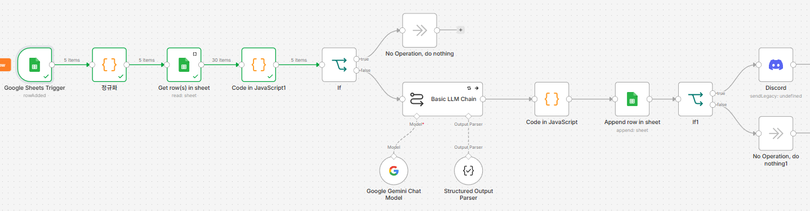
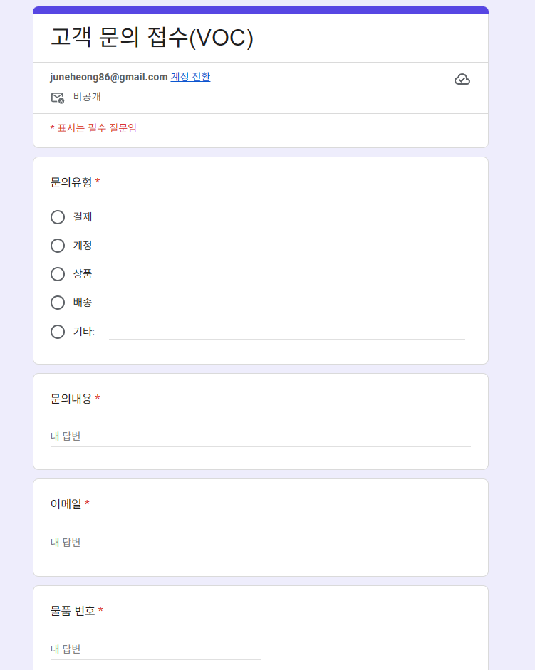
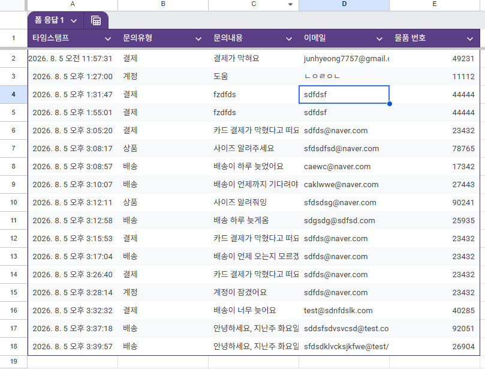
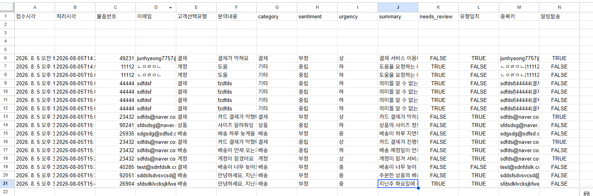
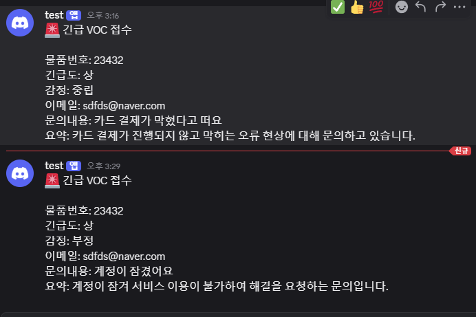

# 고객VOC분석Agent — VOC 자동 분류·긴급 알림 파이프라인

**제출자**: 진준형
**작성일**: 2026-08-05
**사용 스택**: Google Form / Google Sheets / n8n Cloud / Google Gemini 3.5 Flash / Discord Webhook

---

## 1. 프로젝트 개요

종합 쇼핑몰의 고객문의(VOC)를 사람이 직접 읽고 분류하던 방식에는 두 가지 문제가 있었다.

1. 담당자가 자리를 비운 사이 긴급 문의가 몇 시간씩 방치된다.
2. 분류 기준이 사람마다 달라 통계를 낼 수 없다.

이 프로젝트는 **접수 → 분류 → 기록 → 긴급 알림까지 사람 손을 거치지 않는 파이프라인**을 n8n으로 구현했다. 담당자는 Discord 알림이 왔을 때만 개입한다.

## 2. 전체 아키텍처

```mermaid
flowchart TD
    A[고객: Google Form 제출] --> B[(폼 응답1 시트)]
    B -->|Row Added, 1분 폴링| C[n8n: Google Sheets Trigger]
    C --> D[정규화: 중복키 생성]
    D --> E[Get row(s) in sheet: 분석결과 전체 조회]
    E --> F[isDuplicate 계산]
    F --> G{중복인가?}
    G -->|Yes| H[NoOp: 정상 종료]
    G -->|No| I[Basic LLM Chain<br/>Gemini 3.5 Flash + Structured Output Parser]
    I --> J[검증 안전판 Code 노드]
    J --> K[Append Row: 분석결과 시트 저장]
    K --> L{urgency == 상?}
    L -->|Yes| M[Discord Webhook 발송]
    L -->|No| N[NoOp: 종료]
```

핵심 제약: **중복 판정(F, G)이 LLM 호출(I)보다 반드시 앞에 온다.** 중복건에 토큰을 쓰지 않기 위함이다 (REQ-03).



## 3. n8n 노드 구성

| 순서 | 노드 이름 | 역할 |
| --- | --- | --- |
| 1 | Google Sheets Trigger | `폼 응답1` 시트에 새 행 추가 감지, 1분 폴링 |
| 2 | 정규화 (Code) | 이메일 소문자화, 물품번호 숫자 추출, 중복키 생성 |
| 3 | Get row(s) in sheet | `분석결과` 시트 전체 조회 |
| 4 | Code in JavaScript1 | 조회된 행과 중복키 비교, `isDuplicate` 계산 |
| 5 | If | `isDuplicate` 분기 — True: 종료 / False: 계속 |
| 6 | Basic LLM Chain | Gemini 3.5 Flash + Structured Output Parser로 5개 필드 분류 |
| 7 | Code in JavaScript (안전판) | 허용값·타입·길이 검증, 위반 시 안전 기본값 강제 |
| 8 | Append row in sheet | `분석결과` 시트에 14개 열 저장 |
| 9 | If1 | `urgency == 상` 분기 |
| 10 | Discord | Webhook으로 긴급 알림 발송 |

## 4. 요구사항별 구현

### REQ-01 · 수집

Google Form에 `문의유형`(객관식: 결제/계정/상품/배송/기타), `문의내용`(장문형), `이메일`(단답형), `물품 번호`(단답형, 정규식 `^\d{5}$`) 4개 필드를 구성하고 응답을 `폼 응답1` 시트에 연결했다.





### REQ-02 · 트리거

`Google Sheets Trigger` 노드(Event: `Row Added`, 1분 폴링)로 워크플로우를 Active 상태로 유지해, 폼 제출만으로 무조작 자동 실행되도록 구성했다. Manual Trigger는 사용하지 않는다.

### REQ-03 · 중복 방지

중복키를 `이메일|물품번호|문의유형` 조합으로 정의하고, LLM 호출 **이전**에 `분석결과` 시트 전체를 조회해 동일 키가 있으면 저장·알림 없이 정상 종료시켰다.

```javascript
// 정규화 (Code, Run Once for Each Item)
const email = ($json['이메일'] || '').trim().toLowerCase();
const itemNo = ($json['물품 번호'] || '').toString().replace(/\D/g, '');
const type = ($json['문의유형'] || '').trim();
const dedupeKey = `${email}|${itemNo}|${type}`;

return {
  json: {
    ...$json,
    이메일_norm: email,
    물품번호_norm: itemNo,
    문의유형_norm: type,
    중복키: dedupeKey,
  }
};
```

```javascript
// Code in JavaScript1 (Run Once for All Items) — isDuplicate 계산
const originals = $('정규화').all();
const rowsInput = $input.all();

return originals.map((orig, idx) => {
  const currentKey = orig.json['중복키'];
  const isDuplicate = rowsInput.some(r => (r.json['중복키'] || '') === currentKey);

  return {
    json: { ...orig.json, isDuplicate },
    pairedItem: { item: idx },
  };
});
```

### REQ-04 · LLM 분류

Gemini 3.5 Flash에 `category / sentiment / urgency / summary / needs_review` 5개 필드를 구조화 출력으로 요청했다. 프롬프트에는 긴급도(`상`/`중`/`하`) 판정 기준을 명시했다 (전체 프롬프트는 [prompt.md](prompt.md) 참조).

- 상: 서비스 이용 불가, 금전적 피해, 법적 대응·언론 제보 언급, 명시적 환불 요구
- 중: 불편하지만 사용 가능, 문의·개선 요청
- 하: 단순 질문, 칭찬, 정보 확인

### REQ-05 · 검증 안전판

LLM 출력이 계약(허용값/타입/길이)을 어겨도 워크플로우가 죽지 않도록 Code 노드로 방어했다. 위반 시 `urgency`는 안전한 기본값 `중`으로, `needs_review`는 `true`로 강제하며, 검증 실패건도 그대로 저장 단계로 넘긴다 (전체 코드는 [검증안전판.js](검증안전판.js) 참조).

- 코드펜스 제거 후 JSON 파싱, 파싱 실패 시 위반 처리
- `category`/`sentiment`/`urgency` 허용값 검사
- `needs_review` boolean 타입 검사
- `summary` 80자 초과 시 절단 + 위반 처리
- 전체를 `try/catch`로 감싸 어떤 입력에도 예외를 던지지 않음

### REQ-06 · 결과 저장

`Append row in sheet` 노드로 `분석결과` 시트에 14개 열(접수시각·처리시각·물품번호·이메일·고객선택유형·문의내용·category·sentiment·urgency·summary·needs_review·유형일치·중복키·알림발송)을 기록했다. `유형일치`는 고객이 고른 `문의유형`과 LLM의 `category`를 비교해 통계 재료로 남겼다.



### REQ-07 · Discord 긴급 알림

`urgency == 상`인 건만 `IF` 노드로 걸러 Discord Webhook으로 발송했다. `중`·`하` 건은 알림 없이 종료한다. 메시지에는 물품번호/긴급도/감정/이메일/문의내용/요약을 담았고, 문의내용은 Discord embed 필드 제한(1024자)을 고려해 900자로 절단했다.



## 5. 구현 중 발견한 이슈와 해결

n8n Code 노드의 **Mode(Run Once for All Items / Each Item)** 와 **pairedItem 추적** 관련 문제를 여러 번 겪었다.

| # | 증상 | 원인 | 해결 |
| --- | --- | --- | --- |
| 1 | 정규화 노드에서 `A 'json' property isn't an object` 에러 | Mode를 All Items → Each Item으로 바꾸며 `return [{json:{...}}]` 배열 래핑을 그대로 둠 | 배열 제거, `return {json:{...}}` 로 수정 |
| 2 | 트리거가 4건을 한 번에 받았는데 중복 계산 노드가 1건만 출력 | All Items 모드에서 `$('정규화').first()` 만 참조해 배치 중 첫 번째 아이템만 처리 | `$('정규화').all()` + `.map()` 으로 전체 처리, `pairedItem` 명시 부여 |
| 3 | LLM 분류 후 안전판 노드가 3건 입력을 1건으로 축소 | 안전판 노드도 동일하게 All Items 모드 + 단일 아이템 취급 로직 | Each Item 모드 + 배열 없는 `return` 으로 수정 |
| 4 | `Basic LLM Chain` 통과 후 원본 필드(문의내용, 이메일, 물품번호 등)가 사라짐 | LLM Chain 노드가 입력을 passthrough 하지 않고 `output` 으로 아이템을 갈아치움 | 시트 저장·Discord 노드에서 `$('Code in JavaScript1').item.json.*` 로 역참조 |
| 5 | 동일 문의 재제출(TC-05) 시 중복이 걸리지 않음 | `isDuplicate` 계산 시 `Get Rows` 결과를 `pairedItem` 기준으로 서브 필터링했는데, `Get Rows`가 시트 전체를 그냥 읽어오는 노드라 페어링이 기대와 다르게 붙어 실제 존재하는 행이 필터링 단계에서 걸러짐 | 서브 필터링 제거, `rowsInput.some(...)` 으로 가져온 행 전체를 대상으로 비교하도록 단순화 |

## 6. 테스트 결과

전 케이스를 n8n 수동 실행이 아닌 **실제 Google Form 제출**로 진행해 REQ-02(무조작 자동 실행)까지 함께 검증했다. 상세 표는 [테스트결과.md](테스트결과.md) 참조.

| TC | 시나리오 | 결과 |
| --- | --- | --- |
| TC-01 | 정상 문의, 무조작 제출 | ✅ (다른 케이스로 반복 증명) |
| TC-02 | 결제 오류·환불 요구 | ✅ `urgency=상`, Discord 도달 |
| TC-03 | 단순 질문 | ✅ `urgency=하`, 알림 없음 |
| TC-04 | 배송 지연 불편 | ✅ `urgency=중`, 알림 없음 |
| TC-05 | 동일 내용 재제출 | ✅ 행 증가 없음 (버그 수정 후 통과) |
| TC-06 | 같은 물품, 다른 유형 | ✅ 신규건 정상 처리 |
| TC-07 | LLM 허용값 위반 유도 | ✅ `중`+`needs_review=true` 강제, 저장 |
| TC-08 | LLM 응답이 JSON 아님 | ✅ 기본값 저장, 워크플로우 성공 |
| TC-09 | summary 80자 초과 유도 | ✅ 80자 절단, `needs_review=true` |
| TC-10 | 고객 선택 유형과 LLM 판정 불일치 | ✅ `유형일치=false` 기록 |

## 7. 산출물

- Google Form: https://forms.gle/Gji14yQz9qagbVd69
- 스프레드시트 (`폼 응답1`, `분석결과`): https://docs.google.com/spreadsheets/d/1-720m8DSD4Vzb3-0dehyTR1b5en16vbjMx0FsBEnbe8/edit?usp=sharing
- [`workflow.json`](workflow.json) — n8n 워크플로우 export (Credential 값 미포함 확인)
- [prompt.md](prompt.md) — LLM 프롬프트 원문
- [검증안전판.js](검증안전판.js) — REQ-05 검증 코드
- [테스트결과.md](테스트결과.md) — TC-01~10 결과 및 이슈 기록
- [기획서.md](기획서.md) — 기획 및 설계 문서
- [체크리스트.md](체크리스트.md) — 단계별 구축 체크리스트

## 8. 회고

가장 시간을 많이 쓴 부분은 요구사항 자체가 아니라 **n8n Code 노드의 아이템 처리 방식**이었다. `Run Once for All Items`와 `Run Once for Each Item`의 반환 형식이 다르고, 여러 노드를 거치며 원본 아이템과의 연결(pairedItem)이 끊어지면 에러 없이 데이터가 조용히 사라질 수 있다는 걸 실제로 여러 번 겪었다. 특히 5번 이슈(중복 판정 재발)는 겉보기엔 로직이 맞아 보였지만, 시트에 값이 똑같이 들어있는데도 비교에 실패하는 상황이라 원인 파악에 단계별로 데이터를 직접 까봐야 했다. 이후 비슷한 워크플로우를 만들 때는 Code 노드를 추가하는 시점에 Mode와 반환 형식을 먼저 확정하고 시작하는 게 낫다는 걸 배웠다.
