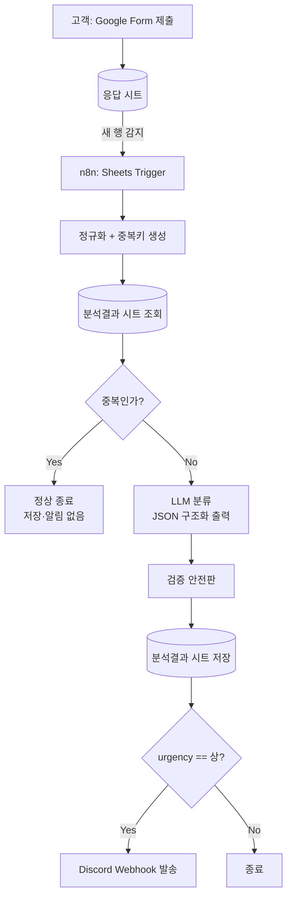

# VOC 자동 분류·알림 파이프라인 기획서

| 항목 | 내용 |
| --- | --- |
| 프로젝트명 | VOC 자동 분류·긴급 알림 파이프라인 |
| 작성일 | 2026-08-05 |
| 대상 | 종합 쇼핑몰 고객문의(VOC) 운영 |
| 사용 도구 | Google Form / Google Sheets / n8n Cloud / Google Gemini 3.5 / Discord Webhook |

---

## 1. 배경

종합 쇼핑몰에 하루 수십 건의 고객 문의가 접수되지만, 현재는 담당자가 직접 읽고 분류한다. 여기서 두 가지 문제가 발생한다.

1. **긴급건 방치** — 담당자가 자리를 비운 사이 서비스 장애·환불 요구 같은 긴급 문의가 몇 시간씩 대기한다.
2. **분류 기준 불일치** — 사람마다 "배송"과 "상품"의 경계, "긴급"의 기준이 달라 누적 데이터로 통계를 낼 수 없다.

## 2. 목적

접수 → 분류 → 기록 → 긴급 알림까지 **사람 손을 거치지 않는 파이프라인**을 구축한다.

- 담당자는 Discord 알림이 왔을 때만 개입한다.
- 분류 기준을 프롬프트로 고정해 일관된 통계 데이터를 축적한다.
- LLM이 실수하거나 응답이 깨져도 파이프라인은 멈추지 않는다.

## 3. 성공 기준

| # | 기준 | 확인 방법 |
| --- | --- | --- |
| S1 | 폼 제출 후 아무 조작 없이 워크플로우가 실행된다 | 폼 제출 → n8n 실행 이력 확인 |
| S2 | 긴급(`상`) 문의가 Discord로 도달한다 | 환불 요구 문의 제출 → 채널 확인 |
| S3 | 동일 문의 재제출 시 결과 행이 늘지 않는다 | 같은 내용 2회 제출 → 시트 행 수 확인 |
| S4 | LLM 응답이 깨져도 워크플로우가 성공 종료하고 행이 남는다 | 프롬프트 강제 오염 테스트 |
| S5 | `중`·`하` 문의는 알림이 가지 않는다 | 단순 질문 제출 → 채널 무반응 확인 |

## 4. 범위

**포함**: 폼 접수, 자동 트리거, 중복 차단, LLM 분류, 출력 검증, 시트 저장, Discord 긴급 알림

**제외**: 고객에게 자동 회신 메일 발송, 상담원 배정, 관리자 대시보드 UI, 다국어 문의 처리

---

## 5. 시스템 구성



**핵심 순서 제약**: 중복 판정(F)은 반드시 LLM 호출(H)보다 앞에 온다. 중복건에 토큰을 쓰지 않기 위함이며, REQ-03의 명시 조건이다.

---

## 6. 데이터 설계

### 6.1 Google Form 입력 항목 (REQ-01)

항목명은 채점 기준이므로 **아래 표기를 그대로 사용한다.**

| 항목명 | 형식 | 필수 | 용도 |
| --- | --- | --- | --- |
| 문의유형 | 객관식 (결제 / 계정 / 상품 / 배송 / 기타) | O | 고객 자기 선택값. LLM 분류 결과와 비교하는 재료 |
| 문의내용 | 장문형 | O | LLM 분류의 실제 입력값 |
| 이메일 | 단답형 | O | 응답 회신용, 중복키 구성 요소 |
| 물품 번호 | 단답형 (임의의 5자리 숫자) | O | 물품 식별자, 중복키 구성 요소 |

> 폼 설정: 응답 시트 연결 필수. `물품 번호`는 정규식 검증 `^\d{5}$` 적용 권장.

### 6.2 응답 시트 (`폼 응답 1`)

| 열 | 내용 |
| --- | --- |
| A | 타임스탬프 (폼 자동) |
| B | 문의유형 |
| C | 문의내용 |
| D | 이메일 |
| E | 물품 번호 |

### 6.3 분석결과 시트 (`분석결과`) — REQ-06

| 열 | 헤더 | 타입 | 설명 |
| --- | --- | --- | --- |
| A | 접수시각 | datetime | 응답 시트 타임스탬프 |
| B | 처리시각 | datetime | 워크플로우 실행 시각 |
| C | 물품번호 | string | 원본 |
| D | 이메일 | string | 원본 |
| E | 고객선택유형 | string | 폼의 `문의유형` |
| F | 문의내용 | string | 원본 |
| G | category | string | LLM 분류 결과 |
| H | sentiment | string | LLM 분류 결과 |
| I | urgency | string | LLM 분류 결과 (검증 후 값) |
| J | summary | string | LLM 요약 (80자 이하) |
| K | needs_review | boolean | 검증 실패 여부 |
| L | 유형일치 | boolean | `E == G` 여부 (통계용) |
| M | 중복키 | string | 중복 판정 기준값 |
| N | 알림발송 | boolean | Discord 발송 여부 |

`L` 열이 "고객이 고른 유형과 LLM 판단이 얼마나 다른가"를 집계할 수 있게 해 준다. 폼 항목 설명에 적힌 비교 목적을 데이터로 남기는 장치다.

---

## 7. 요구사항별 상세 설계

### REQ-02 :: 자동 트리거

실행 환경은 **n8n Cloud** 로 확정. 공개 Webhook URL을 쓸 수 있으므로 두 방식 모두 가능하다.

| 방식 | 구성 | 판단 |
| --- | --- | --- |
| **(채택) Google Sheets Trigger** | `Google Sheets Trigger` 노드, Event = `Row Added`, Poll = 1분 | REQ-02의 "시트에 새 행 추가 → 실행" 을 그대로 구현. Google 계정 OAuth 연결만으로 끝난다 |
| (예비) Apps Script → Webhook | 폼 `onFormSubmit` 에서 n8n Cloud Webhook URL로 POST | 지연 0초. 폴링 지연이 시연에서 문제될 때 전환 |

- Manual Trigger만 있는 상태는 미완성으로 간주한다. 제출 후 무조작 실행을 반드시 검증한다.
- **폴링 주기 때문에 폼 제출 후 최대 1분의 지연이 있다.** 시연 시나리오를 짤 때 이 대기 시간을 감안하고, 즉시성을 보여야 하면 예비 방식으로 전환한다.
- n8n Cloud의 Google 자격증명은 OAuth2로 연결한다. 응답 시트와 `분석결과` 시트가 같은 계정 소유여야 트리거·저장에 자격증명 하나를 재사용할 수 있다.

### REQ-03 :: 중복 방지

**중복키 정의**

```
중복키 = 이메일 | 물품번호 | 문의유형
예) hong@example.com|10432|배송
```

- LLM 결과(`category`)는 호출 전에 알 수 없으므로 **고객이 직접 고른 `문의유형`** 을 키에 쓴다.
- 세 값 모두 정규화한다: 앞뒤 공백 제거, 이메일 소문자화, 물품번호 숫자만 추출.

**판정 흐름**

1. `Code` 노드: 신규 행에서 중복키 생성
2. `Google Sheets (Get Rows)`: `분석결과` 시트 M열 조회
3. `IF` 노드: 동일 중복키 존재 → **True 분기는 `NoOp` 으로 정상 종료** (저장·알림 없음)
4. 존재하지 않음 → LLM 노드로 진행

> 대안으로 `문의내용` 해시를 키에 포함하는 방법이 있으나, 같은 문제를 문장만 바꿔 재문의하는 경우를 잡지 못한다. "같은 물품 + 같은 사람 + 같은 유형"을 하나의 문의로 보는 위 정의를 채택한다.

**유효 기간: 전체 이력 대상 (확정)**

- 중복키가 시트에 한 번이라도 있으면 기간 제한 없이 차단한다.
- 추후 기간 제한이 필요해지면 3번 조회 단계에서 `접수시각 >= (오늘 - N일)` 필터만 추가하면 된다. 나머지 노드는 바뀌지 않는다.

### REQ-04 :: LLM 분류

**출력 스키마 (구조화 출력 / JSON)**

```json
{
  "category": "결제 | 계정 | 상품 | 배송 | 기타",
  "sentiment": "긍정 | 중립 | 부정",
  "urgency": "상 | 중 | 하",
  "summary": "80자 이하 한국어 요약",
  "needs_review": false
}
```

**모델 및 n8n 구성**

| 항목 | 값 |
| --- | --- |
| 모델 | `gemini-3.5-flash` |
| 노드 | `Basic LLM Chain` + `Google Gemini Chat Model` + `Structured Output Parser` |
| 자격증명 | Google AI Studio(Gemini) API 키 — n8n Credential로 등록 |
| temperature | `0` (재현성 확보, 채점·테스트 시 같은 입력 → 같은 출력) |

- Flash 계열은 무료 티어 rate limit이 Pro보다 넉넉해 테스트 반복에 유리하다. 다만 구조화 출력 정확도가 미세하게 떨어질 수 있어, REQ-05 안전판이 실제로 걸리는 빈도를 8단계 테스트에서 눈여겨본다.
- Gemini는 JSON 모드를 켜지 않으면 응답을 ` ```json ` 코드펜스로 감싸는 경향이 있다. `Structured Output Parser` 를 붙이되, REQ-05의 안전판에서 펜스를 제거한 뒤 파싱하는 처리를 반드시 유지한다.
- Gemini API 키는 Google Sheets OAuth와 **별개의 자격증명**이다. 시트 연결이 됐다고 LLM 노드가 인증되지는 않는다.

**프롬프트 (초안)**

```
당신은 종합 쇼핑몰의 고객문의 분류 담당자입니다.
아래 문의내용을 읽고 반드시 JSON만 출력하세요. 설명·머리말·코드펜스를 붙이지 마세요.

[출력 필드]
- category: 결제 / 계정 / 상품 / 배송 / 기타 중 하나
- sentiment: 긍정 / 중립 / 부정 중 하나
- urgency: 상 / 중 / 하 중 하나
- summary: 80자 이하 한국어 한 문장
- needs_review: 판단이 모호하면 true, 아니면 false

[긴급도 판정 기준]
- 상: 서비스를 못 쓰는 상태 / 금전적 피해 발생 / 법적 대응이나 언론 제보 언급 / 명시적 환불 요구
- 중: 불편하지만 사용은 가능 / 문의 및 개선 요청
- 하: 단순 질문 / 칭찬 / 정보 확인

[판단 원칙]
- 어느 유형에도 명확히 속하지 않으면 category는 "기타"로 둔다.
- 긴급도는 감정의 세기가 아니라 위 기준의 사실 여부로 판정한다.
  (말투가 거칠어도 단순 질문이면 "하")
- 여러 기준에 걸치면 더 높은 긴급도를 택한다.

[문의내용]
{{ $json["문의내용"] }}
```

**분류 예시 (프롬프트 few-shot 및 테스트용)**

| 문의내용 | category | sentiment | urgency |
| --- | --- | --- | --- |
| 결제가 두 번 됐어요. 당장 환불해 주세요. | 결제 | 부정 | 상 |
| 로그인이 계속 안 돼서 주문을 아예 못 하고 있습니다 | 계정 | 부정 | 상 |
| 배송이 하루 늦었네요. 다음엔 좀 더 빨랐으면 좋겠어요 | 배송 | 중립 | 중 |
| 이 제품 사이즈가 어떻게 되나요? | 상품 | 중립 | 하 |
| 포장 정성스럽게 해 주셔서 감사합니다 | 기타 | 긍정 | 하 |

### REQ-05 :: 검증 안전판

LLM 출력을 `Code` 노드에서 검사한다. **어떤 경우에도 예외를 던지지 않고** 정상 객체를 반환한다.

| 검사 항목 | 위반 예 | 처리 |
| --- | --- | --- |
| JSON 파싱 | 코드펜스·설명문 포함, 빈 응답 | 펜스 제거 후 재파싱 → 실패 시 전 필드 기본값 |
| 필수 필드 존재 | `urgency` 키 누락 | 기본값 대입 |
| 허용값 위반 | `urgency: "높음"`, `category: "환불"` | 기본값 대입 |
| 타입 불일치 | `needs_review: "true"` (문자열) | boolean 캐스팅 |
| 길이 초과 | `summary` 120자 | 80자 절단 |

**기본값 및 강제 규칙**

| 필드 | 기본값 |
| --- | --- |
| category | `기타` |
| sentiment | `중립` |
| urgency | `중` ← 안전한 기본값 |
| summary | 문의내용 앞 80자 |
| needs_review | `true` |

- **위반이 하나라도 있으면 `urgency = 중`, `needs_review = true`.**
  `urgency`를 `중`으로 내리는 이유: 잘못된 값으로 오알림을 보내는 것보다, 시트에 검토 대상으로 남겨 담당자가 확인하게 하는 편이 안전하다.
- 검증 실패건도 **반드시 시트에 저장한다.** 실패를 이유로 저장을 건너뛰면 문의가 유실된다.
- n8n 노드 옵션에서 LLM 노드에 `Retry on Fail` 1회, `On Error = Continue` 를 설정해 API 오류 시에도 후속 노드가 실행되게 한다.

**검증 코드 스케치**

```javascript
const ALLOW = {
  category: ['결제', '계정', '상품', '배송', '기타'],
  sentiment: ['긍정', '중립', '부정'],
  urgency: ['상', '중', '하'],
};

let raw = $json.output ?? '';
let parsed = {};
let violated = false;

try {
  if (typeof raw === 'object' && raw !== null) parsed = raw;
  else parsed = JSON.parse(String(raw).replace(/```(json)?/g, '').trim());
} catch (e) {
  violated = true;
}

const pick = (key, fallback) => {
  const v = typeof parsed[key] === 'string' ? parsed[key].trim() : parsed[key];
  if (!ALLOW[key].includes(v)) { violated = true; return fallback; }
  return v;
};

const result = {
  category:  pick('category', '기타'),
  sentiment: pick('sentiment', '중립'),
  urgency:   pick('urgency', '중'),
  summary:   String(parsed.summary ?? $json['문의내용'] ?? '').slice(0, 80),
  needs_review: parsed.needs_review === true,
};

if (typeof parsed.summary !== 'string' || parsed.summary.length > 80) violated = true;
if (typeof parsed.needs_review !== 'boolean') violated = true;

if (violated) { result.urgency = '중'; result.needs_review = true; }

return [{ json: { ...$json, ...result } }];
```

### REQ-06 :: 결과 저장

- `Google Sheets (Append Row)` 노드로 `분석결과` 시트에 6.3의 14개 열을 기록한다.
- 중복 판정 통과건은 **검증 성공·실패 여부와 무관하게 전부 저장**한다.
- 시트 1행에 헤더를 고정하고 `Append` 의 컬럼 매핑을 헤더명 기준으로 설정한다.

### REQ-07 :: Discord 긴급 알림

Webhook URL은 생성 완료 상태다.

- `IF` 노드 조건: `urgency == "상"` (문자열 완전 일치). `중`·`하` 는 알림 없이 종료한다.
- **채택**: n8n `Discord` 노드, Connection Type = `Webhook`. URL이 Credential로 분리 저장되므로 산출물로 제출하는 `workflow.json` 에 평문으로 남지 않는다.
- **대안**: `HTTP Request` 노드로 Webhook URL에 `POST` + `Content-Type: application/json`. embed 구성이 더 자유롭다. 다만 URL이 노드 파라미터에 들어가므로 **export 전에 반드시 마스킹**한다.
- 어느 방식이든 Webhook URL은 인증 없이 아무나 메시지를 보낼 수 있는 값이다. 캡처·문서·커밋에 노출되지 않게 관리한다.

**메시지 페이로드**

```json
{
  "content": "🚨 **긴급 VOC 접수**",
  "embeds": [{
    "title": "[{{ $json.category }}] {{ $json.summary }}",
    "color": 15158332,
    "fields": [
      { "name": "물품번호", "value": "{{ $json.물품번호 }}", "inline": true },
      { "name": "긴급도",   "value": "{{ $json.urgency }}",  "inline": true },
      { "name": "감정",     "value": "{{ $json.sentiment }}", "inline": true },
      { "name": "이메일",   "value": "{{ $json.이메일 }}" },
      { "name": "문의내용", "value": "{{ $json.문의내용 }}" }
    ]
  }]
}
```

> Discord embed의 `value` 는 1024자 제한이 있으므로 `문의내용` 은 앞 900자로 절단해 전달한다.

---

## 8. 예외 처리 정책

| 상황 | 동작 |
| --- | --- |
| Gemini API 타임아웃·오류 | 1회 재시도 → 실패 시 검증 안전판 기본값으로 저장, `needs_review = true` |
| Gemini 안전 필터가 응답 차단 | 욕설·협박이 섞인 격한 문의에서 발생 가능. 빈 응답이 오므로 안전판이 기본값(`중` / `needs_review=true`)으로 저장 → **담당자가 시트에서 확인**. 격한 문의일수록 실제 긴급건일 확률이 높으므로 검토 대상에서 누락되지 않는 것이 중요하다 |
| Gemini API 무료 티어 rate limit | 분당 요청 한도 초과 시 429. 재시도 1회로 흡수되지 않으면 안전판 경로로 저장된다. 연속 테스트 시 제출 간격을 둔다 |
| Discord Webhook 실패 | 워크플로우는 성공 처리, 시트 `알림발송 = false` 로 기록 |
| 물품번호가 5자리가 아님 | 정규화 후 그대로 진행 (폼 검증에서 1차 차단) |
| 문의내용 공백 | LLM 호출 없이 `기타 / 중립 / 중 / needs_review=true` 로 저장 |
| 중복 판정 | 저장·알림 없이 정상 종료 (실패 아님) |

## 9. 테스트 계획

| TC | 입력 | 기대 결과 |
| --- | --- | --- |
| TC-01 | 정상 문의 제출 (무조작) | 워크플로우 자동 실행, 결과 행 1건 추가 |
| TC-02 | "결제 두 번 됐으니 환불해 주세요" | `urgency=상`, Discord 알림 도달 |
| TC-03 | "사이즈 알려주세요" | `urgency=하`, 알림 없음 |
| TC-04 | "배송 하루 늦었어요" | `urgency=중`, 알림 없음 |
| TC-05 | TC-02와 동일 내용 재제출 | 결과 행 증가 없음, 알림 없음, 실행은 성공 |
| TC-06 | 같은 물품·다른 유형으로 제출 | 신규건으로 정상 처리 |
| TC-07 | LLM이 `urgency: "매우높음"` 반환 (프롬프트 오염) | `urgency=중`, `needs_review=true`, 시트에 저장, 알림 없음 |
| TC-08 | LLM 응답이 JSON이 아닌 문장 | 기본값 저장, 워크플로우 성공 |
| TC-09 | 100자 초과 summary 반환 | 80자로 절단, `needs_review=true` |
| TC-10 | 고객은 "기타" 선택, LLM은 "배송" 판정 | `유형일치=false` 로 기록 |

## 10. 산출물

| # | 산출물 | 형태 |
| --- | --- | --- |
| 1 | Google Form + 응답 시트 | 공유 링크 |
| 2 | `분석결과` 시트 (헤더 구성 완료) | 공유 링크 |
| 3 | n8n 워크플로우 | `workflow.json` export |
| 4 | LLM 프롬프트 | `prompt.md` |
| 5 | 검증 안전판 코드 | Code 노드 스크립트 |
| 6 | 테스트 결과 기록 | TC-01~10 실행 로그·캡처 |
| 7 | 본 기획서 | `기획서.md` |

## 11. 구현 순서

0. 자격증명 준비: Gemini API 키 발급, n8n Cloud에 Google OAuth2 · Discord Webhook Credential 등록
1. Google Form 생성 → 응답 시트 연결 → `분석결과` 시트 헤더 작성
2. n8n Sheets Trigger 연결, 폼 제출 시 실행되는지 확인 (REQ-02 선검증)
3. 정규화 + 중복키 Code 노드 → 시트 조회 → IF 분기 (REQ-03)
4. LLM 노드 + 구조화 출력 파서 (REQ-04)
5. 검증 안전판 Code 노드 (REQ-05)
6. Append Row 노드 (REQ-06)
7. IF + Discord Webhook (REQ-07)
8. TC-01~10 전수 실행

> 2번을 먼저 통과시킨 뒤 뒤쪽 노드를 붙인다. 자동 트리거가 안 되는 상태로 LLM부터 만들면 마지막에 전체를 다시 손봐야 한다.

## 12. 결정 사항 및 미결 사항

**확정**

| 항목 | 결정 |
| --- | --- |
| LLM 모델 | `gemini-3.5-flash` |
| n8n 실행 환경 | n8n Cloud → 트리거는 Google Sheets Trigger 채택 |
| Discord | Webhook URL 생성 완료 |
| 중복 판정 유효 기간 | **전체 이력 대상으로 고정.** 기간 제한 없음 (REQ-03 참조) |

**미결**

없음.

**준비 필요**

| # | 항목 |
| --- | --- |
| 1 | Google AI Studio Gemini API 키 발급 → n8n Credential 등록 |
| 2 | n8n Cloud에 Google 계정 OAuth2 연결 (시트 읽기·쓰기 권한) |
