# 구글 폼 설정

제출한 사람이 동일 인물인지 확인하기 위해 이메일 주소를 수집하고 응답 횟수를 1회로 제한

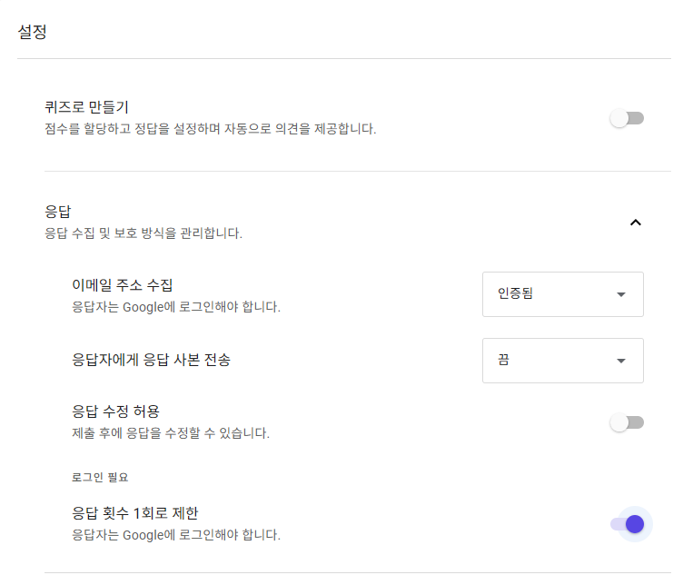

# status 저장 시트

이메일별로 각 구글폼의 전송 여부를 확인할 수 있는 시트

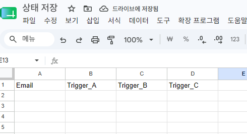
# 동작과정

## 작성한 구글폼의 종류 상관없이 처음 작성한 경우

- junhyeong7757@gmail.com으로 두번째 구글폼을 작성한다
- 트리거 발동시 얻은 이메일로 status 저장 시트에 해당 이메일이 있는지 확인한다
- 값이 없으면 발동한 트리거 종류를 확인 후 status 저장 시트에 이메일과 함께 확인한 트리거를 TRUE 나머지는 FALSE로 append한다

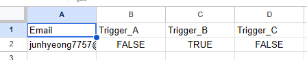

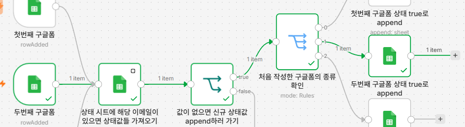

## 2번째 작성한 경우

- 동일 이메일로 세번째 구글폼을 작성한다
1. 트리거 발동시 얻은 이메일로 status 저장 시트에 해당 이메일이 있는지 확인한다
2. 값이 있으면 발동한 트리거 종류를 확인 후 status 저장 시트에 확인한 트리거의 값을 TRUE로 업데이트한다
3. 트리거의 상태값이 하나라도 FALSE면 작동을 끝낸다

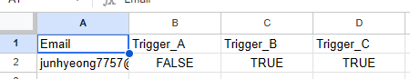

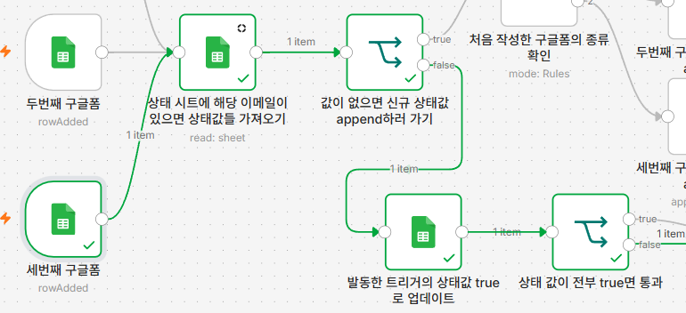

## 중간에 다른 이메일 사용자가 작성한 경우

1. 작동방식은 처음 동작방식과 동일하며 status 저장 시트에 정보가 추가된 걸 확인할 수 있다

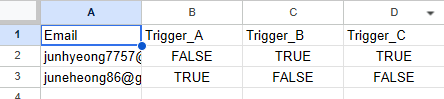

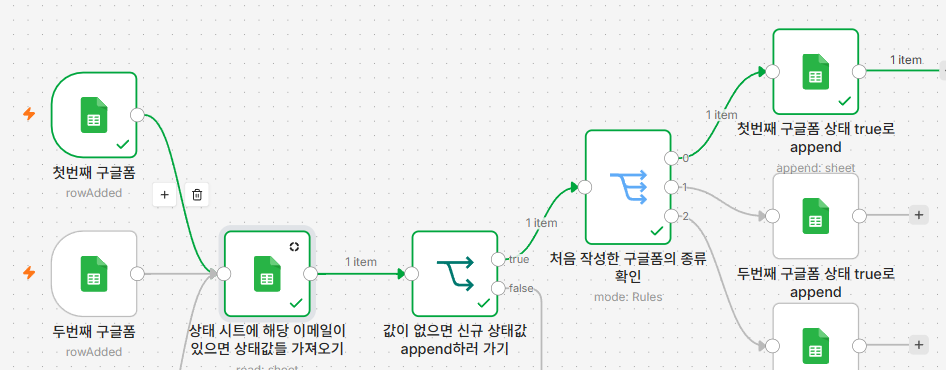

## 동일한 작성자가 3가지 모두 작성 완료한 경우

1. 중간과정까진  2번째 작성한 경우와 같다
2. 상태 값이 전부 true면 해당 이메일 주인의 이름을 찾아온 후 이메일 주소로 이름과 함께 메일을 보낸다

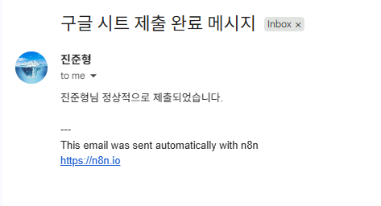

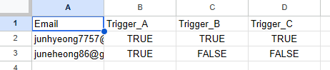

!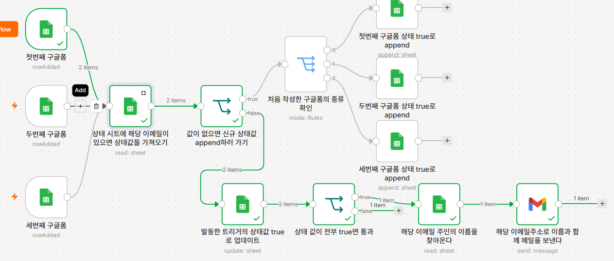

## published 후 다른 이메일로 실험해보니 잘 작동하였다
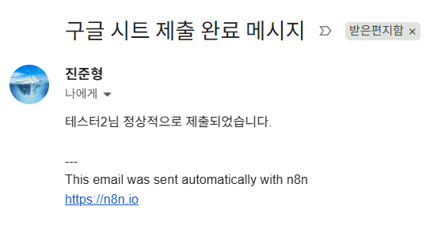
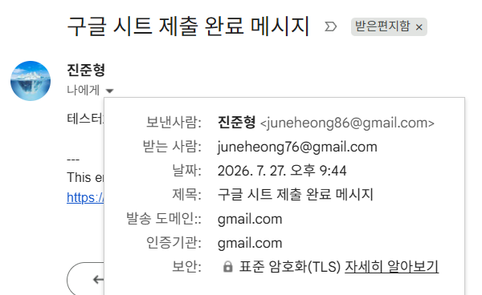
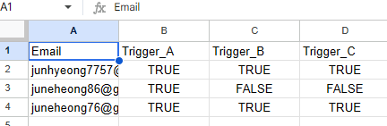
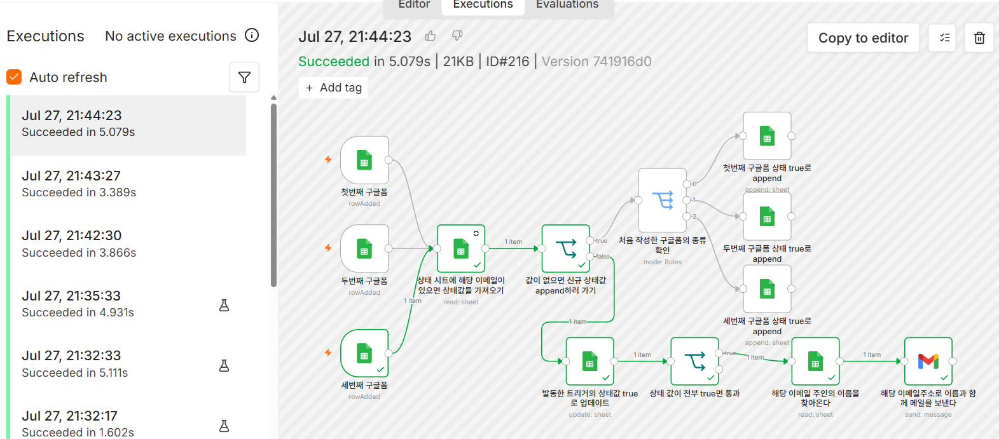