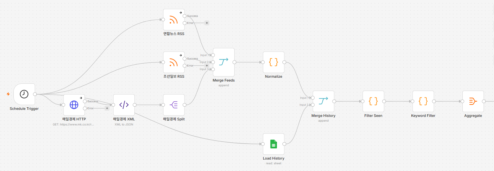
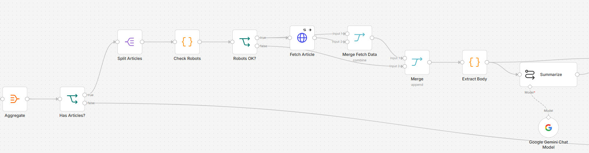
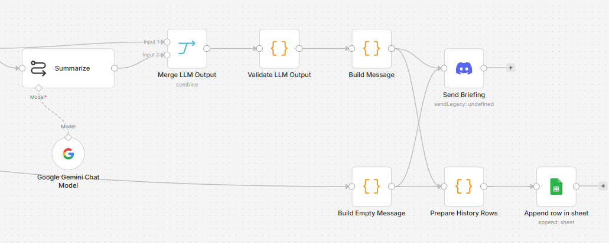
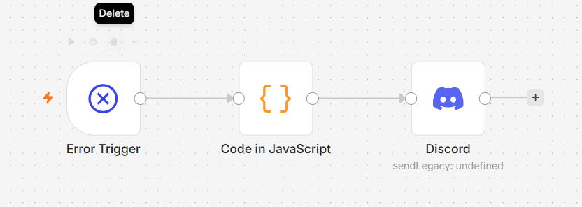
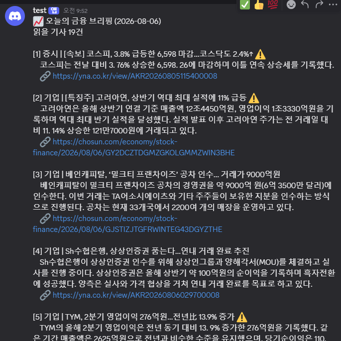
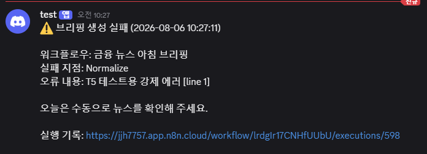
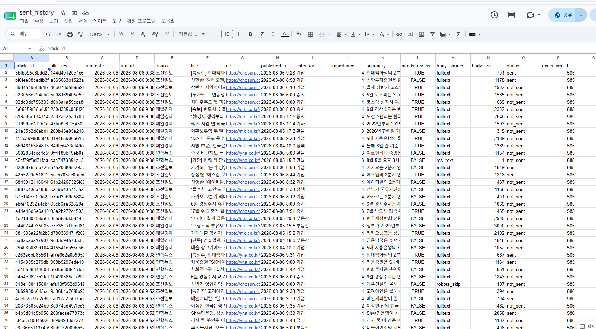

# 금융뉴스브리핑Agent — 금융 뉴스 자동 브리핑 시스템

**작성자**: 진준형
**구현 도구**: n8n Cloud
**LLM**: Google Gemini (n8n Google Gemini Chat Model 노드)
**발송 채널**: Discord
**발송 이력 시트**: https://docs.google.com/spreadsheets/d/11qMOU7yiEaupq_tapHEVmNlJuiRFI_IQJfJ1mWQCKcc/edit?usp=sharing

---

## 1. 프로젝트 개요

자산운용사 리서치팀은 매일 아침 여러 뉴스 사이트를 돌아다니며 시장 관련 기사를 확인한다. 이 과정에서 팀원마다 보는 매체가 달라 정보가 제각각이고, 전체 기사 중 금융과 무관한 기사(연예·스포츠 등) 비중이 높아 걸러내는 데 시간이 들며, 어제 읽은 기사를 오늘 또 읽는 비효율이 반복된다.

이 워크플로우는 **매일 아침 8시 30분**, 3개 매체(연합뉴스·조선일보·매일경제)의 RSS를 수집해 **금융 관련 기사만** 골라내고, LLM으로 요약·중요도 분류한 뒤, **중요도 4 이상**인 기사만 추려 **디스코드 메시지 1건**으로 발송한다. 발송 이력은 구글 시트에 누적해 다음 날 같은 기사가 중복 발송되지 않게 한다.

## 2. 전체 워크플로우 구조

```
[08:30 Schedule Trigger]
        │
        ├─ 연합뉴스 RSS ──┐
        ├─ 조선일보 RSS ──┼─ Merge Feeds(append) ─ Normalize(Code)
        └─ 매일경제 HTTP→XML→Split ┘
        │
        ├─ Load History(Sheets 읽기, 별도 갈래)
        │
        ▼
  Merge History(append) → Filter Seen(Code) : 이력과 대조해 중복 제거
        ▼
  Keyword Filter(Code) : 금융 키워드로 1차 필터 + 상위 30건 절단
        ▼
  Aggregate → Has Articles?(IF) → Split Articles
        ▼
  Check Robots(Code) → Robots OK?(IF) : robots.txt 차단 경로 스킵
        ▼
  Fetch Article(HTTP) → Merge Fetch Data(native Merge) → Merge(append, 스킵분 합류)
        ▼
  Extract Body(Code) : 매체별 본문 추출 + 폴백
        ▼
  Summarize(Basic LLM Chain, Gemini) → Merge LLM Output(native Merge)
        ▼
  Validate LLM Output(Code) : 스키마 검증·보정
        ▼
  Build Message / Build Empty Message(Code) → Send Briefing(Discord)
        ▼
  Prepare History Rows(Code) → Log History Write(Sheets Append)

[별도 워크플로우] Error Trigger → Build Error Message(Code) → Discord
```

### 노드 구성 요약

| 구간 | 노드 |
|---|---|
| 수집 | RSS Read 2개 + HTTP Request→XML→Split Out 1개, Merge Feeds(append) |
| 정규화·고유값 | Normalize(Code) |
| 중복 차단 | Load History(Sheets) → Merge History(append) → Filter Seen(Code) |
| 금융 필터 | Keyword Filter(Code) |
| 분기 처리 | Aggregate(native) → Has Articles?(IF) → Split Articles |
| robots 필터 | Check Robots(Code) → Robots OK?(IF) |
| 본문 수집 | Fetch Article(HTTP) → Merge Fetch Data(native) → Extract Body(Code) |
| LLM | Summarize(Gemini) → Merge LLM Output(native) → Validate LLM Output(Code) |
| 발송 | Build Message/Build Empty Message(Code) → Send Briefing(Discord) |
| 기록 | Prepare History Rows(Code) → Log History Write(Sheets Append) |
| 장애 알림 | 별도 워크플로우: Error Trigger → Discord |

### 실제 n8n 워크플로우 화면

**수집 → 정규화 → 중복 차단 → 금융 키워드 필터**



**분기 → robots 필터 → 본문 추출 → LLM 요약**



**검증 → 메시지 조립 → 발송 → 이력 기록**



**장애 알림용 별도 워크플로우 (Error Trigger)**



---

## 3. 기사 고유값(article_id) 선택 근거 — REQ-03

### 채택안: **정규화된 URL의 SHA-256 해시**

```
article_id = SHA256(normalize(url))
```

`normalize(url)`은 호스트 소문자화, `www.` 제거, `utm_*` 등 알려진 추적 파라미터만 선별 제거(전체 쿼리 삭제 아님), 나머지 쿼리는 키 기준 정렬, 프래그먼트·끝 슬래시 제거를 수행한다.

### 검토한 다른 후보와 기각 이유

| 후보 | 기각 이유 |
|---|---|
| RSS `guid` | 매체마다 형식이 다르다. 연합뉴스·조선일보는 `guid`가 원문 URL과 같지만, 매일경제·한국경제는 `guid` 필드 자체가 없다. 4개 매체를 하나의 키 체계로 묶을 수 없다. |
| 기사 제목 | 매체마다 같은 사건에 다른 제목을 붙이고, 발행 후 제목이 수정되는 경우도 있어 같은 기사가 다른 값으로 인식될 수 있다. |
| 원본 URL(정규화 없이) | RSS가 `utm_source` 같은 추적 파라미터를 붙여 배포하는 경우가 있어, 같은 기사가 파라미터 차이만으로 다른 문자열이 된다. |
| URL 쿼리 전체 삭제 | 실제 검증 중 발견한 문제: 이데일리는 기사 ID가 경로가 아니라 쿼리(`?newsId=...`)에 있다. 쿼리를 통째로 지우면 서로 다른 기사 50건이 전부 같은 `article_id`로 뭉개진다. 그래서 "알려진 추적 키만 골라서" 지우는 방식(블랙리스트)을 채택했다. |

### 선택 근거 요약

정규화 URL 해시는 매체를 가리지 않고 항상 존재하며, 기사 1건과 1:1로 대응하고, 제목 수정이나 배포용 추적 파라미터 차이에 흔들리지 않는다. `guid`나 제목은 매체 간 일관성이 없어서 채택하지 않았다.

---

## 4. 금융 키워드 필터 위치 판단 근거 — REQ-04

### 결정: **LLM 호출 앞(before)**

```
수집 → 정규화 → 이력 대조(중복 차단) → 키워드 필터 → LLM 요약
                                          ▲
                                   이 위치
```

### 판단 근거

| 배치 | 비용 | 정확도 | 채택 |
|---|---|---|---|
| LLM 앞 | 낮음 — 비금융 기사가 토큰을 소비하지 않음 | 키워드에 안 걸린 금융 기사를 놓칠 위험(재현율 손실) | **채택** |
| LLM 뒤 | 높음 — 연예·스포츠 기사까지 전부 요약 비용 발생 | 높음 — LLM이 문맥으로 판단 | 미채택 |

종합 일간지 RSS 피드에서 실제로 금융 관련 기사는 전체의 20~30% 수준이다. 필터를 LLM 뒤에 두면 토큰의 70~80%가 애초에 브리핑에 안 들어갈 기사(연예, 스포츠, 날씨 등)에 쓰인다. 이 시스템은 매일 자동 실행되므로 이 낭비가 매일 누적된다. 또한 8시 30분 발송이라는 시간 약속이 있어, LLM 호출 건수가 곧 처리 시간이므로 입력 건수를 앞단에서 줄이는 것이 지연 위험도 낮춘다.

### 재현율 손실을 보완하는 설계 — 2단 필터 구조

키워드 필터를 앞에 두면 "키워드에 안 걸렸지만 사실은 금융 기사인 것"을 놓칠 수 있다는 약점이 생긴다. 이를 보완하기 위해 필터를 의도적으로 **느슨하게** 설계했다.

```
1단(키워드 필터, LLM 앞): 명백히 비금융인 기사만 제거. 애매하면 통과시킴
2단(LLM 중요도 판정, LLM 뒤): 통과한 기사 중 가치 없는 것에 importance 1~2 부여
3단(importance >= 4 필터): 최종 브리핑 대상 선정
```

1단에서 과하게 조이면 놓친 기사는 복구할 방법이 없지만, 느슨하게 통과시킨 기사는 3단에서 자연스럽게 걸러지므로 실수의 비용이 비대칭이다. 그래서 앞단은 넓게, 최종 선별은 LLM 점수에 맡기는 구조로 설계했다.

**제외 키워드(연예·스포츠·날씨 등)를 포함 키워드보다 먼저 검사**하는 것도 같은 맥락이다. "배우 OO, 강남 아파트 매입" 같은 기사는 `아파트` 키워드로 통과할 수 있는데, 시장 정보로서 가치가 없다. 제외 규칙을 먼저 적용해 이런 유형을 걸러낸다.

---

## 5. 그 밖의 주요 설계 결정

| 항목 | 결정 | 근거 |
|---|---|---|
| RSS 피드 개수 | 3개(연합·조선·매경) | 요구사항 최소 2개보다 여유를 둬서, 1개 장애 시에도 2개로 브리핑 유지 |
| 장애 격리 | 각 RSS/HTTP 노드에 On Error: Continue | 한 피드가 죽어도 전체가 멈추지 않게 |
| 본문 추출 | 매체별 개별 로직(연합/매경: `<p>` 태그, 이데일리: `itemprop="articleBody"`, 조선일보: Fusion.globalContent JSON 파싱) | RSS가 주는 요약이 매체 불문 100자 안팎이라 3문장 요약에 부족 |
| 본문 추출 실패 시 폴백 | fulltext → RSS 본문 → 제목 순으로 대체, `title_only`면 `needs_review` 강제 true | 요약 근거가 부실한 기사를 사람이 확인하도록 유도 |
| robots.txt 준수 | 조선일보 `/economy/realty/` 등 차단 경로는 원문 요청 자체를 생략 | 매체 정책 준수. 다만 기사 자체는 RSS 본문으로 요약해 브리핑에는 포함 |
| 이력 기록 대상 | 발송(`sent`)한 기사뿐 아니라 LLM까지 처리한 기사 전부(`not_sent`, `llm_error` 포함) | 중요도 미달 기사도 다음날 재수집되면 또 요약 비용이 드는 것을 방지 |
| 디스코드 메시지 길이 | 상위 N건 고정이 아니라 **누적 글자수(1,900자)** 기준으로 절단 | 요약문 길이에 따라 10건만으로도 2,000자를 넘을 수 있어, 실제 테스트에서 발송 실패를 겪고 수정함 |
| 빈 브리핑 처리 | 중요 기사 0건이어도 📭 메시지를 발송 | "오늘은 조용함"과 "시스템 장애"를 받는 사람이 구분할 수 있어야 함 |
| 장애 알림 | 별도 워크플로우 + Error Trigger, 메인 워크플로우 Settings에서 연결 | 메인 워크플로우가 죽어도 알림은 나가야 하므로 |

---

## 6. 실제 검증 결과

| 항목 | 결과 |
|---|---|
| 중복 차단 | 동일 조건으로 재실행 시 `신규` 건수가 이력에 쌓인 만큼 정확히 감소함을 확인 (269건 → 239건, 30건 감소 = 이력 30건과 일치) |
| 빈 브리핑 | 중요도 임계값을 임시로 올려 중요 기사 0건 상황을 만들고 📭 메시지 정상 수신 확인 |
| 장애 알림 | 강제 에러 발생 후 자동 실행 시 ⚠️ 메시지에 실패 지점·오류 내용·실행 기록 링크가 정상 수신됨 확인 |
| 메시지 묶음 | 중요 기사 다건(최대 22건 확인)이 디스코드 메시지 1건으로 정상 발송됨 확인 |
| 본문 추출 | 연합·조선·매일경제 실제 기사에서 `fulltext` 추출 성공 확인 |

**정상 브리핑 발송 화면**



**장애 알림 발송 화면**



**발송 이력 시트 (`sent_history`)**



---

## 7. 구현 중 실제로 겪은 이슈 (요약)

기획 단계에서는 예상하지 못했던 문제가 n8n 구현 중 다수 발견됐다. 상세 원인·해결 12건은 [기획서.md](기획서.md#72-실제-발생한-문제와-해결) 7.2절 참조.

| # | 문제 | 원인 | 해결 |
|---|---|---|---|
| 1 | RSS 두 번째 피드가 120배(12000건) 호출됨 | 두 RSS 노드를 직렬로 연결 → n8n은 노드를 **입력 아이템 개수만큼 반복 실행**함 | 3개 피드 모두 Schedule Trigger에서 **병렬**로 직접 분기 |
| 2 | URL 정규화 코드에서 `new URL()`이 매번 실패 | n8n Cloud Code 노드 샌드박스가 전역 `URL`/`URLSearchParams`와 `require('url')`을 둘 다 차단 | 정규식·문자열 함수로 URL 파싱을 직접 구현 |
| 3 | 이력 대조 Code 노드가 `Node 'Load History' hasn't been executed` 에러 | `$('NodeName')`으로 **연결되지 않은 별도 갈래**를 참조하는 방식은 n8n에서 불안정함 | `Load History`와 기사 목록을 **Merge(append)로 물리적으로 합친 뒤**, `run_date` 필드 유무로 이력/기사를 구분하는 방식으로 변경 |
| 4 | 키워드 필터 통과 0건일 때 "기사 없음" 분기가 아예 실행 안 됨 | IF 노드는 입력 아이템이 있어야 평가되는데, 0건이면 True/False 양쪽 다 실행되지 않음 | 기사 배열을 `{count, items}` 아이템 **1개로 래핑**(Aggregate)한 뒤 IF로 분기, True 쪽에서 Split Out으로 다시 펼침 |
| 5 | `Fetch Article`(HTTP Request) 이후 기존 필드가 전부 사라짐 | HTTP Request 노드는 응답 필드로 `item.json`을 **통째로 교체**함 | `Merge`(Combine by Position)로 요청 전 원본 데이터와 응답을 인덱스 기준으로 재결합 |
| 6 | 조선일보만 본문 추출 실패 (`<p>` 태그 0개) | Arc(Fusion) CMS라 본문이 서버 HTML에 렌더링되지 않고 `<script>` 안 `Fusion.globalContent` JSON에 있음 | 해당 JSON을 중괄호 매칭으로 직접 파싱해 `content_elements[type=text]`를 추출 |
| 7 | `Summarize`(LLM Chain) 이후에도 5번과 동일하게 필드 소실 | LLM Chain 노드도 자기 결과로 `item.json`을 교체 | 5번과 동일하게 `Merge(Combine by Position)`로 재결합 |
| 8 | Gemini가 JSON 스키마 자체를 흉내 내서 응답 | n8n Structured Output Parser는 스키마를 프롬프트로 설명해 채우게 하는 방식인데, Gemini가 "스키마 설명"과 "채울 값"을 구분 못 함 | Structured Output Parser를 **떼어내고**, 시스템 프롬프트에 실제 예시 + 금지어를 명시, 응답을 Code에서 직접 `JSON.parse` |
| 9 | 스키마 단순화 후 "모델이 빈 응답을 반환함" 에러 | Gemini의 내부 "생각(thinking)" 토큰이 출력 토큰 한도를 다 써버림 | Maximum Output Tokens를 2048 이상으로 확보 |
| 10 | 디스코드 발송이 매번 원인 불명으로 실패 | 상위 10건 캡이 **글자수**를 보장하지 못해 2,000자 제한 초과 | 건수가 아니라 **누적 글자수(1,900자)** 기준으로 기사를 하나씩 추가하며 자르는 방식으로 변경 |
| 11 | Table/Schema 뷰에서 서로 다른 기사의 필드가 뒤섞여 보임 | n8n의 Schema 탭은 여러 아이템의 필드를 하나로 합쳐서 보여줌 | 실제 아이템 단위 확인은 반드시 **Table/JSON 탭**으로 함 |
| 12 | Error Trigger 워크플로우가 계속 무반응 | n8n은 **수동 실행에서 난 에러는 Error Trigger로 넘기지 않음**(공식 사양) | 스케줄을 임시로 짧게 바꿔 **자동 실행이 실제로 에러 나는 상황**을 만들어 검증 |

---

## 8. 산출물

- 발송 이력 스프레드시트 (`sent_history`): https://docs.google.com/spreadsheets/d/11qMOU7yiEaupq_tapHEVmNlJuiRFI_IQJfJ1mWQCKcc/edit?usp=sharing
- [`금융 뉴스 아침 브리핑.json`](금융 뉴스 아침 브리핑.json) — 메인 워크플로우 export
- [`금융 브리핑 장애 알림.json`](금융 브리핑 장애 알림.json) — Error Trigger 워크플로우 export
- [기획서.md](기획서.md) — 기획 및 설계 문서 (RSS/본문 추출/robots.txt 검증 기록 부록 A~C, 구현 노트 7절 포함)

## 9. 회고

가장 시간을 많이 쓴 부분은 기획 단계에서 세운 설계(고유값, 필터 위치, 폴백 체인)가 아니라 **n8n 노드가 아이템 필드를 다루는 방식**이었다. HTTP Request와 LLM Chain 노드가 입력 필드를 보존하지 않고 결과로 통째로 교체한다는 점, IF 노드가 입력 아이템이 0건이면 아예 실행되지 않는다는 점은 실제로 겪기 전까지는 예상하지 못했다. 특히 Gemini의 Structured Output Parser가 스키마 설명과 실제 값을 구분하지 못해 응답이 깨지는 문제는, 파서를 떼고 프롬프트 + 직접 파싱으로 우회하고 나서야 안정화됐다. 다음에 비슷한 파이프라인을 만들 때는 노드 하나를 추가할 때마다 "이 노드가 입력 필드를 보존하는가"를 먼저 확인하고 시작하는 게 낫다는 걸 배웠다.
