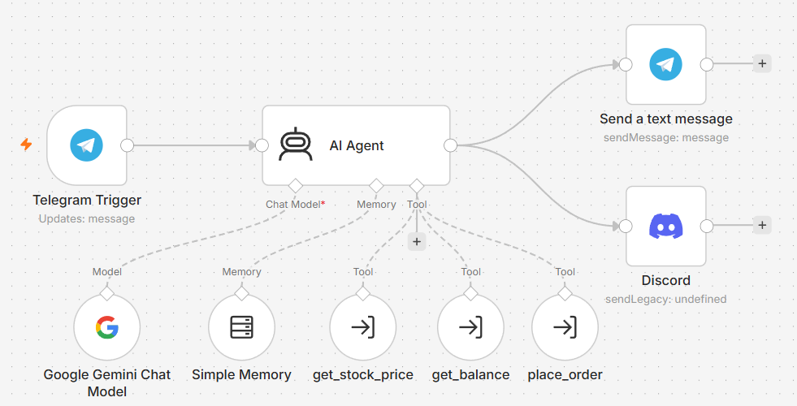
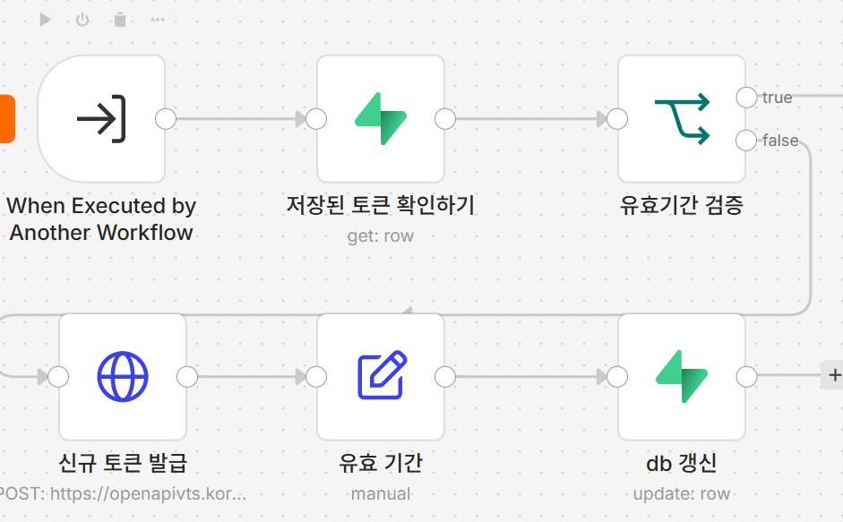
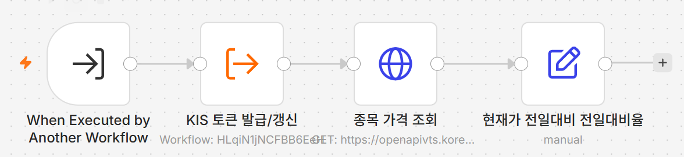
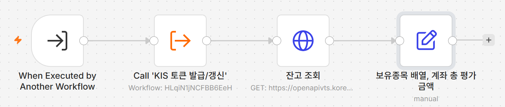
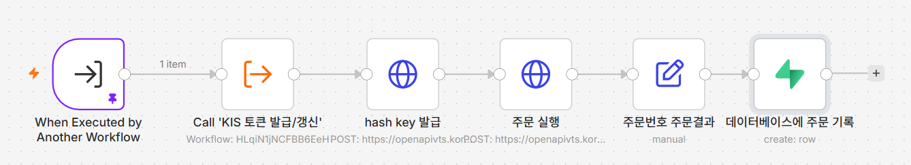
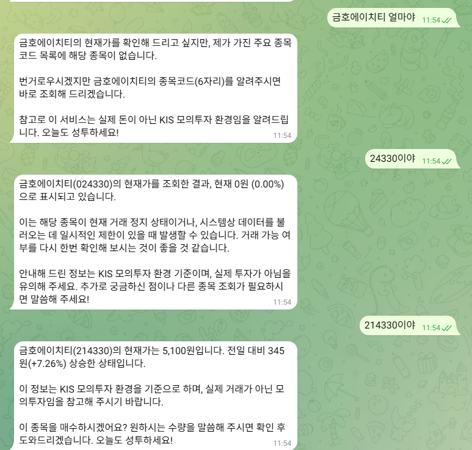
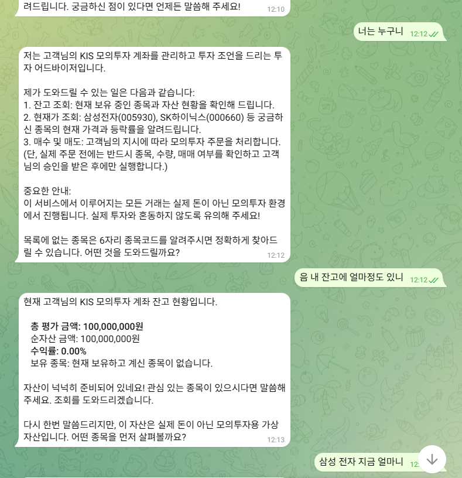
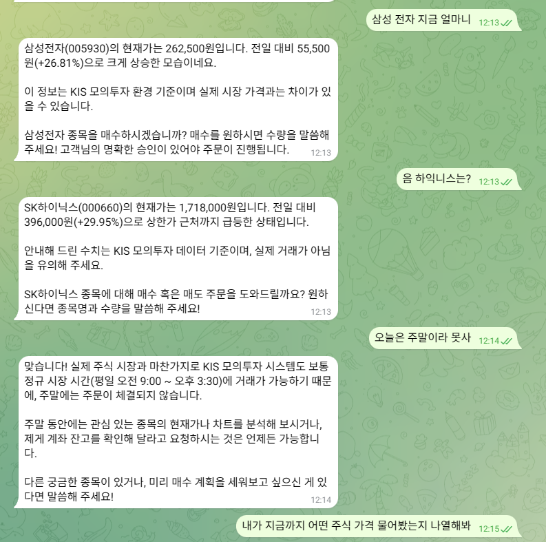
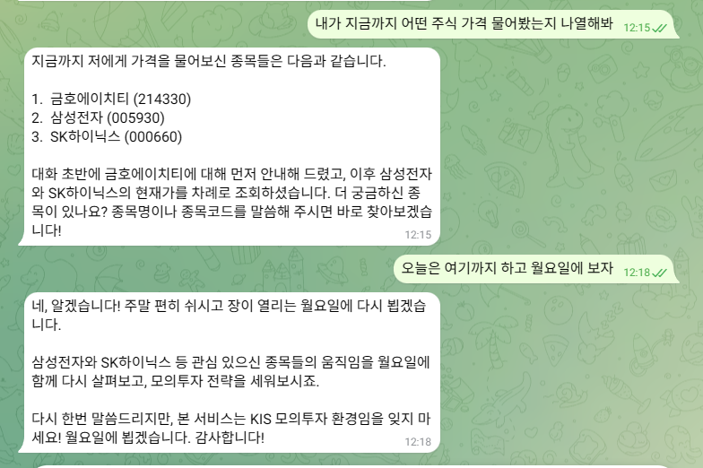

# 금융투자봇 — KIS 모의투자 연동 텔레그램 AI 에이전트

## 프로젝트 소개

금융권 포트폴리오용으로 만든 프로젝트. 텔레그램으로 자연어 대화를 하면서, AI Agent가 상황에 맞게
한국투자증권(KIS) **모의투자 Open API**를 tool로 호출해 실시간 시세조회·계좌 잔고조회·모의 매수/매도
주문까지 처리하는 봇이다. 스프레드시트가 아니라 실제 증권사 API와 연동된다는 점, 그리고 주문 전
사용자 재확인을 강제하는 안전장치를 넣은 점이 핵심.

## 아키텍처

```
[텔레그램 유저] ──메시지──▶ Telegram Trigger
                                 │
                                 ▼
                       AI Agent (Google Gemini)
                        ├─ Memory: chat_id별 대화 맥락 유지
                        └─ Tools ──┬─ get_stock_price (시세조회)
                                   ├─ get_balance (모의계좌 잔고조회)
                                   └─ place_order (모의 매수/매도, 주문 전 재확인 필수)
                                 │
                                 ▼
                       Telegram: Send a text message

(공통) 위 3개 tool은 각각 "KIS 토큰 발급/갱신" 서브워크플로우를 호출해서
       Supabase에 캐싱된 access_token을 받아 쓴다.
```

## 구성 요소

- **n8n 워크플로우 5개**: 메인(Telegram+Agent), 토큰 발급/갱신, 시세조회, 잔고조회, 주문
- **Supabase**: `kis_token`(토큰 캐시), `trade_log`(주문 기록), `alerts`(가격 알림용, 아직 미사용)
- **LLM**: Google Gemini (n8n AI Agent 노드의 Chat Model로 연결)

## AI Agent에게 시킨 일

- KIS Open API 엔드포인트/헤더/tr_id/hashkey 흐름 정리 도움받기
- Supabase 스키마(kis_token, alerts, trade_log) 설계
- AI Agent System Message에 넣을 "주문 전 재확인 필수" 안전장치 문구 설계
- n8n 노드별 설정값(Query Parameter, Body JSON, 표현식) 하나하나 검증

## 막혔던 지점과 해결 방법

- **Supabase 자격증명 연결 실패 (Authorization failed)**
  → service_role 키를 복사할 때 앞뒤 공백/개행이 같이 복사됨. 필드를 지우고 다시 정확히 복사해서 해결.

- **HTTP Request Body가 유효한 JSON이 아니라는 에러**
  → 표현식 값에 따옴표를 안 씌워서(`"appkey": {{ ... }}`) 발생. `"appkey": "{{ ... }}"` 형태로 앞뒤 따옴표를 붙여서 해결.

- **IF 노드에서 만료시각 비교 표현식이 안 먹힘**
  → 조건 타입이 기본값 String으로 되어 있었음. 타입을 Boolean으로 바꾸고 연산자를 "is true"로 바꿔서 해결.

- **Supabase Update 노드에서 "failed to parse logic tree ((id.is.1))" 에러**
  → 필터 연산자가 PostgREST의 `is`(null/true/false 전용)로 되어 있었음. `Equals`로 바꿔서 해결.

- **날짜 계산 표현식에서 `{{now}}`가 `[undefined]`로 나옴**
  → `$` 없이 `now`라고 써서 생긴 문제. `$now.plus({ seconds: ... }).toISO()` 형태로 고쳐서 해결.

- **KIS API "ERROR : INPUT_FIELD_NAME AFHR_FLPR_YN" 에러**
  → 잔고조회 Query Parameter 중 하나의 키 이름 오타/누락. 정확히 재입력해서 해결.

- **주문 tool 단독 테스트 시 "상품번호를 확인해주세요" 에러**
  → 서브워크플로우를 독립 실행하면 트리거 입력값이 전부 null이 되는 게 원인이었음. "set mock data"로 테스트용 입력을 직접 넣어서 해결.

- **주문 실행 시 "모의투자 영업일이 아닙니다" 에러**
  → KIS 모의투자 주문 API는 실제 KRX 장 운영시간(평일 09:00~15:30)에만 동작. 워크플로우 문제가 아니라 정상적인 제약이라 확인만 하고 넘어감(장중 재테스트 필요).

- **AI Agent에서 "multiple tools with the same name: Call_" 에러**
  → Tool 노드 이름이 한글이라 Gemini용 함수명으로 변환되며 다 사라져서 이름이 겹침. 노드 이름을 `get_stock_price`, `get_balance`, `place_order`처럼 영문으로 바꿔서 해결.

- **"Workflow is not active and cannot be executed" 에러**
  → 웹훅(프로덕션) 실행에서 호출하는 서브워크플로우들이 비활성 상태였음. 전부 Active(Publish)로 전환해서 해결.

- **Publish 시 "please publish all referenced sub-workflows first" 에러**
  → 의존성 순서를 지켜서 Publish해야 함: 토큰 발급/갱신 → 시세조회/잔고조회/주문 → 메인 워크플로우 순으로 해결.

## 결과

텔레그램으로 "삼성전자 지금 얼마니" 질문 시 시세조회 tool을 호출해서 정상 응답하는 것까지 확인했고,
계좌 잔고조회(모의투자 기본 시드머니 1억원)도 정상 동작 확인. 매수 주문은 주말이라 "모의투자 영업일이
아닙니다" 에러로 실제 체결까지는 못 봤고, 평일 장중에 재테스트 예정.

## n8n 워크플로우

### 메인 워크플로우 (Telegram Trigger + AI Agent + Tools)


### KIS 토큰 발급/갱신


### 시세조회 Tool


### 잔고조회 Tool


### 주문 Tool


## 텔레그램 결과 메시지

1. 매핑 목록에 없는 종목(금호에이치티)을 물어봤을 때, 종목코드를 직접 확인받아 조회하는 모습


2. 봇 소개와 계좌 잔고조회


3. 삼성전자·SK하이닉스 시세조회, 그리고 주말이라 주문이 체결되지 않는다는 안내


4. 대화 맥락(Memory)을 기억해서 지금까지 조회한 종목을 나열해주는 모습과 마무리 인사


## 아직 남은 것

- 가격 알림 등록 tool + 알림 체커 스케줄 워크플로우 (`alerts` 테이블 활용)
- 평일 장중 매수/매도 주문 실제 체결 테스트
