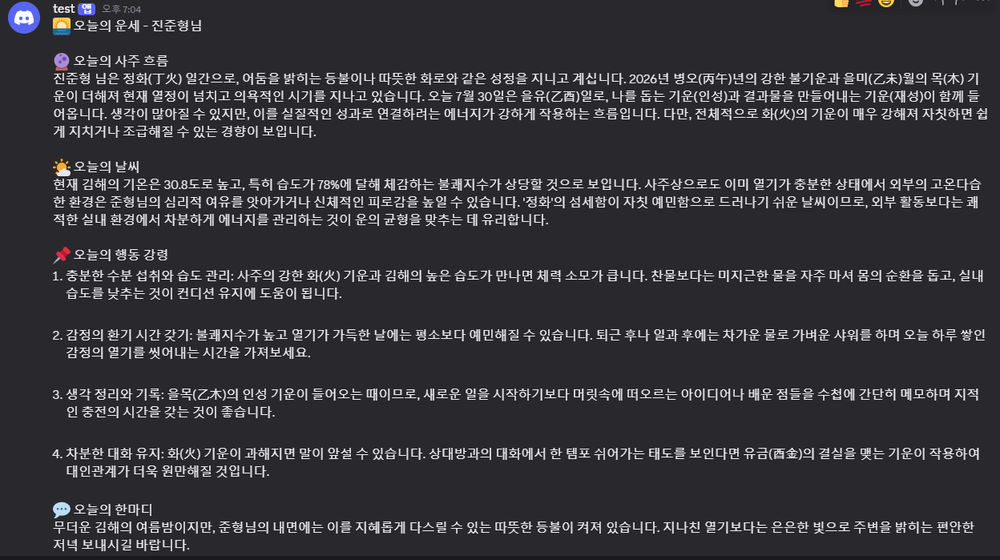

# 내 자동화 봇 소개

## 내 지역
- 경상남도 김해시

## 메시지 형식 
🌅 오늘의 운세 - {{ $('내 정보(이름, 생년월일, 성별) 보내기').item.json.name }}님

🔮 오늘의 사주 흐름
{{ $json.output.saju_flow }}

🌤 오늘의 날씨
{{ $json.output.weather_impact }}

📌 오늘의 행동 강령
1. {{ $json.output.action_guides[0] }}

2. {{ $json.output.action_guides[1] }}

3. {{ $json.output.action_guides[2] }}

4. {{ $json.output.action_guides[3] }}

💬 오늘의 한마디
{{ $json.output.closing_message }}

## AI Agent에 시킨 일
- 프롬프트 짜는거 도움받기(ai한테 내 이름, 생년월일, 성별, 날씨 정보를 줘서 내 사주를 바탕으로 운세와 오늘 날씨에 대한 행동강령을 알려주도록 프롬프트를 짜려고 하는데 도와줘)
- 위도, 경도 데이터로 내 지역 이름 보내주는 api 알아내기
- api로 받은 데이터로 날씨 상태, 습도, 강수 확률, 풍속으로 변환하는 코드 알아내기

## 막혔던 지점과 해결 방법
- ai agent노드에게 줄 프롬프트 어떻게 짤지 고민했는데 claude한테 물어봐서 해결했습니다

## n8n 워크플로우
자동화워크플로우.png)
## 디스코드 결과 메시지

