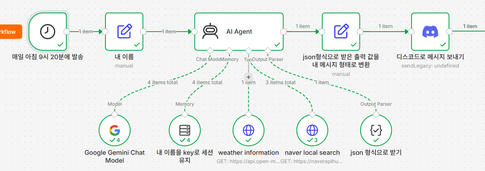
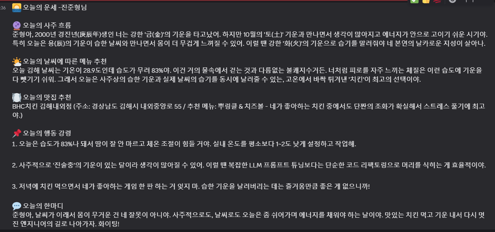

# 아침 자동화 봇 커스터마이징

기존 [내 자동화 봇 소개](내자동화봇소개.md)에 사주, 맛집 추천 기능을 추가로 커스터마이징했습니다.

## 수집
- 시스템 프롬프트로 내 개인정보, 날씨 api로 날씨정보, 네이버 지역 검색 api로 내 지역 맛집 정보를 받는다

## 가공
- 개인정보로 사주정보를 준다
- 날씨정보와 맛집 정보로 날씨에 따른 메뉴와 맛집을 추천해준다
- 1번 추천한 맛집은 메모리에 기억해둬서 다음부터는 추천하지 않는다
- 정보를 종합해 오늘의 행동 강령 3가지를 알려준다
- 종합적인 정보를 토대로 한마디 해준다

## n8n 워크플로우

## 디스코드 결과 메시지

