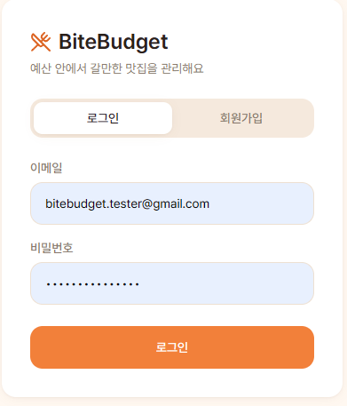
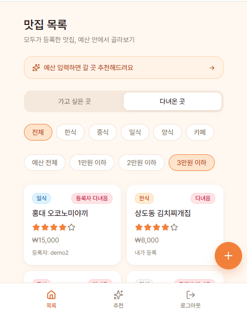
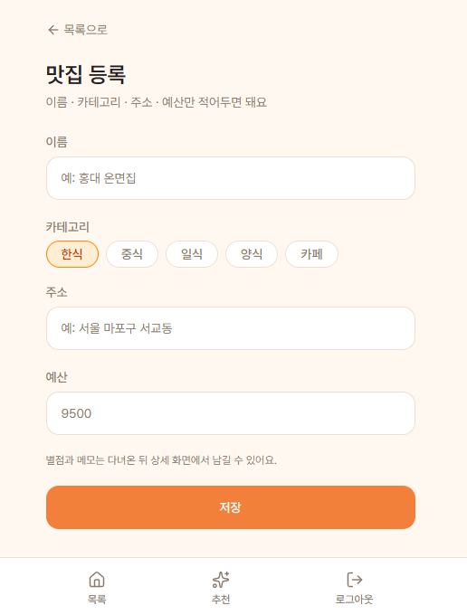
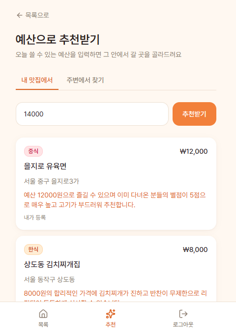
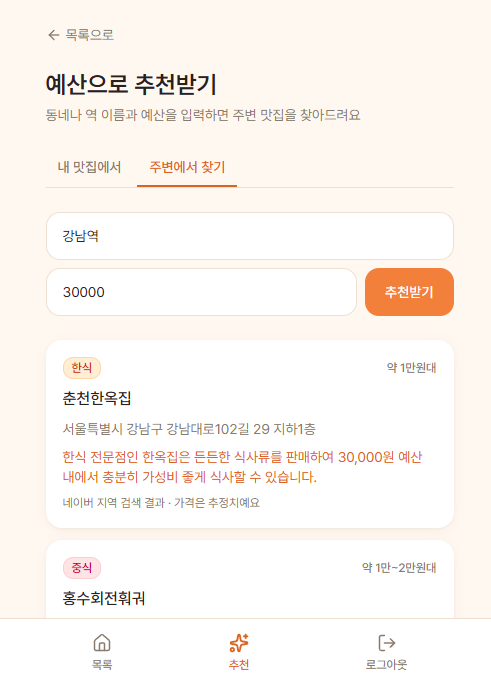

# 맛집 추천 서비스 (BiteBudget) — 기획과 구현 정리

- 서비스명: 예산·위치 기반 맛집 추천 (영문: **BiteBudget**)
- 한 줄 정의: 예산과 현재 위치를 기준으로, 그 예산 안에서 갈 수 있는 근처 식당(맛집) 후보와 추천 이유를 제공해 외식 메뉴·장소 선택 시간을 줄여줍니다.
- 관련 문서: [기준선](맛집추천서비스기준선.md) · [DB 설계](맛집추천서비스DB설계.md) · [화면 설계](맛집추천서비스화면설계.md)
- 구현 저장소: [jjh7757/bitebudget](https://github.com/jjh7757/bitebudget)
- 배포 링크: [bitebudget-rouge.vercel.app](https://bitebudget-rouge.vercel.app/)

## 화면 5개 (업데이트 반영)

### 화면 1 — 로그인 (`/login`)

무드보드를 참고해 새로 잡은 디자인 시스템(주황 포인트 컬러, 카드형 레이아웃)을 처음 적용한 화면. 이메일/비밀번호로 로그인·회원가입 탭 전환.

### 화면 2 — 목록 (`/`)

"가고 싶은 곳" / "다녀온 곳" 탭, 카테고리·예산 필터 칩, 카드 목록(카테고리 배지, 다녀옴 배지, 별점, 예산). 이제 **로그인한 모든 사용자의 맛집**이 함께 보이며, 카드에 "내가 등록" 또는 "등록자 다녀옴"으로 누구 것인지 표시. 상단에 예산 추천 화면으로 가는 배너 추가.

### 화면 3 — 등록 (`/restaurants/new`)

이름·카테고리·주소·예산만 입력받는 최소 등록 폼. 별점·메모는 다녀온 뒤 상세 화면에서 입력.

### 화면 4 — 예산 추천 · 내 맛집에서 (`/recommend`)

예산을 입력하면 등록된 맛집(본인+다른 사용자) 중 예산 이하인 곳을 Gemini가 골라 추천 이유와 함께 보여줌.

### 화면 5 — 예산 추천 · 주변에서 찾기 (`/recommend?mode=location`)

동네·역 이름과 예산을 입력하면 네이버 지역 검색으로 찾은 후보를 Gemini가 예산에 맞게 추려서 추천. 가격 정보가 없는 외부 검색 결과라 "네이버 지역 검색 결과 · 가격은 추정치예요" 안내를 함께 표시.

## 구현 정리

기획서(화면 3개와 테이블 설계)를 기준으로 실제 구현한 내용과, 이후 사용자 요청·직접 사용해보며 추가한 내용을 함께 정리합니다. 전체 코드는 [bitebudget 저장소](https://github.com/jjh7757/bitebudget)에 있습니다.

### 1. 인증 (Supabase Auth)

기획서 화면에는 없었지만, "본인 목록만 조회"를 구현하려면 로그인이 필요해서 추가했습니다.

- 이메일/비밀번호 회원가입·로그인 — [app/login/page.tsx](https://github.com/jjh7757/bitebudget/blob/master/app/login/page.tsx)
- 로그아웃 — [lib/actions.ts](https://github.com/jjh7757/bitebudget/blob/master/lib/actions.ts)의 `signOut`
- 로그인하지 않으면 모든 페이지가 `/login`으로 리다이렉트 — [proxy.ts](https://github.com/jjh7757/bitebudget/blob/master/proxy.ts)
  (이 프로젝트의 Next.js 버전은 `middleware.ts`가 `proxy.ts`로 이름이 바뀜)
- 브라우저/서버용 Supabase 클라이언트 — [lib/supabase/client.ts](https://github.com/jjh7757/bitebudget/blob/master/lib/supabase/client.ts), [lib/supabase/server.ts](https://github.com/jjh7757/bitebudget/blob/master/lib/supabase/server.ts)

### 2. 데이터베이스 (Supabase)

[DB 설계](맛집추천서비스DB설계.md)대로 `restaurants` 테이블을 생성. Row Level Security 정책:

- SELECT: 로그인한 사용자면 누구나 전체 조회 가능 (기획서의 "본인 목록만 조회" 원칙을 이후 사용자 요청으로 변경 — 7번 참고)
- INSERT/UPDATE/DELETE: 본인 소유 행만 가능 (`auth.uid() = user_id`)

목록·상세·추천 화면에 등록자를 표시하기 위해 `public.profiles` 테이블(id, email)을 추가하고, `auth.users`에 새 유저가 생기면 트리거로 자동 동기화합니다.

### 3. 디자인 시스템

Pinterest에서 참고 이미지를 모아 무드보드를 만들고, 이를 기준으로 색상·타이포그래피·카드 컴포넌트 스타일을 정리한 뒤 기존 페이지 디자인을 전면 개선했습니다. `components/ui/`에 버튼·카드·인풋·뱃지·탭·스위치 등 공통 컴포넌트를 두고 모든 화면에서 재사용합니다.

### 4. 화면 — 목록 (`/`)

[app/(app)/page.tsx](https://github.com/jjh7757/bitebudget/blob/master/app/%28app%29/page.tsx)

- "가고 싶은 곳" / "다녀온 곳" 탭 전환
- 카테고리 필터 칩 (전체/한식/중식/일식/양식/카페)
- 예산 필터 칩 (예산 전체/1만원 이하/2만원 이하/3만원 이하 — `budget` 컬럼에 `lte` 조건)
- 로그인한 모든 사용자의 맛집을 함께 보여줌 (본인 등록 항목은 "내가 등록", 남의 것은 "등록자: {이메일 앞부분}" 표시)
- 카드 목록: 카테고리 배지, 다녀옴 배지("다녀옴"은 본인 것, "등록자 다녀옴"은 남의 것), 이름, 별점(다녀온 경우만), 예산
- 우하단 + 버튼 → 등록 화면 이동, 로그아웃 버튼

### 5. 화면 — 등록 (`/restaurants/new`)

[app/(app)/restaurants/new/page.tsx](https://github.com/jjh7757/bitebudget/blob/master/app/%28app%29/restaurants/new/page.tsx)

- 이름 / 카테고리(칩 선택) / 주소 / 예산만 입력받는 최소 등록 폼
- Server Action(`createRestaurant`)으로 저장 후 상세 화면으로 이동
- 별점·메모는 여기서 받지 않고 상세 화면 안내 문구로 유도

### 6. 화면 — 상세 (`/restaurants/[id]`)

[app/(app)/restaurants/[id]/page.tsx](https://github.com/jjh7757/bitebudget/blob/master/app/%28app%29/restaurants/%5Bid%5D/page.tsx)

- 카테고리 배지, 이름, 주소, 예산 표시
- "다녀왔어요" 토글 스위치
- 별점 선택 (커스텀 클라이언트 컴포넌트 — [components/RatingInput.tsx](https://github.com/jjh7757/bitebudget/blob/master/components/RatingInput.tsx))
- 메모 입력, 수정 버튼(토글/별점/메모 저장), 삭제 버튼
- 본인이 등록한 맛집이 아니면 토글/별점/메모/수정/삭제 컨트롤 대신 읽기 전용 정보와 등록자 이메일만 표시 (DB 정책상 어차피 남의 것은 수정·삭제가 막혀 있음)

### 7. 예산 추천 (`/recommend`)

[app/(app)/recommend/page.tsx](https://github.com/jjh7757/bitebudget/blob/master/app/%28app%29/recommend/page.tsx) — 기획서 원본 3화면에는 없던 화면으로, 예산을 입력하면 추천을 받는 요청에 따라 추가한 뒤 두 가지 방식으로 확장했습니다.

**내 맛집에서 (`mode=db`, 기본값)**
- 목록 화면과 동일하게 전체 사용자의 맛집을 대상으로, 입력한 예산 이하인 곳 중 최대 3곳을 Google Gemini API([lib/gemini.ts](https://github.com/jjh7757/bitebudget/blob/master/lib/gemini.ts)의 `getGeminiRecommendations`)가 골라 한국어 추천 이유를 붙여줌
- Gemini 호출이 실패하면 "다녀왔고 별점 높은 곳 최대 2곳 + 안 가본 곳 중 무작위 1곳" 규칙으로 자체 폴백
- 각 카드에 추천 이유와 등록자 표시("내가 등록"/"등록자: OOO")를 함께 보여주고, 남의 것일 때는 "OOO님이 다녀왔고..." 식으로 이유 문구에 등록자를 명시

**주변에서 찾기 (`mode=location`)**
- 동네·역 이름(위치 텍스트)과 예산을 입력하면 네이버 지역 검색 API([lib/naver.ts](https://github.com/jjh7757/bitebudget/blob/master/lib/naver.ts)의 `searchNaverLocal`)로 `"{위치} 맛집"`을 검색해 최대 5곳을 가져옴
- 검색 결과에는 가격 정보가 없어서, 이름·카테고리만으로 Gemini([lib/gemini.ts](https://github.com/jjh7757/bitebudget/blob/master/lib/gemini.ts)의 `getGeminiLocationRecommendations`)가 예산에 맞을 만한 곳을 최대 3곳 추려주고 "약 1만원대" 같은 추정 가격대(`estimatedBudget`)를 함께 반환
- 카드에는 실제 가격이 아닌 추정치라는 점을 명시 ("네이버 지역 검색 결과 · 가격은 추정치예요")
- Gemini 호출이 실패하면 검색 결과 상위 3곳을 예산 매칭 없이 그대로 노출
- DB에 등록된 맛집이 없어도 사용할 수 있는 경로라, 등록 데이터가 적은 초기 사용자도 추천을 받을 수 있음

### 8. 기획서의 "안 만들 것" 준수 여부

지도 API 연동, 거리순 정렬, 예약/웨이팅, 주문/결제, 배달, 공개 리뷰, 추천 이력, 가격대 자동추정, 별도 즐겨찾기 테이블 — **모두 구현하지 않음** (기획서 범위 그대로 유지).

- **예외 1 — 타 사용자 공유**: 기획서는 "본인 목록만 조회"였지만, 이후 사용자 요청으로 목록·상세·추천 화면 모두 전체 사용자의 맛집을 볼 수 있도록 변경했습니다. 등록·수정·삭제는 여전히 본인 것만 가능합니다 (읽기는 공개, 쓰기는 비공개).
- **예외 2 — 네이버 지역 검색 API**: "안 만들 것"의 "카카오/네이버 지도 API 연동(실시간 위치 기반 검색)"은 지도·좌표 기반 검색을 뜻했고, 이번에 추가한 것은 네이버 지역 "검색" API로 동네 이름 텍스트를 그대로 검색어에 넣는 방식입니다. 위도/경도 계산이나 거리순 정렬은 여전히 하지 않습니다.

### 9. 트러블슈팅

- **네이버 API 인증 실패**: 네이버 지역 검색 API가 네이버 개발자센터에서 네이버 클라우드 플랫폼(NCP)으로 이관된 사실을 모른 채 예전 방식(개발자센터 Client ID/Secret, 구 엔드포인트)으로 구현해 인증이 계속 실패했습니다. 이관 정보를 확인한 뒤 NCP 엔드포인트(`https://naverapihub.apigw.ntruss.com/search/v1/local`)와 `X-NCP-APIGW-API-KEY-ID`/`X-NCP-APIGW-API-KEY` 헤더 방식으로 수정해 해결했습니다.
- **Gemini API 미동작**: 배포 후 실제 서비스에서 확인해보니 Gemini API가 동작하지 않았습니다. 원인은 Vercel에 `GEMINI_API_KEY`를 등록한 시점이 최신 배포보다 늦어서 반영되지 않은 것이었고, 재배포로 해결했습니다.

### 10. 알려진 제한사항

- Supabase 무료 플랜의 기본 이메일 발송은 시간당 제한이 있어 회원가입 확인 메일을 짧은 시간에 여러 번 요청하면 "email rate limit exceeded" 에러가 날 수 있음. 필요하면 Supabase 대시보드 → Authentication → Sign In / Providers → Email에서 "Confirm email"을 꺼서 우회 가능.
- 네이버 지역 검색 결과에는 가격 정보가 없어 Gemini가 이름·카테고리만으로 예산을 추정함 — 실제 가격과 다를 수 있음.

### 11. 새롭게 배운 점

- 무드보드를 먼저 모아 디자인 시스템을 만드니, 맨땅에서 디자인할 때보다 더 나은 결과물이 나온다.
- 새 API를 연동할 때마다 바로바로 실제 서비스에서 테스트해보는 습관이 중요하다 (로컬에서만 확인하고 넘어갔다면 Gemini 키 미반영 문제를 못 알아챘을 것).
