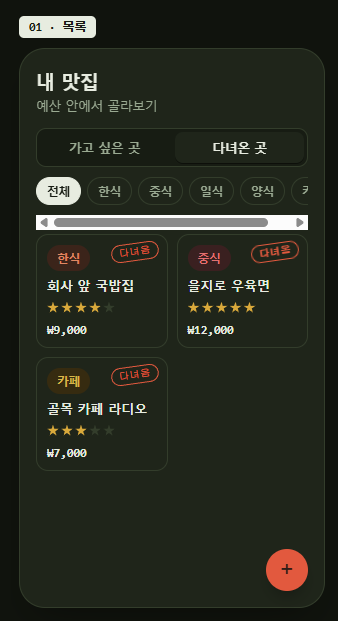
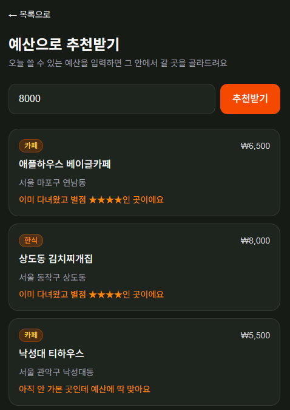

# 맛집 추천 서비스 (BiteBudget) — 기획과 구현 정리

- 서비스명: 예산·위치 기반 맛집 추천 (영문: **BiteBudget**)
- 한 줄 정의: 예산과 현재 위치를 기준으로, 그 예산 안에서 갈 수 있는 근처 식당(맛집) 후보와 추천 이유를 제공해 외식 메뉴·장소 선택 시간을 줄여줍니다.
- 관련 문서: [기준선](맛집추천서비스기준선.md) · [DB 설계](맛집추천서비스DB설계.md) · [화면 설계](맛집추천서비스화면설계.md)
- 구현 저장소: [jjh7757/bitebudget](https://github.com/jjh7757/bitebudget)

## 화면 4개

### 화면 1 — 목록 (`/`)

"가고 싶은 곳" / "다녀온 곳" 탭, 카테고리·예산 필터 칩, 카드 목록(카테고리·다녀옴 배지, 별점, 예산).

### 화면 2 — 상세 (`/restaurants/[id]`)

식당 정보 표시 + "다녀왔어요" 토글 + 별점 선택 + 메모 입력 + 수정/삭제.

### 화면 3 — 등록 (`/restaurants/new`)

이름·카테고리·주소·예산만 입력받는 최소 등록 폼. 별점·메모는 다녀온 뒤 상세 화면에서 입력.

### 화면 4 — 예산 추천 (`/recommend`)

기획서 원본 3화면에는 없던 화면. 예산을 입력하면 등록해둔 맛집 중 예산 이하인 곳을 추천.

## 구현 정리

기획서(화면 3개와 테이블 설계)를 기준으로 실제 구현한 내용입니다. 전체 코드는 [bitebudget 저장소](https://github.com/jjh7757/bitebudget)에 있습니다.

### 1. 인증 (Supabase Auth)

기획서 화면에는 없었지만, `restaurants.user_id`로 "본인 목록만 조회"를 구현하려면 로그인이 필요해서 추가했습니다.

- 이메일/비밀번호 회원가입·로그인 — [app/login/page.tsx](https://github.com/jjh7757/bitebudget/blob/master/app/login/page.tsx)
- 로그아웃 — [lib/actions.ts](https://github.com/jjh7757/bitebudget/blob/master/lib/actions.ts)의 `signOut`
- 로그인하지 않으면 모든 페이지가 `/login`으로 리다이렉트 — [proxy.ts](https://github.com/jjh7757/bitebudget/blob/master/proxy.ts)
  (이 프로젝트의 Next.js 버전은 `middleware.ts`가 `proxy.ts`로 이름이 바뀜)
- 브라우저/서버용 Supabase 클라이언트 — [lib/supabase/client.ts](https://github.com/jjh7757/bitebudget/blob/master/lib/supabase/client.ts), [lib/supabase/server.ts](https://github.com/jjh7757/bitebudget/blob/master/lib/supabase/server.ts)

### 2. 데이터베이스 (Supabase)

[DB 설계](맛집추천서비스DB설계.md)대로 `restaurants` 테이블을 생성하고, Row Level Security로 본인 소유 행만 select/insert/update/delete 가능하도록 정책 설정 (다른 사용자 목록 공유 안 함 — 기획서의 "안 만들 것" 준수).

### 3. 화면 1 — 목록 (`/`)

[app/page.tsx](https://github.com/jjh7757/bitebudget/blob/master/app/page.tsx)

- "가고 싶은 곳" / "다녀온 곳" 탭 전환
- 카테고리 필터 칩 (전체/한식/중식/일식/양식/카페)
- 예산 필터 칩 (예산 전체/1만원 이하/2만원 이하/3만원 이하 — `budget` 컬럼에 `lte` 조건)
- 카드 목록: 카테고리 배지, 다녀옴 배지, 이름, 별점(다녀온 경우만), 예산
- 우하단 + 버튼 → 등록 화면 이동, 로그아웃 버튼

### 4. 화면 3 — 등록 (`/restaurants/new`)

[app/restaurants/new/page.tsx](https://github.com/jjh7757/bitebudget/blob/master/app/restaurants/new/page.tsx)

- 이름 / 카테고리(칩 선택) / 주소 / 예산만 입력받는 최소 등록 폼
- Server Action(`createRestaurant`)으로 저장 후 상세 화면으로 이동
- 별점·메모는 여기서 받지 않고 상세 화면 안내 문구로 유도

### 5. 화면 2 — 상세 (`/restaurants/[id]`)

[app/restaurants/[id]/page.tsx](https://github.com/jjh7757/bitebudget/blob/master/app/restaurants/%5Bid%5D/page.tsx)

- 카테고리 배지, 이름, 주소, 예산 표시
- "다녀왔어요" 토글 스위치
- 별점 선택 (커스텀 클라이언트 컴포넌트 — [components/RatingInput.tsx](https://github.com/jjh7757/bitebudget/blob/master/components/RatingInput.tsx))
- 메모 입력, 수정 버튼(토글/별점/메모 저장, `updateRestaurantStatus`), 삭제 버튼(`deleteRestaurant`)

### 6. 예산 추천 (`/recommend`)

[app/recommend/page.tsx](https://github.com/jjh7757/bitebudget/blob/master/app/recommend/page.tsx) — 기획서 원본 3화면에는 없던 화면으로, 예산을 입력하면 추천을 받는 요청에 따라 추가.

- 예산 입력창 + 추천받기 버튼
- 입력한 예산 이하인 본인 맛집 중 최대 3곳을 추천:
  - 다녀왔고 별점 높은 곳 최대 2곳 (재방문 추천, 별점 내림차순)
  - 안 가본 곳 중 무작위 1곳 (새로운 곳 추천)
- 각 카드에 추천 이유 문구 표시, 클릭하면 상세 화면으로 이동
- 예산 안에 맞는 곳이 없으면 안내 문구 표시, 목록 화면 상단에 진입 버튼 추가
- 실시간 위치 API/거리순 정렬은 기획서의 "안 만들 것" 목록에 있어 추가하지 않음

### 7. 기획서의 "안 만들 것" 준수 여부

지도 API 연동, 거리순 정렬, 예약/웨이팅, 주문/결제, 배달, 타 사용자 공유, 공개 리뷰, 추천 이력, 가격대 자동추정, 별도 즐겨찾기 테이블 — **모두 구현하지 않음** (기획서 범위 그대로 유지).

### 8. 알려진 제한사항

- Supabase 무료 플랜의 기본 이메일 발송은 시간당 제한이 있어 회원가입 확인 메일을 짧은 시간에 여러 번 요청하면 "email rate limit exceeded" 에러가 날 수 있음. 필요하면 Supabase 대시보드 → Authentication → Sign In / Providers → Email에서 "Confirm email"을 꺼서 우회 가능.
